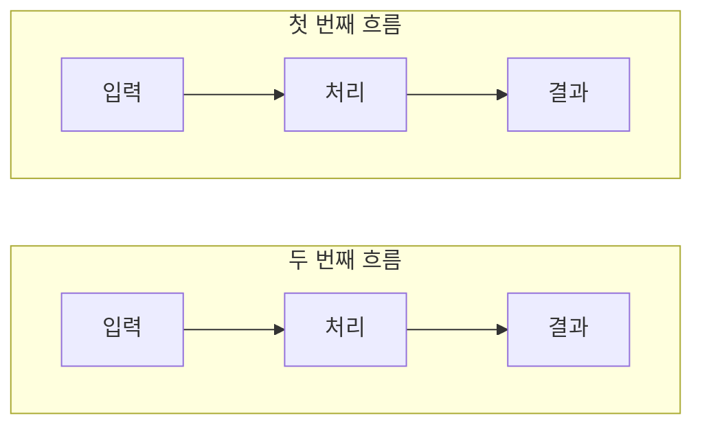

# YOLOG 블로그 작성 가이드

이 문서는 YOLOG 기술 블로그의 포스트 작성 규칙을 정의한다. 독자가 쉽게 이해하고 몰입할 수 있는 글을 작성하는 것이 목표다. 단, category가 "REVIEW"인 포스트는 이 가이드를 따르지 않는다.

---

## 📝 문체 가이드

### 1. 기본 문체

- **자연스러운 `~요`체 사용**: `~요`, `~이에요`, `~예요`, `~했어요`, `~볼게요`를 기본으로 사용한다
- **대화하듯 설명**: 강의록이나 공식 문서처럼 딱딱하게 쓰지 않고, 직접 경험한 내용을 독자에게 설명하듯 작성한다
- **격식체 최소화**: `~합니다`, `~입니다`는 인용문이나 특별히 격식이 필요한 문맥이 아니라면 사용하지 않는다
- **능동적이고 분명한 표현**: 확실한 내용을 `~인 것 같아요`로 흐리지 않는다. 실제로 불확실하거나 추론한 내용에만 사용한다
- **경험을 꾸며내지 않기**: 직접 실행하거나 확인한 내용만 `해봤어요`, `확인했어요`, `느꼈어요`처럼 1인칭 경험으로 작성한다

```markdown
❌ 캐싱은 성능을 향상시키는 기술입니다.
✅ 캐싱은 성능을 높이는 기술이에요.

❌ 이 방법이 효과적인 것 같아요. (이미 측정으로 확인한 경우)
✅ 실제로 측정해 보니 이 방법이 효과적이었어요.

❌ 이제 빌드 스크립트를 작성한다.
✅ 이제 빌드 스크립트를 작성해볼게요.
```

### 2. 종결어미와 맞춤법

- 받침이 있는 명사 뒤에는 `이에요`를 사용한다: `기술이에요`, `원인이에요`
- 받침이 없는 명사 뒤에는 `예요`를 사용한다: `문제예요`, `캐시예요`
- `에요`는 사용하지 않는다. 단, `아니에요`는 올바른 표현이다
- 같은 종결어미를 세 문장 이상 연속해서 반복하지 않는다
- `~거든요`, `~는데요`, `~했어요`, `~할게요`, 질문형 문장을 문맥에 맞게 섞어 리듬을 만든다

```markdown
❌ 이것은 캐시에요.
✅ 이것은 캐시예요.

❌ 첫 번째 원인은 공백이예요.
✅ 첫 번째 원인은 공백이에요.
```

### 3. 사람다운 문장 리듬

- 한 문단은 보통 2~4문장으로 구성한다
- 모든 문장을 같은 길이와 구조로 맞추지 않는다
- `중요한 점은`, `결국`, `다음과 같아요`, `살펴볼게요` 같은 전환 표현을 반복하지 않는다
- 의미 없는 예고 문장보다 바로 핵심 내용을 설명한다
- 지나치게 완벽한 나열보다 실제로 이해에 필요한 내용만 남긴다

```markdown
❌ 중요한 점은 SSR이 항상 빠른 것은 아니라는 점이에요. 결국 측정이 중요해요.
✅ SSR이 항상 빠른 것은 아니에요. 서버 렌더링 시간이 추가될 수 있으니 도입 전후의 지표를 함께 측정해야 해요.
```

### 4. 질문형 문장 활용

독자의 궁금증을 자극하거나 다음 내용으로 자연스럽게 넘어갈 때 질문형 문장을 활용한다. 문단마다 억지로 질문을 넣지는 않는다.

```markdown
✅ 이제 사용자가 새로고침을 누르면 어떻게 될까요?
✅ 화면을 조금 더 일찍 보여줄 수는 없을까요?
✅ 그렇다면 HTML 파일은 어디에서 만들어야 할까요?
```

---

## 🎯 마크다운 작성 규칙

### 1. 강조 표현

백틱과 볼드체는 역할이 다르므로 다음 기준으로 구분한다.

- **백틱**: 독자가 코드에서 그대로 찾거나 입력할 수 있는 이름을 표시한다
- **볼드체**: 문장에서 꼭 기억해야 할 결론, 대비, 핵심 의미를 강조한다
- **평문**: 프레임워크 이름이나 일반 개념을 자연스럽게 설명할 때 사용한다

```markdown
❌ React는 `UI 라이브러리`예요.
✅ React는 UI 라이브러리예요.

❌ hydrateRoot를 호출해요.
✅ `hydrateRoot()`를 호출해요.

❌ **Access-Control-Allow-Origin**
✅ `Access-Control-Allow-Origin`

✅ 서버 렌더링은 **화면 표시 시점**과 **상호작용 가능 시점**을 분리해요.
```

**규칙**:

- 함수, 변수, 컴포넌트, 파일명, 경로, 명령어, 패키지명 → 백틱
- HTML 태그·속성, 코드 리터럴, HTTP 헤더와 상태 코드 → 백틱
- React, Node.js, CSR, SSR, Hydration처럼 문장 안에서 설명하는 일반 개념명 → 평문
- 개념을 처음 정의하거나 핵심 대비를 보여줄 때 → 필요한 구절만 볼드체
- UI 메뉴나 버튼 이름 → 볼드체 또는 따옴표 중 문맥에 맞는 한 가지 방식만 사용
- 한 문단에서 볼드체를 남발하지 않고, 정말 중요한 구절 1~2개만 강조
- 긴 문장 전체를 볼드체로 감싸지 않는다
- 따옴표 포함 문구는 백틱으로 감싸지 않는다. 코드 문자열일 때만 백틱을 사용한다
- **백틱과 볼드체는 혼합 불가** → `**text**` (❌) / `text` (✅)
- **따옴표와 볼드체도 혼합 불가** → `**"text"**` (❌) / `"text"` 또는 **text** (✅)
- **볼드체 안에 백틱 포함 불가** → `**함수 내부의 \`username\`\*\*` (❌) / 함수 내부의 \`username\` (✅)
- **볼드체 안에 괄호 포함 불가** → `**렌더러(Renderer)**` (❌) / **렌더러**(Renderer) 또는 `렌더러(Renderer)` (✅) — 볼드와 괄호를 같이 쓰면 렌더링이 깨진다
- **닫는 괄호와 볼드 종료 문법을 붙이지 않는다** → `)**` 패턴은 사용 금지. `**렌더러**(Renderer)`처럼 괄호를 볼드 밖으로 빼거나, `렌더러(Renderer)`처럼 용어 전체를 백틱으로 감싼다

```markdown
❌ **Presentation → Application → Domain**
✅ `Presentation → Application → Domain`

❌ **기본적으로 3계층 구조(`Domain - Data - Presentation`)**
✅ **기본적으로 3계층 구조**(`Domain - Data - Presentation`)

❌ **`Cache-Control` 헤더**
✅ `Cache-Control` 헤더

❌ **"이 데이터가 유효한가?"**
✅ `"이 데이터가 유효한가?"`

❌ **"무엇이 바뀌었는지 정확히 추적하는 것"**보다 **"일단 다시 계산하는 것"**
✅ "무엇이 바뀌었는지 정확히 추적하는 것"보다 "일단 다시 계산하는 것"

❌ **"최적화가 비명을 지를 때"**까지 기다려요
✅ "최적화가 비명을 지를 때"까지 기다려요

❌ 매튜가 이름을 **"익명"**에서 **"매튜"**로 바꿔도
✅ 매튜가 이름을 "익명"에서 "매튜"로 바꿔도

❌ **함수 내부에 갇힌 옛날 `username`**을 참조해요
✅ 함수 내부에 갇힌 옛날 `username`을 참조해요

❌ **항상 다른 `함수`로 인식**되어 리렌더링돼요
✅ 항상 다른 함수로 인식되어 리렌더링돼요

설명: 백틱 안에 볼드체를 넣거나, 볼드체 안에 백틱을 넣지 않는다.
따옴표가 포함된 일반 문구는 볼드체 없이 따옴표만 사용한다.
`**"text"**`나 `**text with `backtick` inside**` 형태는 마크다운 렌더링 시 문제를 일으킬 수 있으므로 절대 사용하지 않는다.
코드 식별자와 일반 개념, 강조할 문장을 구분해서 표기한다.
예제에서 사람 이름이 필요하면 "매튜"를 사용한다.
```

### 2. 코드 블록

````markdown
✅ 권장 언어 표시: js, ts, html, css, bash, http, ts, tsx

# HTTP 응답 예시

```http
Cache-Control: max-age=31536000
```
````

# JavaScript 코드

```js
const etag = `${stat.mtime.getTime()}`;
```

````

**코드 간결화 원칙**:
- 핵심 로직만 보여준다
- 반복되는 에러 처리, 타입 설정 코드는 생략
- 주석으로 핵심 부분만 설명

```markdown
❌ 나쁜 예시 (너무 긴 코드):
```js
const serveStatic = (root) => {
  return (req, res) => {
    // 100줄짜리 전체 서버 코드
  };
};
````

✅ 좋은 예시 (핵심만):

```js
fs.stat(filepath, (err, stat) => {
  // 파일의 메타데이터를 가져온다
  const modified = stat.mtime;

  // Last-Modified 헤더에 수정 시간을 담아 응답한다
  res.setHeader("Last-Modified", modified.toUTCString());
});
```

````

### 3. 섹션 구조

```markdown
# 포스트 제목 (사용 안 함, frontmatter에만)

## 대제목 (주요 개념)

### 소제목 (세부 내용)

---  (섹션 구분선 - 주요 개념 전환 시)

## 다음 대제목
````

---

## 🔗 링크 전략

### MDN 링크 적극 활용

HTTP 관련 용어, 헤더, 상태 코드 등에 MDN 문서 링크를 추가한다.

```markdown
✅ [`Last-Modified`](https://developer.mozilla.org/ko/docs/Web/HTTP/Headers/Last-Modified)
✅ [`304 Not Modified`](https://developer.mozilla.org/ko/docs/Web/HTTP/Status/304)
✅ [`Cache-Control`](https://developer.mozilla.org/ko/docs/Web/HTTP/Headers/Cache-Control)
```

**링크 추가 대상**:

- HTTP 헤더 (Cache-Control, ETag, Last-Modified 등)
- HTTP 상태 코드 (200, 304 등)
- 주요 웹 API
- 외부 참고 자료 (RFC 문서 등)

---

## 🖼️ 이미지 활용

### 이미지 설명 구조

"어떤 상황 → 이미지 → 결과 해석" 구조로 작성한다.

```markdown
✅ 좋은 예시:

실제로 어떻게 동작하는지 확인해볼게요. 먼저 캐시를 비활성화하고 요청을 보내면:


응답 헤더에 `Last-Modified`가 포함되어 있어요. 브라우저는 이 값을 캐시와 함께 저장해요.

이제 다시 새로고침해보면:


요청 헤더의 `If-Modified-Since`에 이전에 받았던 수정 시간이 담겨 있어요.
```

### Mermaid 다이어그램

Mermaid는 여러 단계의 흐름이나 주체 간 관계를 글보다 빠르게 이해할 수 있을 때만 사용한다. 다이어그램을 넣는 것보다 **실제 본문 너비에서 글자가 읽히는지**가 우선이다.

**내용 구성**:

- 바로 위 문단이나 `text` 코드 블록의 화살표 흐름을 Mermaid로 다시 반복하지 않는다
- 같은 내용을 설명한다면 화살표 텍스트를 제거하고 Mermaid 하나로 통합한다
- 노드에는 문장을 넣지 않고 핵심 동작만 짧게 적는다
- 비교 다이어그램의 각 항목은 가능하면 비슷한 단계 수로 맞춘다
- 단계가 많다면 핵심 흐름과 상세 흐름을 서로 다른 다이어그램으로 분리한다
- 시간 순서나 서버·브라우저 간 왕복이 중요한 경우에는 `sequenceDiagram`을 사용한다

**배치와 가독성**:

- 여러 흐름을 한 줄에 나란히 배치해 글자가 작아지는 구성을 피한다
- 세 개 이상의 흐름을 비교할 때는 각 흐름을 위아래로 쌓고, 흐름 내부만 `direction LR`로 구성하는 방식을 우선 검토한다
- 가로 배치는 본문 너비에서 모든 라벨이 충분히 읽힐 때만 사용한다
- 가로로 길어져 SVG 전체가 축소된다면 노드 수와 문구를 줄이거나 세로로 배치한다
- 세로 공간을 줄이기 위해 무조건 가로로 배치하지 않는다. 화면을 덜 차지하는 것보다 독자가 확대 없이 읽을 수 있는지가 중요하다
- PC뿐 아니라 좁은 화면에서도 노드와 라벨이 지나치게 축소되지 않는지 확인한다



**검증**:

- Mermaid 문법 검사나 프로덕션 빌드 통과만으로 가독성을 판단하지 않는다
- 로컬 페이지를 실제 콘텐츠 너비로 열어 글자 크기, 줄바꿈, SVG 비율을 눈으로 확인한다
- 다이어그램을 읽기 위해 확대하거나 가로 스크롤해야 한다면 구성을 다시 단순화한다
- 다이어그램 전후의 문단을 함께 읽고 설명이 중복되거나 흐름이 끊기지 않는지 확인한다

---

## 💡 콘텐츠 구성

### 1. 도입부

개념의 필요성과 실용성을 먼저 설명한다.

```markdown
✅ 좋은 예시:

웹사이트를 방문할 때마다 같은 이미지와 스크립트를 반복해서 다운로드한다면 얼마나 비효율적일까요?
Cache는 이런 낭비를 막기 위해 한 번 받은 데이터를 임시 저장소에 보관하는 기술이에요.
```

### 2. 개념 설명

추상적 설명 → 실제 동작 순서로 전개한다. **실생활 비유는 사용하지 않는다** (건축가, 편지, 통역사 같은 비유 금지).

```markdown
✅ 좋은 예시:

`ETag`는 `Entity Tag`의 약자로, 파일 내용을 식별하는 고유한 값이에요.

파일 내용이 조금이라도 바뀌면 `ETag` 값도 완전히 달라져요.
```

### 3. 실전 예시

Node.js 등 실행 가능한 코드로 동작을 보여준다.

```markdown
✅ 핵심 코드 + 주석 + 설명 조합
```

### 4. 전략/팁 섹션

실무에서 어떻게 활용하는지 구체적으로 안내한다.

```markdown
## 캐싱 활용 전략

### 정적 자원은 길게 캐시하기

### 파일명 해싱으로 캐시 무효화하기

### HTML은 짧게 캐시하기

### 캐싱 전략 정리
```

**중요**:

- `:::note` 블록은 **사용하지 않는다**
- 일반 마크다운 헤딩(`## 핵심 정리`)을 사용한다
- 가독성이 더 좋고 유지보수가 쉽다

---

## ✅ 맞춤법 및 띄어쓰기

### 자주 틀리는 표현

```markdown
❌ 한번 → ✅ 한 번
❌ 몇 ms → ✅ 몇ms (단위는 붙여쓰기)
❌ 200 ms → ✅ 200ms
```

### 일관성

```markdown
✅ 같은 용어는 동일하게 표기

- 브라우저 (O) / 브라우져 (X)
- 캐시 (O) / 캐쉬 (X)
- 서버 (O) / 써버 (X)
```

---

## 📋 작성 체크리스트

포스트 작성 완료 후 확인:

- [ ] **문체**: 자연스러운 `~요`체로 작성했는가?
- [ ] **종결어미**: `~요`, `~이에요`, `~예요`가 단조롭게 반복되지 않는가?
- [ ] **맞춤법**: 받침에 따라 `이에요`와 `예요`를 올바르게 구분했는가?
- [ ] **경험 표현**: 직접 확인하지 않은 내용을 경험한 것처럼 쓰지 않았는가?
- [ ] **비유 금지**: 실생활 비유 없이 개념 자체로 설명했는가?
- [ ] **질문**: 독자의 궁금증을 유발하는 질문을 포함했는가?
- [ ] **백틱/볼드**: 기술 용어는 백틱, 강조는 볼드로 구분했는가? `**"text"**` 금지!
- [ ] **코드**: 핵심 로직만 간결하게 보여주는가?
- [ ] **MDN 링크**: 주요 HTTP 용어에 MDN 링크를 추가했는가?
- [ ] **이미지 설명**: 상황 → 이미지 → 해석 구조로 작성했는가?
- [ ] **Mermaid 중복**: 주변 문단이나 화살표 텍스트와 같은 내용을 반복하지 않는가?
- [ ] **Mermaid 가독성**: 실제 본문 너비와 좁은 화면에서 확대 없이 읽을 수 있는가?
- [ ] **Mermaid 검증**: 빌드뿐 아니라 실제 렌더링 결과를 눈으로 확인했는가?
- [ ] **섹션 구분**: `---`로 주요 개념을 구분했는가?
- [ ] **맞춤법**: "한 번", "몇ms" 등 올바르게 작성했는가?
- [ ] **이미지 위치**: 기존 이미지 위치를 유지했는가?

---

## 🚀 참고 포스트

잘 작성된 최신 포스트 예시:

- `http-cache.mdx` (2025년 최신 스타일)
- `http-content-security-policy.mdx`
- `http-cors.mdx`

---

## 🎓 작성 철학

> 시니어 개발자의 깊이 있는 지식과 초보자도 이해할 수 있는 쉬운 설명을 동시에 제공한다.

**좋은 기술 블로그란**:

- 개념의 "왜"를 설명한다
- 실행 가능한 코드를 제공한다
- 실무 활용 전략을 안내한다
- 독자가 끝까지 읽고 싶게 만든다
