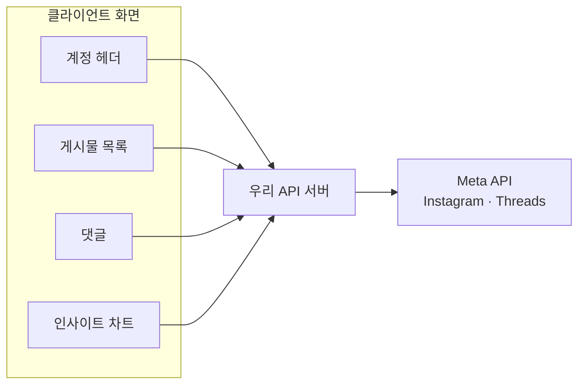
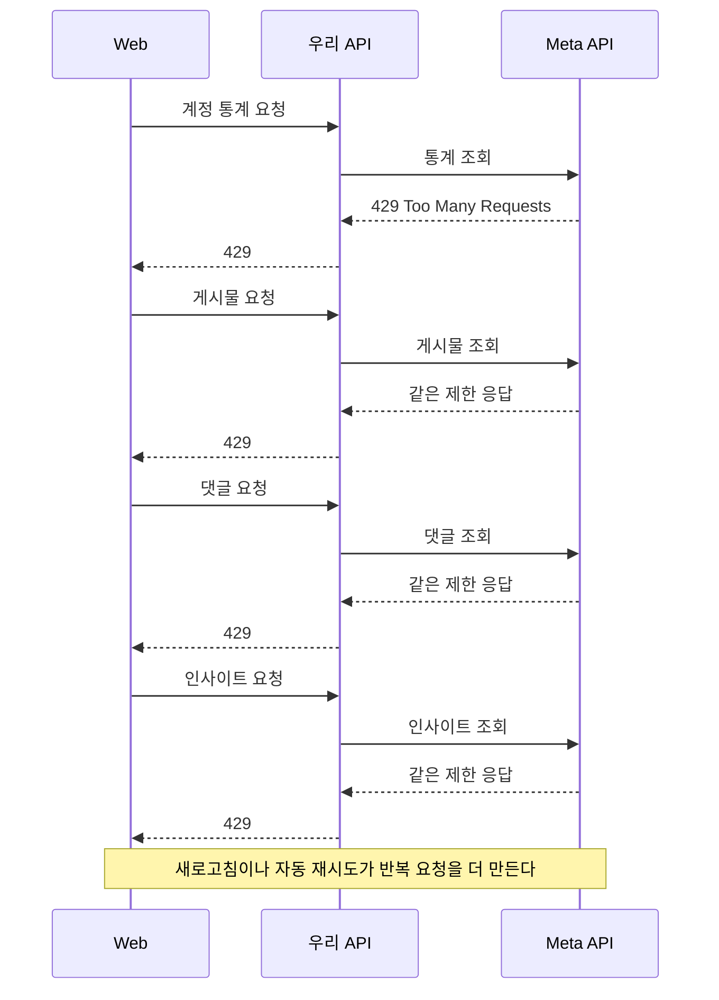
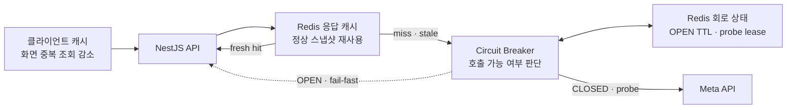
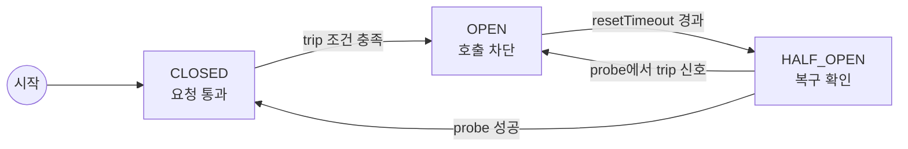
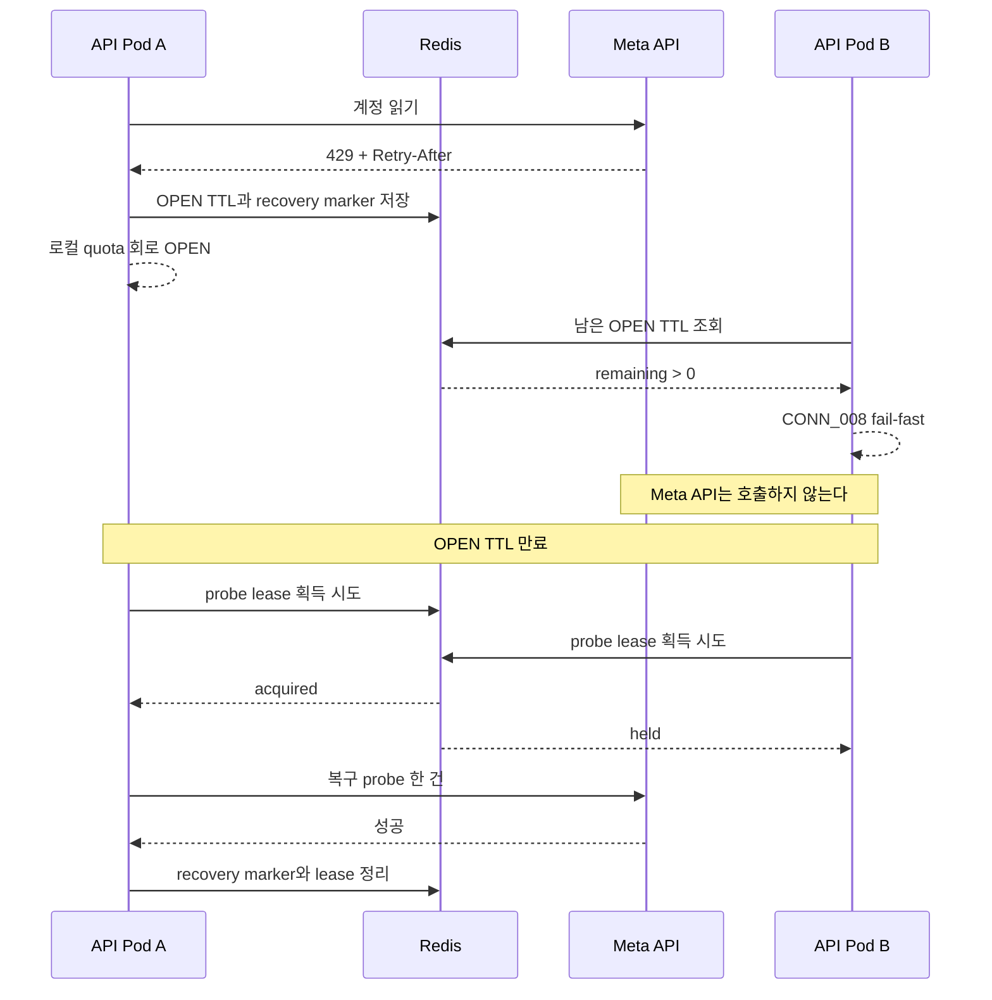
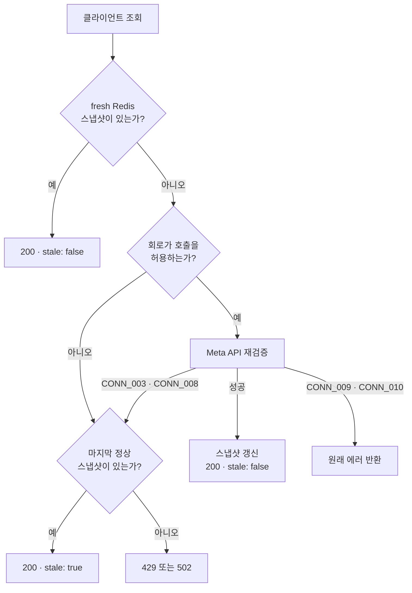
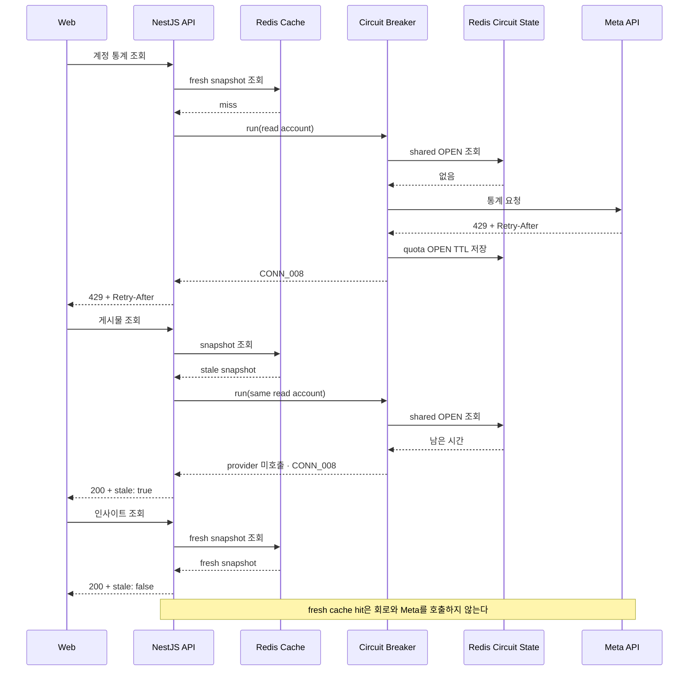

Instagram과 Threads 연동 화면을 만들면서 까다로웠던 점은 API 한 건의 실패가 아니었다. 클라이언트에서는 별개로 보이는 요청들이 서버를 지나면 같은 Meta 계정과 호출 한도를 공유한다는 점이었다.

우리 서비스는 연결된 계정의 프로필 통계, 게시물, 댓글, 인사이트를 가져온다. 화면 하나를 그리는 동안에도 다음 요청들이 비슷한 시점에 실행된다.

```ts
const stats = await provider.fetchAccountStats(accessToken);
const posts = await provider.fetchPosts(accessToken, {
  limit: 12,
  cursor: null,
});
const comments = await provider.fetchComments(accessToken, {
  mediaId,
  limit: 20,
  cursor: null,
});
const insights = await provider.fetchAccountInsights(accessToken, {
  since,
  until,
});
```

클라이언트에서 보면 서로 다른 API 요청이지만 서버를 지나면 모두 같은 Meta 계정을 향한다.



평소에는 문제가 없다. Meta가 계정이나 앱의 호출을 제한하기 시작하면 이야기가 달라진다. 계정 헤더 요청이 이미 제한 응답을 받았는데도 게시물, 댓글, 인사이트 요청은 각자 Meta를 호출한다. 화면 새로고침이나 클라이언트 재시도까지 겹치면 실패할 가능성이 큰 요청이 계속 쌓인다.

특히 Meta API는 호출 한도가 엄격하고 집계 범위도 하나가 아니다. 단순히 “1분에 몇 번” 같은 고정 숫자만 지켜서는 모든 제한을 예측하기 어렵다. Meta가 이미 접근을 막았는데 계속 호출하면 네트워크와 서버 자원만 낭비한다.

이때 한 가지 의문이 생겼다.

> 방금 Meta가 이 호출 범위는 실패한다고 알려줬는데, 다음 요청도 정말 Meta까지 보내야 할까?

이 질문에 답하는 장치가 `서킷 브레이커(Circuit Breaker)`다.

이 글은 2026년 7월 17일의 실제 API 코드를 기준으로 한다. 서킷 브레이커를 처음 접하는 클라이언트 개발자도 이해할 수 있도록 문제 상황부터 시작하고, 뒤에서 NestJS, Opossum, Redis로 구현한 구조와 테스트를 살펴본다.

---

## 서킷 브레이커가 없으면 어떤 일이 생길까?

첫 번째 요청이 Meta의 호출 제한을 확인했다고 가정해보자.



가장 먼저 눈에 띄는 문제는 **이미 확인한 실패를 다음 요청에서 활용하지 못한다는 점**이다. 각 endpoint가 자기 요청만 처리하면 계정 통계에서 확인한 제한 상태를 게시물과 댓글 요청은 알 수 없다.

응답도 필요 이상으로 느려진다. 결국 실패할 요청인데 매번 Meta와의 통신이 끝날 때까지 기다린다. 클라이언트에는 느린 에러가 여러 개 보이고, 서버의 연결과 메모리도 그동안 점유된다.

더 큰 문제는 요청이 한 화면에서만 나오지 않는다는 것이다. 다른 기기, 백그라운드 작업, 여러 API 서버 인스턴스가 같은 계정을 호출할 수 있다. 클라이언트 캐시 하나로는 이 요청들을 함께 제어할 수 없다.

서킷 브레이커는 첫 실패 자체를 없애지는 못한다. 대신 첫 실패에서 얻은 상태를 기억해 **그 뒤의 불필요한 호출을 빠르게 차단한다.**

---

## 클라이언트 캐시나 Redis 캐시만 잘 쓰면 되지 않을까?

가장 먼저 떠오르는 대안은 캐시다. 실제로 클라이언트 캐시, Redis 응답 캐시, DB 스냅샷은 모두 Meta 호출을 줄이는 데 도움이 된다. Rate Limiter와 재시도 역시 상황에 따라 필요하다. 문제는 이 방법들이 서로 다른 질문에 답한다는 데 있다.

| 방법 | 잘 해결하는 문제 | 이것만으로 부족한 이유 |
| --- | --- | --- |
| 클라이언트 캐시 | 같은 화면과 기기의 중복 조회, 빠른 재렌더링 | 다른 사용자·기기·서버 작업을 조정하지 못한다 |
| Redis 응답 캐시 | 여러 API 서버가 최근 정상 응답을 공유한다 | cache miss, 만료, 강제 새로고침, 쓰기 요청은 Meta를 호출해야 한다 |
| DB 스냅샷 | 영속 이력, 리포팅, 긴 보존 기간 | “지금 호출 가능한가”를 판단하는 장치가 아니며 쓰기·정리 비용이 생긴다 |
| Rate Limiter | 알려진 규칙에 맞춰 요청 속도를 선제적으로 제한한다 | Meta가 실제로 차단했거나 장애 중이라는 상태까지 기억하지는 않는다 |
| 재시도 | 짧은 네트워크 흔들림에서 성공 가능성을 높인다 | 호출 제한 중에는 실패 요청을 더 늘릴 수 있다 |
| 서킷 브레이커 | 최근 실패 상태를 기억하고 외부 호출 자체를 막는다 | 정상 데이터를 대신 제공하지는 않는다 |

캐시와 서킷 브레이커 중 하나를 고르는 문제가 아니었다. 각 계층에 다른 책임을 맡겨야 했다.



전체 시스템에서는 다음처럼 역할을 나눌 수 있다. 현재 API 코드는 이 중 서버 영역을 구현한다.

- 클라이언트는 화면 단위 캐시와 요청 상태로 중복 조회를 줄일 수 있다.
- 서버는 통계, 게시물, 인사이트의 마지막 정상 응답을 Redis에 보관한다.
- 같은 cache key의 동시 miss는 `SingleFlight`로 한 요청에 합친다.
- 서킷 브레이커가 지금 Meta를 호출해도 되는지 판단한다.
- 여러 API 서버가 OPEN 상태와 복구 probe를 Redis로 공유한다.

Meta 조회 결과를 DB에 저장하는 선택도 틀린 것은 아니다. 이력 조회, 감사, 리포팅, 오프라인 사용이 제품 요구사항이라면 오히려 DB가 더 잘 맞는다. 현재 필요했던 것은 일정 시간 동안 마지막 정상 응답을 제공하고, 짧게 유지되는 차단 상태를 여러 서버가 공유하는 일이었다. 영구 보존할 업무 데이터가 아니었기 때문에 TTL을 쓰기 쉬운 Redis를 택했다.

회로 상태 자체를 DB에 저장할 수도 있다. 다만 그러면 provider 호출마다 만료 시간을 읽고, 복구 probe를 위한 lease를 원자적으로 획득해야 한다. DB가 이 호출 경로의 핵심 의존성이 되는 셈이다. 현재 구조에서는 짧은 TTL과 `SET NX`가 필요한 상태만 Redis에 두는 편이 단순했다. DB가 유일한 공유 저장소이거나 상태 전이 이력을 반드시 남겨야 하는 서비스라면 판단이 달라질 수 있다.

응답 캐시와 회로 상태가 같은 Redis를 사용한다고 해서 같은 데이터인 것은 아니다.

- 응답 캐시는 “마지막으로 성공한 데이터가 무엇인가?”를 저장한다.
- 회로 상태는 “이 key를 언제까지 호출하지 말아야 하는가?”를 저장한다.

클라이언트에서 `Retry-After`를 지키고 자동 재시도를 멈추는 것도 필요하다. 다만 클라이언트는 다른 사용자와 백그라운드 작업이 보내는 호출까지 볼 수 없다. Meta 토큰과 전체 호출량을 소유한 서버가 회로 상태도 소유해야 하는 이유다.

---

## 서킷 브레이커는 무엇일까?

서킷 브레이커는 외부 시스템 호출의 성공과 실패를 관찰하다가, 정해진 장애 신호가 감지되면 후속 호출을 외부로 보내지 않고 즉시 실패시키는 패턴이다.

이때 외부 시스템은 우리 코드 밖에 있고 네트워크를 통해 호출하는 대상을 뜻한다. 이 글에서는 Instagram과 Threads API가 외부 시스템이다.

서킷 브레이커는 보통 `CLOSED`, `OPEN`, `HALF_OPEN` 세 가지 상태를 가진다.



상태 이름은 처음 보면 반대로 느껴질 수 있다. `CLOSED`에서는 요청 경로가 연결되어 호출이 통과하고, `OPEN`에서는 요청 경로를 끊어 호출을 막는다.

### CLOSED: 평소처럼 호출한다

`CLOSED`는 정상 상태다. 요청을 Meta로 보내고 결과를 관찰한다.

```text
클라이언트 → 우리 API → Circuit CLOSED → Meta API
```

성공 응답은 그대로 반환한다. 실패하더라도 모든 실패가 곧바로 회로를 여는 것은 아니다. 어떤 에러를 장애 신호로 셀지는 서비스가 정해야 한다.

### OPEN: 외부 호출 없이 빠르게 실패한다

회로를 열 조건이 충족되면 `OPEN`이 된다. 이 상태에서 들어오는 요청은 Meta를 호출하지 않는다.

```text
클라이언트 → 우리 API → Circuit OPEN → fail-fast
                                    ↘ Meta API 미호출
```

클라이언트는 느린 외부 실패를 기다리지 않고 즉시 에러 또는 오래된 정상 데이터를 받는다. Meta에는 제한 중인 요청을 더 보내지 않는다.

### HALF_OPEN: 제한된 요청으로 복구를 확인한다

`resetTimeout`이 지나도 회로를 바로 닫지 않는다. `HALF_OPEN`으로 전환해 제한된 probe 요청으로 Meta가 회복했는지 확인한다.

- probe가 성공하면 `CLOSED`로 돌아간다.
- probe에서도 회로를 여는 장애 신호가 나오면 다시 `OPEN`하고 다음 확인 시점까지 기다린다.

따라서 `resetTimeout`은 “이 시간이 지나면 정상”이라는 보장이 아니다. **다시 확인해도 되는 가장 이른 시점**이다.

### 타임아웃, Rate Limiter, 재시도와 무엇이 다를까?

| 패턴 | 답하는 질문 |
| --- | --- |
| 타임아웃 | 이 한 요청을 얼마나 오래 기다릴까? |
| Rate Limiter | 우리가 요청을 얼마나 자주 보낼까? |
| 재시도 | 이 실패를 다시 시도할 가치가 있는가? |
| 서킷 브레이커 | 최근 상태를 볼 때 지금 호출을 보내도 되는가? |
| 캐시·폴백 | 호출하지 못할 때 사용자에게 무엇을 보여줄까? |

한 Meta HTTP 요청에는 `10초 타임아웃`을 적용하고, 계정과 작업 단위에는 `서킷 브레이커`를 적용하며, 읽기 응답에는 `캐시 폴백`을 함께 사용할 수 있다.

---

## Meta API에서는 무엇을 실패 신호로 볼까?

2026년 7월 17일 기준 [Instagram Platform Rate Limiting](https://developers.facebook.com/documentation/instagram-platform/overview#rate-limiting)과 [Threads API Rate Limiting](https://developers.facebook.com/docs/threads/overview#rate-limiting) 문서에서, 메시징을 제외한 일반 endpoint 호출량은 호출 앱과 앱 사용자 조합을 기준으로 설명된다.

```text
Calls within 24 hours = 4,800 × Number of Impressions
```

하지만 이것이 유일한 한도는 아니다. CPU time과 total time 제한이 별도로 적용될 수 있고, 게시·답글·삭제 같은 작업에도 별도 쿼터가 있다. [Graph API Rate Limiting](https://developers.facebook.com/docs/graph-api/overview/rate-limiting/)의 오류 코드마다 제한 범위도 다르다.

우리 서버가 Meta의 모든 내부 집계값을 똑같이 계산하는 것은 현실적이지 않다. 그래서 호출 횟수를 추정해 대신 판정하기보다 Meta 응답을 네 종류로 정규화한다.

| 분류 | 감지 신호 | 서버 에러 | 회로 정책 |
| --- | --- | --- | --- |
| 호출 제한 | HTTP `429`, Meta 코드 `4`, `17`, `32`, `613`, `80001`, `80002`, 명시적 제한 문구 | `CONN_008` | quota 회로 |
| 일시 장애 | 네트워크 오류, HTTP `408`, `5xx` | `CONN_003` | transient 회로 |
| 인증·권한 | HTTP `401`, `403`, Meta 코드 `10`, `102`, `190`, `200` | `CONN_009` | 회로를 열지 않고 재연동 처리 |
| 잘못된 요청·응답 | 그 밖의 `4xx`, 깨진 응답 계약 | `CONN_010` | 회로를 열지 않고 요청·코드 수정 |

호출 제한 문구에는 `API access blocked`, `rate limit`, `too many calls`, `too many requests`, `request limit`이 포함된다. 단순히 `temporarily`라는 단어가 있다는 이유만으로 제한으로 오판하지 않는다.

Meta 에러 코드 `200`은 HTTP `200 OK`가 아니라 Meta 오류 본문 안의 숫자 코드다. 같은 코드라도 메시지가 `API access blocked`라면 호출 제한으로 먼저 분류하고, 그 외 권한 오류라면 인증·권한 실패로 분류한다.

```ts
const RATE_LIMIT_CODES = new Set([
  4, 17, 32, 613, 80_001, 80_002,
]);

function classifyMetaFailure(status: number, error: MetaError | null) {
  if (isRateLimited(status, error)) return 'rate-limit';

  if (status === 408 || (status >= 500 && status <= 599)) {
    return 'transient';
  }

  if (
    status === 401 ||
    status === 403 ||
    AUTHORIZATION_CODES.has(error?.code)
  ) {
    return 'authorization';
  }

  return 'invalid';
}
```

판정 순서는 중요하다. 제한을 권한 오류보다 먼저 검사하지 않으면 `code: 200, message: "API access blocked"`를 재연동 문제로 잘못 처리할 수 있다.

### Meta가 알려준 복구 시간을 따른다

응답에 [`Retry-After`](https://developer.mozilla.org/ko/docs/Web/HTTP/Headers/Retry-After)가 있으면 초 단위 값과 HTTP 날짜 형식을 모두 해석한다. `X-Business-Use-Case-Usage`의 `estimated_time_to_regain_access`가 있으면 분을 초로 바꾼다. 두 값이 모두 있으면 더 긴 시간을 선택한다.

```ts
const candidates = [
  retryAfterHeaderSeconds(response.headers.get('retry-after')),
  businessUsageRetrySeconds(
    response.headers.get('x-business-use-case-usage'),
  ),
].filter((value): value is number => value !== undefined);

const retryAfterSeconds =
  candidates.length === 0 ? undefined : Math.max(...candidates);
```

복구 힌트가 없을 때만 기본값 `120초`를 사용한다. 이 값은 quota 회로의 현재 `resetTimeout`과 우리 API의 [`429 Too Many Requests`](https://developer.mozilla.org/ko/docs/Web/HTTP/Status/429) 응답에 함께 반영된다.

`CONN_008`을 HTTP `429`로 노출하는 것은 우리 서비스의 계약이다. 같은 HTTP 상태를 사용하는 로컬 요청 제한 `COMMON_004`와는 에러코드로 구분한다.

---

## 실제 구현은 왜 회로가 두 개일까?

처음에는 “Meta 계정마다 회로 하나”를 떠올리기 쉽다. 하지만 호출 제한과 일시 장애를 한 회로의 실패 통계에 섞으면 문제가 생긴다.

- 명시적인 호출 제한은 첫 신호에서 바로 멈춰야 한다.
- 네트워크 오류 하나만으로 계정 전체를 오래 막아서는 안 된다.
- 호출 제한의 복구 시간은 Meta가 알려줄 수 있지만 네트워크 장애는 짧게 다시 확인하는 편이 낫다.

그래서 현재 구현은 하나의 base key 아래 `quota`와 `transient` 두 회로를 둔다.

```ts
export const PROVIDER_QUOTA_CIRCUIT_OPTIONS = {
  shouldTrip: isProviderRateLimited,
  volumeThreshold: 1,
  errorThresholdPercentage: 0,
  resetTimeoutMs: providerResetTimeoutMs,
  openError: providerQuotaOpenError,
};

export const PROVIDER_TRANSIENT_CIRCUIT_OPTIONS = {
  shouldTrip: isProviderTransientFailure,
  volumeThreshold: 3,
  errorThresholdPercentage: 50,
  resetTimeoutMs: () => 30_000,
  openError: () => new BusinessException('CONN_003'),
};
```

quota 회로는 `CONN_008` 첫 한 건에 열린다. Meta가 이미 제한을 알렸으므로 같은 실패를 더 수집할 필요가 없다.

transient 회로는 `CONN_003`이 반복될 때만 열린다. 최소 3건을 관찰하고 실패율이 50%를 초과하면 30초 동안 차단한다. 네트워크가 한 번 흔들렸다는 이유만으로 모든 요청을 막지 않기 위한 정책이다.

Opossum은 실패율이 설정값보다 **클 때** 회로를 연다. quota 회로의 `errorThresholdPercentage: 0`은 첫 제한 실패율이 0보다 커지는 즉시 열기 위한 값이다.

---

## 어떤 요청들이 같은 회로를 공유할까?

회로를 Meta 전체에 하나만 만들면 한 계정의 문제가 모든 사용자를 막는다. 반대로 endpoint마다 만들면 계정 통계에서 제한을 확인한 뒤에도 게시물과 댓글 endpoint가 계속 Meta를 호출한다.

현재 base key는 `provider + workload + subject`로 만든다.

```ts
export function providerCircuitKey(
  provider: string,
  workload: ProviderCircuitWorkload,
  subject: string,
) {
  return `provider:${provider}:${workload}:${subject}`;
}
```

| workload | subject | 보호하는 작업 |
| --- | --- | --- |
| `oauth` | `app` | 인증 코드 교환과 프로필 확인 |
| `read` | `providerAccountId` | 통계, 게시물, 댓글, 인사이트 |
| `publish` | `providerAccountId` | 게시물 발행 |
| `reply` | `providerAccountId` | 댓글 답글 |
| `token-refresh` | `providerAccountId` | 장기 토큰 갱신 |

같은 계정의 통계, 게시물, 댓글, 인사이트는 모두 `read` 회로를 공유한다. 통계 요청이 계정 제한을 감지하면 뒤이어 들어온 게시물과 댓글 요청도 Meta를 호출하지 않는다.

반면 읽기, 게시, 답글, 토큰 갱신은 서로 다른 회로를 사용한다. 작업별 쿼터와 실패 범위가 다를 수 있기 때문이다.

이 key가 Meta의 모든 내부 쿼터 범위를 완벽히 재현한다는 뜻은 아니다. 예를 들어 코드 `4`는 앱 수준 제한일 수 있고, Meta의 app user와 로컬 `providerAccountId`가 언제나 같은 개념인 것도 아니다. 현재 key는 우리 서비스에 필요한 **장애 격리 경계**다. 앱 수준 제한을 신뢰성 있게 구분할 수 있게 되면 별도의 `appId` 회로가 필요하다.

---

## NestJS와 Opossum에서는 어떻게 연결했을까?

현재 서버는 lockfile 기준 [`opossum@10.0.0`](https://github.com/nodeshift/opossum/tree/v10.0.0)을 사용한다. Opossum은 Promise 함수를 감싸 `CLOSED`, `OPEN`, `HALF_OPEN` 상태 전이와 통계를 관리한다.

애플리케이션 코드가 Opossum에 직접 의존하지 않도록 작은 포트 뒤에 숨겼다.

```ts
export interface CircuitBreakerRunOptions {
  readonly shouldTrip?: (error: unknown) => boolean;
  readonly volumeThreshold?: number;
  readonly errorThresholdPercentage?: number;
  readonly resetTimeoutMs?: (
    error: unknown,
  ) => number | undefined;
  readonly openError: (
    retryAfterMs: number | undefined,
  ) => Error;
}

export interface CircuitBreakerPort {
  run<T>(
    key: string,
    action: () => Promise<T>,
    options: CircuitBreakerRunOptions,
  ): Promise<T>;
}
```

use-case는 Opossum이나 Redis를 알 필요가 없다. 공용 정책 함수로 provider 호출을 감싼다.

```ts
const page = await runProviderCall(
  circuit,
  providerCircuitKey(
    connection.provider,
    'read',
    connection.providerAccountId,
  ),
  () =>
    provider.fetchPosts(connection.accessToken, {
      limit: input.limit,
      cursor: input.cursor,
    }),
);
```

`runProviderCall`은 base key 뒤에 실제 회로 종류를 붙인다.

```ts
export function runProviderCall<T>(
  circuit: CircuitBreakerPort,
  key: string,
  action: () => Promise<T>,
) {
  return circuit.run(
    `${key}:transient`,
    () =>
      circuit.run(
        `${key}:quota`,
        action,
        PROVIDER_QUOTA_CIRCUIT_OPTIONS,
      ),
    PROVIDER_TRANSIENT_CIRCUIT_OPTIONS,
  );
}
```

Instagram 계정 `178...`의 읽기는 다음 두 상태를 갖는다.

```text
provider:instagram:read:178...:transient
provider:instagram:read:178...:quota
```

`transient` 회로가 바깥에 있고 `quota` 회로가 안쪽에 있다. 두 회로는 같은 action을 보호하지만 실패 통계와 복구 시간을 섞지 않는다.

### Opossum의 errorFilter를 주의해야 한다

Opossum의 `errorFilter`는 `true`를 반환하면 해당 에러를 실패 통계에서 제외한다. 일반적인 filter 이름만 보고 반대로 이해하기 쉬운 부분이다.

```ts
errorFilter: (error: unknown) => {
  const shouldTrip = options.shouldTrip?.(error) ?? true;
  return !shouldTrip;
};
```

통계에서 제외된 에러도 호출부에는 원래 에러 그대로 다시 던진다. 회로를 열지 않는다는 것과 요청을 성공으로 바꾼다는 것은 다른 문제다.

공용 Opossum 옵션의 `timeout: false`도 외부 호출에 타임아웃이 없다는 뜻이 아니다. HTTP 어댑터가 이미 `AbortSignal.timeout(10_000)`으로 요청 수명을 관리한다. 타임아웃을 두 곳에서 경쟁시키지 않고 HTTP 계층이 소유하게 한 것이다.

---

## API 서버가 여러 대면 상태를 어떻게 공유할까?

Opossum의 상태는 기본적으로 프로세스 메모리에 있다. API Pod A가 회로를 열어도 Pod B는 그 사실을 모를 수 있다. Pod B가 같은 실패를 다시 확인해야만 자신의 회로를 연다면 서버 수만큼 불필요한 Meta 호출이 생긴다.

그렇다고 Opossum의 모든 통계와 상태 전이를 Redis에 다시 구현할 필요는 없다. 현재 구조는 로컬 Opossum에 Redis의 최소 공유 상태만 결합한다.

- `OPEN TTL`: 다른 인스턴스도 같은 key를 즉시 차단한다.
- `recovery marker`: OPEN TTL 만료 후 복구 확인이 필요하다는 사실을 남긴다.
- `probe lease`: `SET NX PX`로 여러 인스턴스 중 하나만 복구 요청을 보낸다.



새 OPEN 시간이 기존 TTL보다 길 때만 Redis 값을 연장한다. 짧은 후속 신호가 더 긴 복구 시간을 줄이지 않게 한 것이다. probe lease는 130초 뒤 자동 만료하므로 probe 도중 프로세스가 종료돼도 다른 인스턴스가 영원히 막히지 않는다.

Redis를 회로의 단일 진실 공급원으로 취급하지는 않는다. Redis 조회나 lease 획득이 실패하면 공유 보호 계층은 `fail-open`하고 각 프로세스의 로컬 Opossum 회로가 계속 동작한다.

즉, 현재 구현은 완전히 분산된 상태 머신이 아니다. **로컬 상태 머신 + 분산 OPEN 신호 + 단일 recovery probe**를 조합한 하이브리드 구조다.

첫 제한 응답이 돌아오기 전에 이미 Meta로 출발한 동시 요청까지 취소할 수는 없다. fail-fast가 보장하는 범위는 로컬 또는 공유 회로가 열린 뒤 시작한 후속 호출이다.

---

## 회로가 열리면 클라이언트에는 무엇을 보여줄까?

서킷 브레이커의 책임은 외부 호출을 통과시킬지 결정하는 데까지다. 호출하지 못할 때 무엇을 반환할지는 캐시와 use-case의 책임이다.

현재 통계, 게시물, 인사이트 조회는 Redis에 마지막 정상 스냅샷을 보관한다.

1. 신선한 스냅샷이 있으면 Meta를 호출하지 않고 반환한다.
2. 스냅샷이 오래됐으면 같은 요청 안에서 Meta 재검증을 기다린다.
3. 재검증이 `CONN_003` 또는 `CONN_008`로 실패하면 마지막 정상 값을 `stale: true`로 반환한다.
4. `CONN_009`와 `CONN_010`은 오래된 값으로 숨기지 않고 그대로 반환한다.

이 패턴의 정확한 이름은 `stale-while-revalidate`가 아니라 **stale-if-error**다. stale-while-revalidate는 오래된 값을 먼저 응답하고 백그라운드에서 갱신한다. 현재 코드는 갱신을 같은 요청에서 기다리고, 실패했을 때만 stale 값을 사용한다.

| 데이터 | fresh 구간 | Redis 보존 | 장애 시 stale |
| --- | ---: | ---: | --- |
| 계정 통계 | 5분 | 6시간 | `CONN_003`, `CONN_008` |
| 게시물 | 2분 | 30분 | `CONN_003`, `CONN_008` |
| 인사이트 | 15분 | 48시간 | `CONN_003`, `CONN_008` |
| 댓글 | 없음 | 없음 | 없음 |

게시물 캐시 key에는 `limit`과 `cursor`의 fingerprint가 포함된다. 서로 다른 페이지 결과가 섞이지 않게 한 것이다.

캐시가 한 번도 만들어지지 않은 최초 조회라면 보여줄 값이 없으므로 원래 에러를 반환한다. 댓글도 별도 스냅샷이 없으므로 fail-fast 에러를 그대로 받는다.

통계, 게시물, 인사이트 reader는 프로세스 안의 `SingleFlight`로 같은 cache key의 동시 miss를 하나의 provider 호출로 합친다. 이것은 평상시 cache stampede를 줄이는 역할이고, 다중 인스턴스의 복구 시점 호출은 Redis probe lease가 별도로 조정한다.



클라이언트는 `stale: true`를 정상 최신 데이터와 똑같이 다루지 않는 편이 좋다. 마지막 갱신 시각을 함께 보여주고, 사용자가 데이터가 오래됐다는 사실을 이해할 수 있게 해야 한다.

에러를 받았을 때도 코드별 대응이 다르다.

- `CONN_008`: 서버가 전달한 `Retry-After` 전에는 자동 재시도하지 않는다.
- `CONN_003`: 즉시 연속 재시도하지 않는다. 멱등 읽기에 한해 지수 `backoff`와 `jitter`를 적용할 수 있다.
- `CONN_009`: 재시도보다 계정 재연동 화면으로 안내한다.
- `CONN_010`: 같은 요청을 반복하지 않고 요청 파라미터나 서버 어댑터를 확인한다.

---

## 전체 요청 흐름을 한 번에 보면

Meta 계정 통계 요청에서 처음 호출 제한이 발생하고, 이어서 게시물과 인사이트 요청이 들어오는 상황을 정리하면 다음과 같다.



fresh 캐시가 있으면 회로까지 갈 필요가 없다. 캐시가 없거나 오래됐을 때만 회로가 호출 가능 여부를 판단한다. 회로가 열려 있어도 마지막 정상 값이 남아 있다면 클라이언트는 stale 응답을 받을 수 있다. 저장된 데이터와 호출 차단 상태를 분리했기 때문에 가능한 흐름이다.

---

## 현재 구현이 하지 않는 것들

### 서킷 브레이커는 Rate Limiter가 아니다

현재 구현은 Meta 한도를 미리 계산해 요청을 배분하지 않는다. Meta가 제한 신호를 보내면 그때 quota 회로를 연다. 제한 도달 전 호출량을 제어하려면 별도의 Rate Limiter나 quota 예약 정책이 필요하다.

동시에 실행되는 요청 수를 제한하는 `Bulkhead`도 아니다. 느린 호출이 너무 많이 쌓이는 문제는 큐나 동시성 limiter로 따로 다뤄야 한다.

### 캐시가 모든 실패를 숨기지는 않는다

stale 폴백은 일시 장애와 호출 제한에만 사용한다. 토큰이 만료됐거나 요청 계약이 잘못됐는데 오래된 데이터를 계속 보여주면 사용자는 문제를 알 수 없고 복구도 늦어진다.

쓰기 요청도 stale 데이터로 대체할 수 없다. 게시와 답글, 토큰 갱신은 workload별 회로로 격리하지만 성공한 것처럼 응답하지 않는다.

### Redis가 모든 로컬 상태를 복제하지 않는다

Redis에는 Opossum의 rolling 통계나 정확한 `CLOSED` 상태를 복제하지 않는다. OPEN 기간, recovery marker, probe lease만 공유한다. 운영 복잡도를 낮추면서 서버 수만큼 중복되는 Meta 호출을 줄이기 위한 선택이다.

---

## 회로 인스턴스가 메모리에 계속 쌓이지 않을까?

key마다 Opossum 인스턴스를 만들면 로컬 `Map`의 수명도 관리해야 한다.

현재 어댑터는 다음 정책으로 회로를 정리한다.

- 최근 15분 동안 접근하지 않은 제거 가능한 회로를 정리한다.
- 기본 최대 크기는 5,000개다.
- 상한에 도달하면 가장 오래 사용하지 않은 회로부터 제거한다.
- 실행 중이거나 `OPEN`, `HALF_OPEN`인 회로는 제거하지 않는다.
- 모두 보호 상태라 제거할 수 없으면 상한을 일시적으로 초과하고 경고를 남긴다.
- NestJS 모듈 종료 시 모든 breaker에 `shutdown()`을 호출한다.

별도 `setInterval`은 만들지 않았다. 요청 경로에서 1분에 한 번만 opportunistic sweep을 수행한다.

여기서 5,000은 계정 수가 아니라 **실제 breaker entry 수**다. 한 base key가 `:quota`와 `:transient` 두 회로를 만들 수 있으므로 활성 workload 하나가 최대 두 entry를 차지한다.

---

## 무엇을 테스트해야 할까?

서킷 브레이커 테스트에서 가장 중요한 단언은 에러코드만 확인하는 것이 아니다. **회로가 열린 뒤 실제 provider action이 호출되지 않았는지**까지 확인해야 한다.

```ts
await expect(
  circuit.run('account:quota', blockedAction, quotaOptions),
).rejects.toMatchObject({ code: 'CONN_008' });

const nextAction = mock(async () => 'should-not-run');

await expect(
  circuit.run('account:quota', nextAction, quotaOptions),
).rejects.toMatchObject({ code: 'CONN_008' });

expect(nextAction).not.toHaveBeenCalled();
```

현재 테스트는 다음 경계를 나눠 검증한다.

- HTTP `429`, Meta 제한 코드와 차단 문구가 `CONN_008`로 분류되는가?
- 네트워크·`408`·`5xx`, 인증·권한, 잘못된 요청이 서로 다른 에러로 보존되는가?
- `Retry-After`와 BUC 복구 시간 중 더 긴 값이 적용되는가?
- 로그에서 access token과 응답 본문이 빠지고 숫자 code와 subcode만 남는가?
- base key가 provider, workload, subject별로 분리되는가?
- quota와 transient 회로의 trip 조건과 reset 시간이 섞이지 않는가?
- OPEN 뒤 provider 호출이 막히고 probe 결과에 따라 닫히거나 다시 열리는가?
- `OPEN`, `HALF_OPEN`, 실행 중 회로가 idle/LRU 정리에서 보호되는가?
- Redis 공유 OPEN이 다른 인스턴스의 provider 호출을 막는가?
- 여러 인스턴스 중 하나만 probe lease를 얻고 owner만 lease를 정리하는가?
- Redis 장애 시 로컬 회로와 원래 provider 에러가 보존되는가?
- 통계, 게시물, 인사이트의 fresh hit, stale-if-error, `SingleFlight`가 동작하는가?
- 인증·권한과 잘못된 요청은 stale 데이터로 숨기지 않는가?
- 읽기, OAuth, 게시, 답글, 토큰 갱신 경로가 의도한 workload key를 사용하는가?

테스트에서는 실제 Meta API를 호출하지 않는다. HTTP 어댑터는 `fetch`를 stub하고, use-case는 provider와 회로 포트를 mock한다. Redis 정책은 fake Redis와 독립된 breaker 인스턴스로 경쟁 조건을 재현한다.

---

## 운영에서 무엇을 관찰해야 할까?

현재 Opossum 어댑터는 `open`, `halfOpen`, `close` 이벤트에서 key와 상태 전이를 로그로 남긴다. HTTP 어댑터는 전체 오류 본문 대신 HTTP status와 Meta code, subcode만 기록한다. access token, client secret, OAuth code는 로그에 남기지 않는다.

운영 메트릭으로는 다음 값을 확인할 필요가 있다.

- provider와 workload별 OPEN 횟수와 지속시간
- quota와 transient별 fail-fast 거부 수
- half-open probe 성공·실패와 분산 lease 경쟁 수
- Redis 공유 상태 조회·쓰기 실패율
- 활성 로컬 회로 수와 일시적 상한 초과 횟수
- stale 응답률과 stale 데이터의 나이

현재 코드에는 상태 전이 로그와 `activeCircuitCount` getter가 있다. 하지만 getter가 있다는 사실과 운영 대시보드에 수집된다는 사실은 다르다. metrics pipeline 연결은 별도로 확인해야 한다.

`providerAccountId`처럼 cardinality가 큰 값을 메트릭 label로 그대로 넣어서도 안 된다. 메트릭은 provider와 workload 수준으로 집계하고 개별 계정 추적은 보안 정책에 맞는 로그에서 제한적으로 처리하는 편이 안전하다.

---

## 그래서 왜 서킷 브레이커였을까?

처음에는 캐시만 더 촘촘하게 두면 충분해 보였다. 하지만 cache miss는 여전히 생기고, 쓰기와 토큰 갱신은 캐시로 해결할 수 없다. DB에 응답을 쌓아도 “지금 Meta를 호출해도 되는가?”라는 질문에는 답하지 못한다. Rate Limiter는 우리가 보내는 속도를 제어하지만 Meta가 실제로 차단했는지는 알 수 없다.

결국 비어 있던 자리는 저장소가 아니라 **최근 외부 장애를 기억하고 다음 호출을 허용할지 결정하는 장치**였다. 평상시 호출량은 캐시와 `SingleFlight`가 줄이고, 장애가 시작된 뒤에는 quota와 transient 회로가 Meta 호출을 멈춘다. 여러 서버의 OPEN 상태와 복구 probe는 Redis로 맞추고, 읽기 화면에는 가능하면 마지막 정상 값을 돌려준다.

이 구조는 Meta의 쿼터를 완벽히 예측해서 만든 것이 아니다. 오히려 모든 한도를 미리 계산할 수 없다는 전제에서 출발했다. Meta가 보내는 실제 제한 신호를 신뢰하고, 한 번 확인한 실패를 여러 endpoint와 서버가 반복하지 않게 만든 것이다.

서킷 브레이커는 실패를 없애지 않는다. 이미 시작된 외부 장애가 불필요한 호출과 긴 대기, 연쇄 실패로 커지지 않도록 선을 긋는다. 우리 서비스에서 필요했던 것도 바로 그 경계였다.

더 자세히 살펴보고 싶다면 아래 문서를 확인해볼 수 있다.

- [Opossum v10.0.0](https://github.com/nodeshift/opossum/tree/v10.0.0)
- [Opossum v10.0.0 circuit 구현](https://github.com/nodeshift/opossum/blob/v10.0.0/lib/circuit.js)
- [Meta Graph API Rate Limiting](https://developers.facebook.com/docs/graph-api/overview/rate-limiting/)
- [Instagram Platform Rate Limiting](https://developers.facebook.com/documentation/instagram-platform/overview#rate-limiting)
- [Threads API Rate Limiting](https://developers.facebook.com/docs/threads/overview#rate-limiting)
- [MDN 429 Too Many Requests](https://developer.mozilla.org/ko/docs/Web/HTTP/Status/429)
- [MDN Retry-After](https://developer.mozilla.org/ko/docs/Web/HTTP/Headers/Retry-After)
