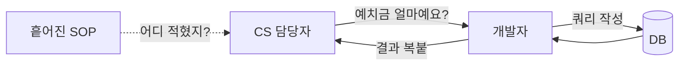
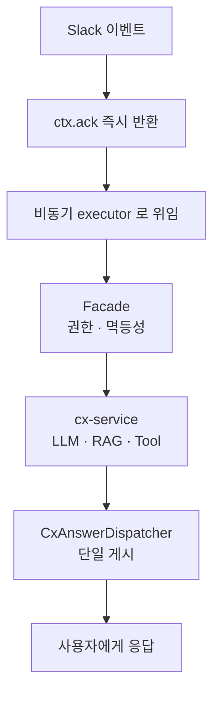
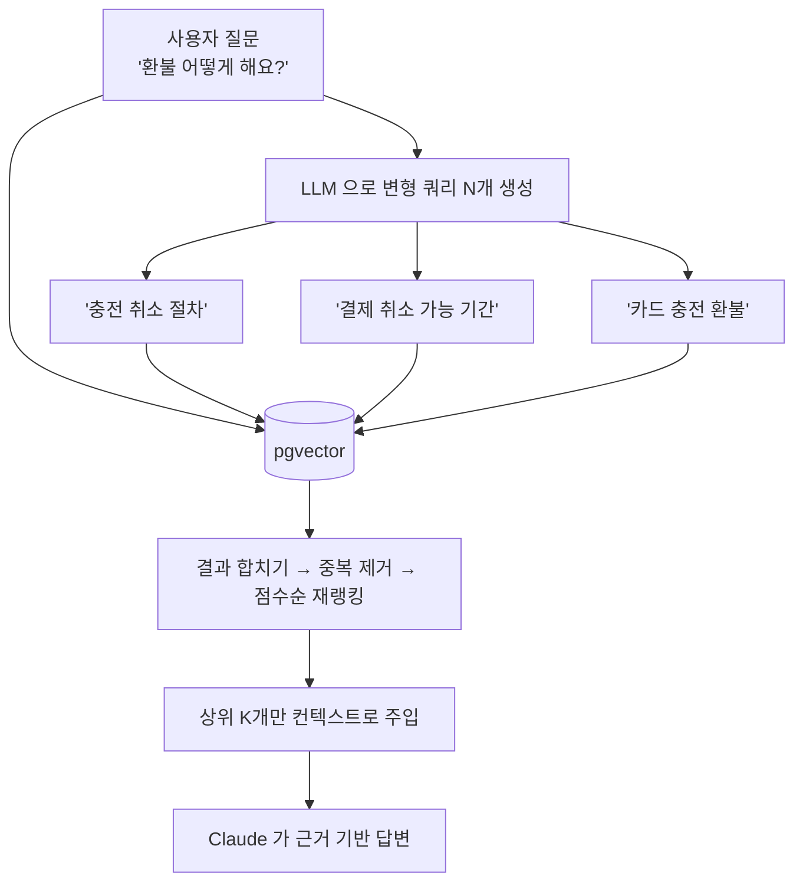
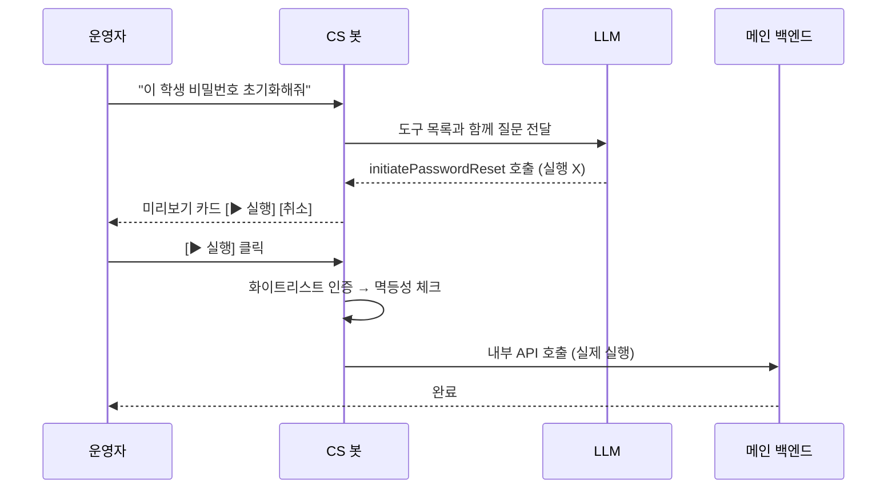
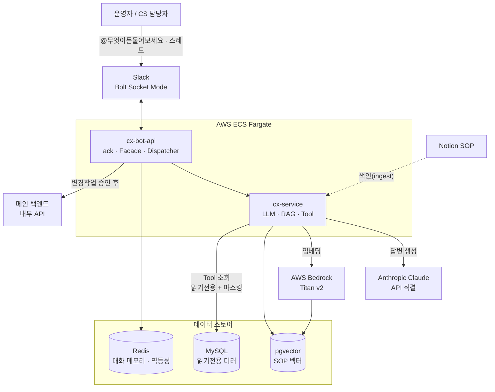

## "이 학원 예치금 얼마예요?"

사내에서 CS와 운영을 맡아주시는 분들의 하루를 떠올려보자.

선생님이나 학원에서 문의가 들어온다. "이 학원 예치금이 지금 얼마죠?", "이 학생 카드가 왜 정지됐어요?", "환불 정책이 어떻게 되더라?" 같은 것들이다. 그런데 이 질문들의 답은 대부분 **두 군데**에만 있다. 하나는 운영 매뉴얼(SOP)이고, 다른 하나는 데이터베이스다.

매뉴얼은 Notion 여기저기에 흩어져 있어 어디 적혀 있는지 찾기 어렵고, 데이터는 아예 사람이 접근할 수 없다. 그래서 결국 어떻게 되느냐면, **CS 담당자분이 개발자 자리로 걸어온다.**

> "혹시 동탄최상위학원 김민수 학생 카드 상태 좀 봐주실 수 있어요?"

개발자는 하던 일을 멈추고, DB를 까보고, 결과를 복사해서 전달한다. 하루에 몇 번씩, 매번. 질문하는 쪽도 미안하고, 답하는 쪽도 흐름이 끊긴다. 양쪽 모두 피곤한 구조다.

이런 경험, 개발자라면 한 번쯤 있지 않은가?



마침 회사가 [프라이머(Primer)](https://primer.kr)에서 `Claude` 토큰을 지원받게 됐다. 감사하게도 "한번 써볼 기회"가 생긴 셈이라, 이 문제를 AI로 풀어보기로 했다. **사람이 매번 찾아 나르던 답을, 봇이 먼저 내놓게 만들자**는 목표였다.

이 글은 그렇게 만든 Slack CS 챗봇을 **어떤 문제 때문에 어떤 고민을 거쳐 어떻게 풀었는지**, 그리고 **무엇을 얻고 무엇을 내줬는지**(Pros & Cons) 실제 코드와 함께 풀어 쓴 기록이다.

---

## 문제를 푸는 게 본질이다

솔직히 고백하면, 나는 `Kotlin` / `Spring` 환경에 익숙하지 않다. 아마 AI가 아니었다면 엄두도 못 냈을 것 같다. 평소엔 `Nest.js`를 어느 정도 다뤄봐서, Kotlin과 TypeScript의 언어적 유사함, 그리고 Spring과 Nest의 프레임워크적 유사함 덕에 코드를 어느 정도 읽을 수는 있다. 다만 깊게 아는 건 아니다. 그런데도 이걸 만들 수 있었던 건, **AI와 함께라면** 낯선 프레임워크도 충분히 헤쳐나갈 수 있다고 봤기 때문이다.

게다가 아주 맨땅은 아니었다. 프론트엔드를 하면서, 직접 구축한 `Hono` 기반 환경 위에 [`@modelcontextprotocol`](https://modelcontextprotocol.io) SDK로 여러 MCP를 커맨드 단위로 엮어 쓰던 경험이 있었다. 그때 이미 **"LLM에 도구를 물려서 일을 시킨다"는 그림**은 머릿속에 있었던 셈이다.

그리고 Spring 진영(`Spring AI`)에도 이와 비슷하게 도구를 LLM에 물리는 방식, 즉 `function calling`이 있었다. 언어와 프레임워크가 다를 뿐, **풀어야 할 그림은 같았다.**

물론 시작 전에 정말 많은 회사들의 사례를 찾아봤다. 그런데 썩 만족스러운 게 없었다. 심지어 **"매번 도구(툴체인)를 만드느니, 차라리 DB를 통째로 LLM에 읽히면 되지 않나?"** 하는 생각도 해봤다. 하지만 자료를 찾아보고 따져보니 이건 아니었다. 보안도 위험하고, 토큰 비용도 감당이 안 되고, 정확도도 떨어진다. 결국 필요한 도구만 골라 물리는 방식으로 갔다.

여기서 얻은 결론은 단순하다. **우리가 풀어야 하는 건 문제 그 자체지, 언어가 중요한 게 아니다.** 그래서 완벽한 설계를 쫓기보다 일단 만들어보기로 했다. *일단 실행하고, 문제는 그때 고치자.* 그렇게 약 **10시간** 만에 어느 정도 굴러가는 프로토타입이 나왔고, 지금도 그걸 계속 다듬어 나가고 있다.

---

## 봇과 두뇌를 나눴다

먼저 전체 구조를 아주 일부만 보자. 모듈은 둘로 나뉜다.

```
app/
└── cx-bot-api/      ← Slack 진입점 (위임자). 포트 8090
    └── interfaces / application / domain / infrastructure

services/
└── cx-service/      ← LLM · RAG · Tool 본체 (두뇌)
    └── application / domain / infrastructure
```

`cx-bot-api`는 Slack `Bolt`(Socket Mode)로 들어온 이벤트를 받아 **위임만** 한다. 실제 LLM 호출, RAG 검색, 도구 실행 같은 "생각"은 전부 `cx-service`가 한다.

굳이 나눈 이유는 단순하다. Slack 메시지 형식이 바뀌는 일과, 답변을 만드는 로직이 바뀌는 일은 서로 별개이기 때문이다. 둘을 갈라놓으니 머릿속에서 "Slack 문제"와 "AI 문제"가 섞이지 않아, 뭔가 터졌을 때 어디부터 봐야 할지가 분명해졌다.

봇이 한 요청을 처리하는 흐름은 이렇다.



여기서 첫 단추가 `ack`를 **먼저** 보내는 것이다. Slack은 이벤트를 받고 3초 안에 응답(ack)을 못 받으면 "전달 실패"로 보고 같은 이벤트를 **재전송**한다. LLM 응답은 몇 초씩 걸리니, 그동안 ack를 미루면 Slack이 같은 질문을 두 번 세 번 던지는 셈이다. 그래서 일단 ack부터 보내고, 무거운 일은 별도 스레드 풀로 넘긴다.

이제 진짜 고민들로 들어가 보자.

---

## 고민 ① 임베딩과 생성을 왜 따로 뒀나

RAG를 이야기하기 전에 `임베딩(Embedding)`부터 짚어야 한다.

임베딩은 **글을 의미가 담긴 숫자 벡터로 바꾸는 것**이다. 예를 들어 "환불 정책"은 `[0.12, -0.45, 0.88, ...]` 같은 1024개의 숫자가 된다. 핵심은, 의미가 비슷한 문장은 숫자도 비슷하게 나온다는 점이다. 그래서 두 벡터가 얼마나 가까운지(코사인 유사도)만 재면, **단어가 정확히 안 겹쳐도 "의미가 가까운 문서"를 찾아낼 수 있다.**

쉽게 말하면, 모든 문장에 **의미 좌표**(GPS 같은 것)를 찍어두는 작업이다. 좌표가 있으니 "이 질문과 가까운 동네에 있는 문서"를 거리 계산으로 빠르게 집어낼 수 있다.

그런데 여기서 한 가지 현실적인 문제에 부딪혔다. **`Claude`는 임베딩을 만들어주지 않는다.** 답변 생성은 잘하지만, 글을 벡터로 바꾸는 기능은 제공하지 않는다.

그래서 역할을 둘로 나눴다.

| 역할 | 누가 | 왜 |
|---|---|---|
| **답변 생성** | Anthropic `Claude` (공식 API 직결) | CS 질의응답 품질이 좋다 |
| **임베딩** | AWS Bedrock `Titan` (1024차원, 다국어) | Claude가 임베딩을 안 해준다 |

여기서 한 가지 더 고민한 게 있다. 생성도 Bedrock 경유로 `Claude`를 부를 수 있었다. 그러면 AWS 한곳으로 깔끔하게 묶인다. 그런데 실제로 재보니 **Bedrock을 거치면 응답이 0.5~1초가량 더 느렸고**, 모델 신버전 반영도 직결보다 늦었다. CS 봇은 사람이 기다리는 대화형이라 이 지연이 체감된다. 그래서 생성만큼은 Anthropic 직결로 가고, Bedrock은 임베딩 전용으로 뒀다.

```yaml
# 생성: Anthropic 직결   /   임베딩: Bedrock Titan v2 (1024차원)
spring.ai.anthropic.chat.options.model: claude-sonnet-4-6
spring.ai.model.embedding: bedrock-titan
```

모델은 지금(2026년 6월 기준) `claude-sonnet-4-6`을 쓴다. 다만 솔직히 말하면, CS 질의응답 정도의 난이도라면 더 가볍고 싼 `Haiku`급으로 낮춰도 충분하다고 본다. 토큰을 지원받아 시작한 프로젝트라 일단 품질 좋은 모델로 검증부터 했지만, 비용을 더 조이는 게 목표라면 **모델을 한 단계 내리는 게 가장 먼저 손볼 카드**다.

### 임베딩은 꼭 Bedrock이어야 했나 — Ollama를 만지작거리다

사실 임베딩만 놓고 보면 **무료**인 길도 있었다. 로컬에서 모델을 직접 돌리는 [`Ollama`](https://ollama.com)다. 호기심에 프로젝트 전날 새벽, 집에서 비슷한 초안을 한번 만들어봤는데 **`Ollama`의 한국어 유사도가 생각보다 꽤 괜찮았다.** "이거 그냥 이걸로 가도 되겠는데?" 싶을 정도였다.

그런데도 `Bedrock`을 택했다. 이유는 품질이 아니라 **운영**이다.

로컬에서야 `Ollama`는 `docker run` 한 줄이면 뜬다. 내 노트북에선 더없이 간단하다. 문제는 **이 컨테이너를 운영 환경에서 24시간 띄워두는 순간**부터다. 우리 서버는 ECS Fargate인데, 쓸 만한 임베딩 모델은 메모리를 제법 먹어서 태스크 사양을 키워야 하고(그만큼 고정비가 붙는다), 속도를 원하면 GPU가 필요한데 그건 또 EC2 GPU 인스턴스를 직접 띄워 패치·오토스케일·모니터링까지 떠안아야 한다. 컨테이너가 하나면 그게 곧 단일 장애점이고, 트래픽을 감당하려 여러 개로 늘리면 무거운 모델이 인스턴스마다 통째로 복제돼 메모리를 또 잡아먹는다. 결국 "공짜 모델"의 대가로 **모델 버전 관리, OOM 대응, 용량 산정, 장애 처리**가 전부 내 몫이 된다.

반면 `Bedrock`은 관리형이라 **띄울 컨테이너도, 손볼 서버도 없다.** 호출한 만큼만 내고, 확장도 알아서 되고, dev·prod에서는 ECS Task Role로 자격증명까지 자동으로 들어온다. 작은 팀에선 "공짜지만 내가 돌봐야 하는 것"보다 "돈은 들지만 알아서 돌아가는 것"이 훨씬 남는 장사다.

그리고 이 선택이 부담스럽지 않았던 건, **임베딩 레이어가 갈아끼우기 쉽게 추상화**돼 있기 때문이다. Spring AI의 `EmbeddingModel` 뒤에 숨겨두면, 나중에 비용이 더 중요해질 때 `Ollama`로 바꿔도 윗단 코드는 거의 안 건드린다. **추후에 바꿔도 괜찮을 것 같다**는 여지를 남겨둔 셈이다.

### Bedrock이 없으면 어떻게 되나

여기서 짚고 넘어갈 게 있다. 생성(`Claude`)과 임베딩(`Bedrock`)을 나눠두니, **둘이 고장 나는 양상도 다르다.**

- **`Anthropic`(생성)이 없으면** — 봇이 아예 입을 닫는다. 답변을 만들 두뇌가 없으니, 멘션해도 fallback 메시지만 돌려준다.
- **`Bedrock`(임베딩)이 없으면** — 봇은 멀쩡히 대화한다. 다만 SOP 검색(RAG)이 비어버린다. 검색 호출이 실패해도 안에서 조용히 삼키도록 해둬서, 컨텍스트 없이 그냥 진행하다 "확인된 SOP 문서가 없습니다"라고 답하는 식이다. **봇이 죽는 게 아니라, 근거(기억)를 잃을 뿐이다.**

한 줄로 줄이면 이렇다. **`Anthropic`이 없으면 봇이 말을 잃고, `Bedrock`이 없으면 봇이 기억을 잃는다.** 둘을 분리해둔 덕에 한쪽이 흔들려도 봇 전체가 무너지지는 않는다.

---

## 고민 ② 한국어는 동의어에서 샌다

이제 RAG다. 흐름 자체는 단순하다.

1. **미리** — Notion에 흩어진 SOP 문서를 임베딩해 `pgvector`(PostgreSQL 벡터 저장소)에 색인한다.
2. **질문이 오면** — 질문도 임베딩해서, 가장 가까운 SOP 조각들을 찾는다.
3. **답변** — 찾은 조각을 `Claude`에게 같이 줘서 **근거에 기반해** 답하게 한다.

이게 RAG(검색 증강 생성)의 전부다. 문제는 2번, "가장 가까운 조각 찾기"가 **한국어에서 잘 샌다**는 것이다.

한 번 이런 상황을 생각해보자. 사용자가 "환불 어떻게 해요?"라고 물었다. 그런데 SOP 문서에는 "충전 취소 절차"라고 적혀 있다. 사람이라면 둘이 같은 말인 걸 안다. 하지만 다국어 임베딩 모델은 한국어 동의어 매칭이 약해서, "환불"과 "충전 취소"의 좌표가 생각보다 멀게 찍힌다. 거리가 임계값을 넘으면 그 문서는 **검색에서 빠진다.** 분명 답이 문서에 있는데도 봇이 "관련 SOP가 없습니다"라고 답하는 것이다.

**단순하게 가면 이렇다 — 단일 쿼리:**

```kotlin
// 사용자 질문 하나로만 검색 → "환불"과 "충전 취소"가 안 이어진다
val docs = vectorStore.similaritySearch(
    SearchRequest.builder().query(question).topK(4).build()
)
```

이걸 어떻게 풀까? 임베딩 모델을 바꾸는 것도 방법이지만, 더 간단하면서 효과 좋은 길이 있다. **검색어가 한 개라서 새는 거라면, 검색어를 여러 개로 늘리면 된다.** 그것도 LLM의 의미 이해를 빌려서.

그래서 `Multi-Query Expansion`이라는 패턴을 직접 구현했다. 흐름은 이렇다.



먼저 LLM에게 원 질문을 **동의어 변형 여러 개로 부풀려** 달라고 시킨다("환불 정책" → "충전 취소 정책", "결제 취소 가능 기간"…). 그다음 `원본 + 변형들`을 **각각** 검색해 합치고, 같은 문서는 한 번만 남겨 점수순으로 다시 줄 세운다. 핵심만 보면 이렇다.

```kotlin
val docs = queries                                    // 원본 + LLM이 만든 변형들
    .flatMap { vectorStore.similaritySearch(it) }     // 각각 검색
    .groupBy { it.id }.map { it.value.maxByScore() }  // 중복 제거
    .sortedByDescending { it.score }.take(topK)        // 재랭킹 → 상위 K개
```

이걸 Spring AI의 `Advisor`로 감싸 `ChatClient` 파이프라인에 끼워 넣었다. 비활성화하면 표준 단일 쿼리 검색으로 돌아가도록 해서, **언제든 끌 수 있는 super-set**으로 만들었다.

비용은? 호출마다 LLM이 한 번 더 도니 약간의 토큰과 ~300ms의 지연이 붙는다. 하지만 "답이 있는데 못 찾는" 문제를 없애는 값으로는 전혀 아깝지 않았다. 운영 튜닝값은 변형 4개, 쿼리당 상위 4개, 합쳐서 상위 8개를 컨텍스트로 주입하도록 잡아뒀다.

---

## 고민 ③ 봇이 DB를 읽게, 하지만 쓰지는 못하게

SOP 같은 **문서**는 RAG로 풀린다. 그런데 도입부의 "이 학원 예치금 얼마예요?"는 문서가 아니라 **실시간 데이터** 질문이다. 이건 RAG로 안 된다. 봇이 직접 DB를 조회해야 한다.

여기서 LLM의 `Function Calling`(툴 콜링, 함수 호출)을 썼다.

툴 콜링이 뭘까? 간단히 말하면, **LLM에게 "이런 함수들을 쓸 수 있어"라고 도구 목록을 쥐여주는 것**이다. 그러면 LLM은 질문을 보고 직접 함수를 실행하는 게 아니라, "이 질문엔 `학원조회(이름)` 함수를 호출해야겠다"라고 **판단해서 알려준다.** 실제 실행은 우리 코드가 하고, 그 결과를 다시 LLM에게 돌려주면 LLM이 자연어로 답을 만든다. 즉 LLM은 **판단**을, 코드는 **실행**을 맡는 분업이다. 학원 조회, 카드 조회, 예치금 잔액, 주문 통계 같은 도구를 만들어 붙였다.

도구 하나는 이렇게 생겼다. `@Description`에 적은 설명을 보고 LLM이 "언제 이 함수를 부를지" 판단한다.

```kotlin
@Component
@Description("학원명으로 학원 정보(ID, 주소, 규모 등)를 조회한다. 오타가 있어도 비슷한 후보를 제시한다.")
class FindInstitutionByName(/* ... */) :
    BiFunction<Request, ToolContext, Result>,
    CxReadTool {                       // ← '읽기 전용' 도구라는 표식
    // 실제 조회 로직
}
```

여기서 가장 크게 고민한 건 **안전**이다. LLM은 똑똑하지만 예측 불가능하다. 봇에게 DB 접근 권한을 주는 순간, 잘못하면 민감정보가 새거나 데이터가 망가질 수 있다. 그래서 두 가지 원칙을 세웠다.

**첫째, 읽기는 읽기 전용으로만.** 조회 도구가 보는 DB는 `GRANT SELECT`만 걸린 **읽기 전용 미러**다. 봇이 아무리 헛짓을 해도 구조적으로 쓰기가 불가능하다. 게다가 휴대폰·사업자번호·카드번호 같은 PII는 **마스킹**해서 내려준다. 봇이 알 필요 없는 건 애초에 보여주지 않는다.

**둘째, 쓰기는 사람이 승인해야만.** 비밀번호 초기화, 카드 정지 같은 변경 작업은 LLM이 **직접 실행하지 못한다.** 도구를 호출해도 실제로 일어나는 일은 "미리보기 카드를 띄우는 것"까지다. 운영자가 그 카드의 `[실행]` 버튼을 눌러야 비로소 진짜 작업이 돈다.



버튼을 누른 뒤에도 곧장 실행하지 않는다. **화이트리스트**로 "이 사람이 운영자가 맞는지"를 확인하고, **멱등성**으로 "방금 같은 작업을 또 누른 건 아닌지"(중복 클릭)를 거른 다음, 그제야 백엔드 내부 API로 실제 작업을 넘긴다.

정리하면 이렇다. **읽기는 마음껏, 쓰기는 사람의 손가락을 한 번 거쳐서.** LLM에게 권한을 주되, 돌이킬 수 없는 일은 절대 혼자 못 하게 막은 것이다.

---

## 고민 ④ 대화는 이어져야 한다

사실 이 고민이 **가장 먼저 해결해야 했던 문제**였다.

초기에 MVP로 급히 띄운 슬랙 챗봇은, 놀랍게도 **이전 대화를 전혀 기억하지 못했다.** 매 질문이 서로 아무 관계 없는 일회성 호출이었다. 그래서 실제로 써보면 이런 식이었다.

> **운영자:** @무엇이든물어보세요 동탄최상위학원 정보 보여줘
> **봇:** (학원 정보 출력)
> **운영자:** @무엇이든물어보세요 그럼 거기 학생 명단은?
> **봇:** "거기"가 어디인가요? 🤔

두 번째 질문의 "거기"가 어디인지 봇이 모른다. 앞 대화를 안 들고 있으니 매번 처음 보는 사람처럼 되묻는다. 결국 사용자는 **질문 하나하나마다 멘션을 다시 달고, 학원 이름을 처음부터 다시 적어** 맥락을 채워줘야 했다.

이런 경험 없는가? 분명 방금 한 얘긴데 상대가 하나도 기억 못 해서, 매번 배경부터 다시 까는 그 피로감 말이다. 봇을 "도구"로 쓰는 게 아니라, 봇의 기억력을 내가 대신 채워주는 꼴이었다.

도구가 더 똑똑해지기 전에, **일단 방금 한 얘기는 기억하게** 만드는 게 먼저였다. 그래서 대화 메모리를 `Redis`에 뒀다. 핵심 결정은 두 가지다.

- **Slack 스레드 하나 = 대화 하나.** 스레드 단위로 맥락을 묶으니, 여러 사람이 동시에 봇과 떠들어도 서로 섞이지 않는다. 덤으로, 한번 시작한 스레드 안에서는 **매번 `@무엇이든물어보세요`를 다시 붙이지 않아도** 봇이 후속 발화를 알아듣게 했다. 멘션을 계속 다는 번거로움까지 같이 없앤 것이다.
- **슬라이딩 윈도우 20턴 + TTL 1시간.** 최근 20개 메시지만 들고 다니고(오래된 건 자동으로 떨어뜨린다), 1시간 동안 말이 없으면 대화째로 만료시킨다. 무한정 쌓아 토큰 비용을 키우지 않으면서, 자연스러운 멀티턴은 유지하는 균형점이다.

```kotlin
fun add(conversationId: String, messages: List<Message>) {
    val merged = (read(key) + messages)
        .takeLast(windowSize)               // 20턴 초과분은 drop
    redis.set(key, encode(merged), ttl)      // 저장하며 매번 TTL 갱신
}
```

별것 아닌 것 같지만, 이 한 조각 덕분에 봇이 비로소 **"검색창"에서 "대화 상대"로** 바뀌었다. 멘션을 다시 달 일도, "거기"가 어디인지 다시 설명할 일도 없어졌다. 가장 먼저 풀어야 했던 불편이 가장 먼저 사라진 셈이다.

---

## 테스트는 어디에 집중했나

이런 봇에서 가장 깨지기 쉬운 지점은 **응답을 Slack에 게시하는 단계**다. 텍스트 따로, 카드 따로 두 번 보내면 사용자가 시간차로 버튼을 보게 되는 버그가 생긴 적이 있다. 그래서 "텍스트 + 카드를 **한 번의 호출**로 보낸다"는 걸 회귀 테스트로 못 박아뒀다. (테스트는 `Mockito + mockito-kotlin`, `given/when/then` 3단으로 쓴다.)

```kotlin
@Test
@DisplayName("카드 응답 → chat.update 한 번에 text+blocks 동시 첨부 (시간차 버그 회귀 가드)")
fun `카드는 단일 호출로 게시된다`() {
    // given
    val answer = CxBotAnswer.WithCard(text = "이번 주 주문 보여드릴게요", payload = payload)

    // when
    dispatcher.dispatch(client, "C1", "T1", interimTs, answer)

    // then — 한 번의 호출에 text + blocks 가 함께
    val req = captureChatUpdate()
    assertNotNull(req.blocks)
    verify(client, never()).chatPostMessage(any())   // 두 번 보내지 않았는지 검증
}
```

LLM 응답 자체는 비결정적이라 테스트하기 어렵다. 그래서 LLM을 검증하려 들기보다, **그 주변의 결정적인 배관(게시·라우팅·권한·멱등성)을 단단히** 조이는 데 집중했다.

---

## 무엇을 얻고, 무엇을 내줬나

솔직하게 적는다.

| 얻은 것 | 내준 것 · 한계 |
|---|---|
| CS 문의의 1차 응대가 **셀프서비스**가 됐다 | 임베딩에 추가 비용·지연이 붙는다 |
| 개발자가 **인터럽트당하는 횟수**가 크게 줄었다 | 답변 품질이 **SOP 최신성**에 묶인다 |
| SOP·DB **근거에 기반한** 답을 즉시 받는다 | Socket Mode라 봇은 단일 인스턴스다 |
| 변경 작업도 **안전하게** 봇 안에서 처리된다 | LLM 환각 가능성 (가드레일로 완화) |

가장 솔직한 한계는 **환각**이다. LLM은 모르면 지어낸다. 그래서 "확인된 SOP가 없으면 없다고 답하라"는 규칙을 프롬프트에 박고, 조회는 읽기 전용 + 마스킹으로, 쓰기는 사람 승인으로 막아 **봇이 틀려도 사고로 이어지지 않게** 울타리를 쳤다. 환각을 0으로 만들 수는 없으니, 환각이 나도 안전한 구조를 택한 것이다.

그리고 답변 품질은 결국 SOP를 얼마나 잘 정리해두느냐에 달려 있다. 봇이 똑똑해지는 게 아니라, **잘 정리된 지식이 봇을 통해 빠르게 흐르는** 것에 가깝다.

---

## 전체 시스템 아키텍처

지금까지 조각조각 본 것들을 한 장에 모으면 이렇게 생겼다. Slack이라는 창구로 들어와, AWS 위에서 두뇌가 돌고, 생성과 임베딩과 데이터가 각자의 자리에서 맞물린다.



결국 따로 놀던 Slack·LLM·문서·데이터를 **하나의 대화 흐름으로 꿴** 셈이다.

---

## 마무리

이 글을 한 줄로 요약하면 이렇다. **사람이 매번 찾아 나르던 답을, 봇이 먼저 내놓게 만들었다.**

돌아보면 네 개의 고민이 있었다.

- **임베딩과 생성을 분리** — Claude는 임베딩을 안 하니 Bedrock Titan에 맡기고, 생성은 지연 때문에 Anthropic 직결로 뒀다.
- **Multi-Query RAG** — 한국어 동의어에서 새는 검색을, LLM으로 질문을 부풀려 메웠다.
- **Tool + 승인 플로우** — 읽기는 읽기 전용·마스킹으로 마음껏, 쓰기는 사람의 손가락을 한 번 거쳐서.
- **대화 메모리** — Slack 스레드를 대화 단위로 묶어 맥락이 이어지게 했다.

물론 아직 **모든 질문을 100% 커버하지는 못한다.** 봇이 못 푸는 복잡한 케이스는 여전히 사람이 붙어야 한다. 하지만 **단순 조회** 같은 건, 이전에 개발자를 찾아야 했던 일이 사실상 **0으로 수렴**했다. 그것만으로도 충분히 의미가 있었다.

작은 스타트업에선 이게 작은 차이가 아니다. **질문하는 사람도 매번 부담스러웠고, 답하는 사람도 많지 않은 시간을 쪼개야** 했다. 빠른 속도를 내야 하는 팀에서 이 반복은 분명 누군가는 해결해야 할 일이었고, 마침 프라이머에서 `Claude` 토큰을 지원받은 덕에 부담 없이 시작할 수 있었다. 감사한 일이다. 거창한 AI가 아니라 **흩어진 지식과 막힌 데이터를 한 창구로 모은 것**만으로도, 작은 팀일수록 피로도가 눈에 띄게 줄어든다.

봇이 답을 다 아는 게 아니다. 다만 이제, 답을 찾으러 자리에서 일어날 필요는 없어졌다.
