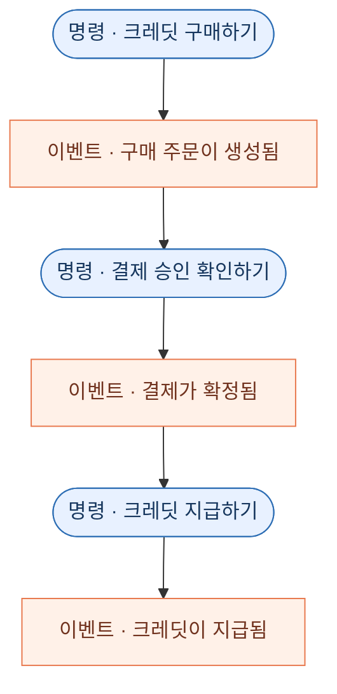
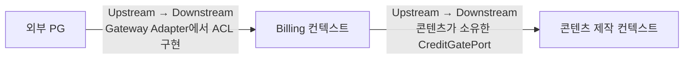
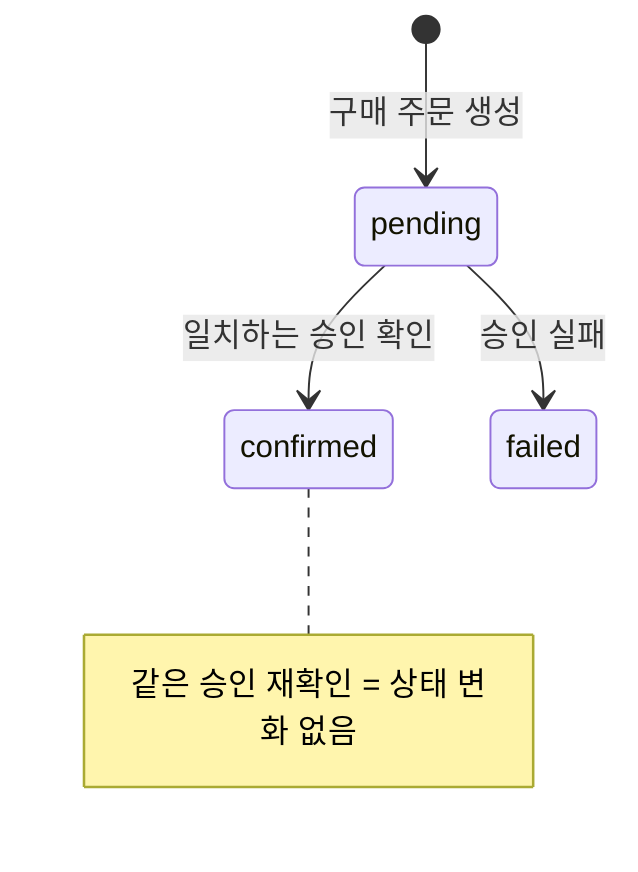
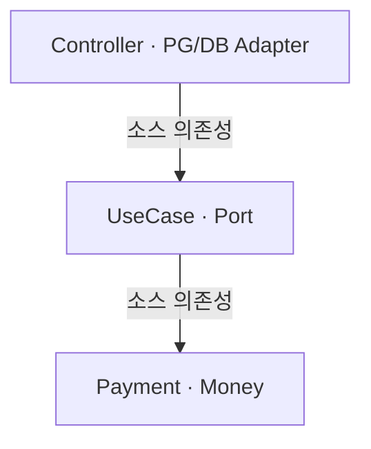

> “결제가 끝나면 크레딧을 지급한다.”

짧고 분명한 요구사항처럼 들립니다. 회의에서 이 문장을 들으면 모두 고개를 끄덕일 수도 있어요. 그런데 정말 같은 장면을 떠올리고 있을까요?

## 같은 “결제 완료”, 서로 다른 순간

| 바라보는 사람과 시스템 | 결제가 완료됐다고 보는 순간 |
| --- | --- |
| 사용자 | 결제 성공 화면을 확인했을 때 |
| 제품 담당자 | 구매한 크레딧을 실제로 사용할 수 있을 때 |
| 외부 결제 시스템 | 승인 요청을 정상적으로 처리했을 때 |
| 서버 엔지니어 | 결제 상태가 `confirmed`로 저장됐을 때 |
| 크레딧 원장 | 지급 기록이 남고 잔액에 반영됐을 때 |

누구도 틀리지 않았지만, 같은 사건을 말한 것도 아니다. 이 차이를 드러내지 않은 채 구현하면 성공 화면은 나왔는데 크레딧은 없거나, 결제 승인은 한 번인데 크레딧이 중복 지급될 위험이 생깁니다.

이 글은 제가 결제 시스템과 크레딧 시스템을 직접 설계하고 개발하며, 하나의 구매 흐름을 여러 시스템과 사람이 서로 다르게 이해하는 문제를 풀어 간 경험에서 출발합니다.

실제 코드를 옮기기보다 구매 요청이 외부 승인, 내부 결제 확정, 크레딧 지급으로 이어지는 데 필요한 결정만 단순한 예시로 다시 만들었습니다.

## 공유 모델은 명령과 이벤트에서 시작합니다

공유 모델은 거대한 정의서가 아니라, 누가 어떤 사실을 결정하고 다음 단계가 무엇을 근거로 움직이는지 함께 검토하는 도구예요. 데이터는 흐름 속에서 바뀔 때 가치를 만들므로 사용자, 주문, 결제 같은 명사뿐 아니라 행동과 결정도 함께 봐야 합니다.

명령은 앞으로 하려는 의도라 현재 규칙에 따라 거절될 수 있고, 이벤트는 이미 일어난 사실이라 과거형으로 씁니다. 크레딧 구매의 흐름을 번갈아 놓으면 다음과 같아요.



둥근 노드의 “구매하기”, “확인하기”, “지급하기”는 명령이고 네모 노드의 “생성됨”, “확정됨”, “지급됨”은 이벤트예요. 이렇게 나누면 금액 불일치처럼 거절할 결정과, 이미 확정된 승인 결과처럼 비교할 사실을 구체적으로 말할 수 있습니다.

코드 가까이 가져오면 의도와 사실의 차이가 더 잘 보입니다.

```ts
type ConfirmCreditPurchase = Readonly<{
  orderId: string
  paymentToken: string
  callbackAmountKrw: number
}>

type CreditPurchaseConfirmed = Readonly<{
  orderId: string
  providerPaymentId: string
  confirmedAmountKrw: number
}>
```

`ConfirmCreditPurchase`는 검증 전의 요청이고 `CreditPurchaseConfirmed`는 검증을 통과한 결과예요. 도메인 이벤트를 찾는 일은 메시지 브로커나 이벤트 소싱을 도입한다는 뜻이 아닙니다. 이 예시에서는 같은 Billing 컨텍스트의 크레딧 지급을 한 트랜잭션에서 처리하므로, 이벤트를 지급용 메시지로 발행하지 않아요.

## 모든 문제를 풀 필요는 없어요

작은 회사일수록 많은 문제를 넓게 건드리기보다, 잘 풀 수 있는 문제 하나를 깊게 파야 합니다.

가령 작은 음료 회사가 “바쁜 사람이 칼로리 부담 없이 갈증과 허기를 함께 달랜다”는 문제에 집중해 포만감 있는 음료를 만든다고 해볼게요. 고객 인터뷰에서 이런 요청이 나옵니다.

> “음료는 좋은데, 샐러드 도시락도 정기 배송해 주세요.”

이 요청은 같은 식단 관리 목표에서 나온 유효한 신호지만, 받아들이면 조리·냉장 유통·배송이라는 새로운 역량과 시장이 필요합니다. 요청을 곧바로 구현하기보다 음료의 포만감 부족을 알리는 신호인지, 고객의 문제가 식단 전체인지, 회사가 그 문제까지 풀 전략인지 구분해야 해요. 핵심 문제를 “갈증과 허기를 함께 달래는 것”에서 “식단 전체를 관리하는 것”으로 넓힌다면, 이는 단순한 기능 요청 수용이 아니라 의식적인 전략 변화입니다.

1. 우리가 풀기로 한 핵심 문제를 더 잘 푸는가?
2. 같은 불편을 반복해서 겪는 핵심 고객이 충분한가?
3. 현재 역량으로 작게 검증할 수 있는가, 아니면 다른 사업을 시작하는가?

DDD는 그 답을 대신 선택하지 않습니다. 다만 핵심 문제를 공용어와 모델에, 확장 비용을 하위 도메인과 경계에 드러내 “우리 문제를 더 깊게 푸는 변경인지, 새 도메인을 여는 전략 변화인지” 팀이 같은 기준으로 판단하도록 돕습니다.

이 판단 기준을 글의 서비스에 적용해 보겠습니다. 이 글의 서비스는 브랜드에 안전한 소셜 콘텐츠를 만들고 운영하는 일을 풀며, 하위 도메인은 경쟁력과 투자 방향을 살피는 상대적인 구분이에요.

| 하위 도메인 | 이 예시에서의 일 | 선택의 이유 |
| --- | --- | --- |
| 핵심 하위 도메인 | 브랜드 기준을 반영한 콘텐츠 기획·제작 | 사업의 차별점을 만드는 역량 |
| 지원 하위 도메인 | 크레딧 정책과 결제 | 핵심 경험을 돕는 내부 규칙 |
| 일반 하위 도메인 | 외부 PG가 제공하는 결제 처리 능력 | 널리 쓰이는 해결책을 활용 가능 |

**하위 도메인**은 사업이 풀어야 할 문제 공간의 구분이고, **바운디드 컨텍스트**는 특정 모델과 언어가 일관되게 유효한 해결 공간의 경계예요. 둘은 일대일로 대응하지 않고, 바운디드 컨텍스트는 마이크로서비스가 아니라 한 애플리케이션 안의 모듈 경계일 수도 있습니다.

이 예시에서 Billing 컨텍스트는 `Payment`, `CreditWallet`, `Subscription`을 소유합니다. 콘텐츠 제작 컨텍스트는 크레딧 예약·사용 확정·해제를 자기 포트로 요청하며 Billing의 내부 모델을 직접 바꾸지 않아요. 이 관계와 번역 경계를 컨텍스트 맵으로 연결해 볼 수 있습니다.



콘텐츠 제작 쪽의 `CreditGatePort`는 Billing의 객체를 노출하지 않고 필요한 계약만 말하고, Billing은 외부 PG의 상태와 필드 이름을 자기 언어로 번역합니다. 이 번역 경계는 **오염 방지 계층**, 즉 ACL이며, 여기서는 Gateway Adapter가 맡아요. 화살표는 호출 순서가 아니라 모델의 영향 방향이고, 외부 PG는 Billing의 Upstream이며 Billing은 콘텐츠 제작의 Upstream입니다.

**유비쿼터스 언어**는 이 경계 안에서 함께 쓰는 공용어예요. 용어집에만 머물지 않고 객체 행동, 상태 변화, 오류와 테스트 이름에도 같은 의미가 살아 있어야 합니다.

| 업무에서 묻는 말 | Billing 모델의 표현 | 지켜야 할 의미 |
| --- | --- | --- |
| 결제가 확정됐나요? | `verifyConfirmable()` → `Payment.complete()` | PG 완료 상태와 주문·금액·통화·가맹점 계정이 일치하고 외부 승인 식별자가 유효함. 재확정이면 저장된 식별자와도 같아야 함 |
| 크레딧을 쓸 수 있나요? | `CreditWallet` | 지급·차감 근거로 잔액을 설명함 |
| 정기 이용 권한이 있나요? | `Subscription` | 유효 기간과 상태 규칙을 지킴 |

같은 “완료”도 콘텐츠 제작 컨텍스트에서는 콘텐츠가 게시 가능한 상태라는 뜻일 수 있어요. Billing의 결제 완료 정의를 전사 표준으로 밀어 넣지 않고, 경계 안에서 공용어를 유지하는 이유입니다.

## 결제 확정 규칙을 지키는 Payment

전략적 경계가 정해졌다면 이제 Billing 컨텍스트 안의 작은 모델로 내려갈 수 있어요. 결제 확정에서 중요한 값은 주문 번호, 주문 금액, 가맹점 계정, 외부 승인 식별자, 현재 상태입니다. 이 값들이 서로 일치해야 `Payment`가 다음 상태가 될 수 있죠.

아래 코드는 구조를 설명하기 위해 다시 쓴 교육용 예시입니다. 먼저 금액 규칙만 떼어 볼게요.

```ts
class Money {
  private constructor(readonly amountKrw: number) {}

  static krw(amountKrw: number): Money {
    if (!Number.isInteger(amountKrw) || amountKrw <= 0) {
      throw new Error('금액은 0보다 큰 정수 원화여야 해요.')
    }
    return new Money(amountKrw)
  }

  equals(other: Money): boolean {
    return this.amountKrw === other.amountKrw
  }
}
```

`Money`는 값과 조건을 함께 담는 **값 객체**예요. 정체성보다 값이 중요하며, 잘못된 금액을 생성 단계에서 막습니다.

`PaymentConfirmation`은 `Payment`가 판단할 외부 승인 식별자, 주문 번호, 승인 금액, 승인에 사용된 가맹점 계정 네 필드만 담습니다.

이제 `Payment`의 필드 선언과 생성·복원 코드는 덜어내고, 결정을 내리는 `complete()`만 볼게요.

```ts
class Payment {
  /* 필드, 생성과 DB 복원은 중간 생략 */

  complete(received: PaymentConfirmation): Payment {
    this.assertMatches(received)

    if (this.status === 'confirmed') {
      if (this.isConfirmedBy(received)) return this
      throw new Error('이미 확정된 승인 정보와 충돌해요.')
    }
    if (this.status !== 'pending') {
      throw new Error('현재 상태에서는 결제를 확정할 수 없어요.')
    }

    return this.copy({ status: 'confirmed', confirmation: received })
  }

  /* 비교와 copy() 구현은 중간 생략 */
}
```

`Payment`는 상태가 달라져도 같은 식별자로 추적되는 **엔티티**예요. 동시에 결제 확정 규칙을 통과하는 유일한 입구이므로 이 예제의 **애그리게이트 루트**입니다. 한 번의 변경에서 일관성을 함께 지켜야 하는 이 경계를 **애그리게이트**라고 해요.

애그리게이트는 관련 테이블을 전부 한 객체에 넣는 규칙이 아니에요. `Payment`는 자기 주문, 금액, 계정, 상태, 승인만 판단하며 외부 호출이나 크레딧 변경은 맡지 않습니다.

외부 결과의 완료 상태와 통화는 애플리케이션 경계에서 먼저 확인해요. `Payment.complete()`는 검증된 승인 스냅샷을 받아 결제 식별자가 비어 있지 않은지, 주문·금액·가맹점 계정이 같은지, 현재 상태에서 확정할 수 있는지를 봅니다. 이미 확정된 결제에 똑같은 유효한 결과가 다시 들어오면 현재 객체를 그대로 돌려줘요. 기존 사실과 충돌하면 조용히 덮어쓰지 않고 거절하고요.

상태를 직접 바꾸지 않고 새 객체를 반환한 것도 의도적인 선택입니다.

```diff
- this.status = 'confirmed'
- this.confirmation = received
- return this
+ return this.copy({
+   status: 'confirmed',
+   confirmation: received,
+ })
```

- DDD와 함수형 프로그래밍은 같은 개념이 아닙니다.
- 새 객체를 반환하면 결정 전후가 구분되고, 실패해도 원본이 보존돼요.
- 불변 스타일이 동시성이나 올바른 모델을 자동으로 보장할 수는 없습니다.

상태도 복잡하게 늘리기 전에 허용된 전이부터 작게 그릴 수 있습니다.



실제 결제에는 취소나 만료 같은 상태가 더 있을 수 있어요. 모든 가능성을 미리 넣기보다 지금 합의한 전이가 한곳에서 읽히는지가 중요합니다.


클라이언트 값이나 외부 응답 하나를 곧바로 진실로 취급하지 않아요. 애플리케이션 경계가 서버 주문과 권위 있는 PG 결과를 대조한 뒤, `Payment`가 정규화된 승인과 자신의 상태를 비교합니다.

## 외부 기술을 번역하는 Port와 Adapter

`Payment`가 규칙을 지켜도 외부 SDK와 ORM 타입을 직접 가져오면 모델은 바깥 변화에 끌려갑니다. 어떤 외부 응답이 `transaction_no`라는 필드를 쓴다는 이유로 Billing 전체가 그 말을 사용하면 번역 경계가 사라져요.

클린 아키텍처의 핵심은 원을 몇 겹으로 그리는 데 있지 않습니다. 업무 규칙을 담은 안쪽 코드가 구체적인 바깥 기술을 소스 코드에서 의존하지 않게 하는 일이에요. 애플리케이션은 자신에게 필요한 외부 기능을 포트라는 계약으로 표현하고, 어댑터가 그 계약을 외부 기술로 구현합니다.

먼저 Billing에 필요한 외부 결제 확인 계약만 남겨 볼게요.

```ts
type GatewayPayment = Readonly<{
  providerPaymentId: string
  orderId: string
  totalAmountKrw: number
  status: 'done' | 'pending' | 'failed'
  currency: string
  account: string
}>

interface PaymentGatewayPort {
  confirm(input: Readonly<{
    paymentToken: string
    orderId: string
    amountKrw: number
    idempotencyKey: string
  }>): Promise<GatewayPayment>
}
```

사업자별 필드와 자격증명 선택은 Adapter 책임이에요. Adapter는 그 차이를 `GatewayPayment`로 번역하고, UseCase는 구체 SDK와 비밀 키를 알지 않습니다.

UseCase에서는 조회, 외부 부수 효과 전 검사, 외부 확인, 도메인 판단 순서만 읽으면 됩니다.

```ts
class ConfirmCreditPurchaseUseCase {
  /* 생성자와 포트 필드는 중간 생략 */

  async execute(command: ConfirmCreditPurchase): Promise<Payment> {
    const payment = await this.payments.findByOrderId(command.orderId)
    if (payment === null) throw new Error('구매 주문을 찾을 수 없어요.')

    payment.assertConfirmationCanBeRequested()
    assertCallbackAmount(payment, command.callbackAmountKrw)

    const gateway = this.gateways.forAccount(payment.providerAccount)
    const received = await gateway.confirm({
      paymentToken: command.paymentToken,
      orderId: payment.orderId,
      amountKrw: payment.chargedAmount.amountKrw,
      idempotencyKey: payment.orderId,
    })

    const confirmation = verifyConfirmable(received, payment)
    return this.confirmAndGrant(payment.complete(confirmation))
  }
}
```

`Payment.assertConfirmationCanBeRequested(): void`는 `pending`과 이미 확정된 결과의 재확인을 허용하고, `failed`나 취소 상태는 예외로 거절합니다. 따라서 허용되지 않은 상태에서는 외부 승인 부수 효과가 일어나지 않아요.

콜백 금액은 잘못된 요청을 일찍 거절하는 방어 값일 뿐 최종 근거는 아니에요. 외부 응답은 `verifyConfirmable()`에서 상태·통화·계정·주문·금액을 검증한 뒤 `PaymentConfirmation`으로 번역합니다.

확정 저장과 지급의 핵심만 UseCase 내부 메서드에서 발췌하면 다음과 같아요.

```ts
// ConfirmCreditPurchaseUseCase 내부
private async confirmAndGrant(confirmed: Payment) {
  return this.unitOfWork.transaction(async (tx) => {
    const saved = await tx.payments.saveConfirmedIfPending(confirmed)
    const persisted = saved
      ? confirmed
      : await tx.payments.findMatchingConfirmationOrThrow(confirmed)

    await tx.credits.grantOnce({
      sourceKey: `payment:${persisted.paymentId}`,
      /* 지급 대상과 수량은 중간 생략 */
    })
    return persisted
  })
}
```

같은 승인을 다시 확인해 조건부 저장에 실패한 요청도 저장된 승인이 같은지 확인한 뒤 `grantOnce()`에 도달합니다. 중복은 세 경계에서 각기 다른 근거로 접어요.

| 경계 | 중복을 막는 근거 |
| --- | --- |
| 외부 승인 | 같은 주문 번호와 멱등 키 |
| 결제 저장 | `pending` 조건부 갱신 |
| 크레딧 지급 | 내부 `paymentId` 기반 유일 키 |

타임아웃은 실패 확정이 아니에요. 새 주문을 만들기 전에 같은 주문 번호와 멱등 키로 결과를 조회하거나 재시도하고, 이전 시도에서 돈이 움직이지 않았음이 확실할 때만 새 주문을 시작합니다.

소스 코드의 의존성은 다음처럼 안쪽을 향합니다.



이 화살표는 런타임 호출 방향이 아니라 `import` 같은 소스 의존성이에요. 실행 중에는 UseCase가 포트를 통해 바깥 어댑터를 호출할 수 있습니다. 하지만 UseCase 소스는 구체 어댑터를 모르고, 바깥 구현이 안쪽 계약을 알죠. 외부 호출이 있다고 의존성 규칙이 깨지는 것은 아닙니다.

**의존성 역전 원칙**, 즉 DIP는 고수준 정책과 저수준 구현이 안쪽의 추상 계약을 바라보게 하는 방향의 원칙이에요. **의존성 주입**, 즉 DI는 만들어진 어댑터를 생성자에 넣는 조립 방법입니다. 생성자 주입을 썼다는 사실만으로 의존성 방향까지 올바르다고 볼 수는 없어요.

## 테스트와 비용을 함께 보는 이유

경계가 나눈 책임은 테스트의 질문도 나눠요. 도메인 모델의 결정, 협력자 호출 순서, 외부 형식 번역, 저장소의 동시성 규칙은 서로 다른 범위에서 확인해야 합니다.

| 테스트 범위 | 확인할 책임 |
| --- | --- |
| 도메인 단위 테스트 | 주문·금액·상태 규칙과 같은 승인 재확인 |
| UseCase 테스트 | 조회·외부 확인·도메인 호출·저장 순서 |
| Adapter 계약 테스트 | 외부 필드와 오류의 내부 타입 변환 |
| DB 통합 테스트 | 조건부 갱신·트랜잭션·지급 키 유일성 |

도메인 단위 테스트는 네트워크와 데이터베이스 없이 모델의 결정을 빠르게 확인합니다. 정상 결제만 통과시키는 데서 끝내지 않고 `Payment`가 소유한 주문·금액·가맹점 계정·상태·승인 식별자 규칙을 살펴야 해요. 같은 요청이 다시 들어왔을 때 이미 확정된 결과를 반환하는 경우와, 내용이 달라 충돌로 거절하는 경우도 여기서 구분할 수 있습니다.

UseCase 테스트는 포트를 대역으로 바꾸고 실행 순서를 관찰해요. 서버가 보관한 주문을 먼저 읽는지, 외부 결과의 완료 상태와 통화를 `verifyConfirmable()`에서 확인한 뒤 승인 결과를 모델에 전달하는지, 상태 저장과 크레딧 지급을 약속한 순서로 요청하는지 확인합니다. 이 테스트의 관심사는 PG 응답의 세부 형식이나 SQL 문장이 아니라 애플리케이션이 각 협력자에게 어떤 질문을 건네는가에 있어요.

Adapter 계약 테스트는 외부 시스템이 보내는 상태와 오류를 우리 타입으로 정확히 옮기는지 확인합니다. 외부 필드가 추가되거나 이름이 바뀌어도 안쪽 모델의 언어가 흔들리지 않는지, 네트워크 실패와 업무 거절을 구분하는지도 이 경계의 질문이에요. 가능하면 실제 계약의 예시 응답을 고정해 번역 규칙이 조용히 달라지는 일을 막습니다.

DB 통합 테스트는 단위 테스트가 대신할 수 없는 저장소의 동시성 규칙을 맡아요. 두 요청이 거의 함께 도착해도 `pending` 상태 하나만 완료로 바뀌는지, 상태 변경과 원장 기록이 한 트랜잭션으로 처리되는지, 같은 지급 키가 두 번 저장되지 않는지 실제 제약과 함께 확인해야 합니다.

이 구분의 장점은 규칙을 찾는 위치가 선명해지고 변경 범위가 작아진다는 점입니다. 반면 이름 붙은 요소와 팀의 합의·관리 비용은 늘고, 규칙이 거의 없는 단순 조회에는 과할 수 있어요. 그래서 전체 시스템을 한 번에 바꾸기보다 실패 비용이 큰 흐름 하나에 먼저 적용하고 다음 범위를 결정하는 편이 좋습니다.

적용 여부는 패턴의 개수보다 잘못된 결정의 비용으로 판단할 수 있어요. 다음 조건이 겹칠수록 작은 모델과 명시적인 경계에 들이는 비용이 의미를 갖습니다.

- 돈·크레딧·재고처럼 잘못 바뀌면 복구 비용이 큰 상태
- 허용되는 상태 변화와 거절 조건을 여러 입력 경로가 공유하는 기능
- 외부 시스템의 형식과 장애를 내부 정책에서 분리해야 하는 흐름
- 제품 용어와 정책이 자주 바뀌어 결정의 근거를 다시 찾아야 하는 영역

### 작은 팀에서 좋은 코드가 뜻하는 것

제가 경험한 작은 팀에서는 한 사람이 제품 맥락부터 구현과 운영까지 넓게 맡는 일이 많았어요. 출시와 고객 대응이 먼저가 되면서 코드 리뷰와 문서화가 밀리고, 몇 달 전 자신이 만든 복잡한 흐름의 이유조차 다시 추적해야 하는 순간도 생겼습니다.

그래서 여기서 말하는 좋은 코드는 패턴이 많은 코드가 아닙니다. 어떤 비즈니스 결정을 어디에서 내렸고 왜 그렇게 판단했는지, 다음 사람과 미래의 내가 다시 찾을 수 있는 코드에 가까워요.

### 좋은 지시를 위한 서비스 이해

- 서비스가 어떤 문제를 푸는가?
- 어떤 규칙을 반드시 지켜야 하는가?
- 어느 모델이 그 결정을 소유하는가?
- 어떤 테스트와 관측으로 결과를 확인하는가?

[Peter Naur의 Programming as Theory Building](https://ingenieria-de-software-i.github.io/assets/bibliografia/programming-as-theory-building.pdf), [Simon Willison의 Not all AI-assisted programming is vibe coding](https://simonwillison.net/2025/Mar/19/vibe-coding/), [Addy Osmani의 Comprehension Debt](https://addyosmani.com/blog/comprehension-debt/)의 관점을 함께 놓고 보면, AI가 코드 생산 비용을 낮춰도 이해와 검증 비용은 사라지지 않아요. 공용어·경계·불변식·테스트는 사람의 리뷰 기준이자 AI의 추측 범위를 줄이는 맥락입니다.

## 결국 DDD의 목적은 공유된 이해입니다

팀이 쉽게 동의하지만 서로 다르게 이해하는 업무 문장 하나를 골라 보세요. 그 문장을 명령과 이벤트로 펼치고, 작은 모델로 함께 검토하는 것부터 시작할 수 있습니다.

모델이 먼저인 이유는 코드가 우리의 이해보다 정확할 수 없기 때문입니다.
