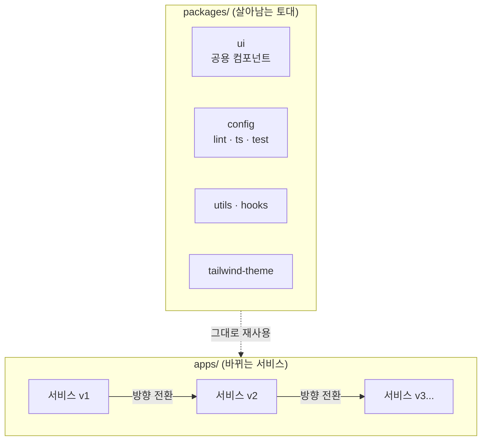
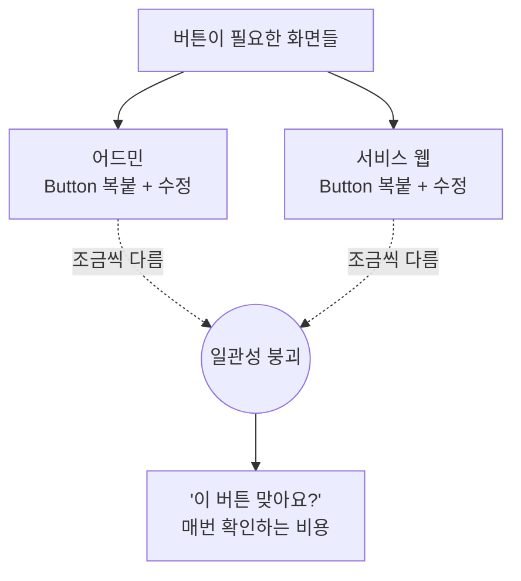
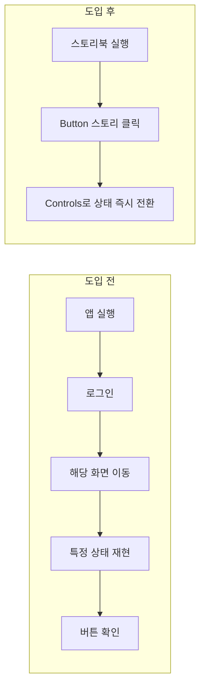
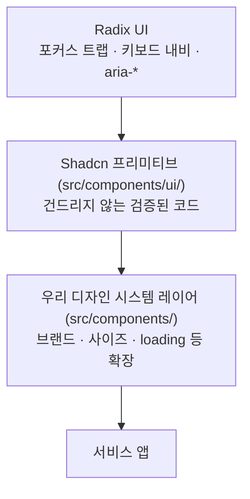
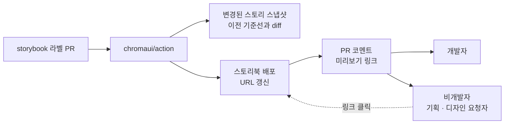
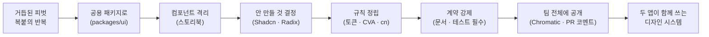

## 왜 스토리북을 도입하게 됐나

디자인 시스템 이야기를 하기 전에, 우리 팀이 일하는 방식부터 짚어야겠다.

우리는 초기 스타트업이다. PMF를 찾기까지의 여정은 생각보다 훨씬 험난했다. 기존 서비스를 조금 손보는 수준이 아니라, 아예 완전히 새로운 서비스로 갈아엎은 적이 여러 번이었다. 그렇게 밑바닥부터 다시 만드는 일을 반복한 끝에, 지금의 어느 정도 안정적인 서비스에 이르렀다.

문제는 그 과정에서 매번 화면 대부분을 새로 만들어야 했다는 점이다. 그리고 그 반복 속에서 한 가지 낭비가 눈에 밟혔다. 매번 똑같은 것들을 다시 긁어오고 있었다는 점이다.

버튼과 인풋 같은 컴포넌트, 날짜 포맷 같은 유틸, 자주 쓰는 훅, 각종 설정(config). 서비스의 본질과는 상관없지만 어느 프로젝트에나 똑같이 필요한 토대였다.

**공통으로 쓰는 것들을 아예 패키지로 묶어두면, 다음에 방향을 틀 때 서비스 코드만 바꾸면 되지 않을까?**

그래서 [Turborepo](https://turborepo.dev/repo) 기반 모노레포로 구조를 다시 잡았다. 자주 바뀌는 서비스는 `apps/`에 두고, 서비스가 바뀌어도 변하지 않는 토대는 `packages/`로 뺐다. 린트·타입스크립트·테스트 같은 설정(config), 공용 컴포넌트(ui), 유틸, 훅을 각각 패키지로 나눠 담았다.



방향을 틀어도 `packages/`는 자리를 지킨다. 바뀌는 건 `apps/` 안의 서비스뿐이다. 복붙으로 매번 토대를 다시 쌓던 일이, 이제는 패키지를 가져다 쓰는 일로 바뀌었다. 그리고 그 토대 중에서 가장 손이 많이 가는 게 `packages/ui`였다. 스토리북은 바로 이 `ui` 패키지를 관리하려고 도입했다.

---

## 이제는 웹 앱 두 개가 같은 토대를 공유한다

지금은 방향이 어느 정도 잡혀서, 성격이 다른 웹 앱 두 개를 동시에 굴리고 있다. 하나는 우리 팀이 내부에서 쓰는 관리자용 어드민이고, 다른 하나는 실제 선생님들이 사용하는 서비스 웹이다. 쓰는 사람도, 화면의 성격도 다르지만 이 둘은 같은 `packages/ui`를 공유한다.

앱이 둘이 되자 유지보수 문제가 눈에 띄게 커졌다. 사실 같은 버튼의 디자인이 살짝 다른 것은 사용자도 잘 체감하지 못한다.

진짜 문제는 따로 있었다. 버튼이 화면마다 복붙되어 각자 살고 있으니, 손볼 일이 한 번 생기면 흩어진 복제본을 전부 찾아 똑같이 고쳐야 했다.

게다가 우리 서비스는 다양한 연령대가 쓴다. 그만큼 웹 접근성을 비롯해 챙겨야 할 요구사항이 계속 따라붙는데, 그 처리를 버튼마다 반복하는 건 고스란히 낭비로 쌓였다.



우리 팀엔 전담 디자이너가 없다. 화면이 필요하면 그때그때 필요한 사람이 Claude에게 시안을 뽑게 하거나, 피그마로 대략 그리거나, 개발자가 코드에서 바로 디자인하며 만든다.

그러니 픽셀까지 딱 맞아떨어지는 규격을 바라는 건 애초에 무리였다. 우리에게 필요한 건 완벽한 규격이 아니라, 유저가 어색함을 느끼지 않을 만큼의 적당한 일관성이었다.

문제는 그 일관성을 어디에 담느냐였다. 컴포넌트가 앱 곳곳에 흩어져 있으면 기준을 세울 자리가 없다.

그래서 두 가지를 정했다. 하나는 컴포넌트를 한곳에 모아 눈으로 확인할 수 있게 하는 도구, 즉 **스토리북**이다. 다른 하나는 그 컴포넌트를 밑바닥부터 만들지 않고, 이미 검증된 **Shadcn을 우리 서비스에 맞게 래핑**해서 쓰는 것이다.

하나씩 풀어보자.

---

## 컴포넌트를 앱 밖으로 꺼냈다

[스토리북(Storybook)](https://storybook.js.org/)은 컴포넌트를 앱과 분리해 독립적으로 렌더링하고 문서화하는 도구다. 버튼 하나를 확인하려고 앱 전체를 켤 필요 없이, 그 컴포넌트만 따로 띄워 모든 상태를 살펴볼 수 있다.

도입 전과 후의 차이는 분명했다.



로딩 상태 버튼을 보고 싶으면 앱의 어딘가에서 실제로 네트워크 요청을 걸 필요 없이, 스토리북 `Controls` 패널에서 `loading` 토글만 켜면 된다. 컴포넌트의 모든 상태가 한곳에 카탈로그로 정리되니, 시안을 뽑은 사람도 코드를 짠 사람도 같은 화면을 보며 "이게 우리 버튼이다"라고 합의할 수 있게 됐다.

우리는 [Vite](https://vite.dev/) 기반의 `@storybook/react-vite` 프레임워크로 스토리북을 구성했다. 앱과 동일하게 Tailwind를 쓰기 위해 `@tailwindcss/vite` 플러그인을 스토리북 빌드에도 그대로 주입한 점이 핵심이다.

```ts
// .storybook/main.ts
import type { StorybookConfig } from "@storybook/react-vite";
import tailwindcss from "@tailwindcss/vite";

const config: StorybookConfig = {
  stories: ["../src/stories/**/*.stories.@(ts|tsx)"],
  framework: "@storybook/react-vite",
  viteFinal(config) {
    // 앱과 동일한 Tailwind 파이프라인을 스토리북에도 주입한다
    config.plugins = [...(config.plugins || []), tailwindcss()];
    return config;
  },
};

export default config;
```

`preview.ts`에서는 전역 스타일을 불러오고, 컨트롤이 값의 종류를 자동으로 알아보도록 매처를 지정했다.

```ts
// .storybook/preview.ts
import type { Preview } from "@storybook/react-vite";
import "../src/styles/globals.css";

const preview: Preview = {
  parameters: {
    controls: {
      matchers: {
        // background/color로 끝나는 prop은 컬러 피커로 표시
        color: /(background|color)$/i,
        date: /Date$/i,
      },
    },
  },
};

export default preview;
```

여기까지는 흔한 스토리북 도입기다. 그런데 컴포넌트를 격리해서 보여주기 시작하자, 자연스럽게 다음 질문이 따라왔다. "그럼 이 버튼 자체는 누가 잘 만들지?"

---

## 바퀴를 다시 만들 이유는 없었다

버튼은 쉬워 보인다. 하지만 제대로 된 버튼 하나에는 생각보다 많은 것이 들어간다. 그렇다면 드롭다운, 다이얼로그, 셀렉트는 어떨까?

`Dialog` 하나를 직접 만든다고 해보자. 열렸을 때 포커스를 내부로 가두는 [포커스 트랩](https://developer.mozilla.org/en-US/docs/Web/Accessibility/ARIA/Reference/Roles/dialog_role), `Esc`로 닫기, 바깥 클릭으로 닫기, 스크린 리더를 위한 `aria-modal`과 레이블 연결, 열릴 때 배경 스크롤 잠그기까지 챙겨야 한다.

우리 서비스는 다양한 연령대가 쓴다. 그래서 [웹 접근성](https://developer.mozilla.org/ko/docs/Web/Accessibility)은 특히 중요하다.

문제는 이 모든 걸 컴포넌트마다 손으로 다시 구현하는 일이다. 빠르게 움직여야 하는 스타트업에서 그건 상당한 낭비다. 접근성은 포기할 수 없지만, 그렇다고 바퀴를 매번 다시 만들 여유도 없었다.

그래서 대체제를 찾았고, [Radix UI](https://www.radix-ui.com/)를 기반으로 하는 [Shadcn UI](https://ui.shadcn.com/)를 도입했다. Radix가 위에서 나열한 접근성 처리를 이미 검증된 형태로 다 해주니, 전 연령대를 고려한 웹 접근성이 자연스럽게 딸려왔다. 나는 빠진 몇몇 부분만 우리 서비스에 맞게 채워 넣으면 됐다.

Shadcn에는 결정적인 특징도 하나 있다. 라이브러리를 `import`해서 쓰는 방식이 아니라, 컴포넌트 소스 코드를 내 프로젝트에 복사해 넣는 방식이라는 점이다. 즉, 설치하는 순간 그 코드는 우리 소유가 된다.

우리 팀은 이 원칙을 규칙으로 못 박았다.

```bash
# shadcn 컴포넌트는 CLI로 설치한다. 직접 작성하지 않는다.
pnpm ui:add dialog
```

- 설치 경로는 `src/components/ui/`로 고정한다
- **shadcn이 생성한 코드는 손대지 않는다** (업데이트가 필요하면 `--overwrite`로 다시 받는다)
- `components.json`이 경로와 alias를 관리한다

`components.json` 설정은 이렇게 되어 있다.

```json
{
  "style": "new-york",
  "tailwind": {
    "css": "src/styles/globals.css",
    "baseColor": "neutral",
    "cssVariables": true
  },
  "aliases": {
    "components": "@/components",
    "ui": "@/components/ui"
  }
}
```

그렇다고 Shadcn을 그대로 쓰기만 한 것은 아니다. Shadcn 프리미티브는 `ui/` 안에 원본 그대로 두고, 우리 팀만의 규칙(브랜드 색, 사이즈 체계, 로딩 상태 같은)은 그 위에 얹은 별도의 레이어에서 만들었다. 아래 그림이 그 층위다.



핵심은 "무엇을 만들까"만큼이나 "무엇을 만들지 않을까"를 정한 것이다. 접근성과 상호작용 로직은 검증된 하부에 맡기고, 우리는 그 위에서 브랜드와 규칙에만 집중한다.

그렇다고 shadcn이 주는 것만 쓰는 건 아니다. 정말 필요한 곳에서는 새로 만든다.

예를 들어 shadcn `Tabs`로는 우리가 원하는 밑줄 탭 모양이 나오지 않아, `UnderlineTabs`를 커스텀 컴포넌트로 따로 뽑았다. 레거시 화면에 흩어져 있던 셀렉트와 드로어도 각각 커스텀 `Select`와 `Sheet` 하나로 모아 `Components/`에 올렸다. 검증된 하부는 빌려 쓰되, 우리 서비스에 꼭 필요한 모습은 그 위 레이어에서 직접 만든다. 그 경계가 실제로 어디에 그어지는지 보여주는 예다.

스토리북으로 컴포넌트를 격리해서 보여주자는 작은 결정이, 어느새 "우리 컴포넌트의 경계는 어디까지인가"라는 아키텍처 결정으로 이어진 셈이다.

---

## 우리끼리의 규칙을 정했다

레이어를 나눴으면 그 위에 규칙이 필요하다. 우리 팀 디자인 시스템은 몇 가지 규칙을 강제한다.

### 컴포넌트 하나에 파일 세 개와 배럴 한 줄이 따라온다

커스텀 컴포넌트를 하나 추가한다는 건 파일 하나를 만드는 일이 아니다. 아래 셋은 한 세트이고, 여기에 배럴 export 한 줄이 더해진다. 하나라도 빠지면 작업이 완료된 게 아니다.

- `src/components/{name}.tsx` : 컴포넌트
- `src/__tests__/{name}.test.tsx` : 테스트
- `src/stories/{name}.stories.tsx` : 스토리 (argTypes `options` 명시)
- 루트 배럴(`src/index.ts`)에 export 한 줄 추가

이 규칙은 기존 컴포넌트를 고칠 때도 똑같이 적용된다. 버튼에 새로운 `variant` 값을 하나 추가하면, 그 값을 테스트 테이블(`test.each`)과 스토리의 `argTypes` `options`에도 반드시 함께 반영해야 한다. 코드에만 존재하고 문서와 테스트에는 없는 variant는 존재하지 않는 것으로 취급한다.

이렇게 하면 "누가 이 옵션 추가했더라?" 하고 코드를 뒤지는 일이 사라진다. 스토리를 보면 쓸 수 있는 옵션이 전부 나오고, 테스트를 보면 그 옵션이 실제로 동작함이 보장된다.

스토리는 다음 네 카테고리로 정리한다. 여기서 `Primitives/`와 `Components/`의 구분이 중요하다. shadcn에서 받아온 원본은 `Primitives/`에, 우리가 그 위에 얹어 만든 커스텀 컴포넌트는 `Components/`에 둔다. 그래서 우리가 확장한 버튼은 `Primitives/`가 아니라 `Components/Button`에 있다.

| 카테고리      | 대상                | 예시                                  |
| ------------- | ------------------- | ------------------------------------- |
| `Primitives/` | shadcn 원본 컴포넌트 | Dialog, Table, Card, Tooltip          |
| `Components/` | 커스텀 컴포넌트     | Button, Badge, Chip, Input, Select    |
| `Layout/`     | 레이아웃            | Flex, Grid, Container, VStack, HStack |
| `Typography/` | 타이포그래피        | Heading, Title, Body, Emphasis        |

### 색과 간격은 CSS 변수에 몰아넣었다

색·간격·둥글기 같은 디자인 값은 Tailwind 설정 파일이 아니라 CSS 변수(`:root`)로 정의했다. 왜일까? 다크 모드 때문이다. Tailwind 설정에 박아둔 값은 빌드 시점에 굳어버리지만, CSS 변수는 런타임에 바꿀 수 있다. 다크 테마는 색 변수만 반대로 덮어쓰면 끝난다.

```css
:root {
  /* 간격은 8px(0.5rem) 배수를 기본 스케일로 */
  --spacing-2: 0.5rem;
  --spacing-4: 1rem;
  --spacing-8: 2rem;

  /* 둥글기 */
  --radii-lg: 0.5rem;
  --radii-full: 9999px;

  /* 브랜드 색 팔레트 (50 → 900) */
  --main-50: #fdedf4;
  --main-500: #fb75bb;
  --main-900: #6e073c;
}

/* 다크 테마는 같은 변수 이름에 값만 반전해 덮어쓴다 */
:root[data-theme="dark"] {
  --main-50: #6e073c;
  --main-500: #fb88c4;
  --main-900: #fdedf4;
}
```

전역 스타일은 Tailwind와 이 토큰 테마를 함께 불러온다.

```css
/* src/styles/globals.css */
@import "tailwindcss";
@import "@theme/theme.css";
```

### variant는 전부 CVA로, 충돌은 cn()으로

컴포넌트의 종류(variant)와 크기(size)는 전부 [`class-variance-authority`](https://cva.style/)(CVA)로 정의한다. CVA는 조건에 따라 Tailwind 클래스를 조합해주고, 그 조합을 타입으로도 보장해준다. 오타로 없는 variant를 넘기면 타입 에러가 난다.

여기에 클래스가 충돌할 때를 대비해 `cn()` 유틸을 함께 쓴다. `clsx`로 조건부 클래스를 합치고, `tailwind-merge`로 상충하는 Tailwind 클래스를 뒤에 온 것이 이기도록 정리한다.

```ts
// src/lib/utils.ts
import { type ClassValue, clsx } from "clsx";
import { twMerge } from "tailwind-merge";

export function cn(...inputs: ClassValue[]) {
  // clsx로 합치고, tailwind-merge로 충돌 클래스 정리 (뒤에 온 값이 승리)
  return twMerge(clsx(inputs));
}
```

덕분에 컴포넌트를 쓰는 쪽에서 `className="bg-blue-500"`을 넘기면, 기본값인 `bg-main-500`을 조용히 덮어쓴다. 두 클래스가 함께 남아 어느 쪽이 이길지 CSS 우선순위에 운을 맡기는 일이 없다.

### Shadcn 버튼 위에 우리 규칙을 얹기

이 규칙들이 실제로 어떻게 모이는지, 우리가 확장한 버튼을 보자. Shadcn 버튼을 기반으로, 브랜드 색·사이즈 체계·로딩 상태·아이콘 슬롯을 얹었다.

```tsx
// src/components/button.tsx (일부 발췌)
export const buttonVariants = cva(
  "relative inline-flex items-center justify-center ...",
  {
    variants: {
      variant: {
        default:
          "bg-main-500 text-white hover:bg-main-600 disabled:bg-zinc-200",
        outline:
          "border border-zinc-300 bg-background text-zinc-900 hover:bg-zinc-50",
        // neutral / destructive / ghost ...
      },
      size: {
        md: "body-b3 rounded-xl px-5 py-[9px]",
        "icon-md": "size-10 rounded-xl",
        // xs / sm / lg / icon-sm / icon-lg ...
      },
      fullWidth: { true: "w-full", false: "" },
    },
  },
);

export interface ButtonProps
  extends
    ComponentProps<"button">,
    Omit<VariantProps<typeof buttonVariants>, "fullWidth"> {
  asChild?: boolean;
  loading?: boolean; // 스피너 표시 + 클릭 차단
  fullWidth?: boolean;
  leadingContent?: ReactNode; // children 앞 슬롯 (보통 아이콘)
  trailingContent?: ReactNode; // children 뒤 슬롯
}
```

특히 `loading` 상태에 신경을 썼다. 로딩 중에는 실제로 클릭이 막히도록 `disabled`를 걸고, 스크린 리더에게도 진행 중임을 알리기 위해 [`aria-busy`](https://developer.mozilla.org/en-US/docs/Web/Accessibility/ARIA/Reference/Attributes/aria-busy)를 함께 설정한다. 눈에 보이는 스피너와 보이지 않는 접근성 속성을 한 세트로 다룬 것이다.

```tsx
export const Button = ({
  loading = false,
  disabled,
  ...props
}: ButtonProps) => {
  const isDisabled = disabled || loading;

  return (
    <Comp
      disabled={isDisabled}
      aria-busy={loading || undefined} // 로딩을 보조기기에도 전달
      {...props}
    >
      {/* loading일 때만 스피너를 겹쳐 보여준다 */}
    </Comp>
  );
};
```

---

## 스토리 하나가 곧 문서가 된다

컴포넌트를 만들었으면 스토리로 카탈로그에 올린다. 우리 스토리는 단순한 미리보기가 아니라, `argTypes`에 선택 가능한 옵션을 전부 명시한 살아있는 문서다.

```tsx
// src/stories/button.stories.tsx (일부 발췌)
export default {
  title: "Components/Button",
  component: Button,
  args: {
    children: "시작하기",
    variant: "default",
    size: "md",
    loading: false,
  },
  argTypes: {
    variant: {
      control: "select",
      options: ["default", "neutral", "outline", "destructive", "ghost"],
      description: "버튼의 스타일 종류",
    },
    size: {
      control: "select",
      options: ["xs", "sm", "md", "lg", "icon-sm", "icon-md", "icon-lg"],
    },
    loading: {
      control: "boolean",
      description: "로딩 스피너 표시 + 클릭 차단",
    },
  },
} satisfies Meta<typeof Button>;

/** 모든 variant를 한눈에 */
export const Variants: StoryObj<typeof Button> = {
  render: (args) => (
    <div className="flex flex-col gap-3">
      {(["default", "neutral", "outline", "destructive", "ghost"] as const).map(
        (variant) => (
          <Button {...args} key={variant} variant={variant}>
            {variant}
          </Button>
        ),
      )}
    </div>
  ),
};
```

`argTypes`에 `options`를 강제하는 이유는 두 가지다. 하나는 `Controls` 패널에서 옵션을 실제로 눌러가며 확인할 수 있게 하기 위해서고, 다른 하나는 스토리 자체가 "이 컴포넌트가 받을 수 있는 값의 전체 목록"이라는 문서 역할을 하게 하기 위해서다.

컴포넌트에 새 variant를 추가하면 이 목록도 함께 갱신되어야 하니, 문서가 코드와 어긋날 틈이 없다.

---

## Chromatic으로 회귀를 잡고, 링크 하나로 팀 전체가 본다

그런데 여기엔 한 가지 함정이 있다. 스토리북은 기본적으로 개발자가 자기 컴퓨터에서 `pnpm storybook`으로 띄워야 볼 수 있다. 정작 우리 팀에서 디자인을 요청하거나 직접 시안을 그리는 사람들, 그러니까 개발자가 아닌 사람들은 이 카탈로그를 열어볼 방법이 없다는 뜻이다. 컴포넌트를 한곳에 모아놨는데, 정작 그게 필요한 사람이 못 본다면 반쪽짜리다.

그래서 [Chromatic](https://www.chromatic.com/)을 붙였다. Chromatic은 스토리북을 만든 팀이 운영하는 도구인데, 우리가 기대한 건 두 가지였다. 하나는 스토리북을 웹 주소 하나로 배포해주는 것, 다른 하나는 스토리마다 스크린샷을 찍어 이전과 비교하는 시각적 회귀 테스트다. 뒤엣것이 사실 Chromatic의 본체다.

단위 테스트로는 버튼에 `bg-main-500` 같은 클래스가 붙는지까지 검증할 수 있다(뒤에서 자세히 다룬다). 하지만 클래스가 맞아도 그 클래스가 그리는 실제 픽셀이 의도대로인지는 코드로 단언하기 어렵다.

예를 들어 토큰 `--main-500` 값 하나를 바꾸면 그 색을 쓰는 버튼·칩·배지가 한꺼번에 달라지는데, 단위 테스트는 클래스 이름만 보니 이 변화를 알아채지 못한다. Chromatic은 바뀐 스토리들의 스크린샷을 이전 기준선과 겹쳐 diff로 보여준다. "이만큼이 바뀌었는데, 의도한 범위가 맞아?"를 사람 눈으로 확인하게 해주는 것이다.

회귀 검사와 배포는 CI에 얹었다. `storybook` 라벨이 붙은 PR에서만 [`chromaui/action`](https://www.chromatic.com/docs/github-actions/)이 돌도록 걸어뒀다. 라벨이 없으면 굳이 스냅샷 비용을 쓰지 않는다.

```yaml
# .github/workflows/chromatic.yml (일부 발췌)
- name: Publish to Chromatic
  id: chromatic
  uses: chromaui/action@v1
  with:
    projectToken: ${{ secrets.CHROMATIC_PROJECT_TOKEN }}
    onlyChanged: true # TurboSnap: 변경된 스토리만 스냅샷
    autoAcceptChanges: true # 변경을 새 기준선으로 자동 승인
    storybookBaseDir: packages/ui
    buildScriptName: build-storybook
```

두 가지 설정이 핵심이다. `onlyChanged`는 [TurboSnap](https://www.chromatic.com/docs/turbosnap/)을 켜서 이번 변경과 무관한 스토리는 건너뛰고 영향받은 것만 스냅샷을 찍는다. `autoAcceptChanges`는 diff가 나와도 그걸 새 기준선으로 자동 승인한다.

지금 우리는 병합을 막는 엄격한 게이트보다, 변경 이력을 시각적으로 남기고 미리보기 링크를 손에 쥐여주는 쪽에 무게를 뒀다. 회귀를 강제로 차단하기보다, 무엇이 어떻게 바뀌었는지를 놓치지 않게 하는 안전망에 가깝다.

배포가 끝나면 그 결과를 팀에게 알려야 한다. 우리는 PR에 코멘트로 스토리북 미리보기 링크가 자동으로 달리게 했다. UI를 건드린 PR을 열면, Chromatic이 배포한 최신 스토리북 주소가 코멘트로 붙는다.



이 링크가 생각보다 큰 변화를 만들었다. 전담 디자이너 없이 필요한 사람이 직접 시안을 그리는 우리 팀에서, "이미 있는 컴포넌트가 뭔지" 아는 것과 모르는 것은 차이가 크다.

코멘트에 달린 링크는 로그인도 설치도 필요 없이 열리고, 이미 만들어둔 버튼·칩·인풋이 어떤 상태(variant·size·loading…)까지 갖췄는지 브라우저에서 바로 보여준다. 없는 걸 새로 그리기 전에 있는 걸 먼저 보게 되니, 자연스럽게 같은 부품을 다시 쓰게 된다.

정리하면, 스토리북이 개발자의 작업 도구였다면 Chromatic은 그걸 두 방향으로 넓혔다. 하나는 바뀐 화면을 diff로 잡아내는 시각적 회귀 테스트이고, 다른 하나는 그 카탈로그를 **팀 전체가 링크 하나로 공유하는 것**이다.

---

## 테스트는 Given / When / Then으로 쌓는다

여기서 한 걸음 더 나간다. 스토리가 "이렇게 생겼다"를 보여준다면, 테스트는 "정말 그렇게 동작한다"를 보장한다. 우리 테스트는 [Vitest](https://vitest.dev/) + [Testing Library](https://testing-library.com/docs/react-testing-library/intro/)를 쓰고, `jsdom` 환경에서 실제 DOM에 렌더해 검증한다.

패턴은 일관적이다. `describe`로 prop별 그룹을 나누고, 그 안에서 `test.each`로 variant를 표처럼 검증한다. 각 케이스는 Given / When / Then으로 읽힌다.

- **Given** 특정 prop 값을 준다 (`variant`, `size` 등)
- **When** 그 prop으로 컴포넌트를 렌더한다
- **Then** 기대하는 클래스나 속성이 존재하는지 확인한다

```tsx
// src/__tests__/button.test.tsx (일부 발췌)
describe("variant 속성", () => {
  test.each([
    // Given: variant 값과 그때 붙어야 할 클래스
    { variant: "default", className: "bg-main-500" },
    { variant: "neutral", className: "bg-zinc-600" },
    { variant: "outline", className: "border" },
    { variant: "destructive", className: "bg-red" },
    { variant: "ghost", className: "hover:bg-zinc-100" },
  ] as const)(
    "variant=$variant일 때 $className 클래스가 적용됨",
    ({ variant, className }) => {
      // When: 해당 variant로 렌더
      render(<Button variant={variant}>버튼</Button>);

      // Then: 기대한 클래스가 붙어 있어야 한다
      expect(screen.getByRole("button")).toHaveClass(className);
    },
  );
});
```

`test.each`의 장점은, variant를 하나 추가할 때 표에 한 줄만 더하면 새 테스트 케이스가 자동으로 생긴다는 것이다. 다섯 개든 열 개든 검증 로직은 한 벌만 유지된다.

스타일만 검증하는 것은 아니다. 우리가 버튼에 얹은 동작과 접근성도 함께 지킨다. 예를 들어 로딩 상태 버튼은 정말로 클릭이 막혀야 하고, `aria-busy`가 켜져야 한다.

```tsx
describe("loading 속성", () => {
  test("loading 상태일 때 버튼이 비활성화되고 aria-busy 가 설정됨", () => {
    // Given & When: loading으로 렌더
    render(<Button loading>저장</Button>);

    // Then: 비활성 + 보조기기에 진행 중임을 알림
    const button = screen.getByRole("button");
    expect(button).toBeDisabled();
    expect(button).toHaveAttribute("aria-busy", "true");
  });

  test("loading 상태일 때 클릭이 무시됨", async () => {
    const handleClick = vi.fn();
    const user = userEvent.setup();

    render(
      <Button loading onClick={handleClick}>
        저장 중
      </Button>,
    );

    // When: 사용자가 실제로 클릭을 시도
    await user.click(screen.getByRole("button"));

    // Then: 핸들러는 호출되지 않아야 한다
    expect(handleClick).not.toHaveBeenCalled();
  });
});
```

스타일, 동작, 접근성을 한 파일에서 함께 지키니, 버튼을 리팩터링하다 `aria-busy`를 실수로 지우면 테스트가 바로 잡아낸다. 회귀를 막는 그물이 촘촘해지는 것이다.

이렇게 보면 우리에겐 회귀를 막는 그물이 둘이다. Vitest는 클래스·동작·접근성처럼 코드로 단언할 수 있는 것을 지키고, 앞서 본 Chromatic은 그 결과가 실제로 어떻게 보이는지, 즉 픽셀을 지킨다. 하나는 "속성이 맞는가"를, 다른 하나는 "화면이 그대로인가"를 본다. 겹치지 않으면서 서로를 메운다.

여기서 한 가지 짚고 넘어갈 게 있다. 스토리와 테스트가 같은 variant 목록을 각자 들고 있으니, 사실상 중복이다. 스토리에는 Vitest 애드온이나 portable stories로 스토리를 그대로 테스트 입력으로 재사용하는 길도 있다. 우리는 그 길 대신 `__tests__`에 독립된 단위 테스트를 두기로 했다.

이유는 세 가지다. 첫째, 작은 팀일수록 도구 체인은 얇을수록 좋다. 둘째, 테스트가 확인하려는 것(클래스·속성 단언)과 스토리가 보여주려는 것(사람이 눈으로 보는 카탈로그)은 관심사가 다르다. 셋째, `argTypes` `options`와 `test.each` 테이블을 함께 갱신하는 규율만 지키면, 그 약간의 중복이 오히려 각 파일을 독립적으로 읽기 쉽게 만든다.

자동으로 하나로 합칠 수도 있었지만, 지금 규모에선 명시적인 이중화가 더 명료했다.

---

## flex 대신 VStack이라고 쓴다

마지막으로, 디자인 시스템에서 의외로 큰 차이를 만든 작은 컴포넌트 이야기다.

레이아웃을 잡다 보면 이런 코드가 화면마다 반복된다.

```tsx
// Before: 의도가 클래스 문자열 속에 묻힌다
<div className="flex flex-col items-center gap-4">
  <Avatar />
  <Title>매튜</Title>
  <Body>프론트엔드 개발자</Body>
</div>
```

`flex flex-col items-center gap-4`를 읽고 나서야 "아, 세로로 쌓고 가운데 정렬이구나"를 이해하게 된다. 의도(세로로 쌓기)가 구현 세부사항(플렉스 클래스 나열) 속에 묻혀 있다. 그래서 우리는 의도를 이름으로 드러내는 레이아웃 프리미티브를 만들었다.

```tsx
// After: 이름이 곧 의도다
<VStack gap={4} align="center">
  <Avatar />
  <Title>매튜</Title>
  <Body>프론트엔드 개발자</Body>
</VStack>
```

`VStack`은 "세로로 쌓는다(Vertical Stack)", `HStack`은 "가로로 쌓는다(Horizontal Stack)"는 뜻이다. 이건 사실 우리가 흔히 말하는 추상화 그 자체다. 추상화란 "어떻게"를 감추고 "무엇"만 남기는 일인데, `flex flex-col items-center`라는 구현 방법을 `VStack`이라는 의도 뒤로 숨긴 게 정확히 그렇다.

매번 원자재(플렉스 클래스)를 다듬는 대신 규격 부품을 가져다 쓰는 셈이라, 코드를 읽는 사람은 클래스를 해석할 필요 없이 이름만 보고 레이아웃을 파악한다.

사실 이 발상은 우리가 처음 만든 게 아니다. React 진영에서는 [Chakra UI](https://chakra-ui.com/docs/components/stack)가 `VStack`·`HStack`·`Stack`·`Box`·`Flex`·`Grid`·`Container`·`Center` 같은 이름으로 이 패턴을 대중화했고, 우리는 거기서 개념을 빌려 우리 스택(Tailwind + CVA)에 맞게 다시 구현했다.

조금 더 거슬러 올라가면, 이런 스택 컨테이너는 [SwiftUI](https://developer.apple.com/documentation/swiftui/building-layouts-with-stack-views)에서 아예 프레임워크 기본기다. 애플의 네이티브 UI는 `VStack`·`HStack`·`ZStack`을 조합해 화면을 짠다. 즉 "레이아웃을 클래스가 아니라 이름으로 표현한다"는 발상은 이미 네이티브 UI에서 검증된 방식이고, 우리는 그걸 웹으로 가져온 셈이다.

구현은 놀랄 만큼 얇다. 실제 로직은 `Flex` 하나에 모여 있고, `VStack`과 `HStack`은 `Flex`에 방향만 고정한 15줄짜리 래퍼다.

```tsx
// src/components/vstack.tsx
import { Flex, type FlexProps } from "./flex";

export interface VStackProps extends Omit<FlexProps, "direction"> {
  children: ReactNode;
}

export const VStack = ({ children, ...props }: VStackProps) => {
  // Flex에 세로 방향만 고정하면 끝. 나머지 prop은 그대로 위임한다
  return (
    <Flex direction="column" {...props}>
      {children}
    </Flex>
  );
};
```

`HStack`은 `direction="row"`라는 점만 다르다. `direction` prop은 타입에서 아예 빼버려서(`Omit<FlexProps, "direction">`), `VStack`에 실수로 가로 방향을 넣는 일 자체가 불가능하다.

그 아래의 `Flex`는 앞서 말한 규칙대로 CVA로 모든 조합을 정의하고, 폴리모픽 `as` prop으로 `<nav>`, `<section>` 같은 시맨틱 태그로도 렌더된다.

```tsx
// src/components/flex.tsx (일부 발췌)
export const flexVariants = cva("", {
  variants: {
    direction: {
      row: "flex-row",
      column: "flex-col",
      rowReverse: "flex-row-reverse",
      columnReverse: "flex-col-reverse",
    },
    align: {
      start: "items-start",
      center: "items-center",
      end: "items-end" /* ... */,
    },
    justify: {
      start: "justify-start",
      center: "justify-center",
      between: "justify-between" /* ... */,
    },
  },
  defaultVariants: { direction: "row", justify: "start", align: "stretch" },
});

export const Flex = ({
  as = "div",
  direction,
  gap,
  className,
  ...props
}: FlexProps) => {
  // as로 시맨틱 태그를 고르고, gap은 Tailwind의 gap-{n} 클래스로 매핑한다
  return createElement(as, {
    className: cn(
      flexVariants({ direction /* ... */ }),
      gap !== undefined && `gap-${gap}`,
      className,
    ),
    ...props,
  });
};
```

이 작은 컴포넌트에도 한 세트 규칙은 예외 없이 적용된다. `Flex`의 모든 방향·정렬 조합은 `test.each`로 검증되어 있고, 여기서도 각 케이스는 Given / When / Then으로 읽힌다.

```tsx
// src/__tests__/flex.test.tsx (일부 발췌)
describe("direction 속성", () => {
  test.each([
    // Given: direction 값과 기대 클래스
    { direction: "row", className: "flex-row" },
    { direction: "column", className: "flex-col" },
    { direction: "rowReverse", className: "flex-row-reverse" },
    { direction: "columnReverse", className: "flex-col-reverse" },
  ] as const)(
    "direction=$direction일 때 $className 클래스가 적용됨",
    ({ direction, className }) => {
      // When: 해당 방향으로 렌더
      render(<Flex direction={direction}>내용</Flex>);

      // Then: 기대한 flex 방향 클래스가 붙는다
      expect(screen.getByText("내용")).toHaveClass(className);
    },
  );
});

describe("gap 속성", () => {
  test("gap이 지정되면 gap 스타일이 적용됨", () => {
    // Given & When: gap={8}
    render(<Flex gap={8}>내용</Flex>);

    // Then: gap-8 클래스로 매핑된다
    expect(screen.getByText("내용")).toHaveClass("gap-8");
  });
});
```

`as` prop이 정말 시맨틱 태그로 렌더되는지, `inline` · `wrap` · `align` · `justify`가 각각 올바른 클래스로 이어지는지까지 전부 표로 검증한다. 레이아웃 프리미티브는 앱 전체에서 쓰이므로, 여기서 회귀가 나면 파장이 크다. 그래서 가장 얇은 컴포넌트에 가장 촘촘한 테스트를 붙였다.

그리고 이름으로 표현한 건 `VStack`·`HStack`만이 아니다. Tailwind로 화면을 짜다 보면 `className`이 금세 길어지는데, 길게 나열된 클래스는 그 자체로 가독성을 해친다.

그래서 사내에서 화면을 짜며 반복적으로 쓰던 배치들을 저마다 이름 있는 부품으로 뽑아, `Layout/` 카테고리에 한 벌의 프리미티브로 갖춰 뒀다. 길어지는 `className`을 걷어내 가독성을 되찾는 여러 방법 중 하나였고, 지금도 실제 서비스 화면을 이 부품들로 짠다.

| 프리미티브          | 하는 일                                                                |
| ------------------- | ---------------------------------------------------------------------- |
| `Flex`              | 모든 flex 조합의 기반. `as`로 시맨틱 태그까지                          |
| `VStack` / `HStack` | `Flex`에 세로 / 가로 방향을 고정한 얇은 래퍼                           |
| `Grid` / `GridItem` | CSS Grid 래퍼. `columns` · `rows` · `gap`을 반응형(브레이크포인트)으로 |
| `Container`         | 콘텐츠 최대 너비 제한 + 중앙 정렬                                      |
| `Centered`          | 자식을 가로·세로 중앙에 놓는 한 줄 래퍼                                |
| `Spacing`           | 지정한 만큼 빈 공간을 띄우는 스페이서                                  |
| `Divider`           | 수평 · 수직 구분선                                                     |

표에 담은 건 대표적인 몇 개일 뿐, `Layout/` 카테고리에는 이 외에도 여러 프리미티브가 함께 자라고 있다. 그리고 이들도 예외 없이 앞서 말한 한 세트 규칙을 따른다. 하나하나가 테스트와 스토리를 갖추고, 스토리북 `Layout/` 카테고리에 나란히 전시된다.

---

## 돌아보면, 격리에서 규칙으로

돌아보면 이 여정은 디자인이 아니라 생존에서 출발했다. 될 때까지 방향을 틀며 서비스를 밑바닥부터 다시 세우던 반복 속에서, 매번 같은 걸 복붙하느니 공통 토대를 패키지로 묶자고 마음먹은 게 출발점이었다. 그 토대 중 하나가 `packages/ui`였고, 어드민과 서비스 웹이 그걸 함께 쓰기 시작하면서 이 이야기가 시작됐다.

스토리북은 앱 안에 흩어져 있던 컴포넌트를 한곳에 모아 눈에 보이게 만들었다. 이렇게 늘어놓고 보니 정작 중요한 질문이 남았다. 이 컴포넌트들을 전부 우리 손으로 만드는 게 맞을까? 그래서 직접 다 만드는 대신, Shadcn으로 안 만들 것부터 정했다. 접근성처럼 검증된 하부는 Radix에 맡기고, 그렇게 절약한 시간은 서비스에 기능을 더하거나 컴포넌트를 우리 서비스에 맞게 확장하는 데 썼다. 브랜드 색, 사이즈, 로딩 상태 같은 우리만의 규칙이 거기서 나왔다. 토큰과 CVA와 `cn()`이 그 규칙을 붙잡았고, 컴포넌트·테스트·스토리를 한 세트로 묶는 원칙이 코드와 문서가 벌어질 틈을 막았다.



그래서 무엇이 달라졌을까? 새 컴포넌트를 만들기 전에, 이제는 카탈로그부터 열어 이미 있는 부품이 있는지 확인한다. 컴포넌트 하나 보려고 앱을 켜고 로그인하고 상태를 재현하던 일도 사라졌다. UI를 건드리면 Chromatic이 바뀐 화면을 diff로 짚어주고, 미리보기 링크 하나면 비개발자도 지금 UI가 어떤 모습인지 알 수 있다.

컴포넌트마다 스토리를 쓰고 테스트를 붙이는 일은 분명 품이 든다. 하지만 AI로 코드를 쓰는 시간이 압도적으로 줄면서, 그 품질을 유지하는 게 더는 부담이 아니게 됐다. 복붙으로 매번 밑바닥부터 다시 쌓던 우리가, 이제는 같은 규칙 위에서 같은 부품을 가져다 쓴다.
