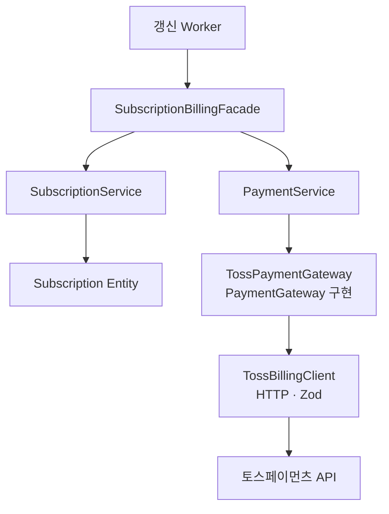
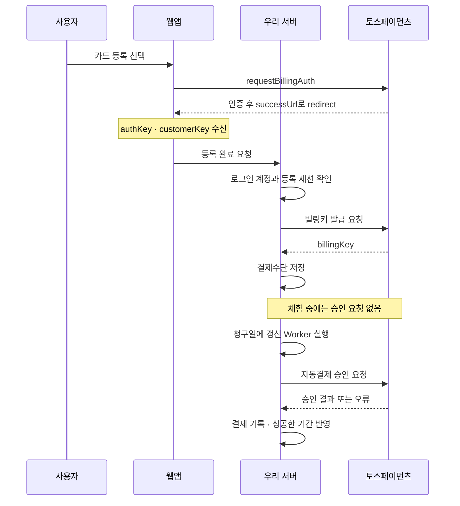

SaaS 서비스를 처음부터 끝까지 만들면서 클라이언트와 서버를 모두 개발했어요. 결제도 처음에는 단순했는데, 요구사항이 하나둘 늘어나면서 코드가 복잡해지고 읽기도 어려워지기 시작했어요.

구독을 갱신하려는 코드에서 결제수단을 찾고, 토스페이먼츠에 맞춰 요청을 만들고, 승인 결과를 확인해 이용 기간을 반영하는 과정까지 직접 챙기고 있었어요. 비슷한 기능을 추가할 때마다 이 순서와 토스의 규격을 다시 알아야 했고, 결제 처리를 바꾸려면 여러 곳을 함께 살펴봐야 했어요.

그래서 구독 갱신을 요청하는 쪽에서 이 과정을 전부 알아야 할지 고민했어요. 필요한 작업은 한곳에서 조합하고, 호출하는 쪽은 갱신을 요청하는 데 집중할 수 있으면 좋겠다고 생각했죠. 그 과정에서 Facade 패턴을 도입했어요. 어떤 코드를 묶고 어떤 책임을 남겼는지, NestJS 예제로 풀어볼게요.


> 코드는 설명에 필요한 흐름을 중심으로 간추렸어요. 일부 구현은 생략되어 있어요.

## 처음에는 결제에 성공하면 끝인 줄 알았어요

카드가 등록되어 있고, 무료 체험이 끝나 첫 구독료를 청구하는 상황부터 볼게요.

청구할 금액과 기간을 담은 청구서(Invoice)는 `SubscriptionService`가 준비해요. 그런데 갱신 작업은 그다음부터 결제수단 조회, 토스 요청 구성, 오류 해석, 승인 기록까지 직접 처리하고 있어요.

```ts
@Injectable()
class RenewSubscriptionJob {
  constructor(
    private readonly subscriptionService: SubscriptionService,
    private readonly paymentMethodRepository: TossPaymentMethodRepository,
    // 결제 시도의 중복 실행을 막고, 승인 결과와 실패 사유를 저장해요.
    private readonly paymentStore: FirstChargeStore,
    private readonly tossBillingClient: TossBillingClient,
  ) {}

  async execute(subscriptionId: string): Promise<void> {
    const invoice = await this.subscriptionService.prepareRenewal(subscriptionId);
    if (!invoice) {
      return;
    }

    // 결제 시도를 저장하고, 이 작업이 처음 승인할 요청을 선점해요.
    const attempt = await this.paymentStore.prepareFirstCharge(invoice);
    if (!attempt) {
      return;
    }

    const paymentMethod = await this.paymentMethodRepository.findForAccount(
      invoice.paymentMethodId,
      invoice.accountId,
    );
    if (!paymentMethod) {
      // 이 계정에서 사용할 결제수단이 없어 결제 시도를 실패로 기록해요.
      await this.paymentStore.markPaymentMethodInvalid(attempt.id);
      return;
    }

    let payment: TossPaymentResponse;

    try {
      payment = await this.tossBillingClient.charge({
        billingKey: paymentMethod.billingKey,
        idempotencyKey: attempt.idempotencyKey,
        body: {
          customerKey: paymentMethod.customerKey, // [!code highlight]
          amount: invoice.amountKrw,
          orderId: attempt.orderId,
          orderName: invoice.description,
        },
      });
    } catch (error) {
      if (error instanceof TossApiError && error.code === "REJECT_CARD_PAYMENT") { // [!code highlight]
        // 카드 승인이 거절됐다는 사유를 결제 시도에 기록해요.
        await this.paymentStore.markCardDeclined(attempt.id);
        return;
      }

      // 카드 거절로 분류하지 못한 오류는 운영자가 확인할 대상으로 남겨요.
      await this.paymentStore.markForReview(attempt.id);
      throw error;
    }

    const matchesInvoice =
      payment.orderId === attempt.orderId &&
      payment.totalAmount === invoice.amountKrw &&
      payment.currency === "KRW" &&
      payment.type === "BILLING";
    if (!matchesInvoice || payment.status !== "DONE") {
      // 청구 내역과 일치하는 승인을 확인하지 못했으므로 구독을 갱신하지 않아요.
      await this.paymentStore.markForReview(attempt.id);
      return;
    }

    // 토스 승인 내역을 저장하고, 연결된 내부 결제 ID로 구독에 반영해요.
    const paymentId = await this.paymentStore.saveTossApproval(attempt.id, payment);
    await this.subscriptionService.applyPayment(invoice.id, paymentId);
  }
}
```

`prepareFirstCharge()`는 청구서에 연결된 결제 시도를 저장하고 처음 실행할 작업만 선점해요. 주문번호와 멱등키도 이때 만들어 보관해요. 이미 처리했거나 결과를 확인 중인 요청은 여기서 다시 승인하지 않아요.

HTTP 호출은 Client로 옮겼지만, 구독 갱신 코드는 여전히 토스가 어떤 키를 요구하고, 어떤 상태를 성공으로 보는지 알아야 해요. `billingKey`와 `customerKey`로 요청을 만들고, `DONE`과 `REJECT_CARD_PAYMENT`를 해석하고 있으니까요. **구독을 갱신하는 로직이 토스의 API 규격에 강하게 결합된 상태예요.**

이제 카드 변경 후 다시 결제하는 기능을 붙인다고 해볼게요. 그쪽에서도 키를 조회하고, 토스 요청을 만들고, 같은 오류 코드를 해석해야 해요. 비슷한 코드를 복사하거나, 기존 함수에 조건을 더 붙이게 되기 쉬워요.


여기서 문득 이런 생각이 들었어요. 토스 연동을 준비하다 심사가 예상보다 길어져, 출시 일정에 맞추려면 다른 결제사로 바꿔야 한다면요? 이 코드는 어디까지 수정해야 할까요? 토스 응답을 기준으로 작성한 테스트도 전부 찾아봐야 할까요?

Client만 교체해서 끝나지 않아요. 토스의 상태와 오류를 해석하는 갱신·재결제 코드, 관련 테스트까지 함께 살펴봐야 하죠. 지금 잘 동작하는 것과 변경에 유연한 것은 다른 문제였어요. 그래서 결제사에 대한 지식을 한곳에 모으고, 구독 쪽에서는 필요한 결과만 알도록 바꾸고 싶었어요.

## 우선 복잡한 사용 과정을 묶어볼게요

Facade는 복잡한 하위 시스템을 쉽게 사용할 수 있는 인터페이스를 제공하는 패턴이에요. 여기서는 구독과 결제 Service를 조합해, 호출자가 구독 갱신의 세부 순서를 매번 작성하지 않게 만들어요.

외부 연동과 승인 기록을 `TossPaymentService`로 옮기고, 두 Service를 Facade에서 호출해 볼게요.

```ts
@Injectable()
class SubscriptionBillingFacadeV1 {
  constructor(
    private readonly subscriptionService: SubscriptionService,
    private readonly tossPaymentService: TossPaymentService,
  ) {}

  async renewSubscription(subscriptionId: string): Promise<TossPaymentResponse | null> { // [!code highlight]
    const invoice = await this.subscriptionService.prepareRenewal(subscriptionId);
    if (!invoice) {
      return null;
    }

    const { paymentId, payment } = await this.tossPaymentService.payInvoice(invoice);
    if (payment.status === "DONE") {
      await this.subscriptionService.applyPayment(invoice.id, paymentId);
    }

    return payment;
  }
}
```

이 중간 버전의 `TossPaymentService`는 승인 결과를 저장한 내부 `paymentId`와 토스 응답을 함께 반환해요. 호출자는 이제 `renewSubscription()`만 사용하면 돼요.

```ts
await subscriptionBillingFacade.renewSubscription(subscriptionId);
```

여기까지도 의미 있는 개선이에요. 호출자가 청구서를 만들고, 결제하고, 이용 기간을 반영하는 순서를 전부 알 필요가 없어졌으니까요.

그런데 결제 결과를 사용하려고 하면 아직 문제가 남아 있어요.

## 반환값과 오류는 여전히 토스의 것이에요

앞의 Facade는 내부에서 `DONE`을 해석하고, 호출자에게도 `TossPaymentResponse`를 반환해요. 외부 오류도 그대로 올라오고요.

```ts
try {
  const payment = await subscriptionBillingFacade.renewSubscription(subscriptionId);
  if (payment?.status === "DONE") {
    // 호출자도 토스의 응답 구조를 알아야 해요.
    console.log(payment.paymentKey, payment.approvedAt);
  }
} catch (error) {
  if (error instanceof TossApiError && error.code === "REJECT_CARD_PAYMENT") {
    // 결제사의 오류 코드가 여기까지 올라와요.
    await paymentFailureNotifier.notify(subscriptionId);
  } else {
    throw error;
  }
}
```

호출은 단순해졌지만 결제사를 바꿀 때 수정할 곳은 아직 남아 있어요. Facade와 호출자 모두 토스의 응답을 알고 있기 때문이에요.

이것만으로 Facade가 틀렸다고 할 수는 없어요. Facade의 기본 목적은 하위 시스템을 쉽게 사용하게 하는 것이니까요. 다만 이 예제에서는 **결제사의 응답과 오류까지 내부 계약으로 정리해야** 변경 범위를 줄일 수 있어요.

구독 쪽에서 필요한 결과는 다음 세 가지예요.

```ts
// contracts.ts
export type PaymentFailureCode = "CARD_DECLINED" | "INVALID_PAYMENT_METHOD" | "PAYMENT_FAILED";

export type PaymentResult =
  | { status: "SUCCEEDED"; paymentId: string }
  | { status: "FAILED"; failureCode: PaymentFailureCode }
  | { status: "PENDING" };
```

`SUCCEEDED`는 승인을 확인하고 내부 결제 기록까지 저장한 결과예요. `paymentId`는 우리 DB의 ID이고, 토스의 `paymentKey`는 결제 모듈 안에 보관해요.

`FAILED`는 실패가 확인된 경우예요. 반면 `PENDING`은 처리가 진행 중이거나 결과를 아직 확정할 수 없는 경우예요. timeout이 발생해도 실제 승인은 끝났을 수 있으니 둘을 구분해야 해요.

상태마다 필요한 필드가 달라서 discriminated union을 사용했어요. [TypeScript의 narrowing](https://www.typescriptlang.org/docs/handbook/2/narrowing.html#discriminated-unions)을 통해 성공한 경우에만 `paymentId`를 사용할 수 있어요. 모든 필드를 optional로 두는 것보다, 성공인데 결제 ID가 없는 데이터를 막기 쉬워요.

이 상태명은 우리 결제 계약에서 정한 이름이에요. 토스의 `DONE`을 그대로 가져오지 않고 결제의 성공·실패·미확정 여부를 표현한 것이죠.

## Facade에는 구독 갱신의 순서가 남아요

이제 `PaymentService`가 토스 응답 대신 `PaymentResult`를 반환하게 만들게요. 바뀌는 부분부터 보면, 토스의 승인 상태를 해석하던 자리에 내부 결제 결과가 들어와요.

```ts
// 구독 갱신 메서드의 결제 처리 부분
const { paymentId, payment } = await this.tossPaymentService.payInvoice(invoice); // [!code --]
if (payment.status === "DONE") { // [!code --]
  await this.subscriptionService.applyPayment(invoice.id, paymentId); // [!code --]
} // [!code --]
const paymentResult = await this.paymentService.payInvoice(invoice); // [!code ++]
if (paymentResult.status !== "SUCCEEDED") { // [!code ++]
  return; // [!code ++]
} // [!code ++]

await this.subscriptionService.applyPayment(invoice.id, paymentResult.paymentId); // [!code ++]
```

이제 Facade는 `DONE`이나 `paymentKey`를 알 필요가 없어요. 전체 코드는 다음과 같아요.

```ts
// subscription-billing.facade.ts
import { Injectable } from "@nestjs/common";
import { PaymentService } from "./payment.service";
import { SubscriptionService } from "./subscription.service";

@Injectable()
export class SubscriptionBillingFacade {
  constructor(
    private readonly subscriptionService: SubscriptionService,
    private readonly paymentService: PaymentService,
  ) {}

  async renewSubscription(subscriptionId: string): Promise<void> {
    const invoice = await this.subscriptionService.prepareRenewal(subscriptionId);
    if (!invoice) {
      return;
    }

    const paymentResult = await this.paymentService.payInvoice(invoice);
    // 실패했거나 결과가 미확정이면 이용 기간을 늘리지 않아요.
    if (paymentResult.status !== "SUCCEEDED") {
      return;
    }

    await this.subscriptionService.applyPayment(invoice.id, paymentResult.paymentId);
  }

  async reconcilePayment(paymentId: string): Promise<void> {
    // 기존 결제의 결과를 확인해 복구해요. 새 결제를 요청하지는 않아요.
    const { invoiceId, result } = await this.paymentService.reconcile(paymentId);
    if (result.status !== "SUCCEEDED") {
      return;
    }

    await this.subscriptionService.applyPayment(invoiceId, result.paymentId);
  }
}
```

청구할 항목이 없으면 끝내고, 결제에 성공하면 해당 청구서의 이용 기간을 반영해요. 위에서 아래로 읽었을 때 구독 갱신의 흐름이 그대로 보이죠. `reconcilePayment()`도 결과를 놓친 결제를 확인한 뒤 같은 반영 경로를 사용해요.

이 Facade는 백그라운드 작업을 처리하는 Worker에서 실행해요. Worker는 `renewSubscription(subscriptionId)`를 호출하고 청구 시도를 추적할 수 있도록 작업을 기록해 둬요. 메서드 실행이 끝났다고 결제까지 성공한 것은 아니므로, 화면에서는 저장된 결제·구독 상태를 조회해요.

Facade가 여러 Service를 조합하는 것은 자연스러운 사용법이에요. 다만 Service를 몇 개 이상 주입해야 Facade가 되는 것은 아니에요. **호출자가 복잡한 사용 순서를 반복하지 않아도 되는지**가 더 중요한 기준이에요. [Facade의 기본 설명](https://www.informit.com/articles/article.aspx?p=347700&seqNum=3)도 하위 시스템을 쉽게 사용하는 데 초점을 맞추고 있어요.


역할도 이 정도로 구분하면 충분해요.

| 구성 요소                   | 담당하는 일                               |
| --------------------------- | ----------------------------------------- |
| `SubscriptionBillingFacade` | 청구 준비 → 결제 → 구독 반영 순서 조합    |
| `SubscriptionService`       | 구독 조회, 청구서 확정, 결제된 기간 저장  |
| `Subscription`              | 청구 가능 여부, 요금·기간, 이용 권한 판단 |
| `PaymentService`            | 결제 시도 관리, 실행·조회, 결과 기록      |
| `TossPaymentGateway`        | 내부 결제 계약과 토스 규격 사이의 변환    |
| `TossBillingClient`         | HTTP 요청과 외부 데이터 검증              |

<div className="overflow-x-auto" role="region" aria-label="구독 결제 구조" tabIndex={0}>
<div className="min-w-[420px]">



</div>
</div>

Facade에는 구독 갱신의 순서가 남고, 요금 계산과 결제 시도 관리는 각각의 객체가 맡아요. 아래 구현을 펼쳐보면 이 책임이 어떻게 나뉘는지 확인할 수 있어요.

<details>
<summary>구독 Entity와 Service 구현</summary>

예제에서 사용할 구독 조건은 아래처럼 정할게요.

| 항목      | 조건                                          |
| --------- | --------------------------------------------- |
| 월간 구독 | 한 달 10,000원                                |
| 연간 구독 | 12개월 100,000원 일괄 결제                    |
| 무료 체험 | 월간·연간 모두 최초 한 달                     |
| 첫 청구   | 체험 종료 시 선택한 요금 청구                 |
| 만료      | 한국 시간 자정, 갱신 승인 미확인 시 무료 전환 |

이 규칙은 구독 자신의 상태를 보고 판단하는 동작이므로 `Subscription` Entity에 모을게요. NestJS나 ORM의 decorator 없이 작성한 클래스예요.

```ts
// subscription.ts
export class Subscription {
  #state: SubscriptionState;

  constructor(state: SubscriptionState) {
    // 전달받은 객체를 나중에 수정해도 구독 상태가 바뀌지 않도록 복사해요.
    this.#state = structuredClone(state);
  }

  get id(): string {
    return this.#state.id;
  }

  createRenewalInvoice(now: Date): InvoiceDraft | null {
    if (!this.#state.autoRenewalEnabled || now < this.#state.trialEndsAt) {
      return null;
    }

    const plan = PLAN_PRICES[this.#state.billingCycle];
    // 최초 무료 체험 한 달과 이미 반영한 유료 기간을 건너뛰어요.
    const monthsAfterSignup = 1 + this.#state.completedBillingPeriods * plan.months;
    const periodStartsAt = getBillingDate(this.#state.signupDate, monthsAfterSignup);
    const periodEndsAt = getBillingDate(this.#state.signupDate, monthsAfterSignup + plan.months);
    // 청구 시점이 아직 오지 않았거나 해당 이용 기간이 모두 지났으면 청구하지 않아요.
    if (now < periodStartsAt || now >= periodEndsAt) {
      return null;
    }

    return {
      subscriptionId: this.#state.id,
      accountId: this.#state.accountId,
      paymentMethodId: this.#state.paymentMethodId,
      billingPeriodIndex: this.#state.completedBillingPeriods,
      amountKrw: plan.amountKrw,
      description: plan.description,
      periodStartsAt,
      periodEndsAt,
    };
  }

  applyPaidInvoice(invoice: Invoice): void {
    const isExpectedInvoice =
      invoice.subscriptionId === this.#state.id &&
      invoice.billingPeriodIndex === this.#state.completedBillingPeriods;
    if (!isExpectedInvoice) {
      throw new Error("현재 구독 기간에 해당하는 청구서가 아닙니다.");
    }

    // 결제 확인이 늦어져도 이용 종료일은 청구서에 정한 날짜를 유지해요.
    this.#state.paidUntil = new Date(invoice.periodEndsAt);
    this.#state.completedBillingPeriods += 1;
  }

  getAccessLevel(now: Date): AccessLevel {
    if (now < this.#state.trialEndsAt) {
      return "TRIAL";
    }

    if (this.#state.paidUntil && now < this.#state.paidUntil) {
      return "PAID";
    }

    return "FREE";
  }

  // 저장용 데이터도 사본으로 반환해 내부 객체의 참조를 노출하지 않아요.
  toState(): SubscriptionState {
    return structuredClone(this.#state);
  }
}
```

Entity는 외부 API를 호출하거나 DB에 저장하지 않아요. 현재 구독 상태와 전달받은 시각으로 청구서를 만들 수 있는지 판단하고, 결제가 확인되면 그 청구서의 기간을 적용해요.

상태는 JavaScript의 [private field](https://www.typescriptlang.org/docs/handbook/2/classes.html#caveats)인 `#state`에 보관해요. `id`는 조회만 가능한 getter로 공개하고, 이용 기간은 `applyPaidInvoice()`를 통해 변경해요. `paidUntil`에 원하는 날짜를 바로 대입하는 setter는 두지 않았어요. `getAccessLevel(now)`는 전달받은 시각으로 권한을 판단하므로 getter 대신 메서드로 유지해요.

필드를 숨기는 것만으로 객체의 참조까지 분리되는 것은 아니에요. 생성자로 받은 상태와 `toState()`가 반환하는 상태는 `structuredClone()`으로 복사해요. 이 상태는 일반 객체와 `Date`로 구성되어 있어서, 중첩된 날짜를 수정해도 Entity 내부에는 영향을 주지 않아요.

`completedBillingPeriods`는 반영이 끝난 유료 기간의 개수예요. 첫 결제에서는 `0`이고, 결제된 기간을 반영할 때 하나씩 증가해요. `monthsAfterSignup`을 계산할 때 더한 `1`은 최초 한 달 무료 체험을 뜻해요.

한 청구 기간이 통째로 지난 구독은 밀린 요금을 자동으로 청구하지 않아요. 다시 구독하려면 새 청구 기간을 정하는 별도 흐름이 필요해요.

```ts
// subscription.ts
import { getBillingDate, type BillingDate } from "./billing-date";
import type { Invoice, InvoiceDraft } from "./contracts";

export type BillingCycle = "MONTHLY" | "YEARLY";
export type AccessLevel = "TRIAL" | "PAID" | "FREE";

export interface SubscriptionState {
  id: string;
  accountId: string;
  paymentMethodId: string;
  billingCycle: BillingCycle;
  signupDate: BillingDate;
  completedBillingPeriods: number;
  autoRenewalEnabled: boolean;
  trialEndsAt: Date;
  paidUntil: Date | null;
}

const PLAN_PRICES = {
  MONTHLY: { amountKrw: 10_000, months: 1, description: "월간 구독" },
  YEARLY: { amountKrw: 100_000, months: 12, description: "연간 구독" },
} as const;
```

```ts
// contracts.ts
export interface InvoiceDraft {
  subscriptionId: string;
  accountId: string;
  paymentMethodId: string;
  billingPeriodIndex: number;
  amountKrw: number;
  description: string;
  periodStartsAt: Date;
  periodEndsAt: Date;
}

export interface Invoice extends InvoiceDraft {
  id: string;
  status: "OPEN" | "PAID";
}
```

```ts
// billing-date.ts
export interface BillingDate {
  year: number;
  month: number;
  day: number;
}

export function getBillingDate(signupDate: BillingDate, monthsAfterSignup: number): Date {
  const targetMonth = new Date(
    Date.UTC(signupDate.year, signupDate.month - 1 + monthsAfterSignup, 1),
  );
  const year = targetMonth.getUTCFullYear();
  const month = targetMonth.getUTCMonth();
  const lastDay = new Date(Date.UTC(year, month + 1, 0)).getUTCDate();
  const day = Math.min(signupDate.day, lastDay);

  // 한국 시간 자정을 UTC로 변환해 저장해요.
  return new Date(Date.UTC(year, month, day, -9));
}
```

가입 날짜에서 매번 계산하기 때문에 1월 31일 가입자는 2월 말일 다음에 3월 31일로 돌아와요. 한 달을 30일로 바꾸거나, 보정된 2월 날짜에 계속 한 달씩 더하지 않아요.

`trialEndsAt`은 가입 시 저장하고 체험 사용 이력도 따로 보존해요. 결제수단을 다시 등록했다고 무료 체험이 시작되어서는 안 돼요. 예제에서는 가입 후 요금제 변경은 다루지 않아요.

구독 Service에서는 조회와 저장을 연결해요.

```ts
// subscription.service.ts
import { Injectable } from "@nestjs/common";
import type { Invoice } from "./contracts";
import { SubscriptionRepository } from "./subscription.repository";

@Injectable()
export class SubscriptionService {
  constructor(private readonly subscriptionRepository: SubscriptionRepository) {}

  async prepareRenewal(subscriptionId: string): Promise<Invoice | null> {
    const subscription = await this.subscriptionRepository.getById(subscriptionId);
    const invoiceDraft = subscription.createRenewalInvoice(new Date());
    if (!invoiceDraft) {
      return null;
    }

    // 같은 구독 기간의 청구서가 이미 있으면 저장된 금액과 기간을 그대로 사용해요.
    return this.subscriptionRepository.getOrCreateInvoice(invoiceDraft);
  }

  async applyPayment(invoiceId: string, paymentId: string): Promise<void> {
    await this.subscriptionRepository.transaction(async (transaction) => {
      const invoice = await transaction.getInvoiceForUpdate(invoiceId);

      // 이 청구서와 연결된 결제인지, 금액·통화가 맞고 성공했는지 확인해요.
      await transaction.assertSuccessfulPayment(invoice, paymentId);

      // 복구 작업이 반복돼도 같은 이용 기간을 두 번 반영하지 않아요.
      if (invoice.status === "PAID") {
        return;
      }

      const subscription = await transaction.getSubscriptionForUpdate(invoice.subscriptionId);
      subscription.applyPaidInvoice(invoice);

      // 이용 기간 변경과 청구서의 결제 완료 처리를 함께 저장해요.
      await transaction.saveSubscription(subscription);
      await transaction.markInvoicePaid(invoice.id, paymentId);
    });
  }
}
```

`prepareRenewal()`은 Entity의 판단을 받아 같은 구독 기간의 청구서를 한 번만 만들어요. 금액과 이용 기간은 청구서에 저장한 값을 사용해요. 나중에 가격표가 바뀌어도 이미 만든 청구서의 금액이 바뀌지는 않아요.

`applyPayment()`는 실제 성공 기록이 이 청구서와 일치하는지 확인한 다음 구독을 변경해요. 청구서와 구독을 잠그고, 구독 저장과 청구서의 결제 완료 처리를 하나의 transaction으로 묶어요. 외부 결제를 기다리는 동안 DB transaction을 열어두지는 않아요.

```ts
// subscription.repository.ts
import type { Invoice, InvoiceDraft } from "./contracts";
import type { Subscription } from "./subscription";

export interface SubscriptionTransaction {
  getInvoiceForUpdate(invoiceId: string): Promise<Invoice>;
  getSubscriptionForUpdate(subscriptionId: string): Promise<Subscription>;
  assertSuccessfulPayment(invoice: Invoice, paymentId: string): Promise<void>;
  saveSubscription(subscription: Subscription): Promise<void>;
  markInvoicePaid(invoiceId: string, paymentId: string): Promise<void>;
}

export abstract class SubscriptionRepository {
  abstract getById(subscriptionId: string): Promise<Subscription>;
  abstract getOrCreateInvoice(draft: InvoiceDraft): Promise<Invoice>;
  abstract transaction<T>(work: (transaction: SubscriptionTransaction) => Promise<T>): Promise<T>;
}
```

`getOrCreateInvoice()`는 구독 ID와 기간 번호의 unique constraint를 사용해요. `assertSuccessfulPayment()`는 내부 결제 ID, 청구서 연결, 금액·통화, 성공 상태를 확인해요. 이미 결제된 청구서라면 연결된 결제 ID도 같아야 해요.

이 계약의 잠금과 원자성은 실제 DB 구현이 보장해야 해요. Entity만으로 동시 실행을 막을 수 있는 것은 아니에요.

</details>

<details>
<summary>결제 Service와 Repository 구현</summary>

```ts
// payment.service.ts
import { Inject, Injectable } from "@nestjs/common";
import {
  PAYMENT_GATEWAY,
  type Invoice,
  type PaymentGateway,
  type PaymentResult,
  type GatewayPaymentResult,
} from "./contracts";
import { PaymentRepository, type PaymentExecution } from "./payment.repository";

@Injectable()
export class PaymentService {
  constructor(
    private readonly paymentRepository: PaymentRepository,
    @Inject(PAYMENT_GATEWAY) private readonly paymentGateway: PaymentGateway,
  ) {}

  async payInvoice(invoice: Invoice): Promise<PaymentResult> {
    // 저장된 결제 시도를 확인해 새 승인, 기존 결제 조회, 결과 반환 중 하나를 정해요.
    const execution = await this.paymentRepository.prepare(invoice);

    return this.execute(execution);
  }

  async reconcile(paymentId: string): Promise<{ invoiceId: string; result: PaymentResult }> {
    const payment = await this.paymentRepository.getById(paymentId);
    const execution = await this.paymentRepository.prepareReconciliation(paymentId);
    const result = await this.execute(execution);

    return { invoiceId: payment.invoiceId, result };
  }

  private async execute(execution: PaymentExecution): Promise<PaymentResult> {
    if (execution.action === "RETURN_RESULT") {
      return execution.result;
    }

    const payment = execution.payment;
    let result: GatewayPaymentResult;

    try {
      if (execution.action === "LOOKUP") {
        // 승인 응답을 놓쳤을 수 있으므로 저장된 주문번호로 기존 결제를 조회해요.
        result = await this.paymentGateway.findPayment(payment.request);
      } else {
        result = await this.paymentGateway.charge(payment.request);
      }
    } catch (error) {
      // 자동으로 처리할 수 없는 연동 오류는 운영 확인 대상으로 기록해요.
      await this.paymentRepository.markForReview(payment);
      throw error;
    }

    // 승인 후 저장 실패를 외부 결제 실패로 바꾸지 않아요.
    return this.paymentRepository.saveResult(payment, result);
  }
}
```

처리한 결과가 있으면 그대로 반환하고, 결과를 놓친 요청은 조회해요. 새 결제를 실행할 때만 `charge()`를 호출해요.

`action`은 실행할 동작이고 `status`는 결제 결과예요. `LOOKUP`은 기존 결제를 조회하라는 지시이고, `PENDING`은 아직 결과가 확정되지 않았다는 뜻이에요.

`saveResult()`를 외부 호출의 `try/catch` 밖에 둔 것도 이유가 있어요. 승인 후 DB 저장에 실패했다고 결제까지 실패한 것은 아니에요. 그 경우 기존 결제를 조회해 복구해야 해요.

```ts
// payment.repository.ts
import type { GatewayPaymentResult, Invoice, PaymentRequest, PaymentResult } from "./contracts";

export interface PaymentAttempt {
  id: string;
  invoiceId: string;
  lockToken: string;
  request: PaymentRequest;
}

export type PaymentExecution =
  | { action: "RETURN_RESULT"; result: PaymentResult }
  | { action: "CHARGE"; payment: PaymentAttempt }
  | { action: "LOOKUP"; payment: PaymentAttempt };

export abstract class PaymentRepository {
  abstract prepare(invoice: Invoice): Promise<PaymentExecution>;
  abstract getById(paymentId: string): Promise<PaymentAttempt>;
  abstract prepareReconciliation(
    paymentId: string,
  ): Promise<Exclude<PaymentExecution, { action: "CHARGE" }>>;
  abstract saveResult(
    payment: PaymentAttempt,
    result: GatewayPaymentResult,
  ): Promise<PaymentResult>;
  abstract markForReview(payment: PaymentAttempt): Promise<void>;
}
```

`prepare()`는 청구서와 연결된 결제 시도를 저장하고 실행을 선점해요. 이미 완료된 시도는 저장된 결과를, 다른 작업이 실행 중이면 `PENDING`을 반환해요. 응답을 놓쳤거나 실행이 중단된 시도는 `LOOKUP`으로 넘겨요.

금액·주문번호·멱등키·결제수단 ID는 처음 저장한 값을 유지해요. 시도마다 내부 결제 ID를 미리 발급하고, 승인 기록에도 같은 ID를 사용해요. 카드가 바뀌어도 진행 중인 시도는 기존 결제수단을 참조해요.

선점에는 만료 가능한 잠금과 `lockToken`을 사용해요. 저장 시에도 token을 검사해, 오래된 작업이 최신 결과를 덮어쓰지 못하게 해요. 승인 요청을 보낸 적이 있는 작업은 잠금이 만료됐다고 바로 다시 청구하지 않아요.

카드 거절이 확인된 뒤 사용자가 재결제를 요청한다면 별도의 시도를 만들 수 있어요. 다만 기존 청구서에 성공한 결제가 없는지 다시 확인해야 해요. 이 글의 갱신 작업은 실패한 결제를 자동으로 새 시도로 바꾸지 않아요.

</details>

## 토스의 응답은 결제 모듈 안에서 정리해요

`PaymentService`는 토스를 직접 호출하는 대신 `PaymentGateway` 계약을 사용해요. 토스 연동을 담당하는 `TossPaymentGateway`가 이 계약을 구현하고요.

```ts
// contracts.ts
export interface PaymentGateway {
  charge(request: PaymentRequest): Promise<GatewayPaymentResult>;
  findPayment(request: PaymentRequest): Promise<GatewayPaymentResult>;
}

export const PAYMENT_GATEWAY = Symbol("PAYMENT_GATEWAY");
```

Gateway는 내부 요청을 토스 규격으로 바꾸고, 응답도 내부 결과로 돌려줘요. 예를 들어 승인 응답은 주문번호·금액·통화와 카드 승인 정보를 확인한 뒤 다음처럼 변환해요.

```ts
// toss-payment.mapper.ts
return {
  status: "SUCCEEDED",
  providerPaymentId: response.paymentKey,
  approvedAt: new Date(response.approvedAt),
};
```

토스의 `DONE`이나 오류 코드는 여기서 해석해요. `providerPaymentId`는 결제 모듈에서 보관하고, `PaymentService`가 결과를 저장한 뒤 내부 `paymentId`를 반환해요. 구독 쪽에서는 토스의 거래 ID를 사용할 필요가 없어요.

외부 요청과 응답은 Zod로 검증해요. 응답의 형식이 올바른지 확인하는 것과, 그 결제가 우리 청구서와 일치하는지 판단하는 것은 구분해 두었어요.

<details>
<summary>토스 연동 흐름, Zod 검증과 Gateway 구현</summary>

먼저 실제 자동결제 흐름을 확인해 볼게요. 카드 등록과 구독료 청구는 별개의 과정이에요. 무료 체험은 앞서 정한 서비스 규칙대로 가입 시 시작해요.

<div className="overflow-x-auto" role="region" aria-label="카드 등록과 자동결제 흐름" tabIndex={0}>
<div className="min-w-[600px]">



</div>
</div>

[토스 자동결제 연동 가이드](https://docs.tosspayments.com/guides/v2/billing/integration)처럼 서버에서 빌링키를 발급받아 고객과 연결해 두고, 청구할 때 이 키를 사용해요. 자동결제는 별도 계약이 필요한 기능이고, 이 예제는 카드 자동결제를 기준으로 해요.

`customerKey`는 서버에서 UUID처럼 추측하기 어려운 값으로 생성해요. 카드 등록 완료 요청에서는 로그인한 계정의 등록 세션과 저장된 고객 키를 대조해요. 브라우저가 전달한 값만 보고 다른 계정에 연결하면 안 돼요.

<div className="overflow-x-auto" role="region" aria-label="자동결제 API 비교" tabIndex={0}>

| 목적               | 요청                                    | 핵심 입력                                       |
| ------------------ | --------------------------------------- | ----------------------------------------------- |
| 인증한 카드 등록   | `POST /v1/billing/authorizations/issue` | `authKey`, `customerKey`                        |
| 등록된 카드로 청구 | `POST /v1/billing/{billingKey}`         | `customerKey`, `amount`, `orderId`, `orderName` |
| 기존 결제 조회     | `GET /v1/payments/orders/{orderId}`     | 저장된 `orderId`                                |

</div>

토스가 구독 요금이나 청구 일정을 관리해 주는 것은 아니에요. 무료 체험, 월간·연간 요금, 다음 청구일은 우리 서버가 결정하고 그 시점에 승인 API를 호출해요.

요청과 응답은 Zod로 확인해요.

```ts
// contracts.ts
export interface PaymentRequest {
  accountId: string;
  paymentMethodId: string;
  orderId: string;
  amountKrw: number;
  description: string;
  idempotencyKey: string;
}

export type GatewayPaymentResult =
  | { status: "SUCCEEDED"; providerPaymentId: string; approvedAt: Date }
  | { status: "FAILED"; failureCode: PaymentFailureCode }
  | { status: "PENDING" };

export interface PaymentGateway {
  charge(request: PaymentRequest): Promise<GatewayPaymentResult>;
  findPayment(request: PaymentRequest): Promise<GatewayPaymentResult>;
}

export const PAYMENT_GATEWAY = Symbol("PAYMENT_GATEWAY");
```

```ts
// toss.schema.ts
import { z } from "zod";

export const tossBillingBodySchema = z.object({
  customerKey: z.string().regex(/^[A-Za-z0-9_\-=.@]{2,50}$/),
  amount: z.number().int().min(100),
  orderId: z.string().regex(/^[A-Za-z0-9_-]{6,64}$/),
  orderName: z.string().min(1).max(100),
});

export const tossChargeRequestSchema = z.object({
  billingKey: z.string().min(1).max(200),
  idempotencyKey: z.string().min(1).max(300),
  body: tossBillingBodySchema,
});

export const tossErrorSchema = z.object({
  code: z.string().min(1),
  message: z.string(),
});

export const tossPaymentSchema = z.object({
  paymentKey: z.string().min(1).max(200),
  orderId: z.string().min(1),
  type: z.string(),
  currency: z.string(),
  totalAmount: z.number().int().nonnegative(),
  status: z.string(),
  approvedAt: z.iso.datetime({ offset: true }).nullable(),
  card: z.object({}).nullable(),
  failure: tossErrorSchema.nullish(),
});

export type TossChargeRequest = z.infer<typeof tossChargeRequestSchema>;
export type TossPaymentResponse = z.infer<typeof tossPaymentSchema>;
```

요청에서는 카드 결제의 최소 금액, 주문번호와 키의 형식을 확인해요. 응답에서는 우리가 사용하는 필드만 검증해요. 새로운 필드가 추가됐다고 실패시키지는 않지만, 금액이 문자열로 오거나 날짜가 잘못되면 그대로 사용하지 않아요.

`card`는 카드 자동결제 승인인지 확인할 때 사용해요. 여기서는 상세 카드 정보를 읽지 않으므로 객체 여부만 확인해요. [Zod의 `safeParse()`](https://zod.dev/basics#handling-errors)로 검증 결과를 분기하고, `ZodError`를 구독 쪽으로 그대로 넘기지 않아요.

Gateway는 필요한 값만 변환해요.

```ts
// toss-payment.gateway.ts
import { Injectable } from "@nestjs/common";
import type { GatewayPaymentResult, PaymentGateway, PaymentRequest } from "./contracts";
import { TossBillingClient } from "./toss-billing.client";
import { TossPaymentMethodRepository } from "./toss-payment-method.repository";
import { mapTossError, mapTossPayment } from "./toss-payment.mapper";
import type { TossPaymentResponse } from "./toss.schema";

@Injectable()
export class TossPaymentGateway implements PaymentGateway {
  constructor(
    private readonly tossBillingClient: TossBillingClient,
    private readonly paymentMethodRepository: TossPaymentMethodRepository,
  ) {}

  async charge(request: PaymentRequest): Promise<GatewayPaymentResult> {
    const paymentMethod = await this.paymentMethodRepository.findForAccount(
      request.paymentMethodId,
      request.accountId,
    );
    if (!paymentMethod) {
      // 이 계정의 결제수단을 찾지 못했으므로 토스에 승인 요청을 보내지 않아요.
      return { status: "FAILED", failureCode: "INVALID_PAYMENT_METHOD" };
    }

    return this.send(request, "CHARGE", () =>
      this.tossBillingClient.charge({
        billingKey: paymentMethod.billingKey,
        idempotencyKey: request.idempotencyKey,
        body: {
          customerKey: paymentMethod.customerKey,
          amount: request.amountKrw,
          orderId: request.orderId,
          orderName: request.description,
        },
      }),
    );
  }

  findPayment(request: PaymentRequest): Promise<GatewayPaymentResult> {
    return this.send(request, "LOOKUP", () =>
      this.tossBillingClient.findByOrderId(request.orderId),
    );
  }

  private async send(
    request: PaymentRequest,
    operation: "CHARGE" | "LOOKUP",
    sendRequest: () => Promise<TossPaymentResponse>,
  ): Promise<GatewayPaymentResult> {
    let response: TossPaymentResponse;

    try {
      response = await sendRequest();
    } catch (error) {
      return mapTossError(error, operation);
    }

    return mapTossPayment(response, request);
  }
}
```

이 안에서는 `billingKey`와 `customerKey`를 사용해도 돼요. 실제 토스 API에 맞추는 위치니까요. 반대로 구독 Entity나 Facade까지 이 필드를 전달할 필요는 없어요.

`TossPaymentMethodRepository`는 내부 결제수단 ID와 계정 ID로 키를 조회해요. 카드 변경 시에는 새 결제수단 레코드를 만들고 기존 결제 시도의 참조는 보존해요.

```ts
// toss-payment.mapper.ts
import {
  PaymentIntegrationError,
  type GatewayPaymentResult,
  type PaymentFailureCode,
  type PaymentRequest,
} from "./contracts";
import {
  TossApiError,
  TossInvalidRequestError,
  TossUnconfirmedResponseError,
} from "./toss-billing.client";
import type { TossPaymentResponse } from "./toss.schema";

const CARD_FAILURE_CODES = new Map<string, PaymentFailureCode>([
  ["REJECT_CARD_PAYMENT", "CARD_DECLINED"],
  ["REJECT_CARD_COMPANY", "CARD_DECLINED"],
  ["INVALID_REJECT_CARD", "CARD_DECLINED"],
  ["INVALID_STOPPED_CARD", "INVALID_PAYMENT_METHOD"],
  ["INVALID_CARD_EXPIRATION", "INVALID_PAYMENT_METHOD"],
]);

export function mapTossPayment(
  response: TossPaymentResponse,
  request: PaymentRequest,
): GatewayPaymentResult {
  const matchesInvoice =
    response.orderId === request.orderId &&
    response.totalAmount === request.amountKrw &&
    response.currency === "KRW" &&
    response.type === "BILLING";
  if (!matchesInvoice) {
    throw new PaymentIntegrationError("승인 내역이 청구서와 일치하지 않습니다.");
  }

  switch (response.status) {
    case "DONE": {
      if (!response.approvedAt || !response.card) {
        throw new PaymentIntegrationError("카드 승인 정보를 확인할 수 없습니다.");
      }

      return {
        status: "SUCCEEDED",
        providerPaymentId: response.paymentKey,
        approvedAt: new Date(response.approvedAt),
      };
    }
    case "ABORTED":
      return {
        status: "FAILED",
        failureCode: CARD_FAILURE_CODES.get(response.failure?.code ?? "") ?? "PAYMENT_FAILED",
      };
    case "EXPIRED":
      return { status: "FAILED", failureCode: "PAYMENT_FAILED" };
    case "READY":
    case "IN_PROGRESS":
      return { status: "PENDING" };
    default:
      // 취소·부분 취소·예상하지 못한 상태는 운영 확인 대상으로 남겨요.
      throw new PaymentIntegrationError("별도 확인이 필요한 결제 상태입니다.");
  }
}

export function mapTossError(error: unknown, operation: "CHARGE" | "LOOKUP"): GatewayPaymentResult {
  if (error instanceof TossUnconfirmedResponseError) {
    // timeout이나 응답 해석 실패만으로 실제 승인까지 실패했다고 판단하지 않아요.
    return { status: "PENDING" };
  }

  if (error instanceof TossInvalidRequestError) {
    throw new PaymentIntegrationError("결제 요청 값이 올바르지 않습니다.", { cause: error });
  }

  if (!(error instanceof TossApiError)) {
    throw error;
  }

  const failureCode = CARD_FAILURE_CODES.get(error.code);
  if (operation === "CHARGE" && failureCode) {
    return { status: "FAILED", failureCode };
  }

  const needsConfirmation =
    error.httpStatus >= 500 ||
    error.code === "IDEMPOTENT_REQUEST_PROCESSING" ||
    error.code === "DUPLICATED_ORDER_ID" ||
    (operation === "LOOKUP" && error.code === "NOT_FOUND_PAYMENT");
  if (needsConfirmation) {
    return { status: "PENDING" };
  }

  throw new PaymentIntegrationError(undefined, { cause: error });
}
```

`DONE`인지 보기 전에 주문번호·금액·통화·결제 유형을 대조해요. 실패가 확인된 `ABORTED`·`EXPIRED`를 미확정 상태로 바꾸지 않고, 취소·부분 취소는 이 예제의 승인 흐름에서 성공 처리하지 않아요. [Payment 상태 정의](https://docs.tosspayments.com/reference#payment-객체)를 기준으로 별도 확인 대상으로 남겨요.

시크릿 키 오류, 고객 키 불일치, `INVALID_BILL_KEY_REQUEST`는 카드 거절로 단정하지 않아요. 특히 마지막 코드는 빌링 인증이나 거래의 유효성 문제도 뜻하므로 연동을 먼저 확인해야 해요. 분류는 [자동결제 오류 목록](https://docs.tosspayments.com/reference/error-codes#카드-자동결제-승인)을 기준으로 했어요.

API의 5xx나 읽을 수 없는 응답은 보수적으로 조회 대상으로 남겨요. 알 수 없는 거래 상태와 연동 오류는 내부 `PaymentIntegrationError`로 전달하고, 해당 결제 시도를 운영 확인 대상으로 기록해요.

```ts
// contracts.ts
export class PaymentIntegrationError extends Error {
  constructor(message = "결제 연동을 확인해야 합니다.", options?: ErrorOptions) {
    super(message, options);
    this.name = "PaymentIntegrationError";
  }
}
```

```ts
// toss-payment-method.repository.ts
export interface TossPaymentMethod {
  billingKey: string;
  customerKey: string;
}

export abstract class TossPaymentMethodRepository {
  abstract findForAccount(
    paymentMethodId: string,
    accountId: string,
  ): Promise<TossPaymentMethod | null>;
}
```

운영 로그에는 내부 결제 ID와 오류 코드를 남기고, 인증 헤더나 빌링키가 들어간 URL 전체는 기록하지 않아요. 내부 오류의 `cause`도 API 응답으로 직렬화하지 않아요.

HTTP timeout을 65초로 둔 이유.

[토스의 자동결제 승인 문서](https://docs.tosspayments.com/reference#자동결제-승인)는 승인에 최대 60초가 걸릴 수 있으니 timeout을 최소 60초로 설정하라고 안내해요.

이 예제는 여유를 조금 더해 **승인 요청을 65초**로 설정했어요. 실무에서 항상 65초를 쓰는 규칙은 아니에요. 조회는 별도 요청이므로 예제의 대기 예산을 10초로 정했어요.

Worker의 제한 시간도 승인 대기와 결과 저장을 마칠 수 있게 잡아야 해요. 일반 HTTP 요청 전체에 같은 timeout을 적용하거나, 브라우저가 65초 동안 연결을 유지해야 한다고 가정하지는 않아요.

```ts
// toss-billing.client.ts
import { Inject, Injectable } from "@nestjs/common";
import {
  tossBillingBodySchema,
  tossChargeRequestSchema,
  tossErrorSchema,
  tossPaymentSchema,
  type TossChargeRequest,
  type TossPaymentResponse,
} from "./toss.schema";

export class TossApiError extends Error {
  constructor(
    public httpStatus: number,
    public code: string,
  ) {
    super("Toss API request failed");
  }
}

export class TossInvalidRequestError extends Error {}
export class TossUnconfirmedResponseError extends Error {}

export const TOSS_SECRET_KEY = Symbol("TOSS_SECRET_KEY");
const TOSS_API_URL = "https://api.tosspayments.com";
const TOSS_CHARGE_TIMEOUT_MS = 65_000;
const TOSS_LOOKUP_TIMEOUT_MS = 10_000;

@Injectable()
export class TossBillingClient {
  constructor(@Inject(TOSS_SECRET_KEY) private readonly secretKey: string) {}

  async charge(request: TossChargeRequest): Promise<TossPaymentResponse> {
    const validation = tossChargeRequestSchema.safeParse(request);
    if (!validation.success) {
      throw new TossInvalidRequestError();
    }

    const { billingKey, idempotencyKey, body } = validation.data;

    return this.request(
      `/v1/billing/${encodeURIComponent(billingKey)}`,
      {
        method: "POST",
        headers: { "Idempotency-Key": idempotencyKey },
        body: JSON.stringify(body),
      },
      TOSS_CHARGE_TIMEOUT_MS,
    );
  }

  async findByOrderId(orderId: string): Promise<TossPaymentResponse> {
    const validation = tossBillingBodySchema.shape.orderId.safeParse(orderId);
    if (!validation.success) {
      throw new TossInvalidRequestError();
    }

    return this.request(
      `/v1/payments/orders/${encodeURIComponent(validation.data)}`,
      {
        method: "GET",
      },
      TOSS_LOOKUP_TIMEOUT_MS,
    );
  }

  private async request(
    path: string,
    options: RequestInit,
    timeoutMs: number,
  ): Promise<TossPaymentResponse> {
    const headers = new Headers(options.headers);
    const credentials = Buffer.from(`${this.secretKey}:`).toString("base64");

    headers.set("Authorization", `Basic ${credentials}`);
    headers.set("Content-Type", "application/json");

    let response: Response;
    let body: unknown;

    try {
      response = await fetch(`${TOSS_API_URL}${path}`, {
        ...options,
        headers,
        signal: AbortSignal.timeout(timeoutMs),
      });
      body = await response.json();
    } catch {
      throw new TossUnconfirmedResponseError();
    }

    if (!response.ok) {
      const validation = tossErrorSchema.safeParse(body);
      if (!validation.success) {
        throw new TossUnconfirmedResponseError();
      }

      throw new TossApiError(response.status, validation.data.code);
    }

    const validation = tossPaymentSchema.safeParse(body);
    if (!validation.success) {
      throw new TossUnconfirmedResponseError();
    }

    return validation.data;
  }
}
```

Client는 시크릿 키 뒤에 콜론을 붙여 Basic 인증 헤더를 만들어요. 요청 후 timeout이 발생해도 결제 실패로 단정하지 않고, 결과를 확정할 수 없다는 오류로 변환해요.

```ts
// billing.module.ts
import { Module } from "@nestjs/common";
import { PAYMENT_GATEWAY } from "./contracts";
import { PaymentService } from "./payment.service";
import { SubscriptionService } from "./subscription.service";
import { SubscriptionBillingFacade } from "./subscription-billing.facade";
import { TossBillingClient, TOSS_SECRET_KEY } from "./toss-billing.client";
import { TossPaymentGateway } from "./toss-payment.gateway";
import { BillingPersistenceModule } from "./billing-persistence.module";

@Module({
  imports: [BillingPersistenceModule],
  providers: [
    SubscriptionBillingFacade,
    SubscriptionService,
    PaymentService,
    TossBillingClient,
    { provide: PAYMENT_GATEWAY, useClass: TossPaymentGateway },
    {
      provide: TOSS_SECRET_KEY,
      useFactory: () => {
        const secretKey = process.env.TOSS_SECRET_KEY;
        if (!secretKey) {
          throw new Error("TOSS_SECRET_KEY is required");
        }

        return secretKey;
      },
    },
  ],
  exports: [SubscriptionBillingFacade],
})
export class BillingModule {}
```

`BillingPersistenceModule`은 구독·결제·토스 결제수단 Repository의 DB 구현을 제공하는 모듈이에요. 외부에는 Facade를 공개하고, Gateway는 [NestJS Custom Provider](https://docs.nestjs.com/fundamentals/custom-providers)로 연결해요.

</details>

## 결제사를 바꿔도 구독 갱신 흐름은 유지돼요

이제 신규 결제를 포트원 연동으로 전환한다고 해볼게요. 새 Gateway가 `PaymentGateway`를 구현하도록 만들고, 주입할 구현을 바꿀 수 있어요.

```ts
// BillingModule에서 신규 결제에 사용할 Gateway를 교체해요.
const paymentGatewayProvider = {
  provide: PAYMENT_GATEWAY,
  useClass: TossPaymentGateway, // [!code --]
  useClass: PortOnePaymentGateway, // [!code ++]
};
```

새 연동의 요청과 응답 변환은 Gateway와 Client에서 구현해요. Facade의 청구 준비·결제·구독 반영 순서와 Entity의 요금·기간 계산은 유지할 수 있고요.

기존 거래는 원래 결제사에서 조회해야 해요. 실제 전환에서는 결제 시도에 결제사를 함께 저장하고 그에 맞는 Gateway로 보내야 해요. 기존 빌링키가 그대로 이전되는 것도 아니므로 결제수단 재등록이 필요할 수 있고요.

## 테스트에서는 결제 결과를 Stub으로 바꿔요

Facade 테스트에 토스의 `Payment` 객체를 만들 필요는 없어요. 결제 Service와 같은 계약을 따르는 Stub을 넣고, 성공·실패·미확정 중 어떤 결과를 반환할지만 정하면 돼요.

```ts
// payment-service.stub.ts
import type { Invoice, PaymentResult } from "./contracts";
import type { PaymentService } from "./payment.service";

export class PaymentServiceStub implements Pick<PaymentService, "payInvoice"> {
  constructor(private result: PaymentResult | Error) {}

  async payInvoice(_invoice: Invoice): Promise<PaymentResult> {
    if (this.result instanceof Error) {
      throw this.result;
    }

    return this.result;
  }
}
```

`PaymentServiceStub`은 갱신에 필요한 `payInvoice()`만 제공해요. 전달받은 결과를 그대로 반환하고, 오류를 전달하면 그 오류를 던져요. 토스의 키나 응답 구조는 전혀 필요하지 않아요.

구독 쪽은 실제 `SubscriptionService`와 Entity를 사용하고, 저장소는 데이터를 메모리에 보관하는 Fake로 바꿀게요. [Stub과 Mock의 차이](https://martinfowler.com/articles/mocksArentStubs.html)는 어떤 도구로 만들었는지보다 무엇을 대신하고 어떻게 검증하는지에 있어요. 여기서는 메서드의 호출 순서 대신, 갱신 후 청구서 상태와 이용 가능한 기간을 확인해요.

Vitest로 Given–When–Then을 나누면 다음처럼 읽혀요. `createTestContext()`는 결제 Stub과 메모리 저장소를 연결하는 테스트 준비 함수예요.

```ts
// subscription-billing.facade.spec.ts
import { afterEach, beforeEach, describe, expect, it, vi } from "vitest";
import type { PaymentResult } from "./contracts";
import { createTestContext } from "./subscription-billing.fixture";

const renewalDate = new Date("2026-10-05T00:00:00+09:00");
const periodEndsAt = new Date("2026-11-05T00:00:00+09:00");

beforeEach(() => {
  // 날짜에 따라 결과가 달라지지 않도록 현재 시각을 고정해요.
  vi.useFakeTimers();
  vi.setSystemTime(renewalDate);
});

afterEach(() => {
  vi.useRealTimers();
});

describe("구독 갱신", () => {
  it("무료 체험 중에는 청구하지 않는다", async () => {
    // Given
    vi.setSystemTime(new Date("2026-10-04T23:59:59+09:00"));
    // 결제를 시도하면 즉시 실패하는 Stub으로 불필요한 청구를 잡아요.
    const { facade, repository } = await createTestContext(
      new Error("무료 체험 중에는 결제를 요청하면 안 됩니다."),
    );

    // When
    await facade.renewSubscription("subscription_001");

    // Then
    expect(repository.invoice).toBeNull();
    const subscription = await repository.getById("subscription_001");
    expect(subscription.getAccessLevel(new Date())).toBe("TRIAL");
  });

  it("결제에 성공하면 청구한 한 달 동안 유료 기능을 이용할 수 있다", async () => {
    // Given
    const { facade, repository } = await createTestContext({
      status: "SUCCEEDED",
      paymentId: "payment_001",
    });

    // When
    await facade.renewSubscription("subscription_001");

    // Then
    const subscription = await repository.getById("subscription_001");
    expect(repository.invoice?.status).toBe("PAID");
    expect(subscription.getAccessLevel(renewalDate)).toBe("PAID");
    expect(subscription.getAccessLevel(new Date(periodEndsAt.getTime() - 1))).toBe("PAID");
    expect(subscription.getAccessLevel(periodEndsAt)).toBe("FREE");
  });

  it.each<PaymentResult>([
    { status: "FAILED", failureCode: "CARD_DECLINED" },
    { status: "PENDING" },
  ])("결과가 $status이면 유료 이용 기간을 부여하지 않는다", async (paymentResult) => {
    // Given
    const { facade, repository } = await createTestContext(paymentResult);

    // When
    await facade.renewSubscription("subscription_001");

    // Then
    const subscription = await repository.getById("subscription_001");
    expect(repository.invoice?.status).toBe("OPEN");
    expect(subscription.getAccessLevel(renewalDate)).toBe("FREE");
  });
});
```

성공하면 청구서가 결제 완료 상태가 되고, 청구한 기간 동안 유료 기능을 이용할 수 있어요. 실패하거나 결과를 확정하지 못했다면 무료 상태를 유지해요. 무료 체험 중에는 결제를 요청하면 오류가 나는 Stub을 넣어, 불필요한 청구도 잡아내요.

이렇게 계약이 정리되어 있으면 AI로 테스트 초안을 만들 때도 편해요. Facade 코드와 `PaymentResult`를 보여주고, 결제 결과별로 어떤 상태가 되어야 하는지 알려주면 돼요. 토스의 복잡한 응답을 매번 설명할 필요 없이, Stub의 반환값을 바꾸며 성공·거절·미확정 시나리오를 작성할 수 있어요.

생성된 테스트를 읽는 기준도 분명해져요. 결제에 성공한 기간만 유료로 열리는지, 미확정 결제에 권한을 부여하지 않는지 보면 되니까요. **계약과 기대하는 결과가 명확할수록, AI가 만든 테스트도 검토하고 고치기 쉬워져요.**

`vi`는 현재 시각을 고정하는 데만 사용했어요. `vi.fn()`이나 호출 횟수 검증 없이도 구독 갱신의 결과를 확인할 수 있어요. 요금과 날짜 계산은 Entity 테스트에서 따로 검증해요.

Gateway와 Client에서는 승인·거절·미확정 응답, Zod 검증, 금액 불일치, 토스 오류 변환을 따로 확인해요. 저장소의 잠금과 unique constraint는 실제 DB를 사용하는 integration test가 필요해요. 메모리 Fake로 검증하는 범위에는 DB의 동시성이 포함되지 않아요.

<details>
<summary>Stub 연결, 메모리 저장소와 Vitest 설정</summary>

`SubscriptionService`는 실제 객체를 사용하고 `PaymentService`만 Stub으로 주입해요. 성공 시나리오에는 성공한 결제 기록도 미리 준비해요. `SUCCEEDED`가 내부 결제 기록까지 저장된 상태라는 계약에 맞추기 위해서예요.

```ts
// subscription-billing.fixture.ts
import { Test } from "@nestjs/testing";
import { onTestFinished } from "vitest";
import type { Invoice, InvoiceDraft, PaymentResult } from "./contracts";
import { PaymentService } from "./payment.service";
import { PaymentServiceStub } from "./payment-service.stub";
import { Subscription } from "./subscription";
import { SubscriptionService } from "./subscription.service";
import { SubscriptionRepository, type SubscriptionTransaction } from "./subscription.repository";
import { SubscriptionBillingFacade } from "./subscription-billing.facade";

interface SavedPayment {
  id: string;
  invoiceId: string;
  amountKrw: number;
  currency: "KRW";
}

// 상태를 메모리에 보관하는 Fake예요. DB의 잠금과 transaction은 재현하지 않아요.
class InMemorySubscriptionRepository extends SubscriptionRepository {
  invoice: Invoice | null = null;

  constructor(
    private subscription: Subscription,
    private successfulPayment: SavedPayment | null,
  ) {
    super();
  }

  async getById(subscriptionId: string): Promise<Subscription> {
    if (subscriptionId !== this.subscription.id) {
      throw new Error("구독을 찾을 수 없습니다.");
    }

    return this.subscription;
  }

  async getOrCreateInvoice(draft: InvoiceDraft): Promise<Invoice> {
    this.invoice ??= { ...draft, id: "invoice_001", status: "OPEN" };

    return this.invoice;
  }

  async transaction<T>(work: (transaction: SubscriptionTransaction) => Promise<T>): Promise<T> {
    const transaction: SubscriptionTransaction = {
      getInvoiceForUpdate: async (invoiceId) => {
        if (!this.invoice || this.invoice.id !== invoiceId) {
          throw new Error("청구서를 찾을 수 없습니다.");
        }

        return this.invoice;
      },
      getSubscriptionForUpdate: (subscriptionId) => this.getById(subscriptionId),
      assertSuccessfulPayment: async (invoice, paymentId) => {
        const payment = this.successfulPayment;
        if (
          !payment ||
          payment.id !== paymentId ||
          payment.invoiceId !== invoice.id ||
          payment.amountKrw !== invoice.amountKrw ||
          payment.currency !== "KRW"
        ) {
          throw new Error("청구서와 일치하는 성공한 결제가 없습니다.");
        }
      },
      saveSubscription: async (subscription) => {
        this.subscription = subscription;
      },
      markInvoicePaid: async (invoiceId, paymentId) => {
        if (
          !this.invoice ||
          this.invoice.id !== invoiceId ||
          this.successfulPayment?.id !== paymentId
        ) {
          throw new Error("청구서에 결제를 연결할 수 없습니다.");
        }

        this.invoice.status = "PAID";
      },
    };

    return work(transaction);
  }
}

export async function createTestContext(paymentResult: PaymentResult | Error) {
  const subscription = new Subscription({
    id: "subscription_001",
    accountId: "account_001",
    paymentMethodId: "method_001",
    billingCycle: "MONTHLY",
    signupDate: { year: 2026, month: 9, day: 5 },
    completedBillingPeriods: 0,
    autoRenewalEnabled: true,
    trialEndsAt: new Date("2026-10-05T00:00:00+09:00"),
    paidUntil: null,
  });

  // SUCCEEDED는 내부 결제 기록까지 저장한 결과이므로 해당 기록도 준비해요.
  const successfulPayment: SavedPayment | null =
    !(paymentResult instanceof Error) && paymentResult.status === "SUCCEEDED"
      ? {
          id: paymentResult.paymentId,
          invoiceId: "invoice_001",
          amountKrw: 10_000,
          currency: "KRW",
        }
      : null;
  const repository = new InMemorySubscriptionRepository(subscription, successfulPayment);
  const module = await Test.createTestingModule({
    providers: [
      SubscriptionBillingFacade,
      SubscriptionService,
      { provide: SubscriptionRepository, useValue: repository },
      { provide: PaymentService, useValue: new PaymentServiceStub(paymentResult) },
    ],
  }).compile();
  onTestFinished(() => module.close());

  return {
    repository,
    facade: module.get(SubscriptionBillingFacade),
  };
}
```

메모리 저장소는 이번 시나리오에 필요한 조회·저장만 구현했어요. transaction의 rollback이나 동시 실행까지 흉내 내지는 않아요.

[NestJS의 Vitest 안내](https://docs.nestjs.com/recipes/swc#vitest)에 따라 SWC로 decorator metadata를 처리해요. 타입 검사는 별도로 실행하고요.

```ts
// vitest.config.ts
import { defineConfig } from "vitest/config";
import swc from "unplugin-swc";

export default defineConfig({
  test: {
    environment: "node",
    globals: false,
  },
  plugins: [
    swc.vite({
      jsc: {
        parser: { syntax: "typescript", decorators: true },
        transform: { legacyDecorator: true, decoratorMetadata: true },
      },
      module: { type: "es6" },
    }),
  ],
});
```

이 예제는 NestJS 12.0.1과 Vitest로 확인했어요. `reflect-metadata`는 NestJS가 내부에서 불러오므로 테스트마다 import할 필요는 없어요. 패키지 의존성과 SWC의 decorator metadata 설정은 유지해요.

</details>

## 빠르게 만드는 것과 계속 빠르게 만드는 것

AI로 개발하면서 이 차이를 자주 생각해요. 요즘은 눈에 보이는 기능을 구현하는 일만큼은 AI가 저보다 훨씬 잘한다고 느끼는 순간이 점점 많아지고 있어요. 다만 제가 구조를 이해하지 못한 채 결과만 받아들이면, 서비스가 커졌을 때 어디를 고쳐야 할지 모르는 순간이 올 것 같아요. 당장의 구현 속도에 만족하는 사이 기술 부채도 빠르게 쌓일 수 있고요.

초기 스타트업에서는 PMF를 찾기 위해 빨리 만들고 검증하는 일이 중요해요. 처음부터 완벽한 설계를 하는 건 불가능하고, 무엇을 완벽하다고 보는지도 사람과 서비스마다 다를 거예요.

그래도 결제처럼 서비스의 핵심이 되는 비즈니스 로직은, 흐름을 이해하고 유지보수할 수 있을 정도로 구조를 잡아두는 게 중요하다고 생각해요. 서비스가 성장해 요구사항이 바뀌거나 중요한 로직에서 장애가 발생했을 때, 원인을 찾고 영향 범위를 확인해 수정할 수 있어야 하니까요. 그 구조를 고민하는 데 처음에는 시간이 조금 더 들더라도, 이후의 변경과 장애 대응에 드는 시간과 비용을 줄여줄 수 있다고 봐요.


곡선의 기울기는 개발 속도, 높이는 그동안 구현한 양을 뜻해요. 변경 비용이 쌓일 때 생길 수 있는 차이를 그린 개념도예요.

이 예제에서는 그 출발점으로 Facade를 도입했어요. **AI가 코드를 빠르게 작성해 주더라도, 무엇이 바뀔 때 어디를 고쳐야 하는지는 이해하고 싶었어요.** 언젠가는 이런 판단까지 AI가 더 잘할지도 모르겠지만, 지금은 제가 설명할 수 있는 구조 안에서 함께 개발하려고 해요.

## Facade를 만들 때 놓치기 쉬운 것들

### 외부 API를 그대로 옮겨놓기

`issueBillingKey()`, `approveBillingPayment()`를 같은 클래스에 모아도 호출자가 실행 순서를 알아야 한다면 단순화한 범위가 작아요. 이 글에서는 `renewSubscription()`처럼 호출자가 하려는 일을 표현했어요.

### 관련 기능을 전부 넣기

구독 갱신에 필요하다고 할인, 이메일, 통계, 환불까지 한 Facade에 넣을 필요는 없어요. 이 Facade는 청구와 구독 반영이라는 응집된 흐름을 맡고, 계산과 저장은 해당 객체에 남겨요.

### 중요한 차이까지 숨기기

카드 거절과 timeout을 모두 `false`로 반환하면 다음 행동을 정할 수 없어요. 내부 계약을 단순하게 만들더라도 확인된 실패와 미확정 결과는 구분해야 해요.

그래서 `PENDING`을 따로 두었어요. 승인 결과를 놓쳤다면 기존 결제를 조회하고, 성공을 확인한 뒤 같은 구독 반영 경로로 보내요. 이때 이용 기간은 확인한 시각이 아니라 원래 청구서를 기준으로 적용해요.

<details>
<summary>이용 기간 만료와 미확정 결제의 복구</summary>

예를 들어 9월 5일 가입했다면 체험은 10월 5일 `00:00`에 끝나요. 월간 결제가 성공하면 11월 5일 `00:00`까지, 연간 결제가 성공하면 다음 해 10월 5일 `00:00`까지 이용할 수 있어요.

가입 시각부터 정확히 30일을 제공하는 정책은 아니에요. 예제에서는 가입 날짜의 한국 시간 자정을 기준으로 정했으므로 화면에도 종료 시각을 안내해요.

자정 배치가 유료 여부를 바꿀 때까지 기다리는 대신, 서버의 권한 검사에서 `subscription.getAccessLevel(now)`로 종료 시각을 확인해요. `<`로 비교하므로 종료 시각에 도달하면 기존 권한은 끝나요.

갱신 승인을 아직 확인하지 못했다면 무료 플랜을 적용해요. 유예 없는 정책이므로 승인 확인 전까지 잠깐 무료로 보일 수 있어요. 그 간격을 허용하지 않는 서비스라면 사전 청구나 유예 기간을 별도로 정해야 해요.

이용 권한이 끝났다고 진행 중인 결제까지 실패한 것은 아니에요. 미확정 결제는 별도 Worker가 조회하고, 확인된 승인은 같은 구독 반영 경로로 보내요.

```ts
// reconcile-payment.job.ts
// 미확정 결제를 조회하는 Worker에서 호출해요.
await subscriptionBillingFacade.reconcilePayment(paymentId);
```

앞서 만든 `reconcilePayment()`를 Worker가 내부 결제 ID로 호출해요. 갱신을 해제했거나 기존 이용 기간이 끝났어도 이미 보낸 결제의 확인은 계속되어야 해요.

반대로 승인 기록은 저장됐는데 구독 반영만 실패했다면, 성공한 결제와 미반영 청구서를 찾아 `SubscriptionService.applyPayment()`를 다시 실행해요. 결제를 다시 요청할 필요는 없어요.

복구된 권한의 종료일은 확인한 시각에 한 달을 더한 값이 아니라 원래 청구서의 `periodEndsAt`이에요. 이미 그 기간까지 지났다면 권한을 새로 늘리지 않고, 결제·서비스 제공 내역을 운영자가 확인해요.

[토스의 멱등키 규칙](https://docs.tosspayments.com/reference/using-api/authorization#멱등키-헤더)에 따르면 같은 키로 동일한 요청을 재전송할 수 있고, 키는 최초 사용일부터 15일간 유효해요. 이 예제는 미확정 요청을 먼저 조회하는 방식으로 처리해요. 새 키로 바로 재청구하지 않아요.

`DUPLICATED_ORDER_ID`도 기존 승인·취소 거래가 있다는 신호이므로 먼저 내역을 확인해요. 조회 한 번에 결제가 없다고 나왔다고 해서 즉시 미승인으로 확정하지 않아요. 조회 횟수와 간격을 제한하고 계속 확인되지 않는 시도는 운영 확인 대상으로 남겨요.

</details>

## 마지막으로, Facade와 Adapter는 목적이 달라요

둘 다 다른 객체를 감싸지만 사용하는 목적은 달라요.

| 패턴    | 목적                             | 이 예제에서 하는 일                                 |
| ------- | -------------------------------- | --------------------------------------------------- |
| Facade  | 복잡한 사용 과정을 단순하게 제공 | 구독 Service와 결제 Service를 조합해 갱신 기능 제공 |
| Adapter | 서로 다른 인터페이스를 맞춤      | 토스 규격을 `PaymentGateway` 계약에 맞게 변환       |

코드로 보면 차이가 더 분명해요. Facade를 사용하는 쪽에서는 다음 호출 하나로 구독을 갱신해요.

```ts
// 청구 준비 → 결제 → 구독 반영 순서는 Facade가 조합해요.
await subscriptionBillingFacade.renewSubscription(subscriptionId);
```

반면 Adapter는 호출자가 기대하는 인터페이스에 다른 객체를 맞춰줘요. 앞서 만든 `TossPaymentGateway`의 조회 기능만 간추려 볼게요.

```ts
// adapter-example.ts
import type { GatewayPaymentResult, PaymentRequest } from "./contracts";
import { TossBillingClient } from "./toss-billing.client";
import { mapTossError, mapTossPayment } from "./toss-payment.mapper";
import type { TossPaymentResponse } from "./toss.schema";

// 앞서 만든 TossPaymentGateway에서 조회 기능만 간추린 예제예요.
class TossPaymentGateway {
  constructor(private readonly tossBillingClient: TossBillingClient) {}

  async findPayment(request: PaymentRequest): Promise<GatewayPaymentResult> {
    let response: TossPaymentResponse;

    try {
      // 내부 요청에서 주문번호를 꺼내 토스 Client의 조회 방식에 맞춰요.
      response = await this.tossBillingClient.findByOrderId(request.orderId); // [!code highlight]
    } catch (error) {
      // 토스의 오류도 내부 결제 결과나 연동 오류로 변환해요.
      return mapTossError(error, "LOOKUP");
    }

    // 토스의 응답을 검증한 뒤 우리 결제 계약으로 바꿔요.
    return mapTossPayment(response, request); // [!code highlight]
  }
}
```

`PaymentService`는 `findPayment(request)`라는 내부 계약을 사용해요. Gateway는 그 요청을 받아 토스 Client의 `findByOrderId(orderId)`를 호출하고, 응답과 오류를 우리 계약에 맞춰 돌려줘요. 이처럼 메서드와 입력·출력의 차이를 맞추는 것이 Adapter의 역할이에요.

예를 들어 토스의 `DONE`은 `SUCCEEDED`로, `paymentKey`는 결제 모듈에서 사용하는 `providerPaymentId`로 바뀌어요. 앞서 작성한 `mapTossPayment()`가 주문번호·금액을 대조하고 이 변환을 처리해요. 구독 기간을 계산하거나 갱신 순서를 조합하지는 않아요.

그래서 `TossPaymentGateway`는 Adapter 역할도 한다고 볼 수 있어요. 결제사를 바꾸면 새 연동도 같은 `PaymentGateway` 계약에 맞추고, Facade는 청구 준비·결제·구독 반영이라는 흐름을 그대로 사용해요. **Facade는 복잡한 사용 과정을 단순하게 만들고, Adapter는 서로 다른 인터페이스를 맞춰요.** 함께 사용할 수 있지만 목적이 다른 패턴이에요.

Facade를 적용하며 얻고 싶었던 것도 이 정도였어요. **기능이 늘어나도, 사용하는 쪽에서 모든 내부 사정을 알 필요는 없게 만드는 것**이요.
