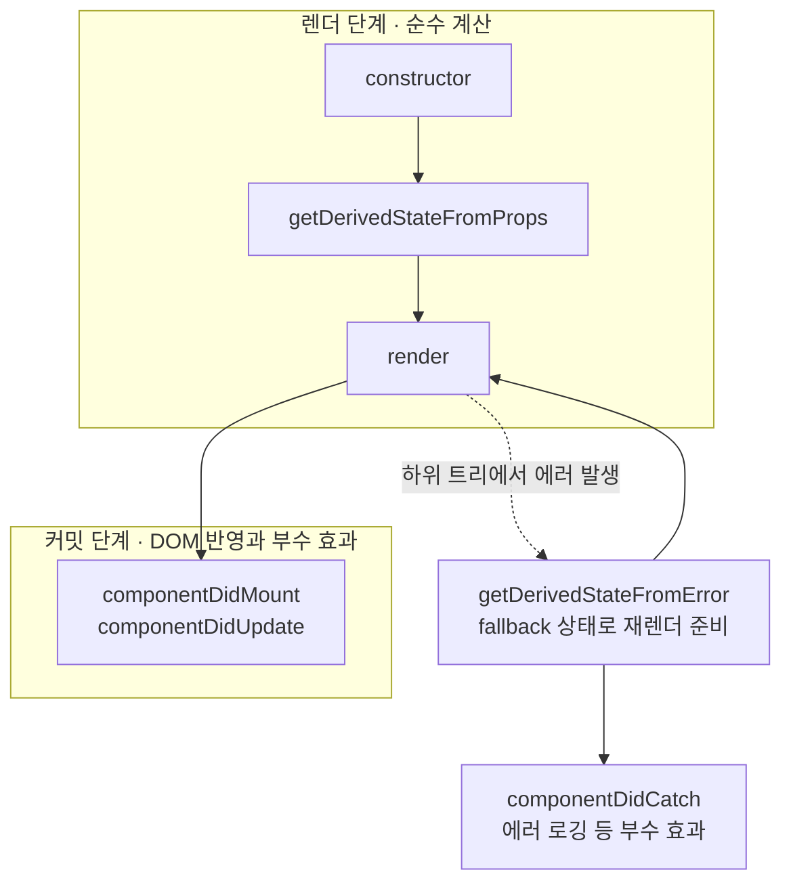
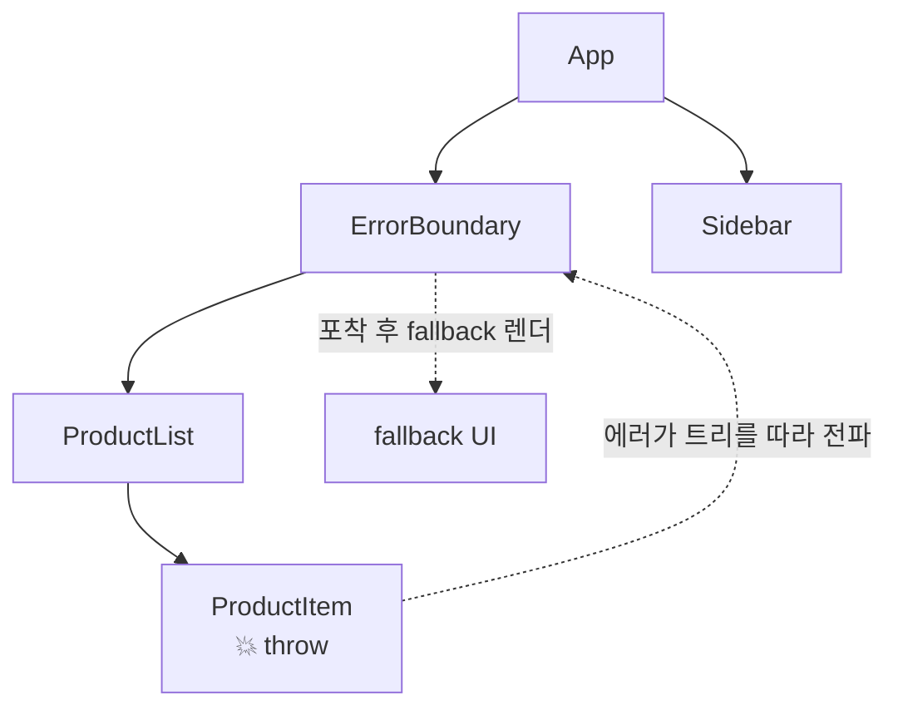

React로 만든 서비스를 운영하다 보면 한 번쯤 겪는 장면이 있습니다. 잘 동작하던 화면이 어느 순간 하얗게 변해버리는 것입니다. 에러는 상세 페이지 구석의 작은 배지 컴포넌트 하나에서 났는데, 사라진 것은 배지가 아니라 **화면 전체**였습니다.

클라이언트 개발에서 오류는 피할 수 없습니다. 네트워크가 끊기고, 서버가 예상치 못한 형식의 데이터를 내려주고, 개발자가 실수합니다. 문제는 오류가 나는 것 자체가 아니라, **오류가 났을 때 앱이 어떻게 반응하느냐**입니다.

그런데 왜 React는 에러가 난 컴포넌트만 조용히 치우지 않고 화면 전체를 지워버릴까요? 그리고 이 동작을 어떻게 제어할 수 있을까요?

이번 글에서는 React 16부터 도입된 `Error Boundary`를 다룹니다. React가 에러를 만나면 어떤 경로로 처리하는지, Error Boundary가 잡을 수 있는 에러와 잡을 수 없는 에러는 무엇인지, 왜 아직도 클래스 컴포넌트로만 만들 수 있는지, 그리고 실무에서는 어떻게 쓰는지까지 순서대로 정리해보겠습니다.

---

## 에러 하나가 화면 전체를 지우는 이유

먼저 문제 상황을 코드로 재현해보겠습니다.

```tsx
function Badge({ user }: { user: User }) {
  // user가 null이면 여기서 TypeError가 던져진다
  return <span>{user.name.toUpperCase()}</span>;
}
```

`user`가 `null`인 채로 렌더링되는 순간 `TypeError`가 던져집니다. 이 에러를 아무도 잡지 않으면 React는 **컴포넌트 트리 전체를 언마운트**합니다. `Badge` 하나 때문에 루트부터 전부 사라지고, 사용자에게는 흰 화면만 남습니다.

가혹해 보이지만 이것은 React 16부터 적용된 의도적인 설계입니다. 에러로 **손상된 UI를 그대로 두는 것이 아무것도 보여주지 않는 것보다 더 위험하다**고 판단했기 때문입니다. 예를 들어 결제 화면에서 금액 계산 로직이 깨진 채로 화면이 남아 있다면, 사용자는 잘못된 금액으로 결제 버튼을 누를 수 있습니다.

대신 React는 개발자가 **어디까지 지울지 경계를 그을 수 있는 장치**를 함께 제공합니다. 그 장치가 바로 `Error Boundary`입니다.

그런데 Error Boundary는 클래스 컴포넌트의 생명주기 메서드 위에 만들어진 기능입니다. 그래서 본격적으로 들어가기 전에, 생명주기부터 잠깐 짚고 가겠습니다.

---

## 잠깐, 클래스 컴포넌트의 생명주기부터

클래스 컴포넌트의 생명주기는 크게 두 단계로 나뉩니다. 컴포넌트를 실행해 화면이 어떻게 생겨야 하는지 계산하는 `렌더 단계(Render Phase)`와, 그 결과를 실제 DOM에 반영하고 부수 효과를 실행하는 `커밋 단계(Commit Phase)`입니다.

에러 처리 메서드가 이 흐름의 어디에 끼어드는지를 함께 그려보면 이렇습니다.



평소에는 `constructor → render → 커밋`으로 흘러가지만, 하위 트리에서 에러가 던져지면 별도의 에러 경로가 열립니다. 렌더 단계에서 `getDerivedStateFromError`가 호출되어 대체 UI를 그릴 준비를 하고, 커밋 단계에서 `componentDidCatch`가 호출되어 로깅 같은 부수 효과를 처리합니다.

이 두 메서드는 **클래스 컴포넌트에만 존재합니다**. 훅으로는 대응되는 API가 없습니다. Error Boundary를 아직도 클래스로 만들어야 하는 이유가 바로 여기에 있습니다.

이제 이 두 메서드를 사용하는 Error Boundary가 무엇인지 본격적으로 살펴보겠습니다.

---

## Error Boundary란 무엇인가

`Error Boundary`는 **하위 컴포넌트 트리에서 던져진 에러를 포착해, 앱 전체를 중단시키는 대신 미리 지정한 fallback UI를 보여주는 컴포넌트**입니다.

핵심 원리는 JavaScript의 `try...catch`와 같습니다. `try...catch`가 코드 블록을 감싸 그 안에서 던져진 에러를 잡듯이, Error Boundary는 컴포넌트 트리를 감싸 그 안에서 던져진 에러를 잡습니다. 명령형 코드의 에러 처리 방식을 선언적인 컴포넌트 세계로 옮겨온 셈입니다.

에러가 발생하면 트리를 따라 위로 전파되고, **가장 가까운 Error Boundary**가 이를 포착합니다.



`ProductItem`에서 던져진 에러는 `ProductList`를 지나 `ErrorBoundary`에서 멈춥니다. 그래서 `ErrorBoundary` 안쪽만 fallback UI로 교체되고, 경계 밖에 있는 `Sidebar`는 아무 일 없이 그대로 동작합니다. 에러의 **폭발 반경**을 경계 안쪽으로 제한하는 것입니다.

그런데 Error Boundary가 모든 에러를 잡아주는 것은 아닙니다. 어떤 에러를 잡고, 어떤 에러를 놓칠까요?

---

## 무엇을 잡고, 무엇을 놓치는가

### 포착하는 에러

Error Boundary는 **React가 렌더링을 진행하는 과정에서 던져진 에러**를 잡습니다.

- **렌더링 단계**에서 발생한 에러
- **생명주기 메서드** 내부의 에러
- **constructor**에서 발생한 에러
- 위 세 가지가 **하위 컴포넌트 트리 어디에서 발생하든** 전부

공통점이 보이시나요? 모두 React가 화면을 그리는 흐름 안에서 실행되는 코드입니다. React가 직접 호출하는 코드이기 때문에 `try...catch`로 감싸서 잡아줄 수 있습니다.

### 포착하지 못하는 에러

반대로 React의 렌더링 흐름 **바깥**에서 실행되는 코드의 에러는 잡지 못합니다.

**1. 이벤트 핸들러**

클릭 핸들러는 렌더링 중이 아니라 사용자가 클릭한 시점에 실행됩니다. 여기서 에러가 나도 이미 그려진 화면은 손상되지 않기 때문에 Error Boundary가 개입하지 않습니다. 직접 `try...catch`로 처리해야 합니다.

```tsx
function SaveButton() {
  const handleClick = async () => {
    try {
      await saveDocument();
    } catch {
      toast.error("저장에 실패했습니다");
    }
  };

  return <button onClick={handleClick}>저장</button>;
}
```

**2. 비동기 코드**

`setTimeout`, `requestAnimationFrame`, Promise의 `then/catch` 콜백은 렌더링이 모두 끝난 뒤 별도의 호출 스택에서 실행됩니다. 에러가 던져지는 시점에는 React의 `try...catch`가 이미 종료된 뒤라 잡을 방법이 없습니다.

```tsx
useEffect(() => {
  setTimeout(() => {
    // 이 에러는 Error Boundary에 잡히지 않는다
    throw new Error("렌더링이 끝난 뒤에 던져진 에러");
  }, 1000);
}, []);
```

**3. 서버 사이드 렌더링**

Error Boundary는 클라이언트에서 동작하는 메커니즘입니다. SSR 중 발생한 에러는 서버 프레임워크의 에러 처리에 맡겨야 합니다.

**4. Error Boundary 자기 자신에서 발생한 에러**

경계 컴포넌트 자신의 렌더링에서 에러가 나면 자기가 잡지 않고 **상위의 가장 가까운 Error Boundary로 전파**합니다. 자기가 던진 에러를 자기가 잡고, fallback을 그리다 또 에러가 나서 또 잡는 무한 루프를 막기 위해서입니다.

정리하면 이렇습니다.

| 에러 발생 위치 | Error Boundary | 대안 |
| --- | --- | --- |
| 렌더링, 생명주기, constructor | 포착 | - |
| 이벤트 핸들러 | 미포착 | `try...catch` |
| `setTimeout`, Promise 등 비동기 | 미포착 | `try...catch` 또는 `useErrorBoundary` |
| SSR | 미포착 | 서버 프레임워크의 에러 처리 |
| Error Boundary 자신 | 미포착 | 상위 Error Boundary |

그렇다면 Error Boundary는 어떻게 만들어야 할까요?

---

## Error Boundary 구현하기

구현 요건은 두 가지입니다.

1. **반드시 클래스 컴포넌트**여야 합니다.
2. 다음 두 생명주기 메서드 중 **하나 또는 둘 다**를 구현해야 합니다.

### static getDerivedStateFromError(error)

하위 컴포넌트에서 에러가 던져졌을 때 **렌더 단계에서 호출**됩니다. 에러 객체를 받아 상태를 업데이트하고, 다음 렌더링에서 fallback UI를 표시하도록 준비하는 역할을 합니다.

```tsx
static getDerivedStateFromError(error: Error): State {
  // 반환한 객체가 새 상태가 되어 fallback 렌더링을 준비한다
  return { hasError: true };
}
```

`static` 메서드이므로 `this`에 접근할 수 없고, 반드시 **상태 객체를 반환**해야 합니다. 렌더 단계에서 호출되기 때문에 로깅 같은 부수 효과를 넣어서는 안 됩니다. 부수 효과는 다음 메서드의 몫입니다.

### componentDidCatch(error, errorInfo)

하위 컴포넌트에서 에러가 던져졌을 때 **커밋 단계에서 호출**됩니다. 에러 정보를 외부 로깅 서비스에 전송하는 등 부수 효과를 처리하는 데 사용합니다.

```tsx
componentDidCatch(error: Error, errorInfo: React.ErrorInfo) {
  // error: 던져진 에러 객체
  // errorInfo.componentStack: 에러가 발생한 컴포넌트 스택
  logErrorToService(error, errorInfo.componentStack);
}
```

`error`는 발생한 에러 객체이고, `errorInfo`는 `componentStack` 속성을 포함해 **에러가 어느 컴포넌트에서 발생했는지 스택 정보**를 담고 있습니다. Sentry 같은 모니터링 도구로 에러를 보낼 때 이 스택이 디버깅의 단서가 됩니다.

### 전체 코드

두 메서드를 합치면 Error Boundary가 완성됩니다.

```tsx
interface Props {
  fallback: React.ReactNode;
  children: React.ReactNode;
}

interface State {
  hasError: boolean;
}

class ErrorBoundary extends React.Component<Props, State> {
  state: State = { hasError: false };

  // 렌더 단계: fallback을 그리도록 상태를 바꾼다
  static getDerivedStateFromError(): State {
    return { hasError: true };
  }

  // 커밋 단계: 로깅 같은 부수 효과를 처리한다
  componentDidCatch(error: Error, errorInfo: React.ErrorInfo) {
    logErrorToService(error, errorInfo.componentStack);
  }

  render() {
    return this.state.hasError ? this.props.fallback : this.props.children;
  }
}
```

사용은 보호하고 싶은 트리를 감싸기만 하면 됩니다.

```tsx
<ErrorBoundary fallback={<ProductList.Error />}>
  <ProductList />
</ErrorBoundary>
```

이제 `ProductList` 어딘가에서 에러가 던져져도 화면 전체가 아니라 이 영역만 `ProductList.Error`로 교체됩니다.

---

## 함수형 컴포넌트와 함께 쓰기

여기서 자연스러운 의문이 생깁니다. 요즘 코드베이스는 전부 함수형 컴포넌트인데, Error Boundary만 클래스로 만들어야 한다면 어떻게 섞어 써야 할까요?

답은 간단합니다. **클래스 기반의 Error Boundary 컴포넌트를 하나만 만들어두고, 함수형 컴포넌트들을 감싸는 형태**로 사용하면 됩니다. 경계 역할을 하는 컴포넌트 하나만 클래스이면 되고, 그 안팎의 컴포넌트는 전부 함수형이어도 아무 문제가 없습니다.

이 구조는 로직을 가진 컴포넌트가 UI를 가진 컴포넌트를 감싸 기능을 더한다는 점에서 `고차 컴포넌트(HOC)`나 `Render Props` 패턴과 유사합니다. 실제로 감싸는 과정을 HOC로 만들어두면 재사용이 편해집니다.

```tsx
function withErrorBoundary<P extends object>(
  Component: React.ComponentType<P>,
  fallback: React.ReactNode,
) {
  return (props: P) => (
    <ErrorBoundary fallback={fallback}>
      <Component {...props} />
    </ErrorBoundary>
  );
}

const SafeProductList = withErrorBoundary(ProductList, <ProductList.Error />);
```

### 경계는 어디에 그어야 할까

Error Boundary는 한 앱에 여러 개를 중첩해서 둘 수 있습니다. 최상단에 전역 경계 하나만 두면 어떤 에러든 앱 전체가 fallback으로 바뀌므로, 흰 화면보다는 낫지만 여전히 사용자는 아무것도 할 수 없습니다.

그래서 실무에서는 **전역 경계를 최후의 안전망으로 두고, 라우트나 독립적인 UI 섹션 단위로 경계를 세분화**하는 전략을 씁니다. 상품 목록에서 에러가 나도 장바구니와 검색은 계속 동작해야 하기 때문입니다. 에러가 났을 때 함께 죽어도 되는 단위가 어디까지인지가 경계를 긋는 기준이 됩니다.

---

## 실무에서는 react-error-boundary

직접 구현해보면 알겠지만, 실제로 쓰다 보면 요구사항이 계속 늘어납니다. fallback에 에러 객체를 넘겨주고 싶고, "다시 시도" 버튼으로 경계를 리셋하고 싶고, 비동기 에러도 경계로 보내고 싶어집니다. 그래서 대부분의 프로젝트는 이 요구사항들이 이미 구현된 [`react-error-boundary`](https://github.com/bvaughn/react-error-boundary) 라이브러리를 사용합니다.

```tsx
import { ErrorBoundary } from "react-error-boundary";

<ErrorBoundary
  FallbackComponent={ProductList.Error}
  onReset={() => refetchProducts()}
  onError={(error, info) => logErrorToService(error, info.componentStack)}
>
  <ProductList />
</ErrorBoundary>;
```

`FallbackComponent`는 `error`와 `resetErrorBoundary`를 props로 받습니다. 사용자가 스스로 복구를 시도할 수 있는 UI를 만들 수 있습니다.

```tsx
ProductList.Error = function ({ error, resetErrorBoundary }: FallbackProps) {
  return (
    <div role="alert">
      <p>상품 목록을 불러오지 못했습니다</p>
      <button onClick={resetErrorBoundary}>다시 시도</button>
    </div>
  );
};
```

앞서 비동기 에러는 Error Boundary가 잡지 못한다고 했습니다. 이 라이브러리의 `useErrorBoundary` 훅을 사용하면 비동기 에러를 **경계로 직접 던져 올릴** 수 있습니다.

```tsx
function ProductList() {
  const { showBoundary } = useErrorBoundary();

  useEffect(() => {
    // 비동기 에러를 잡아서 가장 가까운 Error Boundary로 전달한다
    fetchProducts().catch((error) => showBoundary(error));
  }, []);
  // ...
}
```

### React 19의 root 옵션

React 19부터는 루트를 만들 때 에러 처리 콜백을 등록할 수 있습니다. Error Boundary가 잡은 에러든 놓친 에러든 전부 이 지점을 지나가기 때문에, 경계마다 로깅 코드를 넣는 대신 앱 전체의 에러 로깅을 한 곳으로 모을 수 있습니다.

실무에서는 여기에 Sentry 같은 모니터링 도구를 연결하고, 같은 에러라도 **심각도를 다르게 분류**합니다. 경계가 잡은 에러는 사용자가 fallback UI라도 봤지만, 놓친 에러는 화면 전체가 사라진 상황이기 때문입니다.

```tsx
import * as Sentry from "@sentry/react";

createRoot(container, {
  // 경계가 잡은 에러: fallback으로 복구됐으므로 warning으로 기록
  onCaughtError: (error, errorInfo) => {
    Sentry.captureException(error, {
      level: "warning",
      contexts: { react: { componentStack: errorInfo.componentStack } },
    });
  },
  // 어떤 경계에도 잡히지 않은 에러: 화면 전체가 내려갔으므로 fatal
  onUncaughtError: (error, errorInfo) => {
    Sentry.captureException(error, {
      level: "fatal",
      contexts: { react: { componentStack: errorInfo.componentStack } },
    });
  },
});
```

심각도 분류가 필요 없다면 `@sentry/react`가 제공하는 [`Sentry.reactErrorHandler`](https://docs.sentry.io/platforms/javascript/guides/react/) 헬퍼를 콜백에 그대로 꽂는 것으로 충분합니다. hydration 불일치처럼 React가 스스로 복구한 에러를 받는 `onRecoverableError`도 같은 방식으로 연결할 수 있습니다.

주의할 점은 [`onCaughtError`](https://react.dev/reference/react-dom/client/createRoot#createroot-options)와 `onUncaughtError`가 Error Boundary를 **대체하는 것이 아니라 보완하는 장치**라는 점입니다. fallback UI를 보여주는 역할은 여전히 Error Boundary의 몫이고, root 옵션은 로깅을 모으는 지점입니다.

---

## TanStack Query와 함께 쓸 때 주의할 점

요즘 서버 상태 관리는 대부분 [TanStack Query](https://tanstack.com/query/latest)로 합니다. 그런데 TanStack Query와 Error Boundary를 함께 쓸 때는 알아야 할 함정이 두 가지 있습니다. **에러가 경계까지 오지 않는 문제**와, **재시도 버튼이 동작하지 않는 문제**입니다.

### 에러가 Error Boundary까지 오지 않는다

`useQuery`는 요청이 실패해도 에러를 던지지 않습니다. 에러를 내부에서 잡아 `isError`, `error` 같은 **상태로 반환**하기 때문입니다.

```tsx
function ProductList() {
  const { data, isError } = useQuery({
    queryKey: ["products"],
    queryFn: fetchProducts,
  });

  // 에러는 던져지지 않고 상태로만 존재한다
  if (isError) {
    return <ProductList.Error />;
  }
  // ...
}
```

렌더링 중에 throw되는 것이 없으니 Error Boundary가 개입할 일도 없습니다. 그래서 컴포넌트마다 `isError` 분기를 직접 써야 하는데, 이 분기를 하나라도 빼먹으면 에러가 났는데도 아무 일 없다는 듯 빈 화면이 렌더링됩니다. 에러가 사라지는 것이 아니라 **조용히 삼켜지는 것**입니다.

이를 경계로 보내려면 `throwOnError` 옵션을 켭니다. 2026년 7월 현재 안정 버전인 v5 기준이고, v4에서는 같은 옵션이 `useErrorBoundary`라는 이름이었습니다.

```tsx
useQuery({
  queryKey: ["products"],
  queryFn: fetchProducts,
  // 잡힌 에러를 렌더링 단계에서 다시 던져 Error Boundary로 보낸다
  throwOnError: true,
});
```

`throwOnError`에는 함수를 넘겨 **던질 에러를 선별**할 수도 있습니다. 4xx처럼 예상 가능한 에러는 상태로 받아 UI에서 처리하고, 5xx처럼 예상 불가능한 에러만 경계로 던지는 식입니다. 앞서 이야기한 "예상 가능한 에러는 값으로, 예상 불가능한 에러는 throw로"라는 원칙을 쿼리 단위에서 그대로 실천하는 방법입니다.

```tsx
throwOnError: (error) => error.response.status >= 500,
```

`Suspense`와 함께 쓰는 `useSuspenseQuery`라면 이 옵션조차 필요 없습니다. 로딩은 Suspense가, 에러는 Error Boundary가 받도록 **항상 throw하는 것이 기본 동작**이기 때문입니다.

### 재시도 버튼이 동작하지 않는 이유

에러를 경계로 보냈다면 이제 fallback의 "다시 시도" 버튼을 누르면 복구될 것 같습니다. 그런데 `resetErrorBoundary`만 호출하면 이상한 일이 벌어집니다. 버튼을 아무리 눌러도 **fallback이 그대로 다시 나타납니다**.

왜 그럴까요? `resetErrorBoundary`는 경계의 `hasError` 상태만 초기화할 뿐, **TanStack Query 캐시에는 에러 상태가 그대로 남아 있기 때문**입니다. 경계가 리셋되어 하위 트리를 다시 렌더링하면, 쿼리는 refetch 없이 캐시에 남은 에러를 즉시 다시 던지고, 경계는 그 에러를 또 잡습니다.

그래서 TanStack Query는 [`QueryErrorResetBoundary`](https://tanstack.com/query/latest/docs/framework/react/reference/QueryErrorResetBoundary)를 제공합니다. 경계가 리셋될 때 그 안쪽 쿼리들의 에러 상태를 함께 초기화해서, 재시도가 실제 refetch로 이어지게 만드는 컴포넌트입니다.

### 하나로 묶은 QueryErrorBoundary 래퍼

`QueryErrorResetBoundary`와 `ErrorBoundary`를 매번 조합해서 쓰는 것은 번거롭습니다. 그래서 실무에서는 둘을 하나로 묶은 래퍼를 만들어둡니다.

```tsx
import { QueryErrorResetBoundary } from "@tanstack/react-query";
import { ErrorBoundary } from "react-error-boundary";

function QueryErrorBoundary({ children }: { children: React.ReactNode }) {
  return (
    <QueryErrorResetBoundary>
      {({ reset }) => (
        <ErrorBoundary
          // 재시도할 때 쿼리의 에러 상태도 함께 초기화한다
          onReset={reset}
          onError={(error) => Sentry.captureException(error)}
          fallbackRender={({ resetErrorBoundary }) => (
            <div role="alert">
              <p>일시적인 오류가 발생했어요</p>
              <button onClick={resetErrorBoundary}>다시 시도</button>
            </div>
          )}
        >
          {children}
        </ErrorBoundary>
      )}
    </QueryErrorResetBoundary>
  );
}
```

사용할 때는 `Suspense`와 함께 조합합니다.

```tsx
<QueryErrorBoundary>
  <Suspense fallback={<ProductList.Loading />}>
    {/* 내부에서 useSuspenseQuery를 사용한다 */}
    <ProductList />
  </Suspense>
</QueryErrorBoundary>
```

이 구조의 장점은 역할이 선명하게 나뉜다는 점입니다. **로딩은 Suspense가, 에러는 QueryErrorBoundary가, 컴포넌트는 성공한 데이터만** 다룹니다. `isLoading`과 `isError` 분기가 사라진 컴포넌트는 성공 케이스 하나만 남아 훨씬 단순해집니다.

---

## 마무리

Error Boundary가 잡는 것은 렌더링을 계속할 수 없게 만드는 **예상 불가능한 에러**입니다. 반대로 API의 4xx 응답처럼 예상 가능한 에러는 던지지 말고 값으로 다루는 편이 낫습니다. 이 구분에 대해서는 [예상 가능한 에러와 예상 불가능한 에러](/post/error-handling)에서 자세히 다뤘습니다. 두 글을 합치면 이런 그림이 됩니다. **예상 가능한 에러는 값으로 처리하고, 예상 불가능한 에러는 throw해서 Error Boundary가 받아낸다.**

핵심을 정리하면 이렇습니다.

- React는 렌더링 중 잡히지 않은 에러가 발생하면 **트리 전체를 언마운트**한다. 손상된 UI를 보여주는 것보다 안전하기 때문이다.
- `Error Boundary`는 하위 트리의 에러를 포착해 fallback UI를 보여주는 컴포넌트로, 에러의 폭발 반경을 경계 안쪽으로 제한한다.
- 렌더링, 생명주기, constructor의 에러는 잡지만, **이벤트 핸들러·비동기 코드·SSR·자기 자신의 에러는 잡지 못한다**.
- `static getDerivedStateFromError`로 fallback 상태를 준비하고, `componentDidCatch`로 로깅 같은 부수 효과를 처리한다. 두 메서드는 클래스에만 존재하므로 **Error Boundary는 반드시 클래스 컴포넌트**여야 한다.
- 실무에서는 [`react-error-boundary`](https://github.com/bvaughn/react-error-boundary)로 리셋과 비동기 에러 전달까지 처리하고, 경계는 **함께 죽어도 되는 UI 단위**로 세분화한다.
- TanStack Query는 에러를 상태로 삼키므로 `throwOnError`나 `useSuspenseQuery`로 경계까지 던지고, 재시도는 `QueryErrorResetBoundary`와 함께 묶어야 실제 refetch로 이어진다.

에러를 없앨 수는 없습니다. 하지만 에러가 났을 때 사용자가 흰 화면 대신 "다시 시도" 버튼을 보게 만들 수는 있습니다. 그 차이를 만드는 것이 Error Boundary입니다.
