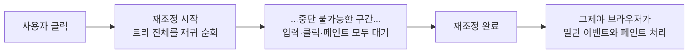
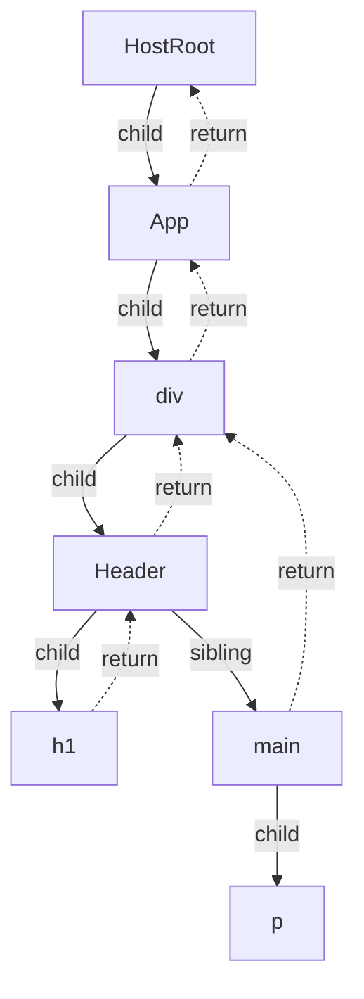
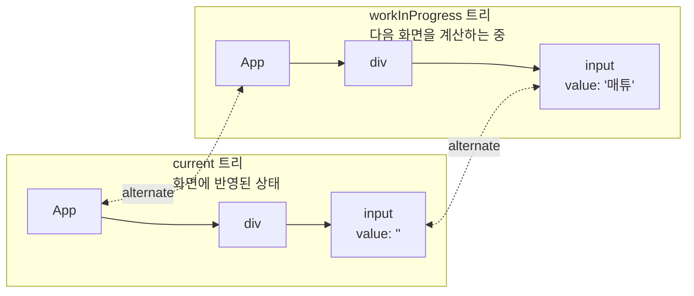
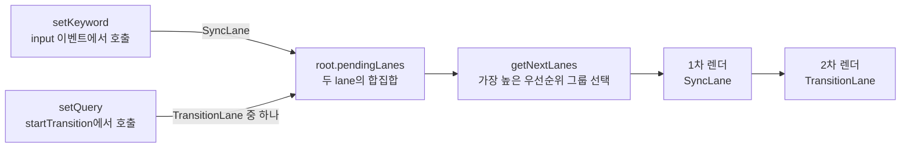
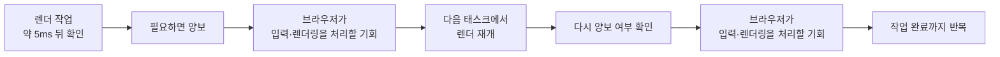
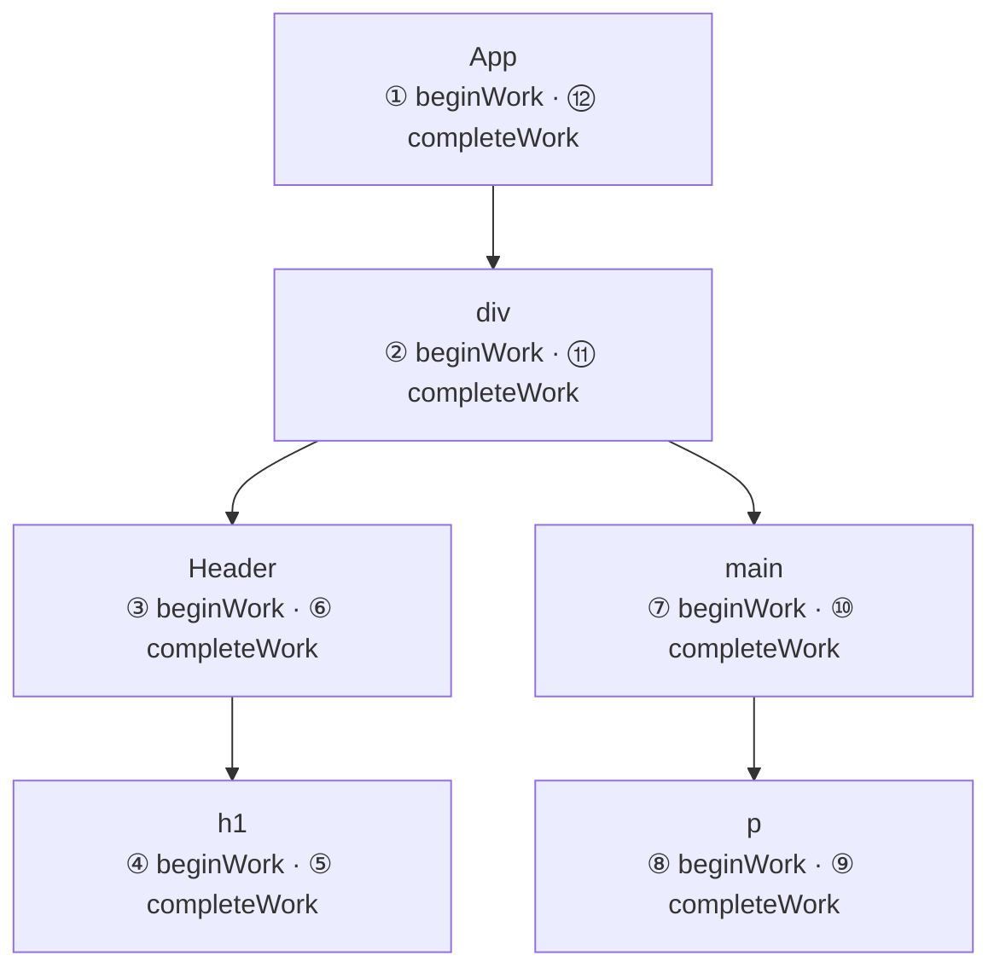
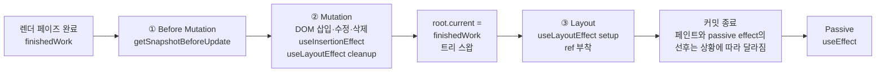
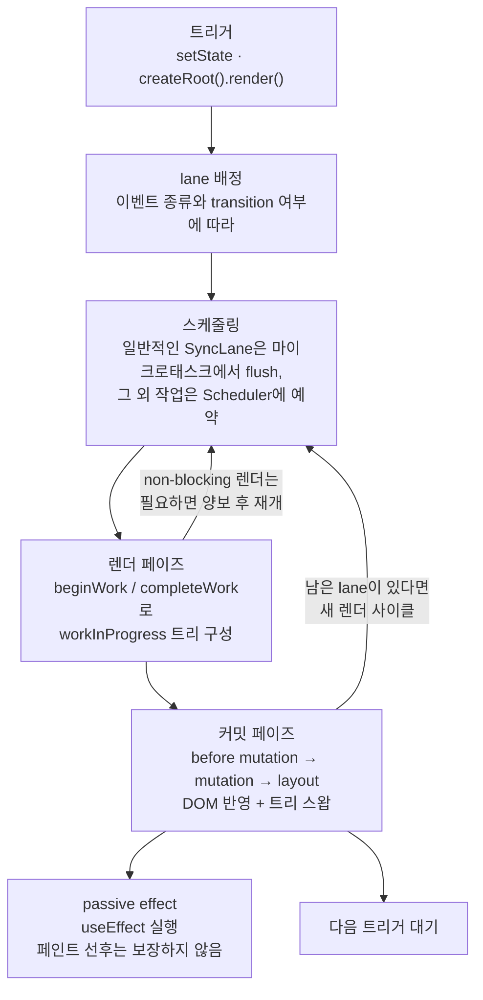

React를 쓰다 보면 `setState`를 호출하는 순간 화면이 바뀐다고 느낀다. 하지만 그 사이에는 생각보다 많은 일이 일어난다. 코드 하나를 놓고 시작해보자.

```tsx
function SearchPage() {
  const [keyword, setKeyword] = useState('');
  const [query, setQuery] = useState('');

  function handleChange(e) {
    // [A] 긴급 업데이트. 입력창에는 글자가 바로 보여야 한다
    setKeyword(e.target.value);

    startTransition(() => {
      // [B] 전환 업데이트. 무거운 검색 결과 필터링은 늦어도 된다
      setQuery(e.target.value);
    });
  }

  console.log('SearchPage 렌더링'); // 몇 번 출력될까?
  return (
    <>
      <input value={keyword} onChange={handleChange} />
      <SearchResults query={query} />
    </>
  );
}
```

입력창에 글자 하나를 입력하면 콘솔에는 `SearchPage 렌더링`이 몇 번 출력될까? [`startTransition`](https://ko.react.dev/reference/react/startTransition)으로 감싼 검색 결과 업데이트는 왜 입력보다 나중에 처리될 수 있을까? `useEffect`, `useLayoutEffect`, `useInsertionEffect`는 각각 언제 실행될까?

이 질문들에 감이 아니라 근거로 답하려면 React의 내부, 그중에서도 `Fiber` 아키텍처를 알아야 한다. 이번 글에서는 React 19 실제 소스코드([v19.2.0 태그](https://github.com/facebook/react/tree/v19.2.0) 기준)를 따라가면서 `setState` 호출부터 DOM 반영과 effect 실행까지의 흐름을 살펴본다. 글 마지막에는 위 질문들에 다시 답해본다.

---

## React 15 재조정의 한계

React가 하는 일의 핵심은 `재조정(Reconciliation)`이다. 상태가 바뀌면 컴포넌트를 다시 실행해서 새 트리를 만들고, 이전 트리와 비교해서 무엇이 바뀌었는지 계산한 뒤, 바뀐 부분만 `DOM`에 반영한다.

React 15까지는 이 재조정을 **재귀 호출**로 구현했다. 이 방식을 `Stack Reconciler`라고 부른다. 동작을 단순화하면 이런 모양이다.

```js
// 실제 코드가 아니라 동작을 단순화한 예시다
function reconcile(element) {
  // 1. 현재 엘리먼트를 처리한다 (마운트/업데이트/삭제 결정)
  process(element);

  // 2. 자식들을 재귀적으로 처리하며 콜 스택에 계속 쌓는다
  element.children.forEach(child => reconcile(child));
}

// 한 번 시작하면 트리 전체가 끝날 때까지 멈출 수 없다
reconcile(rootElement);
```

문제는 재귀 호출이 JavaScript의 콜 스택을 그대로 사용한다는 점이다. 콜 스택은 중간에 멈췄다가 이어서 실행할 방법이 없다. 한 번 시작하면 트리의 끝을 볼 때까지 리턴할 수 없고, 그동안 메인 스레드는 통째로 점유된다.



브라우저가 60FPS를 유지할 때 한 프레임의 전체 예산은 약 16.6ms다. React의 계산뿐 아니라 입력 처리, 스타일 계산, 레이아웃, 페인트도 이 시간을 나눠 쓴다. 컴포넌트 트리가 커서 재조정이 메인 스레드를 오래 점유하면 사용자의 입력이 밀리고 화면이 멈춘 것처럼 보인다.

그렇다면 어떻게 해야 할까? 계산을 더 빠르게 만드는 것도 방법이지만, React 팀의 답은 달랐다. **계산을 멈출 수 있게 만들자**. 그 답이 React 16에서 도입된 Fiber 아키텍처다.

---

## 중단 가능한 작업 단위, Fiber

`Fiber`는 두 가지를 동시에 가리킨다. 재조정 엔진을 다시 만든 아키텍처의 이름이면서, 그 안에서 작업 단위를 나타내는 객체이기도 하다. [React Fiber Architecture 설계 문서](https://github.com/acdlite/react-fiber-architecture)는 fiber를 이렇게 정의한다.

> A fiber represents a unit of work.

콜 스택에 쌓이는 스택 프레임을 React가 직접 관리하는 객체로 바꾼 것이다. 스택 프레임은 함수가 리턴해야만 사라지지만, 객체는 어디까지 처리했는지 기록해두고 언제든 이어서 처리할 수 있다.

### FiberNode의 실제 구조

말로만 설명하는 것보다 실제 코드를 보는 게 빠르다. [ReactFiber.js](https://github.com/facebook/react/blob/v19.2.0/packages/react-reconciler/src/ReactFiber.js#L136)의 `FiberNode` 생성자다.

```js
// 일부 필드는 생략했다
function FiberNode(tag, pendingProps, key, mode) {
  // Instance: 이 fiber가 무엇인지
  this.tag = tag;               // FunctionComponent(0), HostComponent(5) 같은 종류
  this.key = key;               // 리스트 diffing에 쓰는 그 key
  this.elementType = null;
  this.type = null;             // 함수 컴포넌트라면 함수 자체, host라면 'div' 같은 문자열
  this.stateNode = null;        // tag에 따른 인스턴스. host라면 실제 DOM 노드

  // Fiber: 트리에서의 연결 관계
  this.return = null;           // 부모 fiber
  this.child = null;            // 첫 번째 자식 fiber
  this.sibling = null;          // 다음 형제 fiber
  this.index = 0;

  this.pendingProps = pendingProps; // 이번 렌더에서 받은 새 props
  this.memoizedProps = null;        // 지난 렌더에서 사용한 props
  this.updateQueue = null;          // 처리 대기 중인 업데이트 큐
  this.memoizedState = null;        // 함수 컴포넌트라면 훅 연결 리스트

  // Effects: 커밋 페이즈에서 해야 할 일
  this.flags = NoFlags;         // 커밋 때 필요한 작업 (Placement, Update, Ref...)
  this.subtreeFlags = NoFlags;  // 자식 트리 어딘가에 커밋 작업이 있는지

  this.lanes = NoLanes;         // 이 노드에 걸린 업데이트의 우선순위
  this.childLanes = NoLanes;    // 자식들에 걸린 우선순위의 합집합

  this.alternate = null;        // 반대편 트리의 나 자신 (더블 버퍼링)
}
```

필드가 많지만 그룹으로 나누면 명확하다. 이 fiber가 무엇인지(`tag`, `type`, `stateNode`), 트리에서 어디에 있는지(`return`, `child`, `sibling`), 어떤 입력과 상태를 가지는지(`pendingProps`, `memoizedProps`, `memoizedState`), 커밋 때 무슨 작업이 필요한지(`flags`), 그 작업이 얼마나 급한지(`lanes`)다. `alternate`는 뒤에서 자세히 다룬다.

### 재귀 대신 명시적인 링크로 순회하기

여기서 핵심은 `return`, `child`, `sibling` 세 필드다. 다음 JSX가 있다고 하자.

```tsx
function Header() {
  return <h1>Title</h1>;
}

function App() {
  return (
    <div>
      <Header />
      <main>
        <p>Body</p>
      </main>
    </div>
  );
}
```

React는 이 컴포넌트들을 fiber 노드로 만들어 연결한다. 부모는 첫 번째 자식 하나만 `child`로 가리키고, 나머지 자식은 첫째의 `sibling`을 따라가며 찾는다. 각 노드는 `return`으로 부모를 가리킨다.



이 구조 덕분에 트리 순회에 재귀가 필요 없어진다. 어느 노드에서든 다음 규칙만 따르면 된다.

```js
// 실제 코드를 단순화한 순회 규칙이다
function getNextFiber(fiber) {
  if (fiber.child) return fiber.child;      // 1. 자식이 있으면 자식으로

  let node = fiber;
  while (node) {
    if (node.sibling) return node.sibling;  // 2. 형제가 있으면 형제로
    node = node.return;                     // 3. 없으면 부모로 올라가 형제를 찾는다
  }
  return null;                              // 루트까지 왔다면 순회 끝
}
```

컴포넌트 실행 같은 개별 함수 호출은 여전히 JavaScript 콜 스택을 사용한다. 달라진 점은 **트리 전체의 순회 상태를 재귀 호출 스택에 보관하지 않는다는 것**이다. React는 현재 처리 중인 fiber를 변수로 들고 있다가 루프를 빠져나오고, 나중에 그 지점부터 순회를 이어갈 수 있다.

### 그런데 이게 가상돔 아닌가?

흔히 React의 메모리상 표현을 `가상돔(Virtual DOM)`이라 묶어 부르지만, 구현을 이해하려면 성격이 다른 두 구조를 구분하는 편이 낫다.

- `React element`: 컴포넌트 실행이 반환하는 불변 객체다. `type`, `key`, `props`를 중심으로 화면의 의도를 표현한다. 보통 렌더마다 새로 만들어지지만 재사용되거나 컴파일러가 메모이제이션할 수도 있다.
- `fiber 트리`: element를 바탕으로 만든 가변 자료구조다. 컴포넌트의 상태, 훅, 진행 중인 작업 정보까지 담고 렌더 사이에 재사용된다.

`가상돔`은 React의 동작을 큰 틀에서 설명할 때는 유용하지만, 실제 구현의 자료구조를 가리키기에는 범위가 넓다. 내부 동작을 이야기할 때는 element와 fiber를 구분하는 편이 정확하다. React가 element를 계산하고 실제 화면 반영은 렌더러에 맡기는 구조는 [React Native 글](/post/react-native-internals)에서 다뤘던 것과 같은 원리다.

---

## current와 workInProgress

`FiberNode`의 마지막 필드 `alternate`로 돌아가보자. 업데이트가 진행될 때 React는 fiber 트리를 두 버전으로 관리한다.

- `current` 트리: 지금 화면에 반영되어 있는 상태의 트리
- `workInProgress` 트리: 다음 화면을 만들기 위해 작업 중인 트리

두 트리의 같은 위치에 있는 노드들은 `alternate`로 서로를 참조한다. 새 렌더가 시작되면 React는 `current` 노드를 복제해서(정확히는 이미 있는 `alternate`를 재사용해서) `workInProgress` 노드를 만들고, 계산은 작업 트리에서 진행한다.



작업이 끝나 커밋되면 루트 포인터를 `workInProgress` 쪽으로 바꾼다. 이 한 줄로 새 fiber 트리가 `current`가 된다.

```js
root.current = finishedWork;
```

이렇게 현재 버전과 작업 버전을 분리하는 방식을 `더블 버퍼링(Double Buffering)`이라 부른다. 최초 마운트부터 항상 완성된 트리 두 벌이 존재하는 것은 아니며, `alternate`는 필요할 때 만들어진 뒤 다음 렌더에서 재사용된다.

왜 이렇게까지 할까? 화면에 보이는 트리를 직접 수정하면 안 되는 걸까?

더블 버퍼링이 주는 결정적인 이점은 **작업을 버릴 수 있다**는 것이다. `workInProgress`는 화면과 분리되어 있으므로, 만들다가 중간에 무슨 일이 생겨도 현재 화면은 유지된다.

- 작업 도중 **더 급한 업데이트**가 들어오면, 진행하던 작업을 버리고 급한 것부터 새로 시작할 수 있다
- 렌더 도중 **에러**가 나면 반쯤 만들어진 트리를 버릴 수 있어, 화면이 깨진 중간 상태로 남지 않는다
- 이미 보이는 화면을 transition으로 갱신하다 [`Suspense`](https://ko.react.dev/reference/react/Suspense)가 발생하면, 새 작업이 준비될 때까지 이전 화면을 유지할 수 있다

`startTransition`이 렌더링을 중단하고 다시 시작할 수 있는 것도, 뒤에서 다룰 렌더 페이즈가 여러 번 실행되어도 안전한 것도 전부 이 구조 위에서 성립한다.

---

## 훅 상태는 어디에 저장될까?

함수 컴포넌트는 렌더마다 처음부터 다시 실행된다. 그런데 [`useState`](https://ko.react.dev/reference/react/useState)의 값은 어떻게 유지될까? 답은 방금 본 fiber에 있다. 훅의 상태는 함수가 아니라 컴포넌트의 `fiber` 노드에 저장된다.

[ReactFiberHooks.js](https://github.com/facebook/react/blob/v19.2.0/packages/react-reconciler/src/ReactFiberHooks.js#L195)의 `Hook` 타입을 보자.

```ts
export type Hook = {
  memoizedState: any,                  // 이 훅이 렌더 사이에 유지하는 값이나 정보
  baseState: any,
  baseQueue: Update<any, any> | null,
  queue: any,                          // useState, useReducer 등이 사용하는 업데이트 큐
  next: Hook | null,                   // 다음 훅
};
```

`next` 필드가 보이는가? 훅은 연결 리스트다. 컴포넌트가 마운트될 때 `mountWorkInProgressHook`은 첫 훅을 `fiber.memoizedState`에 저장하고, 이후 훅을 `next`로 연결한다.

도입부의 `SearchPage`라면 fiber에는 이런 리스트가 만들어진다.

```text
fiber.memoizedState =
  { memoizedState: '', ... , next: ─┐ }   // keyword
                                    └──▶ { memoizedState: '', ..., next: null }   // query
```

여기서 `훅을 조건문이나 반복문 안에서 호출하면 안 된다`는 규칙의 이유가 드러난다. 이 리스트에는 훅 이름을 기준으로 찾는 별도의 키가 없다. React는 호출 순서대로 `next`를 따라가며 첫 번째 호출을 첫 번째 훅과 대응시킨다. 렌더마다 호출 순서가 달라지면 React는 훅 개수가 달라졌다는 오류를 내거나 상태를 올바른 호출과 연결할 수 없게 된다.

### setState를 호출하면 실제로 무슨 일이 일어날까?

`setKeyword('매튜')`를 호출한다고 화면이 즉시 다시 그려지는 게 아니다. React는 `lane`, `action`, `eagerState`, `next` 같은 필드를 가진 `Update` 객체를 만들어 훅의 원형 queue에 추가하고, 해당 fiber에 처리할 일이 생겼다고 스케줄러에 알린다.

실제 상태 계산은 나중에 렌더 페이즈에서 컴포넌트가 다시 실행될 때, `useState`가 큐에 쌓인 업데이트들을 순서대로 적용하면서 이루어진다.

작은 최적화도 숨어 있다. 현재 fiber와 `alternate`에 대기 중인 lane이 없다면 React는 새 상태를 미리 계산해보고(`eagerState`), 현재 상태와 같을 때 렌더링 예약을 생략할 수 있다. 다른 업데이트가 없는 상태에서 `setCount(0)`을 호출하면 흔히 리렌더링이 일어나지 않는 이유다. [소스의 주석](https://github.com/facebook/react/blob/v19.2.0/packages/react-reconciler/src/ReactFiberHooks.js#L3673)은 이를 `Fast path`라고 부른다.

그런데 방금 `Update` 타입의 첫 필드가 `lane`이었다. 우선순위라는 게 정확히 뭘까?

---

## Lane과 업데이트 우선순위

모든 업데이트가 같은 급이 아니다. 사용자가 입력창에 타이핑한 글자는 즉시 보여야 하지만, 그로 인한 검색 결과 갱신은 조금 늦어도 된다. React는 이 우선순위를 `lane`이라는 값으로 표현한다.

[ReactFiberLane.js](https://github.com/facebook/react/blob/v19.2.0/packages/react-reconciler/src/ReactFiberLane.js)를 열어보면 lane의 정체는 31비트 비트마스크다.

```js
export const TotalLanes = 31;

export const SyncLane: Lane =             0b0000000000000000000000000000010;
export const InputContinuousLane: Lane =  0b0000000000000000000000000001000;
export const DefaultLane: Lane =          0b0000000000000000000000000100000;
const TransitionLane1: Lane =             0b0000000000000000000000100000000;
// ... TransitionLane2 ~ 14가 이어진다
export const IdleLane: Lane =             0b0010000000000000000000000000000;
```

기본적으로 오른쪽 비트일수록 우선순위가 높다. 그리고 어떤 상황에서 `setState`가 호출되었는지에 따라 배정되는 lane이 달라진다.

| 업데이트가 발생한 곳 | 배정되는 lane |
| --- | --- |
| 클릭, 키 입력 같은 개별(discrete) 이벤트 | `SyncLane` |
| 스크롤, 드래그, 마우스 이동 같은 연속(continuous) 이벤트 | `InputContinuousLane` |
| 별도 우선순위 문맥이 없는 `setTimeout`, 네트워크 응답 콜백 | `DefaultLane` |
| `startTransition` 내부 업데이트 | `TransitionLane` 중 하나 |
| 긴급 렌더에서 미뤄진 `useDeferredValue` 작업 | deferred 작업용 lane |
| 일반적인 앱 초기화 코드에서 호출한 `createRoot().render()` | `DefaultLane` |

우선순위를 비트마스크로 관리하면 여러 작업의 합성과 검사가 비트 연산 몇 번으로 끝난다. 도입부 예제에서 글자 하나를 입력하면 `setKeyword`는 `SyncLane`(`input`은 discrete 이벤트다), `setQuery`는 transition lane을 받고, 루트에는 두 lane을 OR 연산한 값이 기록된다.



렌더링을 시작할 때 React는 `getNextLanes`로 다음에 처리할 lane 집합을 고른다. 가장 높은 우선순위가 기준이지만, 같은 우선순위 그룹이나 서로 얽힌(entangled) lane은 함께 선택될 수 있다. 도입부 예제에서는 `SyncLane`이 먼저 처리되어 입력창이 갱신되고, transition lane은 별도 렌더로 남는다.

### 배칭과 lane은 같은 개념이 아니다

`배칭(Batching)`은 여러 상태 업데이트를 곧바로 하나씩 처리하지 않고 모아서 렌더 횟수를 줄이는 동작이다. `handleChange` 같은 하나의 이벤트 핸들러에서 `setState`를 여러 번 호출해도 보통 렌더는 한 번만 일어난다.

React 18의 `createRoot`부터는 `setTimeout`이나 `Promise.then` 같은 React 이벤트 밖의 콜백에서도 여러 업데이트가 자동으로 배칭된다. 반면 lane은 각 업데이트의 우선순위와 이번 렌더에서 처리할 작업 집합을 나타낸다. 같은 lane이라고 항상 같은 렌더로 묶이는 것도 아니고, 같은 이벤트에서 발생했다고 항상 같은 렌더에 포함되는 것도 아니다. 도입부의 sync 업데이트와 transition 업데이트가 한 핸들러 안에서 발생해도 두 렌더로 나뉘는 것이 그 예다.

한 가지 오해를 짚고 가자. `SyncLane`이라고 해서 `setState` 호출 즉시 그 자리에서 리렌더링이 일어나는 것은 아니다. 일반적인 concurrent root에서 React는 루트 처리 일정을 마이크로태스크에 등록한다. 이벤트 핸들러의 나머지 코드가 끝난 뒤 배칭된 동기 작업을 처리하므로, `setState` 직후에 DOM을 읽으면 아직 갱신 전의 화면이 보인다. 이 흐름을 건너뛰고 당장 DOM에 반영해야 할 때 [`flushSync`](https://ko.react.dev/reference/react-dom/flushSync)를 사용한다.

### 낮은 우선순위는 영원히 굶을까?

우선순위 기반 시스템의 고전적인 문제가 있다. 급한 작업이 계속 들어오면 한가한 작업은 영원히 실행되지 못하는 `기아(starvation)` 상태에 빠질 수 있다. 사용자가 쉬지 않고 타이핑하면 transition 렌더는 계속 밀리기만 할까?

React는 일부 lane에 만료 시간을 둔다. [`markStarvedLanesAsExpired`](https://github.com/facebook/react/blob/v19.2.0/packages/react-reconciler/src/ReactFiberLane.js)는 대기 중인 lane을 확인해 sync 계열은 250ms, default·transition 계열은 5000ms 뒤 만료 대상으로 표시한다. 만료된 작업은 우선적으로 처리하며, 일반적인 업데이트에서는 타임 슬라이싱 대상에서도 제외된다. React 19.2의 오픈소스 기본 설정에서 retry lane은 만료되지 않고, idle 계열은 설계상 만료 시간을 갖지 않는다.

---

## Scheduler와 타임 슬라이싱

lane으로 무엇을 먼저 할지 정했다면, 이제 **언제** 실행할지 정할 차례다. 이 일을 맡는 것이 React에 내장된 [Scheduler 패키지](https://github.com/facebook/react/tree/v19.2.0/packages/scheduler)다.

스케줄러의 목표는 렌더링 계산이 메인 스레드를 오래 독점하지 않도록 실행 기회를 나누는 것이다. 중단 가능한 렌더는 일정 시간 작업한 뒤 브라우저에 제어권을 돌려주고 다음 태스크에서 이어간다. 이 기법을 `타임 슬라이싱(Time Slicing)`이라 부른다.



얼마나 일하고 양보할지 결정하는 함수가 [`shouldYieldToHost`](https://github.com/facebook/react/blob/v19.2.0/packages/scheduler/src/forks/Scheduler.js#L447)다. 실제 구현은 의외로 단순하다.

```js
function shouldYieldToHost(): boolean {
  if (!enableAlwaysYieldScheduler && enableRequestPaint && needsPaint) {
    return true; // 페인트가 필요하다는 신호가 오면 즉시 양보
  }
  const timeElapsed = getCurrentTime() - startTime;
  if (timeElapsed < frameInterval) {
    return false; // 아직 5ms가 안 지났으면 계속 일한다
  }
  return true; // 5ms가 지났으니 양보
}
```

`frameInterval`의 기본값은 5ms다. 다만 정확히 5ms 크기로 작업을 자르는 것은 아니다. 하나의 작업 단위가 오래 걸리면 5ms를 넘길 수 있고, 양보했다고 브라우저가 반드시 즉시 페인트하는 것도 아니다. 소스 주석이 설명하듯 이 기준은 프레임 경계에 맞추기 위한 값이 아니라, 메인 스레드를 짧게 점유한 뒤 다른 작업에 기회를 줄지 판단하는 기본 예산이다.

### 브라우저에서는 왜 MessageChannel을 사용할까?

타임 슬라이싱에는 `requestIdleCallback`처럼 브라우저가 한가해질 때까지 기다리는 API보다, 우선순위에 맞춰 다음 작업을 등록할 수단이 필요하다. React 19.2의 브라우저 환경에서는 주로 [`MessageChannel`](https://developer.mozilla.org/ko/docs/Web/API/MessageChannel)을 사용한다. [Scheduler.js](https://github.com/facebook/react/blob/v19.2.0/packages/scheduler/src/forks/Scheduler.js#L532)에서 실제 선택 순서를 확인할 수 있다.

주석에는 [`setTimeout`](https://developer.mozilla.org/ko/docs/Web/API/Window/setTimeout)의 중첩 호출에 적용되는 4ms 클램핑을 피하기 위해 `MessageChannel`을 선호한다고 적혀 있다. Node.js처럼 `setImmediate`가 있는 환경에서는 이를 먼저 사용하고, `MessageChannel`도 없으면 `setTimeout`으로 대체한다.

`MessageChannel`의 message 콜백은 브라우저의 태스크로 실행된다. 마이크로태스크는 현재 태스크가 끝난 뒤 큐가 빌 때까지 처리되므로, 연속해서 예약하면 브라우저에 렌더링 기회를 주기 어렵다. 반면 다음 태스크로 작업을 넘기면 브라우저가 태스크 사이에서 입력과 렌더링을 처리할 기회를 얻는다.

정리하면 Fiber가 **어디에서 멈출 수 있는지**를 만들고, Scheduler가 **언제 멈출지**와 **어떻게 다음 실행을 예약할지**를 결정한다.

---

## 렌더 페이즈

준비가 끝났다. 이제 React가 실제로 화면을 갱신하는 두 단계, `렌더 페이즈(Render Phase)`와 `커밋 페이즈(Commit Phase)`를 순서대로 따라가보자.

렌더 페이즈는 `workInProgress` 트리를 만드는 **계산** 단계다. 스케줄러가 워크 루프를 실행하면, 루프는 fiber를 하나씩 처리한다. [ReactFiberWorkLoop.js](https://github.com/facebook/react/blob/v19.2.0/packages/react-reconciler/src/ReactFiberWorkLoop.js#L2982)의 동시성 워크 루프는 이게 전부다.

```js
function workLoopConcurrentByScheduler() {
  // Perform work until Scheduler asks us to yield
  while (workInProgress !== null && !shouldYield()) {
    performUnitOfWork(workInProgress);
  }
}
```

`workInProgress` 변수가 현재 처리 중인 fiber를 가리킨다. `shouldYield`가 `true`를 반환하면 루프가 끝나고, 스케줄러가 다음 태스크에서 루프를 다시 호출하면 멈춘 fiber부터 이어진다.

### beginWork와 completeWork

`performUnitOfWork`는 fiber 하나를 놓고 두 가지 작업을 한다. 트리를 **내려가면서** `beginWork`, 더 내려갈 곳이 없으면 **올라오면서** `completeWork`다.

`beginWork`는 fiber의 `tag`에 따라 처리 방법을 고른다. 함수 컴포넌트라면 컴포넌트 함수를 실행하고, 훅 큐의 업데이트를 적용해 새 상태를 계산한다. 이후 반환된 element를 이전 자식 fiber와 비교해(`type`과 `key`가 중요한 기준이다) 자식 workInProgress fiber를 만든다. host component처럼 컴포넌트 함수를 실행하지 않는 종류도 있다.

`completeWork`는 자식 처리가 끝난 fiber에서 실행된다. 최초 마운트의 host component라면 아직 화면의 DOM 트리에 붙이지 않은 인스턴스를 만들고, 업데이트라면 커밋 때 필요한 변경을 표시한다. 이어서 자식의 `flags`를 부모의 `subtreeFlags`로 모아 커밋 페이즈가 작업이 있는 서브트리를 찾을 수 있게 한다.



물론 매번 모든 컴포넌트 함수를 실행하는 것은 아니다. 이전 props와 새 props가 같은 객체이고, 현재 렌더에서 처리할 업데이트나 context 변경이 없다면 React는 해당 fiber의 본 작업을 건너뛸 수 있다. 자식에도 처리할 lane이 없다면 서브트리 전체를 건너뛴다. 다만 부모가 새 props 객체를 만들었거나 context가 바뀌었다면 상태 변경 경로 밖의 컴포넌트도 다시 실행될 수 있다.

### 모든 렌더가 쪼개지는 것은 아니다

흔한 오해 하나를 정정할 차례다. Fiber 아키텍처가 도입됐다고 해서 **모든 렌더링이 5ms 단위로 쪼개지는 것은 아니다.**

React는 이번에 처리할 lane을 보고 타임 슬라이싱 여부를 결정한다. 일반적인 클라이언트 업데이트에서 `SyncLane`, `InputContinuousLane`, `DefaultLane`은 `blocking lane`으로 분류되어 동기 워크 루프(`renderRootSync`)를 탄다. `TransitionLane`, `RetryLane`, `IdleLane` 같은 non-blocking lane은 동시성 워크 루프를 사용할 수 있다. 다만 React 19.2에는 prerendering처럼 blocking lane도 동시성 워크 루프로 처리하는 내부 예외가 있다.

```js
// ReactFiberWorkLoop.js의 실제 분기를 단순화했다
const shouldTimeSlice =
  !includesBlockingLane(lanes) &&      // Sync/InputContinuous/Default가 아니고
  !includesExpiredLane(root, lanes);   // 만료된 lane도 아닐 때만

shouldTimeSlice
  ? renderRootConcurrent(root, lanes)  // 필요하면 양보하는 워크 루프
  : renderRootSync(root, lanes);       // 끝까지 달리는 워크 루프
```

즉 Fiber는 React 16부터 중단 가능한 구조를 만들었고, React 18 이후의 `startTransition`, `Suspense` 같은 공개 동시성 기능이 이를 본격적으로 활용한다. transition을 쓰지 않는 무거운 기본 업데이트는 여전히 메인 스레드를 오래 점유할 수 있다. `startTransition`은 단순히 시간을 늦추는 API가 아니라, 해당 업데이트를 긴급하지 않은 작업으로 표시해 중단 가능한 렌더 경로에 올리는 API다.

### 렌더 페이즈는 버려질 수 있다

렌더 페이즈에는 중요한 원칙이 하나 있다. **현재 화면에 커밋된** DOM은 변경하지 않는다. 최초 마운트에서는 `completeWork`가 분리된 DOM 인스턴스를 만들 수 있지만, 아직 문서에 붙이지 않는다. 화면에 보이는 트리와 DOM은 그대로이므로 렌더를 중단하거나 작업 결과를 버려도 사용자가 반쯤 갱신된 화면을 보지 않는다.

transition 렌더 도중 더 높은 우선순위의 입력이 들어오면 React는 진행 중인 작업을 중단하고 급한 렌더를 먼저 처리할 수 있다. 이후 낮은 우선순위 렌더는 새 상태를 기준으로 다시 시작될 수 있다. 컴포넌트 함수 본문에 부수효과를 넣으면 안 되는 이유다. 렌더 페이즈는 여러 번 실행될 수 있고, 실행됐다고 해서 그 결과가 커밋된다는 보장도 없다.

---

## 커밋 페이즈

렌더 페이즈가 완성한 `workInProgress` 트리(이제 `finishedWork`라 부른다)를 실제 `DOM`에 반영하는 단계가 `커밋 페이즈(Commit Phase)`다.

렌더 페이즈와 성격이 정반대다. **동기적으로, 중단 없이, 한 번에 끝까지 실행된다.** `DOM`을 절반만 바꾼 상태로 브라우저에게 제어권을 넘기면 사용자가 깨진 화면을 보게 되기 때문이다.

동기적인 커밋 작업은 크게 세 단계로 나뉜다. passive effect는 이 작업이 끝난 뒤 별도로 처리된다.



- `Before Mutation`: DOM을 바꾸기 직전. 클래스 컴포넌트의 `getSnapshotBeforeUpdate`가 여기서 실행되어, 변경 전 DOM의 스크롤 위치 같은 정보를 읽어둘 수 있다.
- `Mutation`: `appendChild`, `removeChild`, 속성 변경 같은 실제 DOM 조작이 일어난다. [`useInsertionEffect`](https://ko.react.dev/reference/react/useInsertionEffect)와 `useLayoutEffect` cleanup도 이 단계의 경로에서 처리된다. `useInsertionEffect`는 layout effect보다 먼저 실행되지만, 개별 DOM 변경 전후 중 어느 쪽인지에 의존해서는 안 된다.
- `Layout`: DOM 변경이 끝난 직후. [`useLayoutEffect`](https://ko.react.dev/reference/react/useLayoutEffect)의 setup이 실행되고 `ref`가 연결된다. 아직 화면에 페인트되기 전이므로, 여기서 DOM을 측정해 상태를 바꾸면 사용자는 중간 상태를 보지 못한다.

[ReactFiberWorkLoop.js](https://github.com/facebook/react/blob/v19.2.0/packages/react-reconciler/src/ReactFiberWorkLoop.js#L3873)의 주석은 `root.current = finishedWork`가 mutation 이후, layout 이전에 실행되어야 한다고 설명한다. 그래야 언마운트 로직은 이전 트리를, 마운트 로직은 새 트리를 참조한다.

### 그럼 useEffect는 언제 실행될까?

[`useEffect`](https://ko.react.dev/reference/react/useEffect)는 앞의 동기 커밋 단계에서 실행되지 않는다. React는 passive effect가 있음을 기록하고 커밋을 끝낸 뒤 별도의 passive 단계에서 cleanup과 setup을 실행한다. 상호작용과 무관한 업데이트라면 브라우저가 먼저 페인트할 수 있도록 두는 것이 일반적이다.

하지만 `useEffect`가 반드시 페인트 이후에 실행되거나 페인트를 절대 막지 않는 것은 아니다. 클릭 같은 상호작용에서 시작된 업데이트나 `SyncLane`을 포함한 커밋에서는 브라우저가 페인트하기 전에 passive effect를 flush할 수 있다. 따라서 화면 측정과 시각적 보정처럼 페인트 전 실행이 필요한 로직은 `useLayoutEffect`를 사용하고, `useEffect`의 실행 시점을 페인트 기준 타이머처럼 사용하지 않아야 한다.

세 effect 훅의 실행 시점을 나란히 놓으면 이렇다.

| 훅 | 실행 시점 | 용도 |
| --- | --- | --- |
| `useInsertionEffect` | mutation 경로, layout effect보다 먼저 | CSS-in-JS의 스타일 주입 |
| `useLayoutEffect` | DOM 반영 직후, 페인트 전 (동기) | DOM 측정, 깜빡임 없는 보정 |
| `useEffect` | 동기 커밋 후 passive 단계, 페인트 선후는 상황에 따라 다름 | 외부 시스템 연결, 구독 등 부수효과 |

커밋이 끝나면 React는 루트에 남은 lane이 있는지 확인한다. 아까 미뤄둔 `TransitionLane`이 남아 있다면 다시 스케줄러를 호출해 새 렌더 사이클에 진입하고, 없다면 다음 트리거를 기다린다.

---

## 처음 질문에 답해보자

이제 도입부의 코드로 돌아갈 수 있다.

```tsx
function SearchPage() {
  const [keyword, setKeyword] = useState('');
  const [query, setQuery] = useState('');

  function handleChange(e) {
    setKeyword(e.target.value);

    startTransition(() => {
      setQuery(e.target.value);
    });
  }

  console.log('SearchPage 렌더링');
  return (
    <>
      <input value={keyword} onChange={handleChange} />
      <SearchResults query={query} />
    </>
  );
}
```

**콘솔에는 몇 번 출력될까?** 프로덕션 빌드에서 초기 마운트를 제외하고, 렌더가 중단되지 않는 일반적인 경우에는 두 번이다. `setKeyword`는 `SyncLane`, `setQuery`는 transition lane으로 큐에 쌓인다. 첫 번째 렌더에서는 `keyword`가 반영되고, 다음 렌더에서 `query`가 따라온다. 개발 모드의 [`StrictMode`](https://ko.react.dev/reference/react/StrictMode)는 컴포넌트 본문을 추가로 실행하므로 같은 실험에서 네 번이 보일 수 있다. 동시 렌더가 중단되고 다시 시작되는 상황까지 포함하면 콘솔 출력 횟수 자체는 더 늘어날 수 있다.

`startTransition`은 **왜 나중에 반영될 수 있을까?** transition lane은 `SyncLane`보다 우선순위가 낮고, 렌더 도중 더 급한 업데이트에 양보할 수 있기 때문이다. 메인 스레드가 한가하고 작업이 짧다면 즉시 시작해 한 번에 끝날 수도 있다. `startTransition`은 고정된 지연을 추가하는 API가 아니라, 업데이트를 중단 가능한 비긴급 작업으로 표시한다.

**세 훅은 언제 실행될까?** `useInsertionEffect`는 mutation 경로에서 layout effect보다 먼저, `useLayoutEffect`는 `DOM` 반영 후 페인트 전에 동기로 실행된다. `useEffect`는 동기 커밋 뒤 passive 단계에서 실행되며, 브라우저 페인트와의 선후는 업데이트가 발생한 상황에 따라 달라진다.

---

## 전체 흐름 다시 보기

전체 라이프사이클을 한 장으로 정리하면 다음과 같다.



- React 15까지는 재조정 과정에서 컴포넌트 트리를 재귀적으로 순회했다. 한번 작업을 시작하면 도중에 멈추기 어려운 구조였다. Fiber는 각 노드를 `child`, `sibling`, `return`으로 연결하고 현재 작업 위치를 별도로 관리한다. 덕분에 React가 순회를 멈췄다가 이어서 처리할 수 있다.
- Fiber 트리는 화면에 반영된 `current`와 다음 화면을 준비하는 `workInProgress`로 나뉜다. 새 트리는 현재 화면과 분리된 상태로 만들어지므로, 렌더 도중 더 중요한 업데이트가 들어오면 작업을 중단하거나 폐기할 수 있다.
- 함수 컴포넌트의 훅은 해당 fiber의 `memoizedState`에 호출 순서대로 연결된다. React가 훅을 이름이 아닌 순서로 식별하기 때문에 모든 렌더에서 호출 순서가 같아야 한다.
- 업데이트 우선순위는 31비트 비트마스크인 lane으로 표현된다. React는 단순히 lane 하나만 고르는 것이 아니라 우선순위와 서로 얽힌 작업을 함께 살펴본 뒤, 이번 렌더에서 처리할 lane 집합을 결정한다.
- Scheduler는 브라우저 환경에서 주로 `MessageChannel`로 다음 작업을 예약한다. 한 작업 구간이 기본 약 5ms의 예산을 넘기면 브라우저에 제어권을 돌려줘야 하는지 확인한다. 이 과정에서 `TransitionLane`, `RetryLane`, `IdleLane` 같은 긴급하지 않은 작업은 필요에 따라 나뉘어 실행될 수 있다.
- 렌더 페이즈에서는 다음 화면에 필요한 Fiber 트리를 계산하되, 사용자가 보고 있는 DOM은 바꾸지 않는다. 계산이 끝나면 커밋 페이즈가 동기로 실행된다. DOM 변경을 처리한 뒤 layout effect를 실행하기 전에 `root.current`가 새 트리를 가리키면서 화면의 기준도 함께 바뀐다.

---

## Fiber를 알면 보이는 것들

Fiber 아키텍처를 관통하는 설계는 결국 하나다. **렌더링을 중단 가능한 계산으로 만들고, 화면 반영은 동기적인 커밋으로 분리한다.** 이 분리 위에 lane이라는 우선순위 체계가 올라가면서 `startTransition`, `Suspense`, `useDeferredValue` 같은 동시성 기능이 가능해졌다.

내부 구조를 안다고 해서 당장 코드가 달라지지는 않는다. 하지만 `setState 직후에는 왜 이전 값이 읽히는가`, `왜 훅을 조건문에 넣으면 안 되는가`, `useLayoutEffect 남용은 왜 위험한가` 같은 질문에 규칙 암기가 아니라 구조로 답할 수 있게 된다. 그 차이가 문제를 만났을 때의 디버깅 방향을 바꾼다.

더 깊이 살펴보고 싶다면 아래 설계 문서와 공식 소스코드를 확인해볼 수 있다.

- [React Fiber Architecture 설계 문서](https://github.com/acdlite/react-fiber-architecture)
- [facebook/react v19.2.0 소스코드](https://github.com/facebook/react/tree/v19.2.0): ReactFiber.js, ReactFiberLane.js, ReactFiberHooks.js, ReactFiberWorkLoop.js, Scheduler.js
- [react.dev 공식 문서](https://react.dev)
