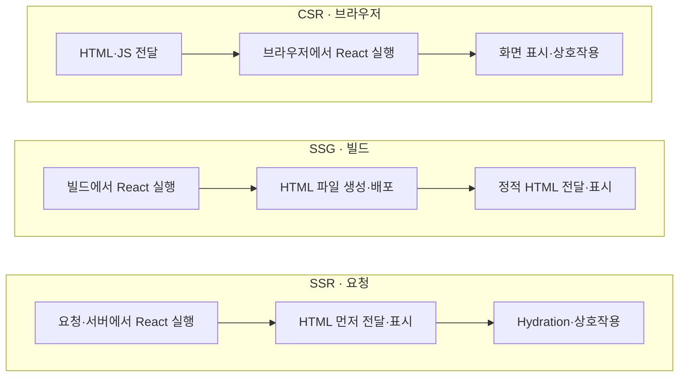
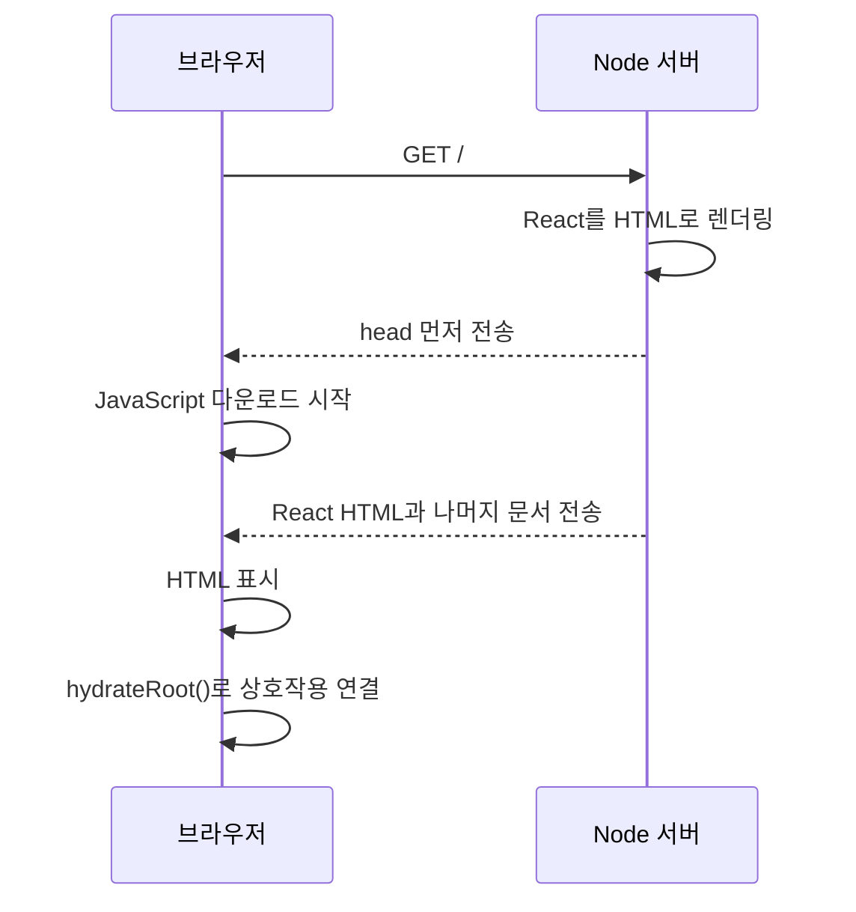

# 프레임워크 없이 살펴보는 React CSR, SSG와 SSR

React 애플리케이션을 만들다 보면 CSR, SSG, SSR, Hydration 같은 용어를 자주 만나게 돼요. Next.js나 Astro 같은 프레임워크를 사용하면 대부분의 과정이 자동으로 처리되지만, 추상화가 걷히면 React가 언제 실행되고 어떤 결과가 브라우저로 전달되는지 헷갈릴 때가 있었어요.

그래서 이번에는 프레임워크 없이 작은 SSG와 SSR을 직접 만들어봤어요. JSX도 잠시 내려놓고 `createElement`, `renderToStaticMarkup`, `renderToString`, `hydrateRoot`가 각각 어떤 일을 하는지 하나씩 확인했어요.

직접 구현해 보니 두 방식의 차이는 생각보다 단순했어요.

- SSG는 빌드할 때 React를 실행하고 결과를 HTML 파일로 저장해요.
- SSR은 요청이 들어올 때 React를 실행하고 결과를 HTML 응답으로 보내요.
- SSR로 전달한 화면에 상호작용을 붙이려면 브라우저에서 Hydration이 한 번 더 일어나요.

이 글에서는 이 흐름을 실제 코드와 함께 정리해볼게요.

## React 렌더링 모드 이해하기

여기서는 React가 화면을 만드는 여러 방식을 편의상 **렌더링 모드**(Rendering Mode)라고 부를게요. React의 공식 분류명이라기보다, 실행 시점과 장소를 구분하기 위한 표현에 가까워요.

중요한 점은 이 방식들이 완전히 배타적이지 않다는 거예요. 페이지 바깥 틀은 정적으로 만들고 내부 애플리케이션은 서버에서 렌더링할 수도 있고, 정적 페이지의 일부에만 클라이언트 React를 붙일 수도 있어요. 결국 애플리케이션 전체가 아니라 페이지와 기능의 특성에 맞게 선택하는 문제예요.

### CSR: 브라우저에서 화면 만들기

일반적인 React SPA는 CSR(Client-Side Rendering)로 동작해요. 서버는 보통 React 루트가 비어 있는 최소한의 `index.html`과 JavaScript 번들을 전달하고, 브라우저가 번들을 다운로드하고 실행한 뒤 화면을 만들어요.

구조가 단순하고 브라우저 API를 자유롭게 사용할 수 있다는 장점이 있어요. 반면 JavaScript 다운로드와 실행이 끝나기 전까지 의미 있는 화면이 늦게 보일 수 있어요. 번들이 크거나 사용자의 기기와 네트워크가 느릴수록 이 차이가 커져요.

### SSG: 빌드할 때 HTML 만들기

SSG(Static Site Generation)는 배포 전에 React 컴포넌트를 HTML 파일로 만들어두는 방식이에요. 요청이 들어올 때는 CDN이나 정적 서버가 해당 경로에 맞춰 미리 생성한 파일을 전달해요.

블로그, 문서, 마케팅 페이지처럼 콘텐츠가 자주 바뀌지 않는 페이지에 잘 맞아요. 요청마다 React를 실행할 서버가 필요하지 않고, GitHub Pages 같은 정적 호스팅에도 배포할 수 있어요.

### SSR: 요청할 때 HTML 만들기

SSR(Server-Side Rendering)은 사용자의 요청이 들어올 때 서버에서 React를 실행해 HTML을 만들어요. 브라우저는 완성된 마크업을 먼저 표시하고, JavaScript가 준비되면 그 화면에 이벤트와 상태를 연결해요.

세 방식의 차이는 React가 실행되는 위치와 HTML을 만드는 시점을 중심으로 보면 한눈에 들어와요.



서버 렌더링이 항상 더 빠른 것은 아니에요. 서버의 렌더링 시간이 추가되고, SSR에서는 서버와 브라우저 양쪽에서 React를 실행해야 해요. 빠른 기기와 네트워크에서는 CSR이 더 단순하고 충분히 빠를 수 있어요. 반대로 저사양 기기나 느린 네트워크를 사용하는 사람이 많다면 HTML을 먼저 보여주는 방식이 체감 성능에 큰 도움이 될 수 있어요.

따라서 처음부터 모든 페이지를 SSR로 만들기보다 실제 사용자의 환경과 페이지 성격을 보고 선택하는 편이 좋아요. 도입 전후의 성능도 함께 측정해야 하고요.

## SSG를 직접 만들어보기

먼저 React 컴포넌트를 정적 HTML 파일로 바꾸는 작은 빌드 스크립트를 만들어볼게요. 완성되는 과정은 다음과 같아요.

```text
App.js → renderToStaticMarkup() → HTML 문자열
index.html + HTML 문자열 → dist/index.html
```

### 프로젝트 준비하기

React와 React DOM만 설치한 Node.js 프로젝트를 만들었어요.

```bash
mkdir ssg
cd ssg
npm init -y
npm install react react-dom
```

`package.json`에는 ES Module 문법을 사용하기 위해 `"type": "module"`을 추가했어요.

```json
{
  "name": "ssg",
  "version": "1.0.0",
  "type": "module",
  "dependencies": {
    "react": "^19.2.8",
    "react-dom": "^19.2.8"
  }
}
```

이번 예제에서는 일부러 JSX를 사용하지 않았어요. JSX 변환을 생략하면 Babel, Vite, Webpack 없이 Node.js와 React만으로 SSG의 핵심 동작을 볼 수 있거든요.

### HTML 템플릿 만들기

React가 만든 결과를 넣을 `index.html`부터 준비했어요.

```html
<!doctype html>
<html lang="ko">
  <head>
    <meta charset="UTF-8" />
    <title>React SSG</title>
  </head>
  <body>
    <div id="root"><!--ROOT--></div>
  </body>
</html>
```

`<!--ROOT-->`는 특별한 문법이 아니라 일반 HTML 주석이에요. 빌드 스크립트가 React의 결과를 어디에 넣어야 하는지 찾기 위한 표식으로 사용했어요.

### `createElement`로 컴포넌트 만들기

`App.js`에서는 JSX 대신 `createElement`를 사용했어요.

```js
import { createElement as h } from "react";

function App() {
  return h(
    "div",
    null,
    h("h1", null, "Hello Matthew"),
    h("p", null, "This page was generated with SSG")
  );
}

export default App;
```

`createElement`를 `h`라는 짧은 이름으로 가져왔어요. 과거 Hyperscript 스타일에서 자주 사용하던 관례일 뿐, `h()`와 `createElement()`는 같은 함수예요.

기본 형태는 다음과 같아요.

```js
createElement(type, props, ...children);
```

- `type`에는 `"div"`, `"h1"` 같은 HTML 태그 이름이나 `App` 같은 React 컴포넌트가 들어가요.
- `props`에는 `{ className: "title" }`처럼 속성을 전달해요. 속성이 없으면 `null`을 사용해요.
- `children`에는 문자열, 숫자, 다른 React 엘리먼트, 배열 등을 필요한 만큼 전달할 수 있어요.

예를 들어 아래 코드는 `<h1>Hello Matthew</h1>`이라는 구조를 설명해요.

```js
h("h1", null, "Hello Matthew");
```

여기서 `createElement`가 실제 DOM이나 HTML 문자열을 즉시 만드는 것은 아니에요. React가 나중에 무엇을 렌더링해야 하는지 나타내는 **React 엘리먼트 객체**를 반환해요. 위의 `App`은 JSX로 쓰면 다음과 같은 구조예요.

```jsx
<div>
  <h1>Hello Matthew</h1>
  <p>This page was generated with SSG</p>
</div>
```

### 빌드 스크립트의 import 살펴보기

이제 `build.js`에서 React 엘리먼트를 HTML 문자열로 바꾸고 파일로 저장할게요. 먼저 사용한 모듈의 역할부터 한 줄씩 살펴봤어요.

```js
import { renderToStaticMarkup } from "react-dom/server";
```

`renderToStaticMarkup(reactNode)`은 React 노드를 정적인 HTML 문자열로 바꿔요. 결과를 클라이언트 React가 Hydration하도록 만들어진 API가 아니기 때문에, 블로그나 이메일처럼 상호작용이 필요 없는 HTML 생성에 잘 맞아요.

```js
import { createElement as h } from "react";
```

`App`이라는 함수 컴포넌트를 `h(App)` 형태의 React 엘리먼트로 만들기 위해 가져왔어요.

```js
import {
  existsSync,
  mkdirSync,
  readFileSync,
  readdirSync,
  unlinkSync,
  writeFileSync,
} from "node:fs";
```

`node:fs`는 Node.js의 파일 시스템 내장 모듈이에요. `node:` 접두사를 붙이면 외부 패키지가 아니라 Node.js 표준 라이브러리라는 사실이 분명해져요.

- `existsSync(path)`는 경로가 존재하는지 확인해요.
- `mkdirSync(path)`는 디렉터리를 만들어요.
- `readFileSync(path, encoding)`는 파일 전체를 읽어요. 인코딩을 지정하면 문자열을 반환해요.
- `readdirSync(path)`는 디렉터리 안의 항목 이름을 배열로 반환해요.
- `unlinkSync(path)`는 파일이나 심볼릭 링크를 삭제해요. 디렉터리를 지우는 API는 아니에요.
- `writeFileSync(path, data)`는 파일을 만들거나 기존 파일을 덮어써요.

모두 이름에 `Sync`가 붙은 동기 API예요. 각 단계가 끝난 다음 다음 단계로 넘어가므로 작은 빌드 스크립트를 이해하기 쉬워요. 반면 요청을 계속 처리하는 웹 서버에서 사용하면 이벤트 루프를 막을 수 있으므로, 그런 코드에서는 `node:fs/promises` 같은 비동기 API를 우선 고려하는 편이 좋아요.

```js
import path, { dirname } from "node:path";
```

`node:path`는 운영체제에 맞게 파일 경로를 다루는 내장 모듈이에요. `path.join()`은 여러 경로 조각을 운영체제에 맞는 구분자로 연결하고, `dirname()`은 파일 경로에서 디렉터리 부분만 가져와요. 다만 사용자 입력으로 인한 경로 탐색 공격까지 막아주는 보안 API는 아니에요.

```js
import { fileURLToPath } from "node:url";
```

ES Module의 `import.meta.url`은 `/Users/...` 같은 파일 경로가 아니라 `file:///Users/...` 형태의 URL이에요. `fileURLToPath()`는 이 값을 운영체제에서 사용할 수 있는 파일 경로로 바꿔줘요. URL 인코딩이나 Windows 경로까지 처리하므로 `new URL(...).pathname`을 직접 사용하는 것보다 안전해요.

```js
import App from "./App.js";
```

마지막으로 정적 HTML로 만들 `App` 컴포넌트를 가져와요. Node.js의 ES Module에서는 로컬 모듈을 가져올 때 `.js` 확장자를 명시하는 편이 안전해요.

### `build.js` 완성하기

전체 빌드 스크립트는 다음과 같아요.

```js
import { renderToStaticMarkup } from "react-dom/server";
import { createElement as h } from "react";
import {
  existsSync,
  mkdirSync,
  readFileSync,
  readdirSync,
  unlinkSync,
  writeFileSync,
} from "node:fs";
import path, { dirname } from "node:path";
import { fileURLToPath } from "node:url";
import App from "./App.js";

const __filename = fileURLToPath(import.meta.url);
const __dirname = dirname(__filename);
const distPath = path.join(__dirname, "dist");

const shell = readFileSync(
  path.join(__dirname, "index.html"),
  "utf8"
);

const app = renderToStaticMarkup(h(App));
const html = shell.replace("<!--ROOT-->", app);

if (!existsSync(distPath)) {
  mkdirSync(distPath);
} else {
  const files = readdirSync(distPath);

  for (const file of files) {
    unlinkSync(path.join(distPath, file));
  }
}

writeFileSync(path.join(distPath, "index.html"), html);
```

핵심 로직을 순서대로 보면 어렵지 않아요.

```js
const __filename = fileURLToPath(import.meta.url);
const __dirname = dirname(__filename);
```

CommonJS에는 `__filename`과 `__dirname`이 기본으로 있지만 ES Module에는 없어요. 현재 모듈의 URL을 파일 경로로 변환해 같은 값을 직접 만들었어요. Node.js 20.11.0과 21.2.0부터는 `import.meta.dirname`을 사용할 수 있고, Node.js 22.16.0과 24.0.0부터 실험 표시가 제거됐어요. 여기서 사용한 변환 패턴은 그보다 오래된 Node.js에서도 동작해요.

```js
const distPath = path.join(__dirname, "dist");
```

빌드 결과를 저장할 `dist` 디렉터리의 절대 경로를 만들어요. 스크립트를 어느 디렉터리에서 실행하더라도 파일 위치를 안정적으로 찾을 수 있어요.

```js
const shell = readFileSync(
  path.join(__dirname, "index.html"),
  "utf8"
);
```

HTML 템플릿을 문자열로 읽어요. 인코딩을 생략하면 `Buffer`가 반환되므로 `"utf8"`을 지정했어요.

```js
const app = renderToStaticMarkup(h(App));
```

`h(App)`이 `App` 컴포넌트를 React 엘리먼트로 만들고, `renderToStaticMarkup()`이 그 엘리먼트를 HTML 문자열로 바꿔요.

```js
const html = shell.replace("<!--ROOT-->", app);
```

템플릿의 표식을 React가 만든 문자열로 교체해 완성된 HTML을 만들어요. 표식이 없으면 조용히 원본 문자열이 반환되므로, 실제 빌드 도구라면 표식의 존재 여부를 검사하고 오류를 내는 편이 안전해요.

```js
if (!existsSync(distPath)) {
  mkdirSync(distPath);
} else {
  const files = readdirSync(distPath);

  for (const file of files) {
    unlinkSync(path.join(distPath, file));
  }
}
```

`dist`가 없으면 만들고, 이미 있으면 이전 결과 파일을 비워요. 이 코드는 `dist` 바로 아래의 **파일만** 처리해요. Vite처럼 하위 디렉터리를 만드는 빌드라면 `unlinkSync()`만으로는 부족하므로 `rmSync(distPath, { recursive: true, force: true })`처럼 디렉터리까지 고려해야 해요.

```js
writeFileSync(path.join(distPath, "index.html"), html);
```

마지막으로 완성된 문자열을 `dist/index.html`에 저장해요.

### 빌드 결과 확인하기

아래 명령을 실행하면 정적 HTML 파일이 생겨요.

```bash
node build.js
```

생성된 `dist/index.html`에는 React 런타임이 남지 않아요.

```html
<div id="root">
  <div>
    <h1>Hello Matthew</h1>
    <p>This page was generated with SSG</p>
  </div>
</div>
```

이 작은 스크립트가 SSG의 핵심이에요. 실제 프레임워크는 여기에 라우팅, 데이터 로딩, 여러 페이지 생성, 에셋 최적화, 캐시 무효화 같은 기능을 더해요. 예를 들어 경로와 컴포넌트, props의 조합을 목록으로 관리하고 반복해서 파일을 만들면 작은 정적 사이트 생성기의 출발점이 돼요.

다만 원리를 이해한 뒤에는 직접 만든 빌드 도구를 계속 확장하기보다 Astro나 Next.js 같은 검증된 도구를 사용하는 편이 대체로 효율적이에요. 직접 구현한 경험은 프레임워크가 어디에서 무엇을 대신하는지 이해하고, 문제가 생겼을 때 원인을 좁히는 데 도움이 됐어요.

## SSR이 필요한 이유

SSG가 빌드 시점의 렌더링이라면 SSR은 요청 시점의 렌더링이에요. 사용자별 데이터나 자주 바뀌는 내용을 요청마다 HTML에 반영해야 할 때 사용할 수 있어요.

CSR에서는 브라우저가 JavaScript를 실행하기 전까지 화면을 만들 수 없어요. SSR은 이 두 시점을 분리해요.

1. 서버가 만든 HTML을 먼저 보여줘요.
2. 브라우저가 JavaScript를 준비해 Hydration을 마치면 상호작용할 수 있어요.

즉, **화면이 보이는 시점**과 **화면을 조작할 수 있는 시점** 사이에 간격이 생겨요. 상호작용 가능 시점이 반드시 빨라지는 것은 아니지만, 사용자는 내용을 먼저 읽고 다음 행동을 생각할 수 있어서 더 빠르다고 느낄 수 있어요.



SSR의 비용도 분명해요.

- 요청마다 서버 CPU와 응답 시간이 들어가요.
- 같은 컴포넌트가 서버와 브라우저 양쪽에서 실행될 수 있어야 해요.
- 서버에는 `window`, `document`, `localStorage` 같은 브라우저 API가 없어요.
- 서버와 클라이언트의 첫 렌더링 결과가 다르면 Hydration 오류가 발생해요.
- 서버, 클라이언트 번들, 정적 파일 제공, 캐시와 모니터링까지 운영 범위가 넓어져요.

그래서 SSR은 무료 성능 최적화가 아니라 복잡성과 서버 비용을 지불하고 초기 화면을 앞당기는 선택에 가까워요. Lighthouse와 Chrome DevTools에서 FCP, LCP, INP 같은 사용자 중심 지표를 확인하고, 서버의 TTFB와 렌더링 시간도 함께 측정해야 전체 효과를 알 수 있어요.

## SSR을 직접 만들어보기

이번에는 Fastify가 요청을 받고, React가 HTML을 만든 다음, 브라우저가 그 화면을 Hydration하는 최소한의 SSR을 구성해볼게요.

### 프로젝트 준비하기

```bash
mkdir ssr
cd ssr
npm init -y
npm install react react-dom fastify @fastify/static vite
```

`package.json`에는 ES Module 설정과 빌드·실행 스크립트를 추가했어요.

```json
{
  "name": "ssr",
  "version": "1.0.0",
  "type": "module",
  "scripts": {
    "build": "vite build",
    "start": "node server.js"
  },
  "dependencies": {
    "@fastify/static": "^10.1.2",
    "fastify": "^5.10.0",
    "react": "^19.2.8",
    "react-dom": "^19.2.8",
    "vite": "^8.1.5"
  }
}
```

패키지의 메이저 버전이 바뀌면 API나 지원하는 Node.js 버전도 달라질 수 있어요. 예제와 다른 오류가 난다면 먼저 설치된 버전을 확인하는 편이 좋아요.

### 서버와 브라우저가 함께 사용하는 `App.js`

SSR에서는 `App`과 그 자식들이 서버의 첫 렌더링과 브라우저의 첫 렌더링에서 모두 실행돼요. 실제로 Hydration이 끝났는지 확인할 수 있도록 카운터를 넣었어요.

```js
import { createElement as h, useState } from "react";

function App() {
  const [count, setCount] = useState(0);

  return h(
    "div",
    null,
    h("h1", null, "Hello Matthew"),
    h("p", null, "This page was rendered with SSR"),
    h(
      "button",
      { onClick: () => setCount((value) => value + 1) },
      `Count: ${count}`
    )
  );
}

export default App;
```

서버는 버튼의 HTML까지 만들 수 있지만 클릭 이벤트를 HTML에 담아 보낼 수는 없어요. `onClick`이 실제로 동작하려면 브라우저에서 React가 같은 `App`을 실행하고 기존 DOM에 이벤트를 연결해야 해요.

상태를 이전 값으로 갱신할 때는 `setCount(count + 1)`도 동작하지만, 연속 업데이트에 안전하도록 함수형 업데이트인 `setCount((value) => value + 1)`을 사용했어요.

### HTML 템플릿과 클라이언트 진입점

`index.html`은 SSG의 템플릿과 비슷하지만 브라우저에서 실행할 `client.js`를 포함해요.

```html
<!doctype html>
<html lang="ko">
  <head>
    <meta charset="UTF-8" />
    <title>React SSR Example</title>
    <script type="module" src="/client.js"></script>
  </head>
  <body>
    <div id="root"><!--ROOT--></div>
  </body>
</html>
```

모듈 스크립트는 기본적으로 HTML 파싱을 막지 않고 지연 실행돼요. 그래서 `type="module"`에는 일반 스크립트의 `defer`와 비슷한 동작이 내장돼 있고, `defer`를 별도로 적어도 효과가 없어요.

원본 실습 코드에는 `<script async type="module" src="/Client.js"></script>`가 들어 있었어요. 하지만 `async` 모듈은 모듈 그래프의 다운로드가 끝나는 즉시 실행될 수 있고, HTML 파싱이 끝날 때까지 기다리지 않아요. 그러면 `<body>`의 `#root`가 만들어지기 전에 `hydrateRoot()`가 호출될 수 있어요. 이 진입점은 DOM이 준비된 뒤 실행되어야 하므로 `async`를 제거하고 모듈 스크립트의 기본 지연 실행을 사용하는 편이 안전해요.

또한 원본 파일명은 `Client.js`처럼 대문자로 시작하지만, 여기서는 일반적인 관례에 맞춰 `client.js`로 통일했어요. macOS의 기본 파일 시스템에서는 두 경로가 같은 것처럼 동작할 수 있지만, Linux처럼 대소문자를 구분하는 환경에서는 `src`와 실제 파일명의 대소문자가 정확히 일치해야 해요.

브라우저 전용 진입점인 `client.js`는 아주 짧아요.

```js
import { createElement as h } from "react";
import { hydrateRoot } from "react-dom/client";
import App from "./App.js";

hydrateRoot(document.getElementById("root"), h(App));
```

`hydrateRoot(container, reactNode)`는 서버가 만든 기존 HTML을 가능한 한 재사용하면서 React의 상태와 이벤트를 연결해요.

`createRoot()`와의 차이도 중요해요.

- `createRoot()`는 빈 컨테이너에 새로운 클라이언트 React 트리를 렌더링할 때 사용해요.
- `hydrateRoot()`는 서버가 이미 만든 HTML이 있을 때 그 DOM을 이어받기 위해 사용해요.

이 파일은 `server.js`가 import하지 않고 브라우저 번들의 진입점으로만 사용해요. 따라서 Google Analytics처럼 브라우저에서만 실행해야 하는 초기화 코드나 `window`를 사용하는 코드는 이 경계 안에 둘 수 있어요.

다만 이것은 **실행 환경의 경계**이지 **보안 경계**는 아니에요. 클라이언트 번들에 포함된 코드와 값은 사용자가 내려받아 볼 수 있으므로 비밀 키나 서버 전용 로직을 넣으면 안 돼요.

### 서버 진입점 만들기

`server.js`는 템플릿을 읽고, 정적 에셋을 제공하고, 요청마다 React를 HTML로 렌더링해 응답해요.

```js
import fastify from "fastify";
import fastifyStatic from "@fastify/static";
import { readFileSync } from "node:fs";
import path, { dirname } from "node:path";
import { fileURLToPath } from "node:url";
import { createElement as h } from "react";
import { renderToString } from "react-dom/server";
import App from "./App.js";

const __filename = fileURLToPath(import.meta.url);
const __dirname = dirname(__filename);

const shell = readFileSync(
  path.join(__dirname, "dist", "index.html"),
  "utf8"
);
const [beforeRoot, afterRoot] = shell.split("<!--ROOT-->");

const app = fastify();

app.register(fastifyStatic, {
  root: path.join(__dirname, "dist"),
  prefix: "/",
});

app.get("/", (_request, reply) => {
  reply.hijack();
  reply.raw.setHeader("Content-Type", "text/html; charset=utf-8");

  reply.raw.write(beforeRoot);
  reply.raw.write(renderToString(h(App)));
  reply.raw.end(afterRoot);
});

await app.listen({ port: 3000 });
```

Fastify 대신 Express, Koa, Node.js의 `http` 모듈을 사용해도 SSR의 원리는 같아요. 여기서는 라우팅과 정적 파일 제공을 간단하게 만들기 위해 Fastify를 사용했어요.

import를 제외한 핵심 코드를 나눠서 살펴볼게요.

```js
const shell = readFileSync(
  path.join(__dirname, "dist", "index.html"),
  "utf8"
);
```

원본이 아니라 Vite가 만든 `dist/index.html`을 읽어요. 빌드된 HTML에는 `/assets/index-해시.js`처럼 최적화되고 해시가 붙은 실제 클라이언트 번들 경로가 들어 있기 때문이에요.

```js
const [beforeRoot, afterRoot] = shell.split("<!--ROOT-->");
```

표식을 기준으로 문서를 두 조각으로 나눠요.

- `beforeRoot`에는 `<!doctype html>`부터 `root` 내부의 표식 직전까지 들어가요.
- `afterRoot`에는 표식 직후부터 닫는 태그까지 들어가요.

실무 코드라면 분할 결과가 정확히 두 조각인지 검사해야 해요. 표식이 없거나 두 번 이상 들어가면 잘못된 문서를 보낼 수 있거든요.

```js
app.register(fastifyStatic, {
  root: path.join(__dirname, "dist"),
  prefix: "/",
});
```

Vite가 만든 JavaScript와 그 밖의 정적 에셋을 `dist`에서 제공해요. HTML만 서버가 만들어도 Hydration에 필요한 클라이언트 번들은 별도로 내려받아야 해요.

```js
app.get("/", (_request, reply) => {
  reply.hijack();
  reply.raw.setHeader("Content-Type", "text/html; charset=utf-8");

  reply.raw.write(beforeRoot);
  reply.raw.write(renderToString(h(App)));
  reply.raw.end(afterRoot);
});
```

`reply.raw`는 Node.js의 원시 응답 객체예요. Fastify의 일반 응답 생명주기를 건너뛰고 직접 응답을 끝낼 것이므로 `reply.hijack()`으로 제어권을 가져왔어요.

응답이 서버에서 만들어지고 브라우저로 전달되는 순서를 그림으로 보면 다음과 같아요.


첫 조각이 실제로 네트워크까지 전달되면 브라우저는 서버가 React를 렌더링하는 동안 `<head>`를 파싱하고 에셋 다운로드를 시작할 수 있어요. 다만 압축 미들웨어, 리버스 프록시, CDN이 작은 청크를 버퍼링하면 브라우저가 즉시 받지 못할 수도 있어요. 작은 예제에서는 차이가 거의 없지만 애플리케이션과 네트워크가 커질수록 일을 겹쳐 진행하는 의미가 생겨요.

다만 `renderToString()` 자체는 전체 React 트리의 렌더링이 끝난 뒤 문자열 하나를 반환해요. React 결과까지 점진적으로 보내는 진짜 스트리밍 SSR은 아니에요. 이 차이는 뒤에서 다시 살펴볼게요.

### `renderToStaticMarkup`과 `renderToString`

SSG에서는 `renderToStaticMarkup()`을 사용했고, SSR에서는 `renderToString()`을 사용했어요.

| API | 주된 용도 | Hydration |
| --- | --- | --- |
| `renderToStaticMarkup()` | 상호작용이 필요 없는 정적 HTML 생성 | 지원하지 않아요 |
| `renderToString()` | 서버에서 HTML을 문자열로 만든 뒤 클라이언트가 이어받는 SSR | `hydrateRoot()`로 이어받을 수 있어요 |
| `renderToPipeableStream()` | Node.js 환경의 스트리밍 SSR | Suspense와 스트리밍을 지원해요 |

`renderToString()`으로 만든 HTML을 Hydration하지 않아도 화면은 보여요. 다만 클라이언트 상호작용이 생기지 않고, 정적 결과만 필요했다면 `renderToStaticMarkup()`이 의도를 더 분명하게 나타내요.

현재 React의 Node.js SSR에서는 가능하면 `renderToPipeableStream()` 사용이 권장돼요. 다만 지금처럼 즉시 끝나는 작은 트리는 결과가 사실상 한 덩어리라 스트리밍의 장점이 거의 없어요. 원리를 확인하는 예제에서는 `renderToString()`이 훨씬 간결해서 선택했어요.

### 빌드하고 실행하기

먼저 Vite가 클라이언트 코드를 번들링하고 `dist/index.html`을 만들도록 빌드해요.

```bash
npm run build
npm run start
```

이제 `http://localhost:3000`을 열면 서버가 만든 화면이 보이고, Hydration이 끝난 뒤 버튼도 동작해요. 브라우저의 **페이지 소스 보기**에서 `Hello Matthew`가 포함된 완성된 마크업을 확인할 수 있다면 서버 렌더링도 제대로 된 거예요.

이 예제에는 개발 서버나 watch 모드가 없어요. `App.js`나 `client.js`를 바꾸면 다시 빌드해야 하고, `server.js`나 서버가 메모리에 읽어둔 템플릿이 바뀌면 서버도 다시 시작해야 해요. 실제 프로젝트에서는 프레임워크와 개발 도구가 이 과정을 자동화해줘요.

## 직접 구현하며 만난 함정

SSR의 핵심 코드 자체는 짧았지만, 서버와 브라우저가 같은 화면을 함께 책임지기 시작하면서 지켜야 할 조건이 늘어났어요.

### Hydration은 무엇을 하는가

Hydration을 “정적 HTML에 이벤트 리스너를 붙이는 과정”이라고 설명하는 경우가 많아요. 큰 방향에서는 맞지만 실제로는 조금 더 많은 일을 해요.

브라우저의 React는 서버가 만든 DOM을 기준으로 컴포넌트 트리를 다시 계산하고, 기존 노드와 대응시키며, 상태와 이벤트 시스템을 연결해요. 이 과정이 성공하려면 서버의 HTML과 클라이언트의 첫 렌더링 결과가 같아야 해요.

```text
서버: renderToString(<App />) → HTML
클라이언트: 첫 번째 <App /> 렌더링 → 같은 트리여야 함
```

React가 단순히 HTML 문자열의 해시만 비교하는 것은 아니에요. 기존 DOM과 클라이언트가 기대하는 트리를 Hydration하면서 불일치를 감지해요. 차이가 생기면 경고를 출력하고, 해당 부분을 클라이언트에서 다시 만들 수 있어요. 그러면 서버 렌더링으로 얻으려던 이점 일부를 잃고 예상하지 못한 화면 변화도 생길 수 있어요.

### 표식 주변의 공백도 DOM 노드가 돼요

템플릿은 아래처럼 표식을 `root`에 붙여 작성했어요.

```html
<div id="root"><!--ROOT--></div>
```

이를 보기 좋게 만들겠다며 다음처럼 줄을 바꾸면 문제가 생길 수 있어요.

```html
<div id="root">
  <!--ROOT-->
</div>
```

서버가 표식만 React HTML로 교체하면 줄바꿈과 들여쓰기가 `root` 안에 그대로 남아요.

```html
<div id="root">
  <div>...</div>
</div>
```

HTML에서 이 공백은 상황에 따라 텍스트 노드가 돼요. 서버 DOM과 클라이언트가 기대하는 첫 트리를 나란히 놓으면 차이가 더 선명하게 보여요.


왼쪽 서버 DOM의 첫 번째 자식은 줄바꿈과 들여쓰기로 생긴 공백 텍스트 노드예요. 반면 클라이언트의 `h(App)`은 `root` 바로 아래에 `App`의 `<div>` 하나만 있을 것으로 기대하므로 Hydration 불일치가 발생할 수 있어요.

공백 자체가 언제나 문제인 것은 아니에요. Hydration 대상인 `root` 내부에서 **서버와 클라이언트의 첫 결과를 다르게 만드는 공백**이 문제예요. 다른 JavaScript 파일의 들여쓰기나 `root` 바깥의 공백은 이 비교와 관계없어요.

Prettier 같은 포매터가 표식 주변을 자동으로 줄바꿈할 수도 있어요. 템플릿을 직접 조립한다면 해당 줄이 변경되지 않도록 설정하거나, 문자열 치환 대신 HTML을 안전하게 조립하는 전용 로직을 두는 편이 좋아요. 프레임워크를 사용하면 보통 이 민감한 경계를 내부에서 관리해줘요.

### 더 흔한 Hydration 불일치 원인

공백 외에도 서버와 클라이언트의 첫 결과를 다르게 만드는 코드는 모두 원인이 될 수 있어요.

- 렌더링 중 `Date.now()`, `Math.random()`처럼 실행할 때마다 달라지는 값을 사용한 경우
- 서버와 브라우저의 시간대나 로케일이 다른 경우
- 렌더링 중 `window.innerWidth` 같은 브라우저 API로 분기한 경우
- 서버가 사용한 초기 데이터와 클라이언트의 초기 데이터가 다른 경우
- 잘못 중첩된 HTML을 브라우저가 자동으로 교정한 경우
- 브라우저 확장 프로그램이 React 실행 전에 DOM을 바꾼 경우

해결 원칙은 서버와 클라이언트의 **첫 렌더링을 결정론적으로 만드는 것**이에요. 브라우저에서만 알 수 있는 값은 `useEffect` 이후에 읽고, 서버에서 사용한 데이터는 클라이언트에도 같은 초기값으로 전달해야 해요.

예를 들어 카운터의 시작값을 `5`로 바꾸고 싶다면 서버와 클라이언트가 공유하는 `App`의 초기값을 함께 바꿔야 해요.

```js
const [count, setCount] = useState(5);
```

서버에서는 `0`, 클라이언트에서는 `5`를 사용하도록 나누면 첫 버튼 텍스트가 달라져 Hydration 불일치가 발생해요.

### 브라우저 API는 경계 밖에서 사용하기

`App`은 서버에서도 실행되므로 렌더링 경로에서 아래 코드를 바로 사용하면 서버가 실패해요.

```js
const theme = localStorage.getItem("theme");
```

브라우저에서만 필요한 작업은 `client.js`에서 초기화하거나 컴포넌트의 `useEffect` 안에서 실행해야 해요.

```js
useEffect(() => {
  const theme = localStorage.getItem("theme");
  // 브라우저에서만 필요한 처리
}, []);
```

다만 `useEffect` 이후 화면을 바꾸면 초기 화면과 Hydration 이후 화면이 달라질 수 있어요. 테마처럼 첫 화면부터 정확해야 하는 값은 쿠키를 서버에서 읽어 초기 HTML에 반영하는 등 별도의 전략이 필요해요.

### 표식을 어디에서 나눌까

이 예제에서는 React 애플리케이션이 들어갈 위치 바로 앞에서 문서를 나눴어요.

```text
[doctype + head + root 시작] → [React HTML] → [root 종료 + 문서 나머지]
```

첫 조각에 `<head>`가 포함되어 있어야 브라우저가 CSS, 폰트, JavaScript 같은 리소스를 빨리 발견할 수 있어요. React를 모두 렌더링한 다음 완성된 문자열 하나를 보내면 구현은 더 단순하지만, 그동안 브라우저는 아무 작업도 시작하지 못해요.

페이지에 독립적인 React 영역이 여러 개 있는 아일랜드나 마이크로 프런트엔드 구조라면 표식도 여러 개일 수 있어요. 각 영역 직전까지 문서를 보내고 렌더링 결과를 채우는 방식으로 확장할 수 있지만, 순서와 오류 처리, Hydration 진입점 관리가 빠르게 복잡해져요.

### `renderToPipeableStream`은 언제 필요한가

`renderToString()`은 전체 트리가 끝날 때까지 기다렸다가 문자열 하나를 반환해요. 반면 `renderToPipeableStream()`은 준비된 HTML을 여러 청크로 나눠 Node.js 응답 스트림에 보낼 수 있어요.

Suspense를 사용하는 큰 애플리케이션에서는 빠르게 준비되는 셸을 먼저 보내고, 데이터가 필요한 영역을 나중에 보낼 수 있어요.

```text
레이아웃과 내비게이션 → 먼저 전송
빠른 콘텐츠 → 준비되는 대로 전송
느린 데이터 영역 → Suspense fallback 뒤에 전송
```

하지만 스트리밍을 도입하면 오류 처리, 응답 상태 코드, 봇 처리, 중단과 타임아웃 같은 고려사항도 늘어나요. 지금 만든 카운터처럼 모든 렌더링이 즉시 끝나는 페이지에서는 얻는 이점보다 코드 복잡성이 더 커요.

## CSR·SSG·SSR 중 무엇을 선택할까

직접 만들어본 뒤에는 “어떤 방식이 가장 좋은가”보다 “언제 실행해야 하는가”가 더 중요한 질문이라는 생각이 들었어요.

| 상황 | 먼저 고려할 방식 | 이유 |
| --- | --- | --- |
| 로그인 후 사용하는 대시보드나 내부 도구 | CSR | SEO와 초기 정적 콘텐츠보다 상호작용이 중심이에요 |
| 블로그, 문서, 마케팅 페이지 | SSG | 콘텐츠를 빌드 때 만들고 CDN에서 빠르게 제공할 수 있어요 |
| 요청마다 달라지는 공개 페이지 | SSR | 최신·개인화된 HTML을 요청 시점에 만들 수 있어요 |
| 정적 콘텐츠에 일부 상호작용만 필요 | SSG + 클라이언트 아일랜드 | 전체 Hydration 비용을 줄일 수 있어요 |
| 복잡한 공개 애플리케이션 | SSR + Hydration 또는 스트리밍 | 초기 콘텐츠와 상호작용을 모두 제공할 수 있어요 |

선택할 때는 다음 질문을 함께 봐야 해요.

1. 콘텐츠는 빌드할 때 알 수 있나요, 요청이 와야 알 수 있나요?
2. 검색 엔진과 링크 미리보기에 완성된 HTML이 중요한가요?
3. 사용자의 기기와 네트워크 환경은 어떤가요?
4. 첫 화면과 상호작용 중 무엇이 더 중요한가요?
5. 서버 렌더링과 캐시를 운영할 복잡성을 감당할 수 있나요?
6. 실제 측정에서 FCP, LCP, INP, TTFB가 개선됐나요?

SSR이나 서버 컴포넌트가 새롭다는 이유만으로 모든 프로젝트에 도입할 필요는 없어요. CSR로 충분한 애플리케이션은 여전히 많고, 정적 콘텐츠라면 SSG가 더 단순하고 저렴할 수 있어요.

이번 구현에서 가장 크게 느낀 점은 프레임워크가 마법을 부리는 것이 아니라는 거예요. 결국 컴포넌트를 실행해 HTML을 만들고, 적절한 시점에 파일이나 응답으로 내보내고, 필요하면 브라우저가 그 화면을 이어받는 과정이었어요.

물론 실제 서비스에서는 이 경계에 라우팅, 데이터 로딩, 캐시, 코드 분할, 오류 복구, 보안이 더해져요. 그래서 원리를 이해한 다음에는 Next.js나 Astro 같은 프레임워크에 맡기는 편이 좋아요. 내부 흐름을 알고 사용하면 문제가 생겼을 때 어느 단계부터 확인해야 하는지도 훨씬 선명해져요.

### 참고 자료

- [React: createElement](https://react.dev/reference/react/createElement)
- [React: renderToStaticMarkup](https://react.dev/reference/react-dom/server/renderToStaticMarkup)
- [React: renderToString](https://react.dev/reference/react-dom/server/renderToString)
- [React: renderToPipeableStream](https://react.dev/reference/react-dom/server/renderToPipeableStream)
- [React: hydrateRoot](https://react.dev/reference/react-dom/client/hydrateRoot)
- [Node.js: File system](https://nodejs.org/api/fs.html)
- [Node.js: ECMAScript modules](https://nodejs.org/api/esm.html)
- [Node.js: URL](https://nodejs.org/api/url.html)
- [Fastify: Reply](https://fastify.dev/docs/latest/Reference/Reply/)
- [Fastify: Static plugin](https://github.com/fastify/fastify-static)
- [Vite: Building for production](https://vite.dev/guide/build)
- [MDN: `<script>` element](https://developer.mozilla.org/en-US/docs/Web/HTML/Reference/Elements/script)
- [Intermediate React: Server-Side Rendering](https://intermediate-react-v6.holt.courses/lessons/react-render-modes/server-side-rendering)
