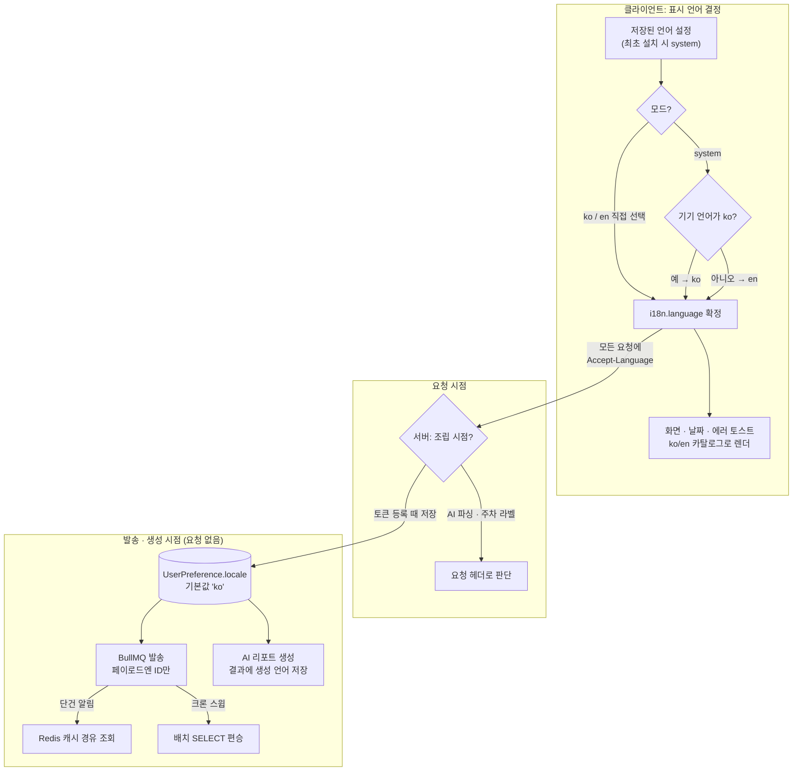
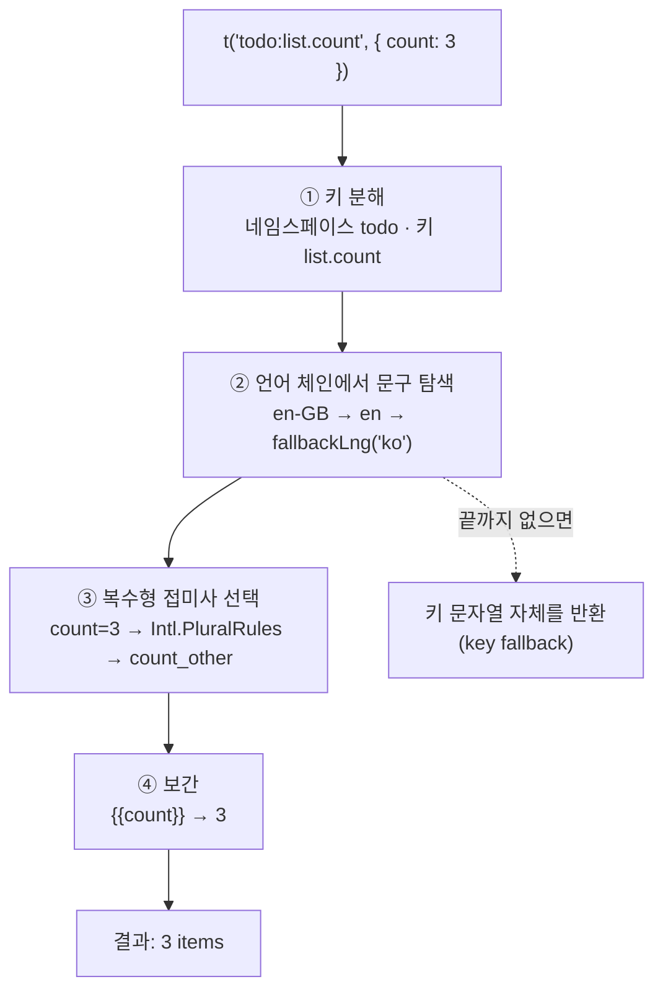
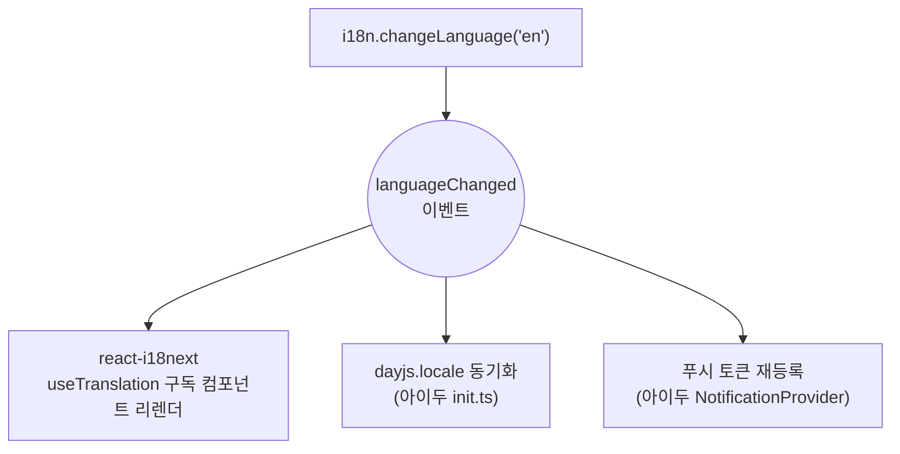

아이두는 처음부터 모든 앱 스토어에 전 세계로 출시했지만, 언어는 한국어로만 제공하고 있었다. 어차피 한국 유저가 대부분일 거라고 생각했다.

어느 날 데이터베이스에서 어떤 유저들이 쓰고 있나 살펴보다가, 생각보다 외국인 가입자가 많다는 걸 알게 됐다. 한국어만 나오는 앱에 가입까지 했다는 건 뭔가 기대를 하고 들어왔다는 뜻이다. 그 기대에 응답해보기로 했다. 대부분의 한국 서비스가 결국 외국인 유저를 고려하게 되니 미리 경험을 쌓아둘 겸, [HTTP를 공부하며 배웠던](/post/http-content-negotiation) `Accept-Language`를 프로덕션에 써볼 기회이기도 했다.

시작할 때는 번역이 이 작업의 전부라고 생각했다. 그리고 번역쯤은 AI가 알아서 잘 해줄 거라 믿었다. 막상 해보니 그렇게 단순하지 않았다. 한국어에는 없는 단수/복수 구분, 이름 뒤에 붙는 조사, 직역하면 뜻이 통하지 않는 표현까지. 한국어만의, 또 영어만의 언어적·문화적 맥락을 하나하나 고려해야 했다.

그런데 코드를 열어보니 그보다 앞선 문제가 있었다. 사용자에게 보이는 한국어가 341개 파일에 흩어져 있었고, 목록을 만들수록 이상한 것들이 나왔다. 서버가 새벽에 보내는 푸시 알림 문구, AI가 생성하는 주간 리포트 본문, 로그인 실패 시 서버가 내려주는 에러 메시지, `7월 2주차` 같은 캘린더 라벨. 이것들은 번역 파일을 만든다고 해결되지 않는다. 애초에 클라이언트가 조립하는 텍스트가 아니기 때문이다.

결국 이 작업의 진짜 질문은 "이 텍스트의 언어를 누가, 언제, 무엇을 보고 결정하는가"였다. 그 과정에서 내린 결정들과 각 결정의 트레이드오프를 순서대로 정리한다.

---

### 아이두 - 친구와 함께 하는 AI 투두 서비스 (막간 홍보)

본격적인 글에 앞서, `아이두(Aido)`가 궁금하다면 **iPhone, Android, Mac, Tablet 등 다양한 기기에서 호환 가능**하니 한 번 써보시면 좋을 것 같습니다. 

친구들과 함께 할 일을 관리하며 서로 자극을 주고받을 수 있는 AI 할일 관리 서비스인데 혹여나 주변에 같이 쓸 친구가 없다면 초대 코드 `WNTQJEEE`로 들어와서 함께 자극을 나누며 성장하면 좋을 것 같습니다!


[App Store](https://apps.apple.com/kr/app/%EC%95%84%EC%9D%B4%EB%91%90-ai-%ED%88%AC%EB%91%90-%ED%94%8C%EB%9E%98%EB%84%88/id6757722325) | [Google Play](https://play.google.com/store/apps/details?id=com.aido.mobile&pcampaignid=web_share&pli=1) | [아이두(Aido) 공식 웹사이트](https://www.aido.kr/) | [공식 인스타그램](https://www.instagram.com/aiddoo_official/)

---

## 기존 유저에게는 아무 일도 없어야 한다

설계에 들어가기 전에, 가장 중요한 제약부터 정했다. 이미 배포된 구버전(1.3.x)을 쓰는 유저에게는 이 변경이 절대 영향을 끼쳐서는 안 된다.

물론 강제 업데이트 게이트를 여는 방법도 있다. 서버가 최소 버전을 내려주고, 구버전이면 업데이트 화면으로 막아버리는 방식이다.

하지만 지금 필요한 건 그 정도가 아니다. 카카오톡이 강제 업데이트로 여론의 뭇매를 맞았던 일을 떠올려보자. 비즈니스적으로 어쩔 수 없는 선택이었다는 건 이해하지만, 유저 입장에서 유쾌한 경험이 아닌 것도 사실이다.

아이두는 회사에서 어떤 기술을 도입하기 전에 미리 테스트해보고 싶거나, 그냥 해보고 싶은 게 생기면 마음껏 해보려고 만든 학습 겸 취미 프로젝트다. 비즈니스적 압박이 없는 프로젝트에서 그런 트레이드오프까지 감수할 이유가 없었다. 새 기능 하나 넣자고 잘 쓰고 있는 유저의 앱을 멈춰 세울 수는 없었다.

이 제약은 문장 하나로 요약된다. **다국어는 새 기능이지만, 기존 유저 입장에서는 아무 일도 일어나지 않은 업데이트여야 한다.**

그래서 이 글에 나오는 모든 분기에는 공통점이 있다. 서버의 언어 분기 기본값은 전부 `ko`이고, DB 마이그레이션은 컬럼 추가(additive)뿐이며, 구버전이 받는 API 응답과 푸시 문구는 한 글자도 바뀌지 않는다. 뒤에서 이 제약이 실제 설계를 어떻게 바꿨는지 몇 번 더 등장한다.

---

## 텍스트가 조립되는 곳이 언어를 안다

국제화를 시작하면 질문이 끝없이 쏟아진다. 폼 에러는 어디서 번역하지? 푸시 알림은? 서버 에러 메시지는? AI 리포트는? 하나씩 개별적으로 답하다 보면 코드 곳곳에 제각각의 번역 로직이 생기기 시작한다.

그래서 질문을 하나로 바꿨다. 이 텍스트는 어디서 조립되는가? 텍스트가 만들어지는 지점이 언어를 알면 되고, 그 지점은 세 종류뿐이었다.

화면 텍스트는 클라이언트가 조립한다. 그러니 클라이언트가 언어를 결정한다.

API 응답에 담기는 텍스트는 요청을 처리하는 서버가 조립한다. 그러니 요청에 실려 온 [`Accept-Language`](https://developer.mozilla.org/ko/docs/Web/HTTP/Headers/Accept-Language) 헤더로 결정한다.

그런데 푸시 알림과 AI 리포트는 요청이 없는 시점에 조립된다. 새벽 크론이 돌 때 읽을 헤더 같은 건 없으니, 서버에 저장해둔 사용자 locale로 결정한다.



각 갈래를 하나씩 살펴보자.

---

## 문자열을 어디에 둘 것인가

가장 먼저 부딪힌 결정이다. 번역 문구를 타입스크립트 객체로 코드 안에 함께 둘 수도 있고, 언어별 JSON 파일로 분리할 수도 있다.

```ts
// 번역 문구를 코드 안에 객체로 두는 방식
export const MESSAGES = {
  ko: { deleteConfirm: '할 일을 삭제할까요?' },
  en: { deleteConfirm: 'Delete this to-do?' },
};
```

코드 안에 객체로 두는 방식은 시작이 빠르다. 타입을 잘 걸면 언어 간 키 누락도 컴파일에서 잡을 수 있다.

그런데도 JSON으로 분리한 이유는 두 가지다. 타입은 `{{count}}` 같은 보간 변수가 한쪽 언어에만 있는 것까지는 잡아주지 못하고, 무엇보다 카피가 코드와 한 몸이 되면 문구 하나 고친 diff가 코드 변경에 묻혀서 번역 검수라는 행위 자체가 성립하지 않는다. 문구는 문구끼리 모여 있어야 기계로 대조하고 사람이 리뷰할 수 있다.

구조는 `i18next` 기준으로 이렇게 잡았다. 기능(feature) 단위로 네임스페이스를 나누고, 한국어 카탈로그를 원문(source of truth)으로 삼았다.

```
src/shared/i18n/locales/
├── ko/   todo.json · auth.json · errors.json · common.json ... (16개)
└── en/   ko와 키 구조 100% 동일 (테스트로 강제)
```

> `카탈로그(catalog)`는 번역 문구를 키-값 쌍으로 모아둔 언어별 리소스 파일을 부르는 국제화 용어다. gettext 시절의 `.po` 파일부터 지금의 JSON까지 형식은 달라도, "문구를 코드 밖에 모아둔 사전"이라는 개념은 같다.

### 한국어 원문이 그대로 타입이 된다

`i18next`는 카탈로그를 타입 소스로 선언할 수 있다. 선언 파일 하나로 모든 `t()` 호출의 키가 타입 검사를 받는다.

```ts
// i18next.d.ts
import type { resources } from './resources';

declare module 'i18next' {
  interface CustomTypeOptions {
    defaultNS: 'common';
    resources: (typeof resources)['ko']; // 한국어 원문이 타입의 소스
    returnNull: false;
  }
}
```

```tsx
t('todo:detail.deleteConfirm'); // OK
t('todo:detail.deleteConfrim'); // 오타: 컴파일 에러
```

수백 개 키를 옮기는 작업에서 이게 없었다면, 어딘가의 화면에는 분명 키 이름이 그대로 노출됐을 것이다.

### 번역 누락은 CI가 잡는다

번역 파일에서 제일 무서운 건 en에만 키가 빠져 있는 조용한 누락이다. 런타임 폴백(`fallbackLng: 'ko'`)이 있으니 앱이 죽지는 않지만, 영어 유저 화면에 한국어 문장이 섞여 나온다. 폴백은 안전망이지 정상 상태가 아니다. 그래서 카탈로그가 JSON이라는 점을 이용해, 두 파일을 기계적으로 대조하는 테스트를 CI에 넣었다.

```ts
// locale-parity.test.ts: 발췌
describe.each(namespaces)('%s 네임스페이스', (namespace) => {
  it('ko와 en의 키 집합이 동일하다', () => {
    expect([...enKeys.keys()].sort()).toEqual([...koKeys.keys()].sort());
  });

  it('모든 키의 보간 변수 집합이 ko/en에서 동일하다', () => {
    // "{{count}}개" ↔ "{{count}} items": 변수 누락도 CI에서 실패
  });
});
```

한국어에는 복수형이 없지만 영어에는 필요하다. 이 비대칭도 카탈로그 포맷이라 자연스럽게 담긴다. `i18next`는 CLDR 복수형 규칙을 따르는 `_one`/`_other` 접미사를 지원하고, parity 테스트는 이 접미사를 base 키로 정규화해서 비교한다.

> `CLDR(Common Locale Data Repository)`은 유니코드 컨소시엄이 관리하는 로케일 데이터 저장소다. 언어별 날짜·숫자 표기 방식부터 "이 언어는 수량에 따라 단어 형태가 몇 가지로 변하는가"까지 정의하고 있고, 브라우저의 `Intl` API가 반환하는 `one`/`other` 같은 복수형 카테고리 이름이 바로 이 데이터에서 온다.

```json
// ko/todo.json
{ "list": { "count": "{{count}}개" } }

// en/todo.json
{ "list": { "count_one": "{{count}} item", "count_other": "{{count}} items" } }
```

부수 효과도 하나 있었다. 카탈로그를 코드와 분리하니 PR에서 `ko/*.json`의 diff는 어떤 원문이 어디로 갔는지를, `en/*.json`의 diff는 무엇이 어떻게 번역됐는지를 그대로 보여줬다. 번역 검수가 코드 리뷰 안에서 끝난다.

### 키는 이렇게 짓는다

카탈로그가 수백 개 키 규모가 되면 키 이름 자체가 하나의 API가 된다. 규칙 없이 짓기 시작하면 `deleteConfirm`, `confirmDelete`, `delete_check`가 공존하는 카탈로그가 되고, 필요한 키를 찾는 것보다 새로 만드는 게 빨라지는 순간 중복이 쌓인다. 그래서 규칙을 하나로 고정했다.

```
네임스페이스:영역.요소   (camelCase, 최대 3단계)

todo:detail.deleteConfirm   → todo 기능 · 상세 화면 · 삭제 확인 문구
auth:signUp.nameTitle       → auth 기능 · 회원가입 · 이름 입력 타이틀
common:actions.cancel       → 공용 · 액션 버튼 · 취소
errors:TODO_0801            → 에러는 예외적으로 코드가 곧 키
```

네임스페이스는 기능(feature) 디렉터리와 일대일로 맞췄다. `todo`, `auth`, `friend`처럼 코드 구조를 그대로 따라가니 "이 키가 어느 파일에 있지?"라는 질문이 사라진다. 여기에 어느 기능에도 속하지 않는 횡단 네임스페이스를 몇 개 뒀다. 확인/취소 같은 공용 버튼은 `common`, 에러 코드는 `errors`, 폼 검증은 `validation`이다.

원문을 키로 쓰는 방식(`t('할 일을 삭제할까요?')`)은 배제했다. 시작은 편하지만 원문에서 오타 하나만 고쳐도 키가 바뀌어 모든 언어의 카탈로그가 같이 깨지고, 타입 자동완성과도 궁합이 나쁘다. 키와 원문을 분리해야 원문은 카피라이팅의 영역으로, 키는 코드의 영역으로 각자 진화할 수 있다.

패턴별로 보면 이렇다.

```tsx
// 1. 화면 텍스트: 컴포넌트에서는 useTranslation (언어 변경 시 리렌더)
const { t } = useTranslation('todo');
<Text>{t('detail.deleteConfirm')}</Text>

// 2. 토스트/에러 팩토리: 비컴포넌트에서는 싱글턴 t (호출 시점 평가)
toast.success(t('friend:toast.requestSent'));

// 3. 개수 보간: ko는 단일 키, en은 복수형 접미사
t('list.count', { count: 3 }); // ko "3개" / en "3 items"

// 4. enum 라벨: 값 대신 키를 담는 맵 (누락되면 컴파일 에러)
const CATEGORY_LABEL_KEYS = {
  BUG_REPORT: 'inquiry:category.bugReport',
  FEATURE_REQUEST: 'inquiry:category.featureRequest',
} as const satisfies Record<InquiryCategory, string>;
```

4번이 특히 유용했다. 서버 enum을 화면 라벨로 바꾸는 맵은 어느 앱에나 있는데, 값에 문자열 대신 카탈로그 키를 담고 `satisfies`로 잠그면 enum에 항목이 추가됐는데 라벨을 깜빡한 경우를 타입 체커가 잡아준다.

이 규칙들이 실제로 어떻게 굴러가는지, 새 기능이 추가되는 상황으로 따라가 보자. 예를 들어 할 일을 친구에게 공유하는 기능을 만든다고 하자. 화면에 제목과 버튼, 성공 토스트가 필요하다.

먼저 두 카탈로그에 키를 추가한다. 기능이 `todo` 소속이니 네임스페이스도 `todo`다.

```json
// ko/todo.json: 원문을 먼저 쓴다
{ "share": { "title": "할 일 공유", "action": "공유하기", "sent": "{{name}}에게 공유했어요" } }

// en/todo.json: 같은 키, 같은 보간 변수
{ "share": { "title": "Share To-do", "action": "Share", "sent": "Shared with {{name}}" } }
```

그리고 화면과 뮤테이션에서 키를 참조한다.

```tsx
// 화면 컴포넌트
const { t } = useTranslation('todo');
<H3>{t('share.title')}</H3>
<Button>{t('share.action')}</Button>

// 성공 토스트 (비컴포넌트)
toast.success(t('todo:share.sent', { name: friend.name }));
```

이게 전부다. en에 키를 빼먹으면 parity 테스트가 CI에서 실패하고, 키에 오타를 내면 컴파일이 실패하고, `{{name}}` 변수를 한쪽에만 쓰면 그것도 CI가 잡는다. 규칙을 외울 필요 없이 어기면 빌드가 알려주는 상태를 만드는 것이 카탈로그 설계의 목표였다.

참고로 번역 자체보다 번역이 깨뜨리는 레이아웃이 더 골치였다. 영어는 같은 의미라도 한국어보다 문장이 길어지는 경우가 많아서, 고정 폭 버튼과 한 줄 제한이 걸린 라벨이 곳곳에서 터졌다. 영어 번역문은 원문 대비 대략 1.4배 길이를 상한으로 잡고, 넘치면 번역을 줄이는 쪽을 택했다. UI를 늘리는 것보다 카피를 다듬는 게 대부분 더 싸다.

---

## i18next는 어떻게 동작하는가

설정에서 [English]를 누르는 순간, 수백 개 화면의 문장이 한 번에 바뀐다. 처음 보면 마법 같지만, 내부를 열어보면 메커니즘은 딱 두 개다. **문장을 찾아 완성하는 파이프라인**과, **변경을 알리는 이벤트**. 이 두 개만 이해하면 이 글의 모든 설계 결정이 왜 그렇게 됐는지 보인다.

공식 문서를 따라가며 정리한다. 기준은 2026년 7월의 i18next v26과 react-i18next v16, 아이두에 설치된 버전 그대로다.

### t() 한 줄이 문장이 되기까지

`t('todo:list.count', { count: 3 })`를 호출하면 무슨 일이 일어날까. i18next는 네 단계를 거친다.



①과 ④는 직관적이니, 설계에 영향을 준 ②와 ③을 자세히 보자.

②의 언어 탐색은 한 번에 끝나지 않는다. [공식 폴백 규칙](https://www.i18next.com/principles/fallback)에 따라 현재 언어가 `en-GB`처럼 지역 변형이면 `en-GB` → `en` → `fallbackLng` 순서로 카탈로그를 차례로 뒤진다. `fallbackLng`에는 문자열 하나뿐 아니라 배열(`['fr', 'en']`), 지역별 객체, 함수까지 넣을 수 있다. 아이두는 원문이 한국어라 `fallbackLng: 'ko'` 하나로 충분했다. 영어 카탈로그에 구멍이 나도 앱이 깨지는 대신 한국어가 나온다.

이 체인이 전부 실패하면 마지막 안전장치가 발동한다. **키를 끝까지 못 찾으면 키 문자열 자체를 반환한다.** `t('notExistingKey')`는 `"notExistingKey"`를 돌려준다. 타입 선언이 없는 프로젝트에서 화면에 키 이름이 그대로 찍히는 현상이 바로 이것이다. 아이두는 오타는 타입 검사가, 누락은 parity 테스트가 그보다 먼저 막기 때문에, 프로덕션에서 이 마지막 폴백까지 도달하는 건 사고라는 전제를 유지할 수 있었다.

폴백은 키 단위로도 쓸 수 있다. 배열을 넘기면 앞에서부터 차례로 시도한다.

```ts
// 첫 키가 없으면 다음 키로: 에러 코드처럼 런타임에 결정되는 키의 표준 처리
i18next.t([`errors.${code}`, 'errors.fallback']);
```

뒤에서 다룰 에러 코드 매핑이 정확히 이 메커니즘 위에 서 있다. 서버가 신규 에러 코드를 먼저 배포해도 클라이언트는 폴백 문구로 안전하게 내려앉는다.

### 복수형 접미사는 누가 고르나

파이프라인의 ③단계가 흥미로운 지점이다. en 카탈로그의 `count_one`/`count_other`에서 어느 쪽을 쓸지, i18next는 직접 판단하지 않는다. [공식 문서](https://www.i18next.com/translation-function/plurals)에 따르면 v21의 JSON v4 형식부터 이 판정은 JavaScript 표준 `Intl.PluralRules`에 위임됐다. 접미사 이름도 i18next가 지은 게 아니라, 그 API가 반환하는 CLDR 복수형 카테고리(`zero`, `one`, `two`, `few`, `many`, `other`) 그대로다. 규칙은 하나뿐이다. 보간 변수명은 반드시 `count`여야 한다.

```ts
new Intl.PluralRules('en').select(1); // 'one'  → count_one 키 선택
new Intl.PluralRules('en').select(3); // 'other' → count_other 키 선택
new Intl.PluralRules('ar').select(2); // 'two'  → 아랍어는 6개 카테고리를 쓴다
```

그래서 "복수형 키를 몇 개 만들어야 하나"의 답은 언어가 정한다. 영어는 2개, 아랍어는 6개, 한국어는 복수형이 없어 `other` 하나다. ko 카탈로그에 접미사가 없는 게 게으름이 아니라 CLDR 규칙상 올바른 상태라는 뜻이다.

아이두가 `intl-pluralrules` 폴리필을 번들에 넣은 이유도 여기서 완성된다. React Native의 Hermes 엔진은 Intl API 지원에 플랫폼별 편차가 있다. 판정기인 `Intl.PluralRules`가 없으면 ③단계가 통째로 동작하지 않아 화면에 복수형 키가 그대로 노출된다. 기기 종류에 따라 복불복으로 겪느니, 몇 KB짜리 폴리필을 항상 싣는 쪽이 싸다고 판단했다.

### 언어가 바뀌면 무슨 일이 일어나나

여기까지가 문장 하나를 만드는 정적인 이야기였다면, 남은 건 동적인 이야기다. 언어가 바뀌었을 때 앱 전체가 어떻게 아는가.

i18next 코어는 React와 아무 관련이 없는 프레임워크 무관 라이브러리다. 번역 저장소, 방금 본 해석 파이프라인, 그리고 이벤트 이미터로 이루어져 있다. 나머지는 전부 `use()`로 끼우는 플러그인이고, 우리가 무심코 쓰는 `initReactI18next`도 그중 하나다. 하는 일은 생각보다 소박한데, i18next 인스턴스를 react-i18next에 연결해줄 뿐 코어의 동작은 하나도 바꾸지 않는다.

핵심은 이벤트다. `changeLanguage()`를 호출하면 코어가 언어를 바꾸고 `languageChanged` 이벤트를 방출한다. 그 뒤에 일어나는 모든 일은 이 이벤트를 구독한 소비자들의 몫이다.



`useTranslation`이 언어 변경에 반응하는 것도 마법이 아니라 이 구독이다. 훅은 마운트 시 `bindI18n` 옵션의 이벤트(기본값 `languageChanged`)를 구독하고, 이벤트가 오면 내부 상태를 갱신해 자기 컴포넌트만 리렌더시킨다. 전역 상태 라이브러리 없이도 언어 변경이 앱 전체에 전파되는 원리다.

아이두는 이 버스에 소비자를 두 개 더 얹었다. 날짜 포맷을 담당하는 dayjs의 locale 동기화와, 서버에 알림 언어를 알리는 푸시 토큰 재등록이다. 화면 리렌더와 정확히 같은 신호를 구독하므로 어긋날 수가 없다.

```ts
// init.ts: 화면 리렌더와 정확히 같은 신호를 구독한다
i18n.on('languageChanged', (language) => {
  dayjs.locale(language);
});
```

이 구독 모델은 주의점도 하나 알려준다. 싱글턴 `t`는 이벤트를 구독하지 않는다. 그래서 모듈 로드 시점에 `const MSG = t('...')`처럼 평가해버리면 그 순간의 언어로 굳는다. 아이두가 "비컴포넌트에서는 반드시 호출 시점에 `t()`를 실행한다"를 컨벤션으로 못 박은 이유가, 구독이 없는 곳에서는 매번 물어봐야 한다는 이 원리에서 나왔다.

마지막으로 Suspense. react-i18next의 Suspense 통합은 번역 파일을 backend 플러그인으로 네트워크에서 lazy 로딩할 때 그 대기를 처리하기 위한 것이다. 아이두는 카탈로그 전체가 앱 번들에 정적으로 포함돼 부팅 시점에 이미 준비되어 있으므로 이 대기 자체가 존재하지 않는다. 스플래시를 붙잡아둘 필요도, `ready` 상태를 처리할 필요도 없었던 건 이 구조 덕분이다.

---

## 언어 설정은 어디에 둬야 할까

라이브러리 안쪽까지 봤으니, 이제 사용자 쪽 결정 하나를 짚고 넘어가자. 사용자가 언어를 어떻게 바꾸게 할 것인가. 선택지는 세 개였다.

**첫 번째는 기기 언어만 따라가는 방식이다.** 설정 UI가 없다. iOS/Android가 이미 언어 설정을 갖고 있으니 그걸 그대로 따르면 되고, 구현이 제일 싸다. 하지만 "폰은 영어로 쓰지만 앱은 한국어로 쓰고 싶다" 같은 요구를 수용할 수 없다. 실제로 해외 거주 한국인처럼 기기는 영어, 콘텐츠는 한국어인 유저가 존재한다.

**두 번째는 인앱 설정만 두는 방식이다.** 반대로 기기 언어를 무시하고 앱 안에서만 고르게 한다. 이러면 첫 실행 경험이 나빠진다. 미국 유저가 설치했는데 첫 화면이 한국어면, 언어 설정 메뉴를 찾아가는 것 자체가 한국어로 된 미로 찾기가 된다.

**세 번째는 둘을 합친 하이브리드다.** 기본값은 `system`(기기 언어 자동)으로 두고, 인앱 설정에서 [시스템 설정], [한국어], [English]를 고를 수 있게 한다. 첫 실행은 기기 언어를 따라가니 자연스럽고, 원하면 기기와 다른 언어로 고정할 수도 있다.

당연히 세 번째로 갔고, 대부분의 큰 서비스들이 이 형태다. 비용도 생각보다 크지 않았다. `resolveLanguage(mode, deviceLanguage)`라는 순수 함수 하나로 규칙이 전부 표현되기 때문이다.

```ts
// 'system'이면 기기 언어가 ko일 때만 한국어, 그 외 전부 영어
export function resolveLanguage(mode: LanguageMode, deviceLanguage?: string | null): 'ko' | 'en' {
  if (mode !== 'system') {
    return mode;
  }
  return deviceLanguage === 'ko' ? 'ko' : 'en';
}
```

다만 아쉬움이 없는 건 아니다.

Android 13부터는 OS 설정에서 앱마다 언어를 지정하는 앱별 언어 설정이 생겼다. `locales_config.xml`을 선언해서 지원은 해뒀는데, 만들고 나서 보니 유저 입장에서는 언어를 바꾸는 창구가 두 개가 된 셈이었다. OS에서는 영어로, 앱 설정에서는 한국어로 골랐다면 어느 쪽을 따라야 할까. 답은 인앱 설정이 이긴다인데, 이걸 아는 건 나뿐이다. 설정 화면에 한 줄이라도 적어뒀어야 했다.

`system` 모드의 해석도 다시 보면 임시방편이다. 위 함수를 보면 기기 언어가 한국어가 아니면 일본어든 프랑스어든 전부 영어로 보낸다. 지원 언어가 두 개인 지금은 이게 최선이 맞다. 하지만 세 번째 언어를 추가하는 순간 이 이분법은 바로 깨진다. 그때는 기기가 주는 언어 우선순위 목록을 순회하면서 지원 언어와 매칭하는, 이른바 locale negotiation을 제대로 구현해야 한다. 미래의 나에게 남겨둔 숙제다.

---

## 서버에는 어떻게 알려줄까

클라이언트가 정한 언어를 서버에 알려야 한다. `X-Locale` 같은 커스텀 헤더를 만들 수도 있었지만, HTTP에는 이미 이 용도의 표준이 있다. [콘텐츠 협상](/post/http-content-negotiation)에서 다뤘던 [`Accept-Language`](https://developer.mozilla.org/ko/docs/Web/HTTP/Headers/Accept-Language)다. 공부할 때는 브라우저가 알아서 보내주는 헤더 정도로 이해하고 넘어갔는데, 앱에서는 이 헤더를 내가 직접 채워서 보내는 입장이 된다. 표준을 쓰면 얻는 것도 명확했다. 프록시, 로깅, Swagger 같은 API 문서화 도구가 전부 이 헤더를 기본으로 이해한다.

진짜 고민은 어디서 붙이느냐였다. 처음에는 자연스럽게 클라이언트 생성 옵션에 넣고 싶어진다.

```ts
// 이렇게 하면 안 됐다
ky.create({
  headers: {
    'X-Timezone': getDeviceTimezone(),
    'Accept-Language': i18n.language, // 인스턴스 생성 시점의 값으로 굳는다
  },
});
```

아이두의 HTTP 클라이언트는 앱 부팅 때 한 번 만들어지는 싱글턴이다. 정적 `headers`는 그 시점의 값으로 굳어버려서, 사용자가 설정에서 언어를 바꿔도 서버는 계속 예전 언어를 받는다. 언어는 런타임에 바뀌는 값이니, 매 요청마다 실행되는 `beforeRequest` 훅에서 주입해야 했다.

```ts
// auth-client.ts
hooks: {
  beforeRequest: [
    async (request) => {
      // 언어는 런타임에 바뀔 수 있으므로 정적 headers가 아닌 훅에서 주입한다
      if (i18n.language) {
        request.headers.set('Accept-Language', i18n.language);
      }

      const accessToken = await storage.get<string>(STORAGE_KEYS.ACCESS_TOKEN);
      if (accessToken) {
        request.headers.set('Authorization', `Bearer ${accessToken}`);
      }
    },
  ],
}
```

`if (i18n.language)` 가드는 사소해 보이지만, i18n 초기화 전이나 테스트 환경에서 문자열 `"undefined"`가 헤더로 날아가는 사고를 막는다.

### 헤더가 없을 때는 저장된 값을 지킨다

서버는 이 헤더를 푸시 토큰 등록 시점에 받아 `UserPreference.locale`로 저장한다. 여기서 앞서 말한 "기존 유저 무영향" 제약이 설계를 실제로 바꾼 사건이 있었다.

처음 구현은 "헤더가 없으면 `ko`로 저장"이었고, 단위 테스트도 전부 통과했다. 그런데 로컬 도커에 서버를 띄우고 시나리오를 직접 돌려보다가 구멍을 발견했다. 영어로 쓰는 유저가 구버전 기기를 하나 더 갖고 있다면 어떻게 될까? 구버전 앱은 헤더를 안 보내니, 그 기기가 토큰을 재등록하는 순간 `en` 설정이 `ko`로 되돌아간다.

그래서 파서의 의미를 바꿨다. 미전송은 `ko`가 아니라 판단 보류다.

```ts
// locale.decorator.ts: 미전송이면 undefined를 반환해 저장 자체를 건너뛴다
export function parseAcceptLanguage(header: unknown): SupportedLocale | undefined {
  if (typeof header !== 'string' || header.length === 0) {
    return undefined; // 구버전 클라이언트: 저장된 locale 보존
  }

  const language = header.split(',')[0]?.trim().toLowerCase().split(';')[0]?.split('-')[0];
  const matched = SUPPORTED_LOCALES.find((locale) => locale === language);
  return matched ?? DEFAULT_LOCALE; // 미지원 언어는 ko
}
```

단위 테스트만 믿었다면 출시 후에야 알았을 문제다. 국제화처럼 상태가 클라이언트, 헤더, DB 세 곳에 흩어지는 작업일수록, 실제 서버를 띄워놓고 시나리오를 통째로 돌려보는 검증이 값을 했다.

---

## 에러 메시지는 왜 클라이언트에서 매핑했나

에러 메시지는 고민이 가장 길었던 부분이다. 서버는 이미 모든 에러에 한국어 `message`를 담아 내려주고 있었다.

```json
{ "success": false, "error": { "code": "AUTH_0102", "message": "토큰이 만료되었습니다." } }
```

이걸 그대로 토스트에 띄우면 어떻게 될까? "토큰이 만료되었습니다"라는 문장을 보고 자기가 뭘 해야 하는지 아는 유저는 거의 없다. 토큰은 개발자의 언어지 유저의 언어가 아니다. 실제 서버 에러 정의에는 이런 것들이 널려 있다.

```
AUTH_0102          "토큰이 만료되었습니다."          → 유저: 토큰이 뭔데?
SYS_0004           "동시 수정 충돌이 발생했습니다."   → 유저: 내가 뭘 잘못했나?
SUBSCRIPTION_1604  "Webhook 처리에 실패했습니다."    → 유저: ???
```

정중체냐 구어체냐 하는 톤 차이도 물론 있다. 하지만 제일 중요한 건 그게 아니다. **서버의 에러 메시지와 클라이언트가 유저에게 보여주는 메시지는 애초에 목적이 다르게 설계된 문장**이라는 점이다.

서버 message의 독자는 로그를 뒤지는 개발자와 관리자 도구다. 원인을 정확히 기록하는 게 목적이라 "토큰", "동시 수정 충돌", "Webhook" 같은 단어가 그대로 들어간다. 반면 유저에게 필요한 문장의 목적은 다음 행동을 안내하는 것이다.

목적이 다른 문장을 번역만 한다고 좋은 문장이 되지 않는다. 국제화를 하면서 "서버가 `Accept-Language`를 보고 message를 번역해서 내려주자"로 가면, 개발자용 문장을 두 개 언어로 늘리는 일이 될 뿐이다.

그래서 반대로 갔다. 클라이언트가 `message`를 무시하고 `code`만 신뢰하는 방식이다. 에러 코드는 서버와 클라이언트가 공유하는 계약으로 두고, 코드를 유저의 문장으로 바꾸는 책임은 표시 계층인 클라이언트 카탈로그가 가진다.

```ts
// error-handler.ts: HTTP 클라이언트의 응답 훅에서 실행된다 (React 밖)
const resolveMessage = (code: string, serverMessage: string): string => {
  if (isErrorCode(code)) {
    const mapped = tDynamic('errors', code); // errors 카탈로그에서 코드로 조회
    if (mapped) {
      return mapped;
    }
  }
  return serverMessage || t('errors:fallback'); // 모르는 코드만 서버 문구로 폴백
};
```

```json
// locales/ko/errors.json: 키가 곧 에러 코드
{
  "AUTH_0102": "로그인이 만료되었어요. 다시 로그인해주세요.",
  "SYS_0004": "동시 수정 충돌이 발생했어요. 다시 시도해주세요.",
  "EMAIL_0502": "입력 정보를 확인해주세요",
  "EMAIL_0507": "입력 정보를 확인해주세요"
}
```

같은 `AUTH_0102`가 서버에서는 "토큰이 만료되었습니다"지만 유저 화면에서는 "로그인이 만료되었어요. 다시 로그인해주세요"가 된다. 무엇이 잘못됐는지가 아니라 뭘 하면 되는지를 말해주는 문장으로 바뀌는 것이다. 영어 유저에게는 같은 코드가 "Your session has expired. Please sign in again."으로 나간다.

위 JSON을 자세히 보면 `EMAIL_0502`와 `EMAIL_0507`이 같은 문구인 것도 보인다. 하나는 이메일이 없는 경우고 하나는 비밀번호가 틀린 경우인데, 로그인 실패의 구체적 원인을 숨기려고 일부러 같은 문장을 쓴다. 이런 정책도 문장을 소유한 쪽이 가져야 일관되게 지켜지고, 영어 카탈로그에서도 이 두 코드는 같은 문장으로 번역했다.

하위 호환도 따라왔다. 서버 응답을 한 글자도 바꾸지 않았으니 구버전 앱은 어제와 완전히 같은 응답을 받고, 국제화된 서버를 앱 심사보다 먼저 배포해도 안전했다. 앞서 정한 제약이 여기서도 설계를 결정한 셈이다.

마지막으로 실행 위치 문제가 있다. 에러 번역은 HTTP 클라이언트의 응답 훅에서 일어나는데, 거긴 React 컴포넌트가 아니다. `i18next`의 싱글턴 `t`는 어디서든 호출할 수 있어서 훅, 에러 팩토리, 토스트 헬퍼 같은 비컴포넌트 코드에서도 같은 카탈로그를 쓴다.

컴포넌트에서는 언어 변경 시 리렌더되는 `useTranslation`을 쓴다. 언어처럼 바뀌면 앱 전체가 반응해야 하는 상태 이야기는 [전역 상태 글](/post/global-state)에서 다룬 적이 있다.

---

## 푸시 알림에는 읽을 헤더가 없다

마지막 갈래는 요청 자체가 없는 텍스트다. 푸시 알림은 BullMQ 큐에서, AI 리포트는 크론에서 만들어진다.

여기서 핵심은 큐 페이로드에 텍스트를 넣지 않는 것이었다. 페이로드에는 ID만 싣고, 문구는 발송하는 순간에 수신자의 저장된 locale을 읽어 조립한다. 리마인더를 예약해둔 뒤 언어를 바꿔도, 알림은 발송 시점의 언어로 도착한다.

```ts
// notification-queue.processor.ts: 발송 시점에 수신자 locale 조회 (Redis 캐시 경유)
const locale = await this.pushDeliveryService.getUserLocale(data.followingId);
const message = NotificationMessageBuilder.followNew(data.followerName, locale);
```

locale 조회 비용도 신경 썼다. 단건 알림은 발송 가능 여부를 판정할 때 이미 읽는 사용자 설정의 Redis 캐시에 편승해서 추가 쿼리가 없고, 수천 명에게 나가는 크론 스윕은 대상자 조회 쿼리에 locale 컬럼을 얹어 배치로 가져온다. 사용자별 조회는 캐시, 대량 fan-out은 배치라는 원칙이다.

같은 친구 신청 알림이 수신자의 언어 설정에 따라 이렇게 갈린다. 여기서 언어를 타는 건 템플릿뿐이다. 친구 이름이나 할 일 제목 같은 사용자 데이터는 번역 대상이 아니라 보간 변수로 원문 그대로 들어간다. 매튜라는 친구가 보낸 같은 신청이, 받는 사람의 언어에 따라 이렇게 도착한다.

```
수신자가 en → "매튜 wants to do this together! 🤝 / Everything's easier with a friend"
수신자가 ko → "👋 매튜의 친구 신청 / 수락하면 서로의 할 일이 보여. 각오해"
```

이름은 그 사람의 것이므로 어떤 언어의 화면에서도 그대로 보이는 게 맞다.

참고로 한국어 템플릿에는 재미있는 디테일이 하나 있는데, `{이름}의` 같은 조사가 이름의 받침에 따라 달라지는 문제다. 한국어 템플릿은 조사 처리 라이브러리로 `이/가`, `와/과`를 자동으로 붙이고, 영어 템플릿에는 그 문법 규칙 자체가 없으니 아무 일도 하지 않는다. 템플릿을 언어별로 분리했기 때문에 각 언어의 문법 문제를 그 언어 안에서만 풀 수 있었다.

AI 리포트는 한 걸음 더 나간다. LLM 프롬프트 자체를 locale로 분기해 생성 시점의 언어로 본문을 만들고, 그 언어를 결과와 함께 저장한다. 나중에 앱 언어를 바꿔도 과거 리포트는 생성 당시 언어를 유지하는데, 이건 버그가 아니라 의도다. 본문은 영어인데 라벨만 한국어로 바뀌는 반쪽짜리 화면보다, 그때 그 언어의 기록이 일관적이라고 판단했다.

---

## 번외: 스토어 제출은 뭐가 달라지나 (2026년 7월 기준)

코드가 끝이 아니었다. 다국어 앱은 스토어에 올리는 방식도 달라진다. 이번 제출에서 실제로 달라진 것들을 정리해둔다.

### 앱 제품 페이지의 "지원 언어" 표기

두 스토어 모두 제품 페이지에 앱이 지원하는 언어를 표시하는데, 이건 스토어 콘솔이 아니라 앱 바이너리의 선언을 읽는다. iOS는 `Info.plist`의 `CFBundleLocalizations`, Android 13+는 `locales_config.xml`이다. Expo에서는 `expo-localization` 플러그인의 `supportedLocales` 옵션 하나로 양쪽 다 생성된다.

```ts
// app.config.ts: iOS CFBundleLocalizations + Android locales_config.xml 생성
['expo-localization', { supportedLocales: ['ko', 'en'] }]
```

이 선언이 없으면 앱이 영어를 지원해도 스토어에는 여전히 한국어 전용으로 표시된다.

### App Store Connect: 현지화 추가

[App Store Connect의 현지화](https://developer.apple.com/help/app-store-connect/manage-app-information/localize-app-information/)는 기본 언어(primary language) 위에 언어를 얹는 구조다. 앱 정보 화면에서 기본 언어를 클릭하면 나오는 언어 메뉴에서 추가할 언어의 [+] 버튼을 누르면 된다. 언어를 추가하면 필드들이 언어별로 분리된다.

- 언어별로 따로 쓰는 것: 앱 이름, 부제, 키워드, 설명, 프로모션 텍스트, 업데이트 노트(What's New), 스크린샷
- 새 언어를 추가하면 스크린샷 등은 기본 언어 값이 복사되지만, 설명과 키워드는 빈 값으로 시작한다
- 현지화가 없는 국가에서는 기본 언어가 폴백으로 노출된다. 아이두는 기본 언어가 한국어였으니, 영어 현지화를 추가하기 전까지 미국 스토어에서도 한국어 설명이 보이고 있었던 셈이다

업데이트 노트도 이제 두 벌이다. 한국어 노트와 영어 노트를 각각 제출해야 심사에 들어간다.

### Google Play Console: 출시 노트의 언어 태그

Play Console은 스토어 등록정보 번역을 언어별로 추가하는 것 외에, [출시 노트에 독특한 형식](https://support.google.com/googleplay/android-developer/answer/9859348)이 있다. 한 텍스트 상자 안에 언어 태그로 구분해서 쓴다.

```
<ko-KR>
이제 아이두가 영어를 지원해요! 설정 > 언어에서 바꿀 수 있어요.
</ko-KR>
<en-US>
Aido now speaks English! You can switch in Settings > Language.
</en-US>
```

지켜야 할 규칙이 두 가지 있다. 언어 태그는 반드시 노트 본문과 별도의 행에 있어야 하고, 언어당 500자(유니코드) 제한이 있다. 그동안은 `<ko-KR>` 하나만 쓰면 됐는데, 스토어 등록정보에 영어를 추가하는 순간부터 `<en-US>` 블록도 함께 채워야 한다. 콘솔에서 지원 언어를 추가하면 새 언어 태그가 텍스트 상자에 자동으로 나타난다.

### 시스템 권한 문구도 심사 대상이다

iOS의 마이크·사진 접근 권한 팝업 문구(`NSMicrophoneUsageDescription` 등)는 시스템이 띄우지만 문구는 앱이 제공한다. 한국어 문구만 있으면 영어 유저에게 한국어 권한 팝업이 뜨고, 심사에서 지적받을 수 있는 부분이기도 하다. Expo에서는 `locales` 옵션으로 언어별 `InfoPlist.strings`를 만들어 해결했다.

```ts
// app.config.ts: 권한 문구를 기기 언어에 맞춰 제공
locales: {
  ko: './native-locales/ko.json', // "Aido이(가) 음성 입력을 위해 마이크에 접근하려고 합니다."
  en: './native-locales/en.json', // "Aido needs microphone access for voice input."
}
```

정리하면, 스토어 쪽에서 달라지는 건 네 가지다. 바이너리의 지원 언어 선언, 스토어 등록정보의 언어별 분리, 업데이트 노트의 언어별 작성(iOS는 필드 분리, Android는 `<ko-KR>`/`<en-US>` 태그), 그리고 권한 문구의 현지화까지. 코드의 국제화가 끝났다고 제출 버튼을 눌렀다면 절반만 다국어인 앱이 될 뻔했다.

---

## 마무리

- 국제화의 진짜 질문은 번역이 아니라 **이 텍스트의 언어를 누가 결정하는가**였다. 텍스트가 조립되는 곳이 언어를 안다는 원칙 하나로, 화면은 클라이언트 카탈로그가, API 응답은 `Accept-Language`가, 푸시와 AI 생성물은 저장된 locale이 맡도록 정리했다
- JSON 카탈로그를 고른 건 번역 파일이라서가 아니라, ko 원문을 타입 소스로 만들고 ko/en 정합성을 CI로 강제하기 위해서였다
- 언어 설정은 기기 자동(system)과 인앱 선택을 함께 두는 하이브리드로 갔다. 첫 실행의 자연스러움과 "기기와 다른 언어" 요구를 둘 다 잡는 대신, 설정 창구가 둘이 되는 비용은 남았다
- 싱글턴 HTTP 클라이언트에서 언어처럼 런타임에 바뀌는 값은 정적 헤더가 아니라 `beforeRequest` 훅에서 주입해야 한다. 그리고 "헤더 미전송이면 저장값 보존"이라는 결정은 책상이 아니라 라이브 시나리오 테스트에서 나왔다
- 에러는 코드만 신뢰했다. "토큰이 만료되었습니다" 같은 개발자용 문장을 유저에게 그대로 보여주지 않기 위해서다. 코드는 서버와의 계약으로, 문장은 표시 계층의 책임으로 분리하니 톤, 보안 마스킹, 하위 호환, 다국어가 한 번에 풀렸다
- 그리고 이 모든 분기의 기본값은 `ko`였다. 기존 유저에게 국제화는 아무 일도 일어나지 않은 업데이트여야 한다

아이두가 궁금해지셨다면 한 번 써보세요. 이제 영어로도 잘 됩니다.

[App Store](https://apps.apple.com/kr/app/%EC%95%84%EC%9D%B4%EB%91%90-ai-%ED%88%AC%EB%91%90-%ED%94%8C%EB%9E%98%EB%84%88/id6757722325) | [Google Play](https://play.google.com/store/apps/details?id=com.aido.mobile&pcampaignid=web_share&pli=1) | [아이두(Aido) 공식 웹사이트](https://www.aido.kr/) | [공식 인스타그램](https://www.instagram.com/aiddoo_official/)
