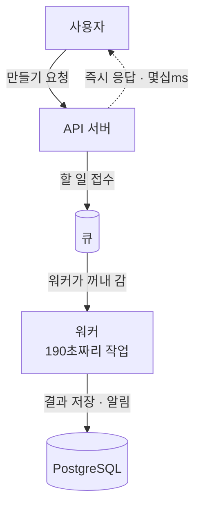
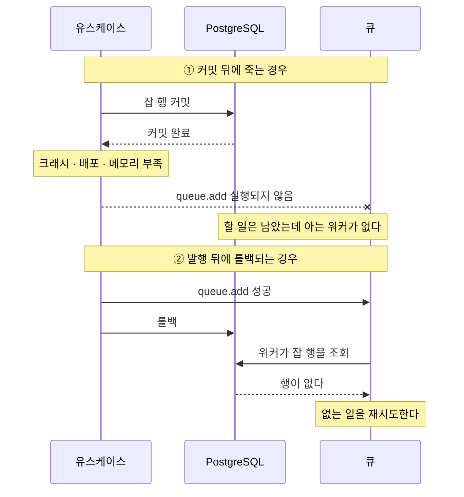
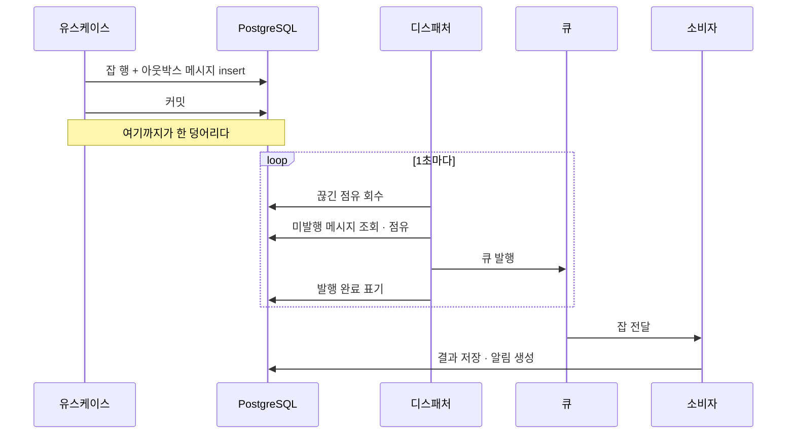
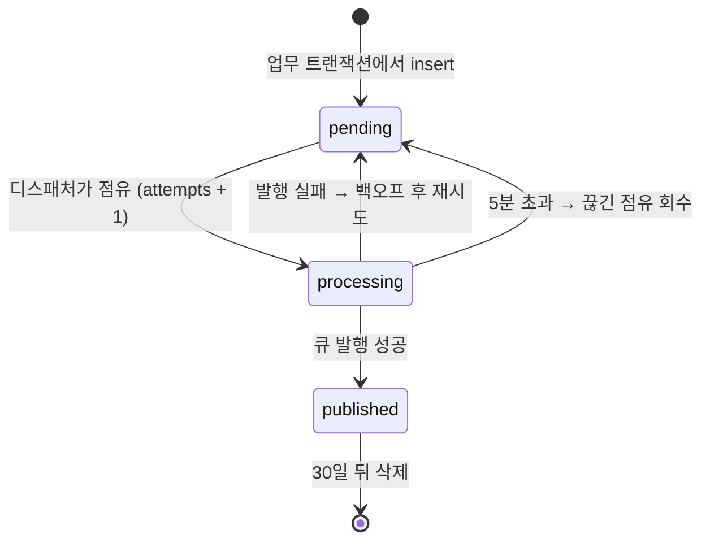
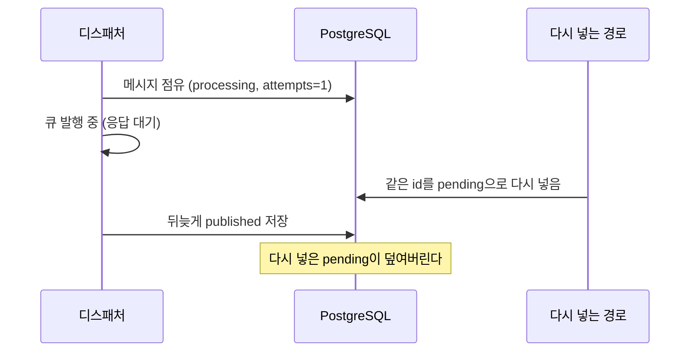
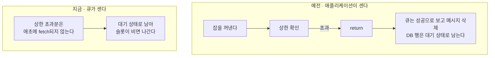
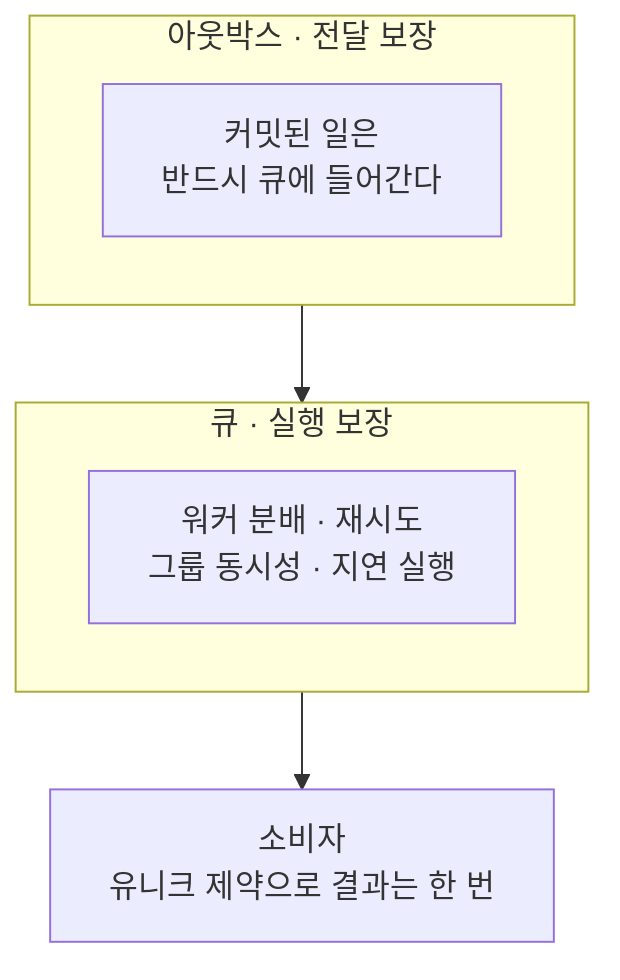
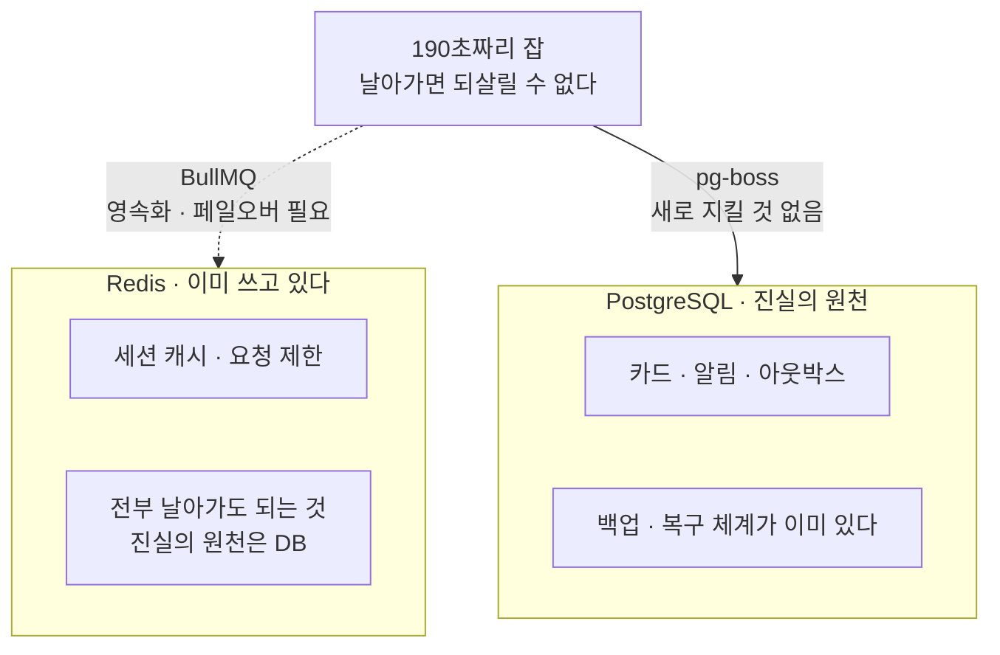
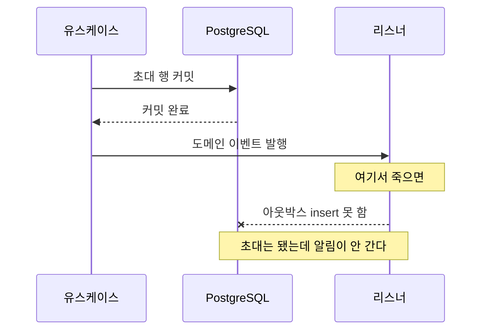

요즘 AI로 카드뉴스를 만들어주는 기능을 서버부터 클라이언트까지 혼자 만들고 있습니다. 인스타그램에서 옆으로 넘겨 보는 여러 장짜리 게시물을, 주제와 톤만 입력하면 통째로 만들어주는 기능입니다.

만들기 전에 비슷한 서비스를 몇 개 써봤는데, 대부분 결과가 빨리 나오는 대신 중간에 자주 어긋났습니다. 쓰다가 자꾸 어긋나면 사용자는 기능을 의심하기 전에 서비스 자체를 의심하게 됩니다. 서비스에 대한 신뢰는 결국 안정성에서 시작한다고 생각합니다.

그래서 속도 대신 품질을 택했고, 생성 과정에 검증을 얹은 만큼 시간도 같이 늘었습니다. 카드 한 장에 평균 190초가 걸리고, 흔한 5장짜리 한 편이면 문구 잡 하나와 카드 잡 다섯 개가 만들어져 전부 끝나기까지 10분 안팎입니다.

줄일 방법은 마땅치 않았습니다. 시간을 거의 다 쓰는 쪽이 이미지를 만드는 단계라, 오래 걸리는 것 자체가 이 기능의 성질에 가깝습니다.

그래서 시간을 줄이는 대신 기다림을 견딜 수 있게 만들기로 했습니다. 그러려면 서버가 약속해야 할 것이 세 가지 생깁니다. 창을 닫아도 계속 만들고, 다 되면 알려주고, 실패했다면 이유를 남기는 것입니다. 셋 다 그 신호가 유실되면 안 된다는 같은 조건에 걸립니다.

그런데 이 "알려주기"가 생각보다 쉽게 사라집니다. 사라지는 자리는 대부분 한 곳, 커밋과 큐 사이입니다.

이번 글에서는 그 틈이 왜 생기는지, 어떻게 닫았는지, 그리고 그렇게 닫으면서 무엇을 치렀는지를 순서대로 적어보려 합니다.

---

## 커밋과 큐 사이의 틈

본론에 들어가기 전에 큐부터 짚고 가겠습니다.

10분짜리 작업을 HTTP 요청 안에서 처리할 수는 없습니다. 브라우저도 로드 밸런서도 그렇게 오래 기다려주지 않고, 설령 기다려준다 해도 사용자가 그동안 화면에 묶이게 됩니다.

그래서 요청은 할 일을 접수만 하고 즉시 응답하고, 실제 작업은 뒤에서 도는 별도 프로세스가 맡습니다. 이렇게 접수된 할 일을 쌓아두었다가 처리할 프로세스에 넘겨주는 것이 `큐(Queue)`입니다.



작업을 넣는 쪽을 생산자, 꺼내서 처리하는 쪽을 소비자라고 부릅니다. 이 글에서는 카드를 실제로 만드는 소비자를 워커라고 적겠습니다. 둘이 분리되어 있으니 API 서버가 재시작돼도 워커는 하던 일을 계속합니다.

큐 하나가 여러 종류의 일을 다루기 때문에, 일의 종류마다 이름을 붙여 나눕니다. 그 이름을 `토픽(topic)`이라고 합니다. 카드 만들기, 알림 보내기, 결제 처리가 각각 다른 토픽입니다.

여기까지는 잘 알려진 그림입니다. 문제는 할 일을 접수하는 그 한 줄에서 시작합니다.

작업을 큐에 넣는 코드는 보통 이렇게 생겼습니다.

```ts
await db.transaction(async (tx) => {
  await tx.insert(cardJob).values(jobs); // 잡 행을 만들고 커밋
});

await queue.add('cardnews.job.ready.v1', { jobId }); // 큐에 넣기
```

여기서 `트랜잭션`을 잠깐 짚고 가겠습니다. 트랜잭션은 여러 개의 쓰기를 한 덩어리로 묶는 장치입니다. 묶인 것이 전부 반영되는 것을 `커밋`, 하나라도 어긋나 전부 없던 일이 되는 것을 `롤백`이라고 합니다.

위 코드에서 `db.transaction` 안쪽은 이 보호를 받습니다. 그런데 바깥에 있는 `queue.add`는 받지 못합니다. DB와 큐는 서로 다른 시스템이고, 두 시스템 사이에는 아무 보증이 없기 때문입니다.

이렇게 두 저장소에 순서대로 쓰면서 둘 다 성공했다고 가정하는 문제를 `이중 쓰기(dual write)`라고 부릅니다.



`queue.add`가 실행되기 전에 프로세스가 죽으면 작업이 유실됩니다. DB에는 만들어야 할 카드가 남아 있는데 정작 그 일을 할 워커는 아무것도 모르는 상태가 됩니다. 화면은 진행률 0에서 멈추고 완료 알림도 오지 않습니다.

반대로 `queue.add`가 먼저 성공하고 트랜잭션이 롤백되면 없는 작업이 큐에 남습니다. 워커가 잡을 꺼내 DB를 조회하면 그 행이 없습니다.

두 경우 모두 원인은 같습니다. **큐에 넣은 메시지는 롤백되지 않습니다.** 되돌릴 수 없는 쓰기를 트랜잭션 밖에 두는 순간, 유실은 버그가 아니라 설계의 일부가 됩니다.

### 재시도로는 왜 안 되나

사실 여기까지는 알고 있었고, 그래서 처음에는 발행 실패에 재시도만 붙여두고 넘어갔습니다. 실패하면 다시 부르면 되지 않나 싶었습니다.

하지만 재시도는 `queue.add`가 실패했을 때 도움이 되지, 그 줄에 도달하지 못했을 때는 아무것도 해주지 못합니다. 재시도할 코드 자체가 프로세스와 함께 사라지기 때문입니다.

그리고 프로세스는 생각보다 자주 사라집니다. 가장 규칙적으로 사라지는 순간은 장애가 아니라 배포입니다. 새 버전을 띄우고 트래픽을 옮긴 뒤 기존 버전을 내리는데, 10분짜리 작업은 이 구간을 그냥 가로지릅니다.

종료 훅으로 30초를 벌어도 30초로 190초를 구할 수는 없습니다. 정상 종료 처리는 정리할 기회를 주는 것이지, 작업을 끝낼 시간을 주는 것이 아니기 때문입니다.

---

## 무엇을 잃어도 되는지부터 정하기

해결책을 고르기 전에 질문을 바꿔봤습니다. 어떻게 하면 아무것도 잃지 않을까가 아니라, 무엇을 잃어도 괜찮은가입니다.

뭉뚱그려 전부 지키겠다고 하면 결국 전부 어설프게 지키게 됩니다. 그래서 사용자에게 보여야 하는 신호를 저장 위치별로 줄 세워봤습니다.

| 신호 | 어디에 남는가 | 판단 |
| --- | --- | --- |
| 생성된 카드와 문구 | PostgreSQL 커밋 | **유실 불가**. 여기 없으면 없는 일입니다 |
| 작업 진행과 완료 사실 | PostgreSQL, 업무 변경과 같은 트랜잭션 | **유실 불가**. 이 글의 주제입니다 |
| 앱 내 알림·발송 영수증 | PostgreSQL, 유니크 제약 | **유실 불가**. 두 번 와도 한 건입니다 |
| 실시간 연결과 푸시 | 프로세스 메모리, 브라우저 푸시 서비스 | **유실 허용**. 재접속 후 다시 읽어옵니다 |

마지막 줄이 성립하는 이유는 실시간 신호를 진실로 취급하지 않기 때문입니다. 카드 한 장이 끝나면 서버가 깨우기 신호를 보내고 브라우저는 `SSE(Server-Sent Events)`로 받지만, 신호를 놓쳤든 연결이 끊겼든 브라우저는 재접속 후 진행 상태와 알림 목록을 HTTP로 다시 읽어옵니다. 그래서 푸시가 실패해도 화면을 열면 완성된 카드가 그 자리에 있습니다.

이 표를 만들고 나서야 문제가 좁아졌습니다. 지켜야 할 것은 위의 세 줄, 그러니까 화면을 다시 열었을 때 반드시 보여야 하는 사실을 전부 트랜잭션 안에 넣는 일입니다.

---

## 트랜잭션 아웃박스 패턴

`트랜잭션 아웃박스 패턴`은 보낼 메시지를 큐에 바로 넣지 않고, **업무 데이터와 같은 트랜잭션으로 DB에 먼저 적어두는** 방법입니다. 하는 일은 두 가지뿐입니다.

- 하나의 트랜잭션에서 업무 로직에 필요한 변경을 수행합니다.
- 같은 트랜잭션에서 보낼 메시지를 아웃박스 테이블에 추가합니다.

그리고 아웃박스에 쌓인 메시지는 별도 프로세스가 주기적으로 읽어 큐로 옮깁니다. 이 프로세스를 보통 디스패처나 릴레이라고 부릅니다. 이렇게 일정 간격으로 새 일이 있는지 확인하러 가는 방식을 `폴링(polling)`이라고 합니다.



핵심은 발행이 커밋 이후에만 일어난다는 점입니다. 트랜잭션이 롤백되면 아웃박스 행도 함께 사라지니 없는 작업이 큐에 남을 수 없고, 커밋이 성공했다면 메시지는 이미 디스크에 있으니 그 뒤에 프로세스가 몇 번 죽든 다음 디스패처가 이어서 발행합니다. 앞에서 본 두 가지 실패가 동시에 닫히는 셈입니다.

### 이 패턴의 값

공짜는 아닙니다. 도입하면서 치른 값을 먼저 적어두겠습니다.

| 얻은 것 | 치른 값 |
| --- | --- |
| 커밋된 일은 반드시 큐에 들어간다 | 폴링 주기만큼 발행이 늦는다 (최악 1초) |
| 롤백된 일은 큐에 남지 않는다 | 테이블 하나와 정리 크론이 늘어난다 |
| 유스케이스가 큐를 몰라도 된다 | 디스패처라는 프로세스를 하나 더 돌봐야 한다 |
| 테스트에 큐를 띄우지 않아도 된다 | 전달이 `at-least-once`라 소비자를 전부 멱등하게 만들어야 한다 |

가장 신경 쓰였던 것은 마지막 줄입니다. 아웃박스를 넣으면 중복 전달이 정상 동작이 되므로, 메시지를 받는 쪽 전부가 두 번 와도 괜찮게 만들어져야 합니다. 이건 뒤에서 따로 다루겠습니다.

지연 1초는 190초짜리 작업 앞에서 낼 만한 비용이라고 판단했습니다. 만약 사용자 입력에 즉시 반응해야 하는 메시지였다면 같은 결론을 내지 않았을 것 같습니다.

---

## 테이블과 상태를 어떻게 잡았나

컬럼은 이 정도면 충분했습니다.

```ts
export const outboxMessage = pgTable(
  'outbox_message',
  {
    id: text('id').primaryKey(),
    organizationId: text('organization_id').notNull(),
    topic: text('topic').notNull(),
    payload: jsonb('payload').notNull(),
    status: text('status').notNull().default('pending'),
    attempts: integer('attempts').notNull().default(0), // 몇 번째 시도인가
    availableAt: timestamp('available_at').notNull().defaultNow(), // 언제 다시 시도할까
    claimedAt: timestamp('claimed_at'), // 누가 언제 집어갔나
    publishedAt: timestamp('published_at'),
    lastError: text('last_error'),
    groupTier: text('group_tier'), // 발행 시점의 플랜을 굳혀 둔다
  },
  (table) => [
    // 미발행 행만 담는 부분 인덱스. 폴링이 발행 완료된 행을 훑지 않는다
    index('outbox_pending_available_idx')
      .on(table.availableAt, table.createdAt)
      .where(sql`${table.status} = 'pending'`),
    check(
      'outbox_message_status_ck',
      sql`${table.status} in ('pending', 'processing', 'published')`,
    ),
  ],
);
```

인덱스에 조건을 걸어 일부 행만 담는 것을 `부분 인덱스(partial index)`라고 합니다. 발행이 끝난 행은 여기서 빠지기 때문에, 테이블이 아무리 커져도 폴링이 훑는 범위는 아직 안 보낸 것들로 고정됩니다.

상태를 어떻게 잡을지는 한참 고민했습니다. 흔히 보이는 구성은 대기 / 완료 / 실패 세 가지에 실패 횟수를 함께 두는 쪽인데, 저는 대기(`pending`) / 처리 중(`processing`) / 발행 완료(`published`)로 갔습니다.

실패 상태를 따로 두지 않은 이유는 이렇습니다. 실패를 별도 상태로 격리하면 그 뒤는 결국 사람이 봐야 합니다. 그런데 발행이 계속 실패한다면 그건 메시지 하나의 문제가 아니라 큐나 DB의 문제이고, 그때 필요한 건 실패 목록이 아니라 알람이라고 생각했습니다.

그래서 `availableAt`에 다음 시도 시각을 적어 간격을 벌리며 계속 재시도하게 두고, 마지막 실패 사유만 `lastError`에 남겼습니다.

이 선택의 약점도 분명합니다. 영원히 실패할 메시지가 조용히 재시도만 반복합니다. 실패 목록이 없으니 무엇이 몇 번째 시도인지 보려면 `attempts`와 `lastError`를 직접 조회해야 하고, 알람을 걸어두지 않으면 아무도 모릅니다. 사람이 봐야 하는 큐를 만들지 않는 대신, 사람이 알아채는 일을 알람에 전부 걸어둔 셈입니다.

대신 처리 중 상태와 점유 시각은 넣었습니다. 여러 인스턴스가 같은 테이블을 동시에 폴링하기 때문에, 지금 누가 집어간 행인지 표시할 자리가 필요했습니다.

한 행을 집어가면서 내가 처리 중이라고 표시해두는 것을 이 글에서는 점유라고 적겠습니다. 표시가 있으면 다른 디스패처가 같은 행을 건드리지 않고, 표시한 쪽이 사라지면 그 표시를 근거로 되살릴 수 있습니다.



여기서 `processing`에서 `pending`으로 돌아가는 화살표가 두 개인 것이 핵심입니다. 하나는 발행이 실패한 경우이고, 다른 하나는 발행 결과를 아무도 기록하지 못한 경우입니다. 배포로 디스패처가 사라지면 그 행은 `processing`에 갇히는데, 5분이 지나면 다음 디스패처가 회수해 갑니다. 앞에서 본 배포 구간이 여기서 복구됩니다.

---

## 적재 · 점유 · 발행

코드는 크게 세 조각입니다.

**적재.** 잡 행과 아웃박스 메시지를 호출한 쪽의 트랜잭션 안에서 함께 만듭니다.

```ts
await tx.insert(cardJob).values(jobs);

await this.outbox.save(
  OutboxMessage.create({
    organizationId: input.organizationId,
    groupTier: input.groupTier, // 지금 플랜을 굳혀 둔다
    topic: CARD_JOB_READY_TOPIC,
    payload: { jobId: job.id, deckId: input.deckId, kind: job.kind },
  }),
);
```

유스케이스는 큐 클라이언트를 주입받지도 않습니다. 발행이 자기 책임이 아니기 때문인데, 덕분에 이 코드를 테스트할 때 큐를 띄울 필요가 없어졌습니다.

**점유.** 디스패처는 1초마다 발행 대기 중인 행을 집어옵니다.

```ts
const rows = await this.uow.executor
  .select()
  .from(outboxTable)
  .where(and(eq(outboxTable.status, 'pending'), lte(outboxTable.availableAt, claimedAt)))
  .orderBy(asc(outboxTable.availableAt), asc(outboxTable.createdAt))
  .limit(limit)
  .for('update', { skipLocked: true }); // 남이 잡은 행은 건너뛴다
```

마지막 줄이 이 구조를 성립시킵니다. [`FOR UPDATE SKIP LOCKED`](https://www.postgresql.org/docs/16/sql-select.html#SQL-FOR-UPDATE-SHARE)는 다른 트랜잭션이 이미 잠근 행을 기다리지 않고 건너뛰는 옵션이라, 여러 인스턴스가 동시에 폴링해도 서로 다른 행을 집어가게 됩니다.

이 옵션이 없으면 두 번째 디스패처는 첫 번째가 커밋할 때까지 기다립니다. 그 대기가 폴링 주기보다 길어지면 대기열이 아니라 정체 구간이 되어버립니다.

**발행.** 집어온 메시지를 큐로 옮기고 결과를 한 번에 저장합니다.

```ts
// 큐 발행은 네트워크 I/O라 병렬로, 실패는 메시지별로 흡수한다
await mapWithConcurrency(messages, 5, async (message) => {
  const row = message.snapshot;
  try {
    await this.queue.publish(
      { id: row.id.getValue(), organizationId: row.organizationId, topic: row.topic, payload: row.payload },
      { id: row.organizationId, tier: row.groupTier ?? undefined },
    );
    message.published(this.clock.now());
  } catch {
    message.retry('큐 발행 실패', this.clock.now());
  }
});

// 결과는 한 트랜잭션으로 묶어 저장한다. 커밋은 한 번만
await this.uow.run(async () => {
  for (const message of messages) {
    await this.outbox.save(message);
  }
});
```

한 건이 실패해도 나머지를 계속 발행하는 것이 여기서 중요했습니다. 실패에서 루프를 멈추면 뒤에 있던 멀쩡한 메시지들이 앞의 한 건 때문에 함께 밀립니다.

재시도 간격은 실패할 때마다 두 배로 벌어집니다.

```ts
retry(reason: string, failedAt: Date): void {
  this.props.status = 'pending';
  this.props.availableAt = new Date(
    failedAt.getTime() + Math.min(60_000, 2 ** this.props.attempts * 1_000),
  );
  this.props.claimedAt = null;
  this.props.lastError = reason;
}
```

점유할 때 오른 `attempts`를 지수로 써서 2초, 4초, 8초로 늘어나다 60초에서 멈춥니다. 이렇게 간격을 벌리는 방식을 `지수 백오프(exponential backoff)`라고 하는데, 큐가 잠깐 흔들렸을 때 같은 간격으로 계속 두드리면 오히려 회복을 방해하기 때문입니다.

디스패처의 한 틱은 회수를 먼저 하고 발행을 나중에 합니다.

```ts
async tick(): Promise<void> {
  await this.dispatch.recoverStaleClaims(); // 5분 넘게 processing인 행을 되살린다
  await this.dispatch.execute(this.config.outboxDispatchBatch); // 기본 20건
}
```

순서에 이유가 있습니다. 회수를 먼저 해두면 이번 틱의 점유 쿼리가 되살아난 행까지 함께 집어갑니다. 반대로 두면 회수된 행은 다음 틱까지 1초를 더 기다립니다.

---

## 아웃박스가 유실을 만든 순간

여기까지 만들고 한 번 데였습니다. 아웃박스를 도입한 이유가 유실을 막는 것이었는데, 정작 아웃박스가 유실을 만드는 상황이 나왔습니다.

### 왜 생겼나

아웃박스 행을 저장하는 코드는 처음에 조건 없는 upsert 한 방이었습니다. 저장은 저장이니 한 줄로 끝내는 게 깔끔하다고 생각했습니다.

```ts
// id가 충돌하면 조건 없이 지금 상태로 덮어쓴다
await tx.insert(outboxTable).values(row).onConflictDoUpdate({
  target: outboxTable.id,
  set: { status: row.status, attempts: row.attempts },
});
```

같은 작업에는 항상 같은 메시지 id를 쓰는 경로가 있어서, 이미 발행 대기 중인 메시지를 다시 대기 상태로 넣는 일이 가능합니다. 그때 이런 순서가 만들어집니다.



결과는 조용한 유실입니다. 예외도 로그도 남지 않습니다. 다시 보내야 한다고 표시된 메시지가 이미 보낸 것으로 바뀌어, 다시는 발행되지 않는 채로 남습니다.

원인을 정리하면 이렇습니다. 저장 코드가 "지금 내가 아는 상태로 덮어쓴다"고만 말하고 있어서, 내가 그 상태를 읽은 뒤에 남이 무엇을 했는지는 아무도 확인하지 않았습니다.

### 어떻게 고쳤나

저장을 하나의 upsert가 아니라 **전이별 조건부 UPDATE**로 쪼갰습니다. `CAS(Compare-And-Swap)`라고 부르는 방식으로, 내가 기대한 상태일 때만 값을 바꾸고 아니면 아무것도 하지 않는 것입니다.

발행 확정은 이렇게 생겼습니다.

```ts
const [confirmed] = await this.uow.executor
  .update(outboxTable)
  .set({ status: 'published', publishedAt: row.publishedAt, lastError: null })
  .where(
    and(
      eq(outboxTable.id, row.id.getValue()),
      eq(outboxTable.organizationId, row.organizationId),
      eq(outboxTable.status, 'processing'), // 아직 내가 잡은 상태일 때만
      eq(outboxTable.attempts, row.attempts), // 같은 시도 회차일 때만
    ),
  )
  .returning({ id: outboxTable.id });

// 0행이면 누군가 이미 다시 넣었다는 뜻. 예외가 아니라 아무 일도 하지 않는다
return confirmed === undefined ? 'superseded' : 'published';
```

여기서 `attempts`를 조건에 넣은 것이 핵심입니다. 상태만 보면, 끊긴 점유가 회수된 뒤 다른 디스패처가 다시 집어간 클레임을 내 것으로 착각할 수 있습니다. 점유할 때 `attempts`를 1 올리므로 이 값이 회차를 구분해줍니다.

그런데 조건을 이렇게 걸고 나니 최초 등록은 어떻게 구분하느냐는 문제가 남습니다. 아무 흔적도 없는 행이어야 upsert를 허용할 수 있는데, 그 흔적을 세 컬럼으로 판별했습니다.

```ts
/** create()가 만든 최초 등록 또는 같은 id 재등록의 지문 */
function isFreshEnqueue(row: Readonly<OutboxMessageProps>): boolean {
  return row.attempts === 0 && row.claimedAt === null && row.publishedAt === null;
}
```

디스패처의 재시도는 반드시 점유를 거쳐 `attempts`가 1 이상이므로 이 조건에 걸리지 않습니다. 그래서 최초 등록과 재등록만 upsert로 가고, 나머지 전이는 전부 조건부 UPDATE로 갈립니다.

경합에서 밀렸을 때 예외를 던지지 않는 것도 의도한 선택입니다. 경합에서 지는 건 오류라기보다 상대의 의도가 더 최신이라는 뜻이고, 그렇다면 물러나는 게 맞다고 봤습니다.

### 이 방식의 값

| 얻은 것 | 치른 값 |
| --- | --- |
| 늦게 도착한 쓰기가 새 의도를 덮지 않는다 | 저장 코드가 한 줄에서 네 갈래로 늘어났다 |
| 경합에서 밀려도 예외가 터지지 않는다 | 0행을 no-op으로 삼키니 진짜 버그도 조용히 삼킬 수 있다 |
| 이중 클레임이 구조적으로 막힌다 | 전이 조건을 하나 잘못 쓰면 메시지가 영구히 멈춘다 |

오른쪽 두 줄이 마음에 걸려서, 이 시나리오는 실제 PostgreSQL을 띄우는 통합 테스트로 세 가지를 못 박아뒀습니다. 다시 넣어진 메시지를 덮지 않는지, 정상적인 경우에는 확정되는지, 다른 디스패처가 재점유한 뒤에는 손대지 않는지.

눈으로 확인할 수 없는 경합을 다룰 때는, 조건을 신중하게 쓰는 것보다 조건이 틀렸을 때 알려주는 장치를 두는 편이 낫다고 생각합니다.

---

## 중복은 정상, 결과는 한 번

앞에서 미뤄둔 `at-least-once` 이야기입니다.

아웃박스는 메시지가 최소 한 번 전달되게 만드는 장치입니다. 정확히 한 번이 아닙니다. 적어도 한 번은 도착하지만 두 번 이상 올 수도 있다는 뜻입니다.

발행에 성공한 직후 발행 완료를 기록하기 전에 프로세스가 죽으면 다음 디스패처가 다시 발행합니다. 큐 쪽도 마찬가지여서, 잡을 처리하던 워커가 사라지면 점유 기한이 지나 재전달됩니다. 즉 중복은 버그가 아니라 정상 동작에 가깝습니다.

1차 방어선은 큐에 있습니다. 아웃박스 메시지 id를 키로 넘기면 같은 키를 가진 잡이 이미 큐에 있을 때 발행이 무시됩니다.

```ts
const id = await boss.send(job.topic, job, {
  singletonKey: job.id, // 같은 아웃박스 메시지는 큐에 하나만
  expireInSeconds: 600, // 처리 중 상태로 10분을 넘기면 재전달 대상
  retryLimit: 5,
  retryBackoff: true,
});
```

그래도 큐의 중복 차단만 믿을 수는 없습니다. 잡이 처리되어 큐에서 사라진 뒤 다시 발행되면 새 잡으로 들어오고, 만료 재전달은 이 차단을 거치지 않기 때문입니다.

그래서 소비자를 `멱등`하게 만들었습니다. 멱등은 같은 요청을 몇 번 처리해도 결과가 한 번 처리한 것과 같다는 성질이고, 방법은 유니크 제약입니다.

- 앱 내 알림은 `(수신자, 중복키)` 유니크로 두 번 와도 한 건만 생깁니다
- 이메일·푸시는 발송 영수증을 `(수신자, 중복키, 채널)`로 남겨 이미 보낸 채널을 건너뜁니다

영수증을 언제 쓰느냐로 한 번 더 고민했습니다. 보내기 전에 미리 자리를 잡아두는 쪽이 중복을 확실히 막지만, 선점한 뒤 발송이 실패하면 그 채널은 영구히 건너뛰어집니다.

그래서 **발송에 성공한 직후** 기록하는 쪽으로 갔습니다. 재시도 창 안에서만 가능한 드문 중복이, 조용한 유실보다는 낫다고 판단했습니다. 같은 알림이 두 번 오면 사용자가 알아채고 넘어가지만, 안 오면 아무도 모릅니다.

정리하면 중복 전달은 큐가 줄여주고, 중복된 결과는 DB가 막습니다. 앞의 것은 최적화이고 뒤의 것이 실제 보증이라고 볼 수 있습니다.

---

## 상한은 누가 세는가

여기까지가 커밋과 큐 사이의 이야기입니다. 그런데 잡을 큐에서 꺼낸 다음에도 같은 모양의 틈이 하나 더 있었습니다.

### 왜 생겼나

한 조직이 워커를 독차지해 다른 조직이 굶지 않도록, 조직당 동시 생성에 상한을 두고 있습니다. 처음에는 이 상한을 애플리케이션이 직접 셌습니다. 워커가 잡을 꺼낸 뒤 슬롯을 잡아보고, 실패하면 조용히 물러나는 코드였습니다.

```ts
if (acquired.status !== 'acquired') {
  return; // 상한에 걸렸다. 예외가 아니라 정상 종료다
}
```

문제는 이 `return`이었습니다. 핸들러가 정상 종료하면 큐는 잡을 처리 완료로 보고 메시지를 지웁니다. 그런데 DB의 잡 행은 대기 상태로 남습니다. 다시 깨워줄 사람이 없습니다.

당시에 이게 안 터지고 있던 이유는 우연에 가까웠습니다. 워커 한 대의 동시 처리 수가 조직 상한보다 작아서 상한에 닿을 일이 없었을 뿐입니다. 워커를 늘리는 순간 한 조직의 잡 여섯 개 중 몇 개만 살아남게 됩니다. 처리량을 늘리려던 변경이 유실을 만드는 셈입니다.

원인은 앞의 것과 같았습니다. 큐에서 메시지를 꺼내는 것도 되돌릴 수 없는 일인데, 꺼낸 뒤 아무것도 하지 않고 정상 종료한 것입니다.

### 어떻게 고쳤나

상한 검사를 애플리케이션에서 큐로 넘겼습니다. pg-boss는 잡에 그룹을 실어 보내면 fetch 단계에서 그룹당 동시성을 조율해줍니다.



꺼냈다가 버리는 경로 자체가 사라졌습니다. 상한에 걸린 잡은 큐에서 나오지 않고 기다리다가, 앞선 잡이 끝나면 그때 나옵니다.

### 상한이 제품이 되다

여기서 예상하지 못한 일이 생겼습니다. 상한을 큐가 조율하게 되니, 그 값을 조직마다 다르게 주는 것이 거의 공짜가 되었습니다.

```ts
export const CARD_JOB_ORG_CONCURRENCY = {
  default: 2, // 무료·스타터. 5장이면 3라운드다
  tiers: {
    pro: 5, // 5장 덱이 한 번에 나간다
    business: 10,
    enterprise: 20,
  },
} as const;
```

같은 5장짜리 한 편이 무료 플랜에서는 세 라운드에 걸쳐 나오고, 프로 플랜에서는 한 라운드에 끝납니다. 190초와 570초의 차이입니다. 워커를 더 붙인 것도 아니고, 잡에 실어 보내는 값 하나가 달라졌을 뿐입니다.

유실을 막으려고 옮긴 책임이 그대로 플랜 차등이 되었다는 점이 재미있었습니다. 상위 플랜이 정말로 더 빨리 만들어지고, 그 근거가 마케팅 문구가 아니라 큐의 fetch 조건이라는 것도요.

### 이 방식의 값

| 얻은 것 | 치른 값 |
| --- | --- |
| 상한에 걸린 잡을 잃는 경로가 사라졌다 | 그룹 동시성은 pg-boss 고유 기능이라, 큐를 갈아타면 직접 만들어야 한다 |
| 플랜별 차등이 값 하나로 끝난다 | 큐 인터페이스에 그룹과 티어 개념이 새어 들어왔다 |
| 앱이 슬롯을 세지 않으니 계산할 것이 없다 | 상한이 왜 안 풀리는지 디버깅할 때 앱 로그로는 알 수 없다 |

오른쪽 두 번째 줄이 특히 아쉬운 부분입니다. 원래 `JobQueuePort`는 발행과 구독만 아는 얇은 경계였는데, 그룹 동시성을 넘기면서 큐 구현의 사정이 인터페이스에 조금 묻었습니다.

그래도 이 교환은 했어야 한다고 생각합니다. 인터페이스가 조금 두꺼워지는 것과 잡이 사라지는 것 중에 고르라면 전자입니다.

### 티어를 발행 시점에 굳히는 이유

작은 결정 하나가 더 있었습니다. 이 티어 값을 어디서 읽느냐입니다.

디스패처가 발행할 때마다 조직의 현재 플랜을 조회하면 될 것 같지만, 그러면 문제가 생깁니다. 잡은 큐에서 몇 분씩 기다립니다. 그 사이에 플랜이 바뀌면 같은 덱의 카드 다섯 장이 서로 다른 상한을 받게 됩니다. 한 편을 만드는 중에 세 장은 프로 상한으로, 두 장은 무료 상한으로 도는 상태가 되는 것입니다.

그래서 아웃박스 행에 `groupTier` 컬럼을 두고, 접수 시점의 플랜을 거기에 적어둡니다. 디스패처는 그 값을 그대로 실어 보낼 뿐 플랜을 다시 읽지 않습니다.

```ts
groupTier: text('group_tier'), // 발행 시점의 플랜을 굳혀 둔다
```

대가는 값이 낡을 수 있다는 것입니다. 만드는 중에 플랜을 올린 사용자는 이번 편에 그 효과를 보지 못하고, 다음 편부터 빨라집니다. 한 편 안에서 일관된 쪽이 낫다고 봤습니다.

아웃박스 행이 메시지를 저장하는 곳이면서, 그 메시지를 만들던 순간의 맥락을 함께 얼려두는 곳이기도 하다는 걸 이때 알았습니다.

---

## 순서를 포기하고 지킨 것

디스패처는 한 배치를 동시에 발행합니다. 그래서 큐 도착 순서는 보장되지 않습니다. 여기서 두 가지가 걸렸습니다.

첫째는 문구와 카드의 순서입니다. 문구 잡과 카드 잡이 같은 토픽을 쓰는데, 함께 발행하면 카드가 문구보다 먼저 깨어날 수 있습니다. 그러면 카드 잡은 쓸 재료가 없어 그대로 종결됩니다.

그래서 접수 때는 문구 잡만 발행하고, 문구가 커밋된 뒤에 카드 잡을 발행하도록 두 단계로 나눴습니다.

```ts
// 접수 시점에는 문구 잡만 발행한다
for (const job of jobs.filter((candidate) => candidate.kind === 'caption')) {
  await this.outbox.save(OutboxMessage.create({ ...같은 트랜잭션 }));
}
```


이 방식의 값은 이렇습니다. 순서 문제는 확실히 사라지지만, 발행 지점이 두 곳으로 늘어나고 카드가 나가기까지 문구 한 라운드를 기다립니다. 그리고 문구 잡이 재전달되면 카드 발행이 두 번 돌 수 있어서, 아직 대기 중인 카드 잡만 골라 발행하는 조건이 필요했습니다. 이미 만든 카드를 다시 만들면 그대로 이중 과금이기 때문입니다.

둘째는 진행률입니다. 카드 다섯 장의 완료 신호가 뒤섞여 도착해도 화면의 진행률이 뒤로 가면 안 됩니다. 이건 순서를 지키는 대신 버전으로 풀었습니다.

```ts
function sourceVersionOf(input: CardDeckWorkStatusInput): number {
  if (input.phase === 'queued') return 1;
  if (input.phase === 'running') return input.completedCards + 1; // 카드마다 +1
  return input.cardCount + 2; // 종료
}
```

접수가 1, 카드가 하나 끝날 때마다 1씩 오르고, 종료가 가장 큰 값입니다. 화면은 자기가 가진 것보다 큰 버전만 반영하므로, 3번 신호가 2번보다 먼저 와도 진행률이 되돌아가지 않습니다.

순서를 큐에서 지키려 하지 않고 소비자 쪽에서 무시할 수 있게 만든 것인데, 결과적으로 발행 실패에서 루프를 멈출 이유도 같이 없어졌습니다.

---

## 큐는 무엇으로 골랐나

여기까지 읽고 나면 자연스럽게 드는 질문이 있습니다. 큐 라이브러리가 알아서 해주는 거 아닌가요?

저도 처음에 그렇게 생각했습니다. 그래서 먼저 층을 갈라놓아야 했습니다.

앞에서 본 큐의 기능은 전부 잡이 큐에 들어온 다음의 이야기입니다. 그 앞, 커밋과 접수 사이는 큐의 책임 범위가 아닙니다. 둘은 대체재가 아니라 서로 다른 층에서 서로 다른 것을 보장합니다.

- **아웃박스는 전달의 시작을 보장합니다.** 커밋된 일은 반드시 큐에 들어간다는 약속입니다.
- **큐는 그 이후의 실행을 보장합니다.** 워커 분배, 재시도, 동시성 제한이 전부 이 층에 있습니다.



NestJS에서 큐라고 하면 보통 [BullMQ](https://docs.bullmq.io/)를 씁니다. [`@nestjs/bullmq`](https://docs.bullmq.io/guide/nestjs)라는 공식 통합 패키지가 있을 만큼 사실상 기본 선택지입니다. 반면 [pg-boss](https://github.com/timgit/pg-boss)는 공식 통합이 없어서 직접 감싸 써야 합니다.

그럼에도 pg-boss를 골랐습니다. 차이는 딱 하나에서 출발합니다. 잡이 어디에 저장되는가입니다.

BullMQ는 잡을 Redis에 저장합니다. 그래서 `queue.add`는 PostgreSQL 트랜잭션에 참여할 수 없습니다. PostgreSQL의 커밋과 롤백은 Redis에 아무 영향도 주지 못하기 때문입니다. 커밋과 발행 사이의 틈이 구조적으로 닫히지 않고, 원자성을 얻으려면 결국 PostgreSQL 테이블에 먼저 쓰고 별도 워커로 옮겨야 하는데 그게 바로 아웃박스입니다.

영속성도 한 겹 더 있습니다. BullMQ [공식 문서](https://docs.bullmq.io/guide/going-to-production)는 Redis 영속성이 수동 설정이며 `AOF(Append Only File)`를 쓰되 쓰기 주기는 1초면 충분하다고 안내합니다. 잘 설정해도 마지막 1초분의 잡은 날아갈 수 있다는 뜻입니다.

여기서 당연한 반문이 하나 나옵니다. 우리는 이미 Redis를 쓰고 있는데요?

맞습니다. 세션 캐시, 로그인 시도 제한, 요청 제한 카운터까지 전부 Redis 계열 노드에 올려두고 씁니다. 저장소를 하나 더 들이는 게 부담이라는 논리는 여기서 성립하지 않습니다. 문제는 저장소 개수가 아니라 데이터의 등급이었습니다.



거기 올려둔 것들은 전부 날아가도 되는 데이터입니다. 캐시가 비면 다시 채우면 되고, 카운터가 사라지면 잠깐 느슨해질 뿐입니다. 그래서 그 노드는 애초에 영속화를 기대하지 않고 만들었습니다.

반면 잡은 등급이 다릅니다. 날아가면 사용자의 10분이 통째로 사라지고 되살릴 방법도 없습니다. 여기에 잡을 올리려면 그 노드의 전제부터 되돌려야 하는데, 앞에서 본 AOF 권고가 정확히 그 이야기입니다.

### 이 선택의 값

| 얻은 것 | 치른 값 |
| --- | --- |
| 업무 데이터와 같은 백업·복구 경로를 쓴다 | NestJS 공식 통합이 없어 직접 감싸야 한다 |
| 큐 때문에 새로 지킬 저장소가 없다 | 대시보드가 없어 테이블을 직접 조회한다 |
| 그룹 동시성을 DB가 조율해준다 | 처리량이 폴링 주기와 배치 크기에 묶인다 |
| 잡을 업무 트랜잭션에 넣는 것도 가능하다 | 큐가 DB 커넥션을 나눠 쓴다 |

마지막 왼쪽 줄은 실제로 쓰지 않고 있습니다. pg-boss는 발행에 내 커넥션을 넘길 수 있어서 아웃박스 없이도 원자성을 얻을 수 있는데, 그러면 유스케이스가 큐 클라이언트를 알아야 하고 큐를 갈아탈 때 업무 코드를 열어야 합니다. 원자성은 그 옵션으로도 얻을 수 있지만 경계는 아웃박스로만 얻습니다.

그리고 이 판단이 틀릴 수도 있으니 큐를 인터페이스 뒤에 숨겨뒀습니다.

```ts
export interface JobQueuePort {
  publish(job: QueueJobEnvelope, group?: QueueJobGroup): Promise<void>;
  subscribe(topic: string, handler: QueueJobHandler, options?: SubscribeOptions): void;
  /** 생산자가 먼저 배포되는 경우, 소비자가 없는 토픽도 큐를 만들어 둔다 */
  declare(topic: string): void;
}
```

디스패처도 소비자도 이 인터페이스만 압니다. [SOLID 글](https://www.yolog.co.kr/post/solid)에서 정리한 의존성 역전과 같은 이야기인데, 되돌릴 수 있게 만들어두면 지금 완벽하게 고를 필요가 없어집니다.

`declare`가 하나 더 붙어 있는 것은 실제로 겪은 일 때문입니다. 소비자가 아직 없는 토픽으로 발행하면 pg-boss가 거절합니다. 생산자를 먼저 배포하는 순간이 있어서, 큐만 미리 만들어두는 통로를 열어뒀습니다.

---

## 어디에 두고, 언제 늘리고, 언제 지우나

마지막으로 운영 이야기를 짚고 가겠습니다.

### 워커를 왜 떼어냈나

한때 API 프로세스가 HTTP와 큐를 함께 소유했습니다. 프로세스 하나면 배포도 하나이니 그게 간단해 보였습니다.

두 가지가 문제였습니다. 카드 합성이 CPU를 잡는 동안 HTTP 응답이 밀렸고, HTTP 트래픽 때문에 스케일아웃하면 워커 수까지 같이 늘어 이미지를 만들어주는 외부 AI 프로바이더에 보내는 요청도 의도치 않게 많아졌습니다. 사용자 요청과 190초짜리 작업이 같은 커넥션 풀을 두고 다투는 구조였습니다.

지금은 같은 이미지를 환경변수만 바꿔 띄운 별도 서비스입니다. 이미지를 나누지 않은 이유는 두 배포가 어긋나는 순간 워커가 예전 계약으로 잡을 처리하게 되기 때문입니다.

| 항목 | 값 |
| --- | --- |
| API 인스턴스 | 0.5 vCPU · 1 GiB. 큐를 구독하지 않고 발행만 |
| 워커 인스턴스 | 1 vCPU · 2 GiB × 1대 |
| 카드 토픽 동시 처리 | 12 |
| 커넥션 예산 | HTTP 풀 10 · 큐 워커 풀 8 |
| 워커 1대 처리량 | 하루 약 1,080편 |

떼어내면서 치른 값은 명확합니다. 인스턴스가 하나 늘어 비용과 배포 대상이 함께 늘었고, 같은 이미지를 쓰기 때문에 환경변수를 잘못 주면 워커가 HTTP를 열거나 API가 큐를 구독하는 사고가 가능해졌습니다.

동시 처리 수를 12로 정한 근거는 CPU가 아니라 메모리입니다. 카드 잡은 대부분의 시간을 프로바이더 응답을 기다리며 놀기 때문에 CPU는 남습니다. 반면 한 장을 합성할 때 피크가 약 84MB이고, 2 GiB 워커에서 런타임 베이스라인을 빼면 1,450MB쯤 남습니다. 1,450 ÷ 84 ≈ 17이고 여기에 안전 계수를 곱해 12로 뒀습니다.

이 값이 토픽별이라는 점도 한 번 데이고 나서 바뀐 부분입니다. 예전에는 토픽마다 `work()`를 여러 번 불러 워커를 여러 개 만들었는데, 그러면 공용 노브 하나가 구독 중인 모든 토픽에 곱해집니다. 토픽이 열 개면 카드만 올리고 싶어도 스무 개가 늘어나는 식입니다.

```ts
queue.subscribe(CARD_JOB_READY_TOPIC, handler, {
  concurrency: CARD_TOPIC_CONCURRENCY, // 카드 토픽에만 적용된다
  groupConcurrency: CARD_JOB_ORG_CONCURRENCY,
});
```

지금은 토픽당 `work()`를 한 번만 부르고 동시성은 옵션으로 넘깁니다.

### 피크가 오면 무엇이 늘어나야 할까

접수와 처리를 분리해둔 덕분에 요청이 몰려도 API가 먼저 무너지지는 않습니다. 요청은 아웃박스에 `INSERT` 한 줄로 끝나고 몰린 만큼은 큐에 쌓이기 때문에, 늘려야 하는 쪽은 워커입니다.

기준으로 삼을 지표도 CPU가 아닙니다. 앞서 말한 대로 워커는 대부분 놀고 있어서, 잡이 백 장 밀려 있어도 CPU 사용률로는 스케일 아웃이 걸리지 않습니다. 그래서 대기 중인 잡 수와 가장 오래 기다린 잡의 나이를 1분마다 구조화 로그로 뱉습니다.

```ts
@Cron('0 * * * * *')
async emit(): Promise<void> {
  this.logger.warn('cardnews.queue_health', {
    pendingJobs,
    runningJobs,
    oldestPendingMinutes,
  });
}
```

CloudWatch 메트릭 필터가 이 로그에서 `oldestPendingMinutes`를 뽑아 알람을 겁니다. 15분을 넘으면 증설 신호입니다. 메트릭 SDK를 새로 붙이지 않은 이유는, 이 하나를 위해 관측 스택을 늘릴 이유가 없다고 봤기 때문입니다. 대신 로그 포맷을 바꾸면 알람이 조용히 깨지는 위험을 안게 됐습니다.

늘리는 쪽은 간단합니다. `SKIP LOCKED`와 큐의 그룹 조율 덕분에 워커끼리 맞출 것이 없어서, 인스턴스를 더 띄우는 것으로 끝나고 코드는 그대로입니다.

오히려 줄이는 쪽이 조심스럽습니다. 190초짜리 잡을 들고 있는 인스턴스가 그냥 내려가면 그 잡은 처리 중 상태로 남습니다. 그래서 종료 유예를 310초로 잡아뒀는데, 기준은 잡의 점유 기한(180초)이 아니라 프로바이더 호출 상한(300초)입니다.

```hcl
# 200초로 끊으면 정상 응답을 기다리던 카드가 강제 종료된다
stop_timeout = 310
```

점유 기한에 맞춰 끊으면, 프로바이더가 곧 응답할 카드가 중간에 잘립니다. 잡은 남아서 언젠가 회수되겠지만 그 시도는 통째로 버려지고 크레딧도 함께 사라집니다. 대신 배포 한 번에 최대 5분을 더 기다리게 됐습니다. 어느 쪽 숫자를 기준으로 삼을지가 곧 무엇을 잃어도 되는지의 문제였습니다.

### 발행이 끝난 행은 언제 지우나

아웃박스는 계속 쌓이는 테이블입니다. 다행히 폴링 쿼리는 미발행 행만 담는 부분 인덱스를 타기 때문에, 테이블이 커져도 훑는 범위는 늘지 않습니다.

그래도 무한정 둘 이유는 없어서 30일이 지난 발행 완료 행을 지웁니다.

```ts
export const OUTBOX_PUBLISHED_RETENTION_DAYS = 30;
export const OUTBOX_PRUNE_BATCH_SIZE = 1_000;
export const OUTBOX_PRUNE_MAX_BATCHES = 10;

/** KST 새벽 03:17. 사용자 트래픽이 가장 적은 시간대다 */
export const OUTBOX_RETENTION_CRON = '0 17 3 * * *';
```

한 번에 다 지우지 않고 1,000건씩 최대 열 번만 도는 것은, 정리 작업이 락을 오래 잡아 디스패처를 막는 일이 없게 하기 위해서입니다. 남은 것은 다음 날 지웁니다.

다만 하루에 지울 수 있는 양이 1만 건으로 묶여 있으니, 발행량이 그보다 많아지면 테이블이 계속 자랍니다. 지금 규모에서는 한참 남았지만, 이 숫자를 언제 올려야 하는지 알려주는 장치는 아직 없습니다.

---

## 아직 열려 있는 틈

솔직하게 하나 적어둡니다. 같은 모양의 틈이 아직 하나 남아 있습니다.

카드 작업의 진행과 완료 알림은 업무 변경과 아웃박스 행이 같은 트랜잭션에 들어가서 안전합니다. 그런데 팀 초대나 결제처럼 도메인 이벤트를 타고 오는 알림은 사정이 다릅니다.

도메인 이벤트는 "초대가 만들어졌다" 같은 사실을 앱 안에 알리는 신호입니다. 관심 있는 쪽이 그 신호를 듣고 반응하는 구조라, 초대를 만드는 코드가 알림 코드를 직접 부르지 않아도 됩니다.

도메인 이벤트는 원 트랜잭션이 커밋된 **뒤에** 발행됩니다. 그래서 이벤트를 받은 리스너가 아웃박스에 적는 시점은 원 트랜잭션과 별도입니다.



커밋과 큐 사이를 막으려고 아웃박스를 넣었는데, 커밋과 아웃박스 사이에 같은 틈이 생긴 것입니다.

고치는 방법은 알고 있습니다. 모든 유스케이스가 알림용 아웃박스 기록을 자기 트랜잭션 안에 직접 넣으면 닫힙니다. 그런데 그러면 초대 유스케이스가 알림의 존재를 알아야 하고, 결제 유스케이스도 그래야 합니다. 도메인 이벤트로 얻은 느슨한 결합을 반납하는 셈입니다.

그 교환이 지금 유리한지 아직 확신이 없어서 미뤄두고 있습니다. 카드가 사라지는 것과 초대 알림이 드물게 안 가는 것은 무게가 다르다고 판단했지만, 이건 판단이지 해결이 아닙니다.

---

## 마무리

트랜잭션 아웃박스 패턴을 한 문장으로 줄이면 이렇습니다. **보낼 메시지를 업무 데이터와 같은 트랜잭션에 적어두고, 커밋 이후에 별도 프로세스가 옮긴다.**

구현은 테이블 하나와 폴링 루프 하나가 전부입니다. 오래 붙잡고 있었던 건 코드가 아니라 그 뒤에 따라온 질문들이었습니다.

- 중복은 어디까지 허용할까. 전달은 큐에서 줄이고, 결과는 유니크 제약으로 막았습니다.
- 실패한 메시지는 누가 볼까. 실패 상태를 두지 않고 알람에 맡겼습니다.
- 상한은 누가 셀까. 애플리케이션에서 큐로 넘겼습니다.

답은 전부 무엇을 잃어도 되는지 정하는 데서 나왔습니다. 어떻게 하면 완벽하게 전달할까를 붙잡고 있을 때는 하나도 정해지지 않던 것들입니다.

돌아보면 같은 틈을 세 번 만났습니다. 커밋과 큐 사이, 아웃박스 행을 조건 없이 덮어쓰던 자리, 큐에서 꺼낸 잡을 조용히 버리던 자리. 그리고 네 번째가 도메인 이벤트 경로에 아직 남아 있습니다.

모양은 매번 달랐지만 원인은 같았습니다. **되돌릴 수 없는 일을 트랜잭션 밖에 둔 것입니다.** 패턴을 안다고 이 실수를 안 하게 되지는 않았고, 세 번째에는 알아보는 게 조금 빨랐던 정도가 달라진 점입니다.

세 번째를 고치면서는 예상하지 못한 것도 하나 얻었습니다. 상한을 큐에 넘긴 결정이 플랜별 동시성이라는 제품 기능이 됐습니다. 안정성을 위해 옮긴 책임이 그대로 값이 되는 경우도 있다는 걸 그때 알았습니다.

서두에 안정성이 신뢰의 시작이라고 적었습니다. 이 작업을 하고 나서 그 말이 조금 구체적으로 바뀌었습니다.

안정성은 에러가 안 나는 상태라기보다, 무엇을 지킬지 정해두고 그것만은 지키는 상태에 가깝다고 생각합니다. 사용자에게 하는 약속도 딱 그만큼입니다. 알림이 늦을 수 있고 푸시가 안 뜰 수도 있지만, 다 만들어진 카드가 사라지지는 않습니다.

아웃박스가 정답이라고 말할 생각은 없습니다. 지금 규모에 과한 설계라는 말도 맞고, 앞에서 적은 대로 치른 값도 적지 않습니다. 다만 이 틈은 규모가 작다고 안 생기는 종류가 아니고, 오히려 사용자가 적을 때 한 건이 사라지는 쪽이 더 아픕니다.

언젠가 큐를 갈아타더라도 아웃박스는 남아 있을 것 같습니다. 커밋과 발행 사이의 틈은 큐를 바꿔도 사라지지 않기 때문입니다.

---

## 참고 자료

- [Pattern: Transactional outbox - microservices.io](https://microservices.io/patterns/data/transactional-outbox.html)
- [Transactional outbox pattern - AWS Prescriptive Guidance](https://docs.aws.amazon.com/prescriptive-guidance/latest/cloud-design-patterns/transactional-outbox.html)
- [pg-boss](https://github.com/timgit/pg-boss)
