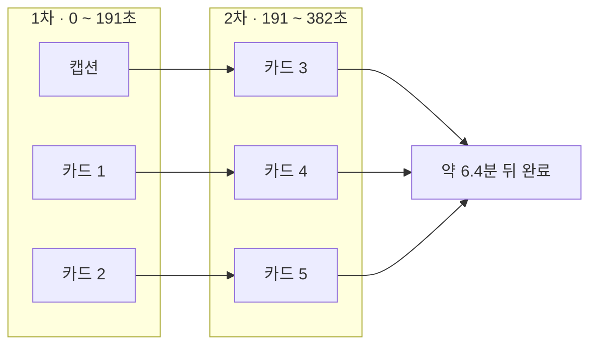
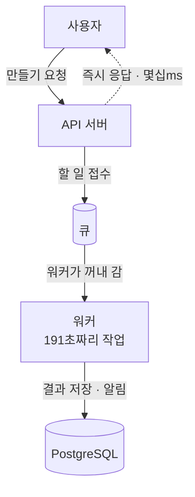
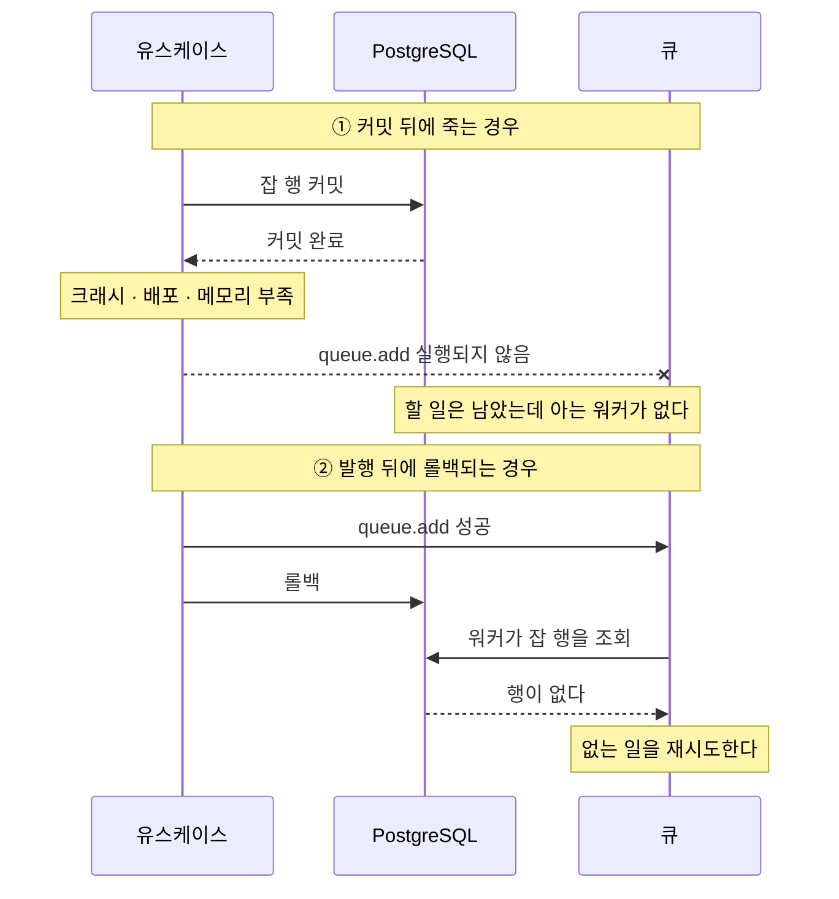
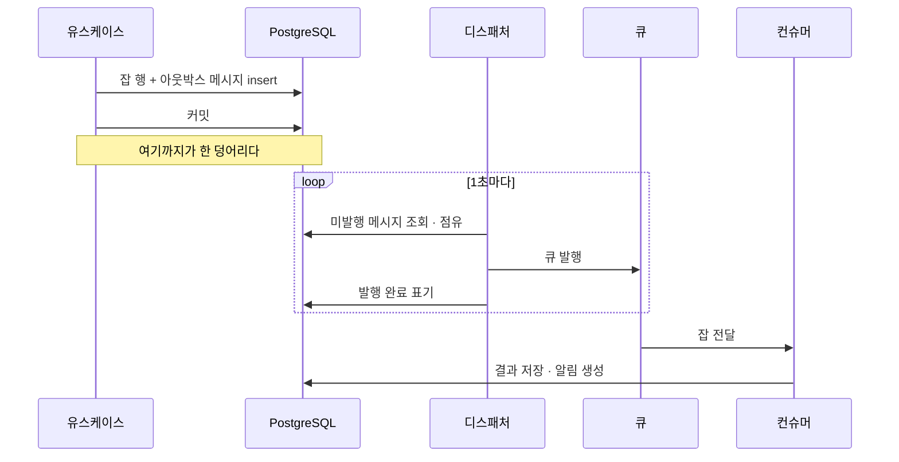
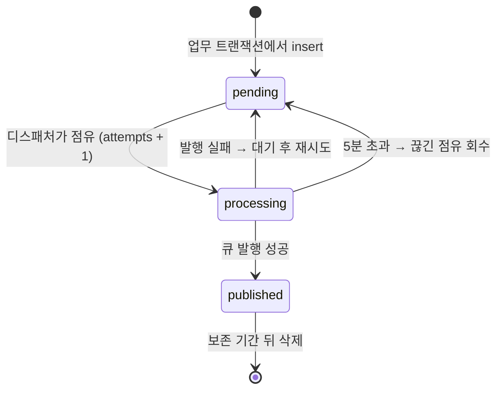
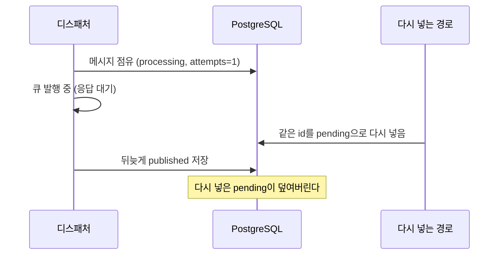
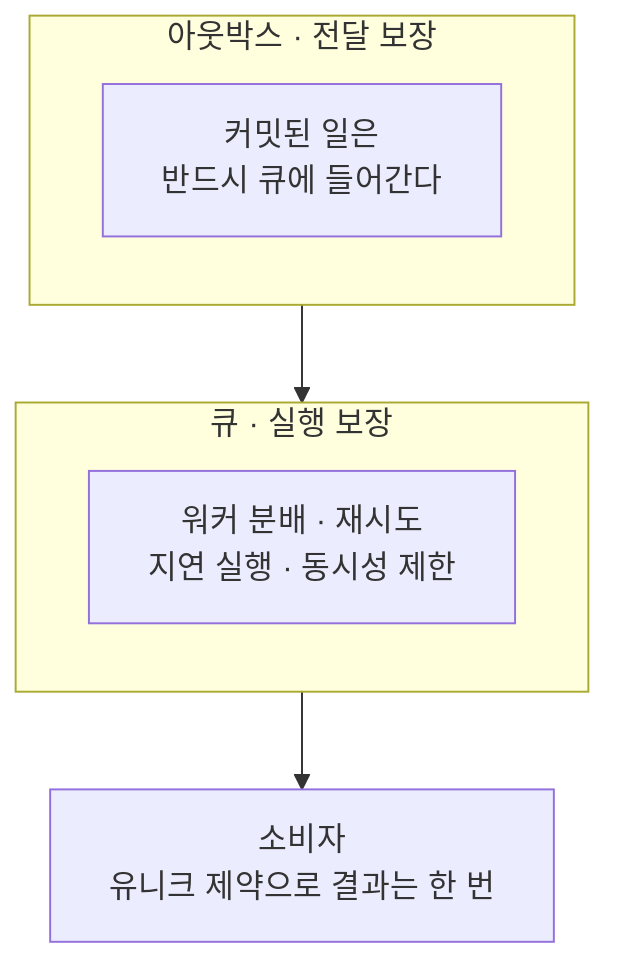
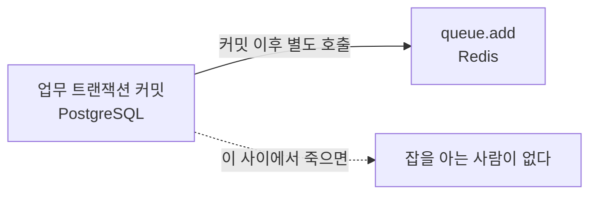
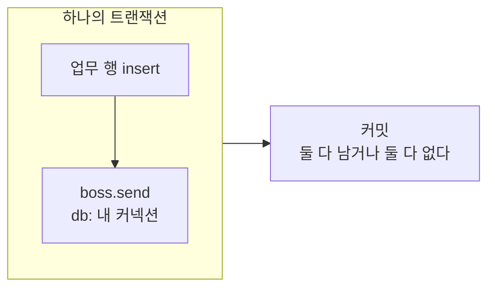
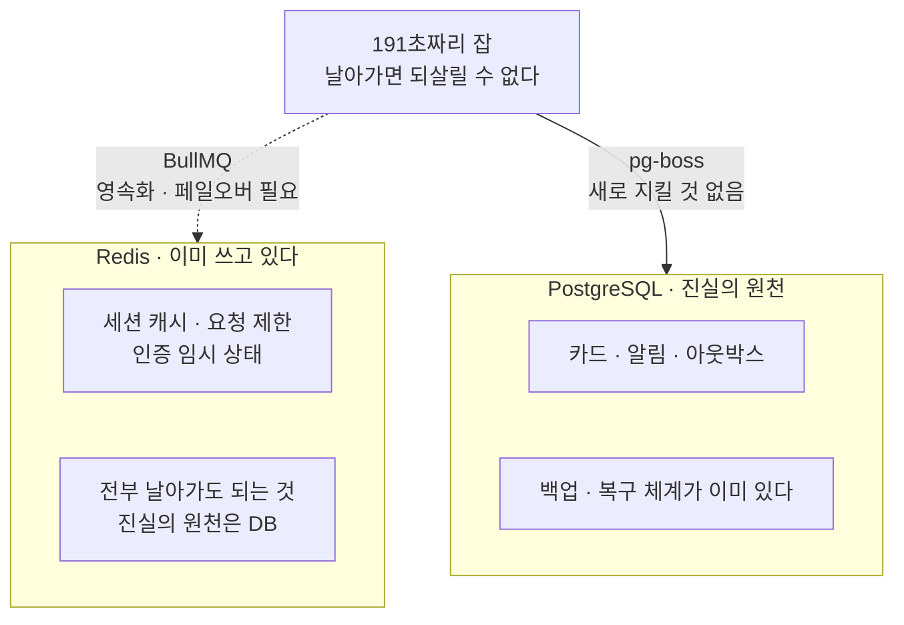

최근 AI로 카드뉴스를 만들어주는 기능을 서버부터 클라이언트까지 혼자 만들고 있습니다. 인스타그램에서 옆으로 넘겨 보는 여러 장짜리 게시물을, 주제와 톤만 입력하면 통째로 만들어줍니다.

비슷한 서비스를 몇 개 써보고 생각이 하나 굳었습니다. 대부분 빠른 대신 불안정했고, 결과물에도 브랜드 컨셉이 남지 않았습니다. **서비스에 대한 신뢰는 안정성에서 시작합니다.** 쓰다가 자꾸 어긋나면 사용자는 기능을 의심하기 전에 서비스를 의심하고, 안에서 보안을 아무리 단단히 해둬도 밖으로 에러가 자주 보이면 내 데이터를 제대로 다루는 곳인지부터 묻게 됩니다. 돈을 내는 사용자라면 더 그렇습니다.

받아서 직접 손보는 시간과 검증을 앞단에 두고 만드는 시간을 재보니 후자가 조금 더 짧기도 했습니다. 그래서 속도를 포기하고 생성 과정에 검증 세 가지를 얹었습니다. 문구가 주제에서 벗어나지 않았는지, 이미지가 브랜드 톤과 맞는지, 글자가 잘리거나 대비가 부족하지 않은지. 기준에 못 미치면 그 장을 다시 만듭니다.

품질은 올라갔고 **생성 시간도 같이 올라갔습니다.** 흔한 5장짜리 기준으로 카드 한 장에 평균 **191초**, 캡션까지 **6개** 작업이 만들어지고, 한 조직이 동시에 돌릴 수 있는 건 **3개**입니다.



**약 6.4분**입니다. 줄일 방법도 마땅치 않습니다. 시간을 거의 다 쓰는 쪽은 이미지를 만드는 단계라 병렬로 돌린다고 한 장이 빨라지지 않고, 동시 실행 수는 한 조직이 워커를 독차지하지 못하게 막아둔 상한이라 올릴 수도 없습니다. **오래 걸리는 것이 이 기능의 성질입니다.**

그래서 시간을 줄이는 대신 **기다림을 견딜 수 있게** 만들기로 했습니다. 그러면 서버가 약속할 것이 세 가지 생깁니다. 창을 닫아도 계속 만들고, 다 되면 알려주고, 실패했다면 이유를 남기는 것. 모두 **그 신호가 유실되면 안 된다**는 같은 조건에 걸립니다. 그런데 그 "알려주기"는 생각보다 쉽게 사라집니다. 사라지는 자리는 대부분 한 곳, **커밋과 큐 사이**입니다.

이 글은 그 틈을 닫는 `트랜잭션 아웃박스 패턴(Transactional Outbox Pattern)` 이야기입니다. 패턴이 무엇인지, 실제로 어떻게 만들었는지, 그리고 BullMQ와 pg-boss가 이 문제와 각각 어떤 관계인지까지 정리했습니다.

---

## 큐가 하는 일

본론에 들어가기 전에 큐부터 짚고 가겠습니다.

6.4분짜리 작업을 HTTP 요청 안에서 처리할 수는 없습니다. 브라우저도 로드 밸런서도 그렇게 오래 기다려주지 않고, 기다려준다 해도 사용자는 그동안 화면에 묶입니다. 그래서 요청은 **할 일을 접수만 하고 즉시 응답**하고, 실제 작업은 뒤에서 도는 별도 프로세스가 맡습니다. 접수된 할 일을 쌓아두었다가 처리할 프로세스에 넘겨주는 것이 `큐(Queue)`입니다.



작업을 넣는 쪽을 생산자, 꺼내서 처리하는 쪽을 소비자라고 부릅니다. 둘이 분리돼 있으니 API 서버가 재시작돼도 워커는 하던 일을 계속하고, 처리가 밀리면 워커만 늘리면 됩니다. 큐는 그 밖에도 실패한 작업을 다시 넣어주고, 동시에 도는 작업 수를 제한하고, 예약 실행을 처리합니다.

여기까지는 잘 알려진 그림입니다. 문제는 **할 일을 접수하는 그 한 줄**에서 시작합니다.

---

## 커밋과 큐 사이의 틈

작업을 큐에 넣는 코드는 보통 이렇게 생깁니다.

```ts
await db.transaction(async (tx) => {
  await tx.insert(cardJob).values(jobs); // 잡 행을 만들고 커밋
});

await queue.add('card-job-ready', { jobId }); // 큐에 넣기
```

짧은 코드지만 **DB와 큐라는 서로 다른 두 시스템**을 순서대로 건드리고 있고, 두 시스템 사이에는 아무 보증이 없습니다. 이렇게 두 저장소에 순서대로 쓰면서 둘 다 성공했다고 가정하는 문제를 `이중 쓰기(dual write)`라고 부릅니다.



`queue.add`가 실행되기 전에 프로세스가 죽으면 **작업이 유실됩니다.** DB에는 만들어야 할 카드가 남아 있는데 그 일을 할 워커는 아무것도 모릅니다. 화면은 진행률 0에서 멈추고 완료 알림은 오지 않습니다. 반대로 `queue.add`가 먼저 성공하고 트랜잭션이 롤백되면 **없는 작업이 큐에 남습니다.** 워커가 잡을 꺼내 DB를 조회하면 그 행이 없습니다.

원인은 하나입니다. **큐에 넣은 메시지는 롤백되지 않습니다.** 되돌릴 수 없는 쓰기를 트랜잭션 밖에 두는 순간, 유실은 버그가 아니라 설계의 일부가 됩니다.

여기까지는 알고 있었고, 그래서 처음에는 발행 실패에 재시도만 붙여두고 넘어갔습니다. 하지만 재시도는 `queue.add`가 **실패했을 때** 도움이 되지, 그 줄에 **도달하지 못했을 때**는 아무것도 해주지 못합니다. 재시도할 코드 자체가 프로세스와 함께 사라지기 때문입니다.

그리고 프로세스는 생각보다 자주 사라집니다. 가장 규칙적으로 사라지는 순간은 장애가 아니라 **배포**입니다. 새 버전을 띄우고 트래픽을 옮긴 뒤 기존 버전을 내리는데, 6.4분짜리 작업은 이 구간을 그냥 가로지릅니다. 종료 훅으로 30초를 벌어도 30초는 191초를 구하지 못합니다. 정상 종료 처리는 **정리할 기회**이지 **작업을 끝낼 시간**이 아닙니다.

---

## 무엇을 잃어도 되는지 정하기

그래서 질문을 바꿨습니다. 어떻게 아무것도 잃지 않을까가 아니라, **무엇을 잃어도 되는가**입니다. 뭉뚱그려 전부 지키겠다고 하면 전부 어설프게 지키게 되니, 신호를 저장 위치로 줄 세워봤습니다.

| 신호 | 어디에 남는가 | 판단 |
| --- | --- | --- |
| 생성된 카드와 캡션 | PostgreSQL 커밋 | **유실 불가**. 여기 없으면 없는 일입니다 |
| 작업 완료 사실 | PostgreSQL, 업무 변경과 같은 트랜잭션 | **유실 불가**. 이 글의 주제입니다 |
| 앱 내 알림·발송 영수증 | PostgreSQL, 유니크 제약 | **유실 불가**. 두 번 와도 한 건입니다 |
| 실시간 연결과 푸시 | 프로세스 메모리, 브라우저 푸시 서비스 | **유실 허용**. 재접속 후 다시 읽어옵니다 |

마지막 줄이 성립하는 이유는 실시간 신호를 진실로 취급하지 않기 때문입니다. 카드 한 장이 끝나면 서버가 깨우기 신호를 보내고 브라우저는 `SSE(Server-Sent Events)`로 받지만, 신호를 놓쳤든 연결이 끊겼든 브라우저는 재접속 후 진행 상태와 알림 목록을 HTTP로 다시 읽습니다. 그래서 **푸시가 실패해도 화면을 열면 완성된 카드가 그 자리에 있습니다.**

남은 것은 위의 세 줄, 그러니까 **화면을 다시 열었을 때 보여야 하는 사실**을 전부 트랜잭션 안에 넣는 일입니다. 여기서 아웃박스가 나옵니다.

---

## 트랜잭션 아웃박스 패턴

`트랜잭션 아웃박스 패턴`은 **보낼 메시지를 큐에 바로 넣지 않고, 업무 데이터와 같은 트랜잭션으로 DB에 먼저 적어두는** 방법입니다. 하는 일은 두 가지뿐입니다.

- 하나의 트랜잭션에서 **업무 로직에 필요한 변경**을 수행합니다.
- 같은 트랜잭션에서 **보낼 메시지를 아웃박스 테이블에 추가**합니다.

그리고 아웃박스에 쌓인 메시지는 별도 프로세스가 주기적으로 읽어 큐로 옮깁니다. 이 프로세스를 보통 디스패처나 릴레이라고 부릅니다.



핵심은 **발행이 커밋 이후에만 일어난다**는 점입니다. 트랜잭션이 롤백되면 아웃박스 행도 함께 사라지니 없는 작업이 큐에 남을 수 없고, 커밋이 성공했다면 메시지는 이미 디스크에 있으니 그 뒤에 프로세스가 몇 번 죽든 다음 디스패처가 이어서 발행합니다. 앞에서 본 두 가지 실패가 **동시에** 닫힙니다.

대가는 지연입니다. 폴링 주기가 1초이니 최악의 경우 발행이 1초 늦습니다. 191초짜리 작업 앞에서 1초는 낼 만한 비용이라고 판단했습니다.

---

## 아웃박스 테이블과 상태

컬럼은 이 정도면 충분했습니다.

```ts
export const outboxMessage = pgTable(
  'outbox_message',
  {
    id: text('id').primaryKey(),
    topic: text('topic').notNull(), // 어떤 메시지인가
    payload: jsonb('payload').notNull(),
    status: text('status').notNull().default('pending'),
    attempts: integer('attempts').notNull().default(0), // 몇 번째 시도인가
    availableAt: timestamp('available_at').notNull().defaultNow(), // 언제 다시 시도할까
    claimedAt: timestamp('claimed_at'), // 누가 언제 집어갔나
  },
  // 미발행 행만 담는 부분 인덱스. 폴링이 발행 완료된 행을 훑지 않는다
  (t) => [index('outbox_pending_idx').on(t.availableAt).where(sql`${t.status} = 'pending'`)],
);
```

상태를 어떻게 잡을지는 한참 고민했습니다. 흔히 보이는 구성은 대기 / 완료 / **실패** 세 가지에 실패 횟수를 함께 두는 쪽인데, 저는 대기(`pending`) / 처리 중(`processing`) / 발행 완료(`published`)로 갔습니다.

**실패 상태를 따로 두지 않았습니다.** 실패를 별도 상태로 격리하면 그 뒤는 사람이 봐야 합니다. 그런데 발행이 계속 실패한다면 그건 메시지 하나의 문제가 아니라 큐나 DB의 문제이고, 그때 필요한 건 실패 목록이 아니라 알람입니다. 그래서 `availableAt`에 다음 시도 시각을 적어 간격을 벌리며 계속 재시도합니다.

**대신 처리 중 상태와 점유 시각을 넣었습니다.** 여러 인스턴스가 같은 테이블을 동시에 폴링하기 때문에 지금 누가 집어간 행인지 표시할 자리가 필요했습니다.



`processing`에서 `pending`으로 돌아가는 화살표가 두 개인 것이 핵심입니다. 하나는 발행이 실패한 경우, 다른 하나는 **발행 결과를 아무도 기록하지 못한 경우**입니다. 배포로 디스패처가 사라지면 그 행은 `processing`에 갇히는데, 5분이 지나면 다음 디스패처가 회수해 갑니다. 앞에서 본 배포 구간이 여기서 복구됩니다.

---

## 적재 · 점유 · 발행

코드는 세 조각입니다.

**적재.** 잡 행과 아웃박스 메시지를 호출한 쪽의 트랜잭션 안에서 함께 만듭니다.

```ts
await tx.insert(cardJob).values(jobs);
await tx.insert(outboxTable).values({ topic: CARD_JOB_READY, payload: { jobId } });
```

유스케이스는 큐 클라이언트를 주입받지도 않습니다. 발행이 자기 책임이 아니기 때문이고, 덕분에 이 코드를 테스트할 때 큐를 띄울 필요가 없어졌습니다.

**점유.** 디스패처는 1초마다 발행 대기 중인 행을 집어옵니다.

```ts
const rows = await tx
  .select()
  .from(outboxTable)
  .where(and(eq(outboxTable.status, 'pending'), lte(outboxTable.availableAt, now)))
  .limit(20)
  .for('update', { skipLocked: true }); // 남이 잡은 행은 건너뛴다
```

마지막 줄이 이 구조를 성립시킵니다. [`FOR UPDATE SKIP LOCKED`](https://www.postgresql.org/docs/16/sql-select.html#SQL-FOR-UPDATE-SHARE)는 **다른 트랜잭션이 이미 잠근 행을 기다리지 않고 건너뛰는** 옵션이라, 여러 인스턴스가 동시에 폴링해도 서로 다른 행을 집어갑니다. 이 옵션이 없으면 두 번째 디스패처는 첫 번째가 커밋할 때까지 기다리고, 대기가 폴링 주기보다 길어지면 대기열이 아니라 정체 구간이 됩니다.

**발행.** 집어온 메시지를 큐로 옮기고 결과를 한 번에 저장합니다.

```ts
// 큐 발행은 네트워크 I/O라 병렬로, 실패는 메시지별로 흡수한다
await mapWithConcurrency(messages, 5, async (message) => {
  try {
    await queue.publish(toEnvelope(message));
    message.published(clock.now());
  } catch {
    message.retry(clock.now()); // 다음 시도 시각을 뒤로 밀어둔다
  }
});

// 결과는 한 트랜잭션에 묶어 저장한다. 커밋은 한 번만
await db.transaction(() => Promise.all(messages.map((message) => outbox.save(message))));
```

재시도 간격은 실패할 때마다 두 배로 벌어집니다. 점유할 때 오른 `attempts`를 지수로 써서 2초, 4초, 8초로 늘어나다 60초에서 멈춥니다. 이렇게 간격을 벌리는 방식을 `지수 백오프(exponential backoff)`라고 하는데, 큐가 잠깐 흔들렸을 때 같은 간격으로 계속 두드리면 회복을 방해하기 때문입니다.

한 가지 더. 발행이 실패해도 **루프를 멈추지 않습니다.** 순서를 지키려고 거기서 멈추는 구현을 흔히 보는데, 저는 순서를 다른 곳에서 지키기로 했습니다. 작업 상태에는 전이마다 증가하는 버전이 붙어 있고 소비자는 자기가 가진 것보다 큰 버전만 반영하므로, 전달 순서가 뒤집혀도 진행률이 뒤로 되돌아가지 않습니다.

순서를 포기했으니 이제 남은 문제는 횟수입니다.

---

## 중복은 정상, 결과는 한 번

아웃박스는 메시지가 **최소 한 번** 전달되게 만드는 장치입니다. 정확히 한 번이 아닙니다. 이 성질을 `at-least-once`라고 하는데, **적어도 한 번은 도착하지만 두 번 이상 올 수도 있다**는 뜻입니다.

발행에 성공한 직후 발행 완료를 기록하기 전에 프로세스가 죽으면 다음 디스패처가 다시 발행합니다. 큐 쪽도 마찬가지로, 잡을 처리하던 워커가 사라지면 점유 기한이 지나 재전달됩니다. 즉 **중복은 정상 동작입니다.**

1차 방어선은 큐에 있습니다. 아웃박스 메시지 id를 키로 넘기면 같은 키를 가진 잡이 이미 큐에 있을 때 발행이 무시됩니다.

```ts
await boss.send(topic, payload, {
  singletonKey: message.id, // 같은 아웃박스 메시지는 큐에 하나만
  expireInSeconds: 600, // 처리 중 상태로 10분을 넘기면 재전달 대상
});
```

그래도 큐의 중복 차단만 믿을 수는 없습니다. 잡이 처리되어 큐에서 사라진 뒤 다시 발행되면 새 잡으로 들어오고, 만료 재전달은 이 차단을 거치지 않습니다. 그래서 소비자를 `멱등`하게 만들었습니다. 멱등은 **같은 요청을 몇 번 처리해도 결과가 한 번 처리한 것과 같다**는 성질이고, 방법은 유니크 제약입니다.

- 앱 내 알림은 `(수신자, 중복키)` 유니크로 두 번 와도 한 건만 생깁니다
- 이메일·푸시는 발송 영수증을 `(수신자, 중복키, 채널)`로 남겨 이미 보낸 채널을 건너뜁니다

중복키에는 작업 종류, 대상 id, 상태, 상태 버전이 함께 들어갑니다. 그래서 같은 완료 이벤트가 두 번 와도 알림은 한 건이고, 완성 뒤에 사용자가 한 장을 다시 만들어 상태가 또 바뀌면 그때는 새 알림으로 취급됩니다.

정리하면 **중복 전달은 큐가 줄여주고, 중복 결과는 DB가 막습니다.** 앞의 것은 최적화이고 뒤의 것이 보증입니다.

---

## 아웃박스가 유실을 만든 순간

여기까지 만들고 한 번 데였습니다. 아웃박스를 도입한 이유가 유실을 막는 것이었는데, 아웃박스가 유실을 만드는 상황이 나왔습니다.

### Before

아웃박스 행을 저장하는 코드는 처음에 조건 없는 upsert 한 방이었습니다.

```ts
// id가 충돌하면 조건 없이 지금 상태로 덮어쓴다
await tx.insert(outboxTable).values(row).onConflictDoUpdate({
  target: outboxTable.id,
  set: { status: row.status, attempts: row.attempts },
});
```

같은 작업에는 항상 같은 메시지 id를 쓰는 경로가 있어서, 이미 발행 대기 중인 메시지를 다시 대기 상태로 넣는 일이 가능합니다. 그때 이런 순서가 만들어집니다.



결과는 조용한 유실입니다. 예외도 로그도 남지 않습니다. 다시 보내야 한다고 표시된 메시지가 이미 보낸 것으로 바뀌어, 다시는 발행되지 않는 채로 남습니다.

### After

각 상태 전이를 **조건부 UPDATE**로 바꿨습니다. `CAS(Compare-And-Swap)`라고 부르는 방식으로, **내가 기대한 상태일 때만 값을 바꾸고 아니면 아무것도 하지 않는** 것입니다.

```ts
const [confirmed] = await tx
  .update(outboxTable)
  .set({ status: 'published' })
  .where(
    and(
      eq(outboxTable.id, row.id),
      eq(outboxTable.status, 'processing'), // 아직 내가 잡은 상태일 때만
      eq(outboxTable.attempts, row.attempts), // 같은 시도 회차일 때만
    ),
  )
  .returning({ id: outboxTable.id });

// 0행이면 누군가 이미 다시 넣었다는 뜻. 예외가 아니라 아무 일도 하지 않는다
return confirmed === undefined ? 'superseded' : 'published';
```

`attempts`를 조건에 넣은 것이 핵심입니다. 상태만 보면, 끊긴 점유가 회수된 뒤 **다른 디스패처가 다시 집어간** 클레임을 내 것으로 착각할 수 있습니다. 점유할 때 `attempts`를 1 올리므로 이 값이 회차를 구분해줍니다.

경합에서 밀렸을 때 예외를 던지지 않는 것도 의도한 선택입니다. 경합에서 지는 것은 오류가 아니라 **상대의 의도가 더 최신인 것**이고, 그러면 물러나는 게 맞습니다. 이 시나리오는 눈으로 확인할 수 없어서 실제 PostgreSQL을 띄우는 통합 테스트로 세 가지를 못 박아뒀습니다. 다시 넣어진 메시지를 덮지 않는지, 정상적인 경우에는 확정되는지, 다른 디스패처가 재점유한 뒤에는 손대지 않는지.

---

## BullMQ · pg-boss · 아웃박스는 무엇이 다른가

여기까지 읽고 나면 자연스럽게 드는 질문이 있습니다. **큐 라이브러리가 알아서 해주는 거 아닌가?**

NestJS에서 큐라고 하면 보통 [BullMQ](https://docs.bullmq.io/)를 씁니다. [`@nestjs/bullmq`](https://docs.bullmq.io/guide/nestjs)라는 공식 통합 패키지가 있을 만큼 사실상 기본 선택지입니다. 반면 [pg-boss](https://github.com/timgit/pg-boss)는 NestJS 공식 통합이 없어서 직접 감싸 써야 합니다. 그럼에도 pg-boss를 골랐는데, 이 선택을 설명하려면 먼저 층을 갈라놓아야 합니다.

### 아웃박스와 큐는 다른 층에 있다

앞에서 본 큐의 기능은 전부 **잡이 큐에 들어온 다음**의 이야기입니다. 그 앞, 커밋과 접수 사이는 큐의 책임 범위가 아닙니다. 둘은 대체재가 아니라 서로 다른 층에서 서로 다른 것을 보장합니다.

- **아웃박스는 전달의 시작을 보장합니다.** 커밋된 일은 반드시 큐에 들어간다는 약속입니다.
- **큐는 그 이후의 실행을 보장합니다.** 앞 섹션에서 본 기능이 전부 이 층에 있습니다.



BullMQ도 pg-boss도 아래층 이야기입니다. 그럼 둘은 무엇이 다를까요. 차이는 딱 하나에서 출발합니다. **잡이 어디에 저장되는가.**

### BullMQ는 잡이 Redis에 산다

BullMQ는 잡을 Redis에 저장합니다. 발행과 소비는 이렇게 생겼습니다.

```ts
const queue = new Queue('card-job', { connection: { host, port } });

await db.transaction(async (tx) => {
  await tx.insert(cardJob).values(jobs); // PostgreSQL
});

await queue.add('ready', { jobId }); // Redis, 트랜잭션 밖
```

```ts
new Worker('card-job', async (job) => generateCard(job.data.jobId), { connection });
```

깔끔합니다. 그런데 `queue.add`는 **PostgreSQL 트랜잭션에 참여할 수 없습니다.** 참여할 방법이 없어서가 아니라 저장소가 다르기 때문입니다. PostgreSQL의 커밋과 롤백은 Redis에 아무 영향도 주지 못합니다.



그래서 BullMQ에서 커밋과 발행 사이의 틈은 **구조적으로 닫히지 않습니다.** 원자성을 얻으려면 결국 PostgreSQL 테이블에 먼저 쓰고 별도 워커로 옮겨야 하는데, 그게 바로 아웃박스입니다.

영속성도 한 겹 더 있습니다. BullMQ [공식 문서](https://docs.bullmq.io/guide/going-to-production)는 Redis 영속성이 **수동 설정**이며 `AOF(Append Only File)`를 쓰되 쓰기 주기는 1초면 충분하다고 안내합니다. 잘 설정해도 마지막 1초분의 잡은 날아갈 수 있다는 뜻입니다. Redis가 아예 죽었을 때 API가 매달리지 않게 하는 `enableOfflineQueue: false` 옵션도 있지만, 이건 **빨리 실패하는 것**이지 유실을 막는 것이 아닙니다.

정리하면 BullMQ를 쓴다고 아웃박스가 필요 없어지지 않습니다. **BullMQ는 아웃박스의 대안이 아니라 아웃박스의 다음 단계에 있습니다.**

### pg-boss는 잡이 같은 PostgreSQL에 산다

pg-boss는 잡을 PostgreSQL 테이블에 저장합니다. 전용 스키마를 만들고 그 안에서 잡을 관리합니다.

```ts
await boss.createQueue('card-job'); // 없는 큐로는 send가 거부된다
await boss.send('card-job', { jobId }, { singletonKey: jobId });

await boss.work('card-job', async ([job]) => generateCard(job.data.jobId));
```

여기서 흥미로운 사실이 하나 있습니다. 잡이 내 DB에 있으니 **내 트랜잭션 안에서 잡을 넣을 수도 있습니다.** pg-boss의 `SendOptions`는 `ConnectionOptions`를 상속하고 거기에 `db` 옵션이 있는데, 이 옵션이 요구하는 것은 `executeSql` 메서드 하나뿐입니다.

```ts
// pg-boss가 요구하는 건 executeSql 하나뿐이다
const asPgBossDb = (client: PoolClient) => ({
  executeSql: (text: string, values: unknown[] = []) => client.query(text, values),
});

await withTransaction(async (client) => {
  await client.query('insert into card_job ...', [jobId]);
  await boss.send('card-job', { jobId }, { db: asPgBossDb(client) }); // 같은 트랜잭션
});
```



롤백되면 잡도 함께 사라지고, 커밋되면 잡도 함께 남습니다. **pg-boss에서는 이중 쓰기를 아웃박스 없이도 없앨 수 있습니다.**

패턴을 소개하는 글에서 할 말은 아니지만 사실이니 적어둡니다. 잡이 사는 곳이 다르면 **가능한 보장의 종류**가 달라지고, 그게 두 라이브러리의 진짜 차이입니다.

### 그럼 pg-boss를 쓰면 아웃박스가 필요 없을까

가능한 것과 그렇게 하는 것은 다른 문제입니다. 저는 `db` 옵션을 알고도 아웃박스를 남겼습니다. 이유는 네 가지입니다.

**첫째, 유스케이스가 큐를 몰라도 됩니다.** `db` 옵션을 넘기려면 애플리케이션 계층이 pg-boss의 실행기 모양을 알아야 하고 큐 클라이언트를 주입받아야 합니다. 아웃박스는 `INSERT` 한 줄이라 유스케이스가 큐의 존재 자체를 모르고, 테스트에 큐를 띄울 일도 없습니다.

**둘째, 큐를 갈아탈 수 있습니다.** SQS나 BullMQ로 옮기는 순간 `db` 옵션은 성립하지 않습니다. 그때 유스케이스를 전부 열어야 한다면 큐 교체가 아니라 업무 로직 수정이 됩니다.

**셋째, 업무 트랜잭션이 짧아집니다.** 큐 스키마에 쓰는 작업을 업무 트랜잭션 안에 넣으면 그만큼 락을 오래 잡습니다.

**넷째, 재시도와 회수를 한 곳에서 봅니다.** `attempts`, `availableAt`, 끊긴 점유 회수가 전부 내 테이블 안에 있어서, 무엇이 몇 번 실패했고 언제 다시 나가는지를 내 스키마로 조회할 수 있습니다.

한 줄로 줄이면 이렇습니다. **원자성은 pg-boss로도 얻을 수 있지만, 경계는 아웃박스로만 얻습니다.** 반대로 큐를 바꿀 생각이 없고 계층 분리가 크게 중요하지 않다면 `db` 옵션만으로 충분할 수 있습니다. 아웃박스를 도입할지는 **유실을 막을 방법이 그것뿐이어서**가 아니라 **경계가 필요한가**로 판단하는 게 맞다고 생각합니다.

### 무엇을 기준으로 골랐나

두 라이브러리를 나란히 놓으면 이렇습니다.

| 기준 | BullMQ | pg-boss |
| --- | --- | --- |
| 잡이 사는 곳 | Redis 계열 | 업무 데이터와 같은 PostgreSQL |
| 업무 커밋과 한 트랜잭션 | 불가능 | 가능 (`send`에 `db` 전달) |
| 큐 때문에 지켜야 할 저장소 | Redis가 추가된다 | 없음. 업무 DB 그대로 |
| 영속성 | AOF 수동 설정, 1초 주기 권장 | 업무 데이터와 같은 백업·복구 경로 |
| 경쟁 워커 분배 | Redis 원자 연산 | `FOR UPDATE SKIP LOCKED` |
| 중복 방지 | `jobId` 또는 `deduplication` | `singletonKey` |
| 처리량 | 높음 | 폴링 주기와 배치 크기로 제한됨 |
| NestJS 통합 | `@nestjs/bullmq` 공식 제공 | 없음. 직접 감싸야 합니다 |
| 대시보드 | Bull Board 등 생태계 | 테이블 직접 조회 |

표만 보면 BullMQ가 밀리지 않습니다. 그런데 여기서 당연한 반문이 하나 나옵니다. **우리는 이미 Redis를 쓰고 있는데요.**

맞습니다. 세션 캐시, 로그인 시도 제한, 요청 제한 카운터, 인증 과정의 임시 상태까지 전부 Redis 계열 노드에 올려두고 씁니다. 저장소를 하나 더 들이는 게 부담이라는 논리는 여기서 성립하지 않습니다. **문제는 저장소 개수가 아니라 데이터의 등급이었습니다.**



그런데 거기 올려둔 것들은 전부 **날아가도 되는 것**입니다. 캐시가 비면 다시 채우면 되고, 카운터가 사라지면 잠깐 느슨해질 뿐입니다. 그래서 그 노드는 애초에 영속화를 기대하지 않고 만들었습니다.

잡은 등급이 다릅니다. 날아가면 사용자의 6.4분이 통째로 사라지고 되살릴 방법도 없습니다. 여기에 잡을 올리는 건 **버려도 되게 만든 곳에 버리면 안 되는 데이터를 두는 것**이고, 그러지 않으려면 그 노드의 전제를 되돌려야 합니다. 앞에서 본 BullMQ 문서의 AOF 권고가 정확히 그 이야기입니다. 반면 PostgreSQL은 이미 잃으면 안 되는 데이터를 담고 그에 맞는 백업과 복구 경로를 갖고 있으니, 잡을 얹어도 새로 지킬 것이 없습니다.

그리고 이 판단이 틀렸을 때를 대비해 큐를 인터페이스 뒤에 숨겼습니다.

```ts
/** 구현체(pg-boss / BullMQ / SQS)를 애플리케이션 계층에서 숨기는 경계 */
export interface JobQueuePort {
  publish(job: QueueJobEnvelope): Promise<void>;
  subscribe(topic: string, handler: QueueJobHandler): void;
}
```

디스패처도 소비자도 이 인터페이스만 압니다. [SOLID 글](https://www.yolog.co.kr/post/solid)에서 정리한 의존성 역전과 같은 이야기인데, **되돌릴 수 있게 만들어두면 지금 완벽하게 고를 필요가 없어집니다.**

---

## 이 선택의 비용

폴링으로 DB를 계속 찌르는 구조라 부하 걱정을 자주 듣습니다. 그래서 숫자를 세어봤습니다.

| 항목 | 값 |
| --- | --- |
| 카드뉴스 1건이 만드는 아웃박스 행 | 6행 |
| 디스패처 이론 처리량 | 초당 20행 (폴링 1초 × 한 번에 20건) |
| 폴링 쿼리 비용 | 부분 인덱스를 타는 인덱스 스캔 1회 |
| 커넥션 예산 | HTTP 10 · 큐 워커 4 · 실시간 신호 1 |

한 건이 만드는 게 6행인데 처리할 수 있는 건 초당 20행입니다. 두 자릿수 차이라 당분간 걱정할 일이 아닙니다. 발행이 끝난 행은 부분 인덱스에서 빠지니 테이블이 커져도 훑는 범위는 미발행분으로 고정되고, 인스턴스가 늘어 쓰기 경합이 보이면 폴링 주기를 환경변수로 늘리면 됩니다.

여기에 규칙을 하나 더 뒀습니다. **HTTP를 받는 인스턴스는 큐를 구독하지 않습니다.** 한 프로세스가 둘 다 하면 191초짜리 생성 작업이 사용자 요청과 커넥션 풀을 두고 다투고, 결국 화면 로딩이 생성 작업 뒤에 줄을 섭니다.

### 지금 스펙으로 어디까지 버티나

몇 명까지 받을 수 있는지도 세어봤습니다.

| 항목 | 값 |
| --- | --- |
| HTTP 인스턴스 | 0.5 vCPU · 1 GiB × 1대 |
| 워커 인스턴스 | 1 vCPU · 2 GiB × 1대 |
| 동시에 도는 카드 | **2장** (워커 1대 × 토픽 동시성 2) |
| 카드 한 장 | 평균 191초 · 최대 268초 |
| DB 커넥션 | 태스크당 14 · 합계 28 (상한 약 110) |

동시 2장에 한 장이 191초니 시간당 37장, 하루 900장 남짓입니다. 5장짜리로 환산하면 **하루 180건**입니다. 만약 100명이 동시에 5장짜리를 요청하면 카드 500장이 동시 2장으로 처리되니, 마지막 사람은 **13시간쯤 뒤에** 받게 됩니다.

작아 보이지만 지금 트래픽에는 남고, 무엇보다 **병목이 어디인지가 분명합니다.** DB도 CPU도 아닙니다. 커넥션은 상한의 4분의 1만 쓰고, 카드 잡은 대부분의 시간을 프로바이더 응답을 기다리며 놀기 때문에 CPU도 남습니다. 진짜 한도는 **워커의 메모리와 프로바이더 쿼터**입니다.

### 막히면 무엇부터 늘리나

순서를 정해뒀습니다.

1. **본다.** 1분마다 대기 중인 잡 수와 가장 오래 기다린 잡의 나이를 로그로 남깁니다. 이 값이 15분을 넘으면 증설 신호입니다.
2. **워커 동시성을 올린다.** 환경변수 하나이고, 메모리가 허락하는 데까지 올립니다.
3. **워커 대수를 늘린다.** `SKIP LOCKED` 덕분에 인스턴스를 더 띄우는 것으로 끝나고 코드는 그대로입니다.
4. **커넥션 예산을 다시 잰다.** 태스크가 늘면 14씩 곱해지니 DB 상한과 폴링 주기를 같이 조정합니다.

여기까지가 큐를 건드리지 않고 갈 수 있는 길이고, **아마 여기서 끝날 겁니다.** BullMQ로 바꾼다고 카드 한 장이 191초보다 빨라지지 않고 워커가 한 대 늘지도 않습니다. 처리량은 `동시 실행 수 ÷ 191초`인데 큐는 두 항 어느 쪽도 바꾸지 않고, 큐가 차지하는 몫은 폴링 1초로 전체의 0.5%입니다. 큐 교체가 답이 되는 건 아웃박스 쓰기가 초당 수백 건에 닿아 폴링 자체가 부담이 될 때인데, 하루 180건과는 두세 자릿수 떨어져 있습니다. **처리량이 모자랄 때 큐부터 갈아타는 건 대개 잘못 짚은 겁니다.**

---

## 아직 열려 있는 틈

그런데 2번과 3번을 준비하다가 하나를 더 찾았습니다. 아웃박스로 커밋과 발행 사이는 막았는데, **큐에서 꺼낸 다음**에 또 다른 틈이 있었습니다.

조직당 동시 생성은 3장으로 제한합니다. 한 조직이 워커를 독차지해 다른 조직이 굶지 않게 하는 장치입니다. 워커는 잡을 꺼낸 뒤 이 상한을 확인하고, 넘었으면 조용히 물러납니다.

```ts
if (acquired.status !== 'acquired') {
  return; // 상한에 걸렸다. 예외가 아니므로 큐는 이 잡을 성공으로 본다
}
```

문제는 `return`이라는 것입니다. 핸들러가 정상 종료하면 큐는 잡을 처리 완료로 보고 메시지를 지웁니다. 그런데 DB의 잡 행은 대기 상태로 남습니다. 다시 깨워줄 사람이 없습니다.

지금 안 터지는 이유는 우연에 가깝습니다. 전역 동시성이 2장이라 조직 상한 3에 닿을 수가 없기 때문입니다. 그런데 워커를 늘리는 순간 한 조직의 잡 여섯 개 중 셋만 살아남고 나머지는 사라집니다. 화면은 3/5에서 멈추고 완료 알림은 오지 않습니다. **처리량을 늘리려던 변경이 유실을 만드는 셈입니다.**

고치는 방향은 정했습니다. 상한 검사를 애플리케이션이 아니라 큐에 맡기는 것입니다. pg-boss에는 그룹당 동시성을 DB로 조율하는 기능이 있어서, 조직 id를 그룹으로 넘기면 **네 번째 잡을 애초에 꺼내지 않습니다.** 꺼냈다 버리는 경로 자체가 없어집니다.

교훈은 앞과 같았습니다. **되돌릴 수 없는 일을 트랜잭션 밖에 두면 유실이 생깁니다.** 큐에서 메시지를 꺼내는 것도 되돌릴 수 없는 일이고, 꺼낸 뒤 아무것도 하지 않으면 그게 유실입니다. 같은 실수를 층만 바꿔서 한 번 더 한 셈입니다.

알림 경로에도 하나 남아 있습니다. 작업 상태 알림은 업무 변경과 아웃박스 행이 같은 트랜잭션에 들어가 안전하지만, 팀 초대나 결제처럼 도메인 이벤트를 타고 오는 알림은 리스너가 **커밋 이후에** 이벤트를 받아 아웃박스에 적습니다. 여기도 같은 틈입니다. 모든 유스케이스가 아웃박스 기록을 자기 트랜잭션에 직접 넣으면 막히지만, 그러면 도메인 이벤트로 얻은 느슨한 결합을 반납해야 해서 아직 미뤄뒀습니다.

---

## 마무리

트랜잭션 아웃박스 패턴을 한 문장으로 줄이면 이렇습니다. **보낼 메시지를 업무 데이터와 같은 트랜잭션에 적어두고, 커밋 이후에 별도 프로세스가 옮긴다.**

구현은 테이블 하나와 폴링 루프 하나가 전부입니다. 어려운 건 코드가 아니라 그 뒤에 따라오는 질문들이었습니다. 중복은 어디까지 허용할지, 실패한 메시지는 누가 볼지, 경합에서 밀렸을 때 예외를 던질지 물러날지. 그리고 가장 오래 남은 것은 패턴 이름이 아니라 질문이 바뀐 순간이었습니다. 어떻게 완벽하게 전달할지가 아니라, **무엇을 잃어도 되고 무엇은 절대 잃으면 안 되는지**로.

돌아보면 같은 틈을 세 번 만났습니다. 커밋과 큐 사이에서 한 번, 아웃박스 행을 조건 없이 덮어쓰면서 한 번, 큐에서 꺼낸 잡을 조용히 버리면서 한 번. 매번 모양은 달랐지만 원인은 같았습니다. **되돌릴 수 없는 일을 트랜잭션 밖에 둔 것입니다.** 패턴을 안다고 이 실수를 안 하게 되지는 않았고, 다만 세 번째에는 알아보는 게 빨랐습니다.

서두에 안정성이 신뢰의 시작이라고 적었는데, 이 작업을 하고 나서 그 말이 조금 더 구체적으로 바뀌었습니다. 안정성은 에러가 안 나는 상태가 아니라 **무엇을 지킬지 정해두고 그것만은 지키는 상태**에 가깝습니다. 지금 사용자에게 하는 약속은 이렇습니다. 알림이 조금 늦을 수 있고 푸시가 안 뜰 수도 있습니다. 하지만 **다 만들어진 카드가 사라지는 일은 없습니다.** 창을 닫았다가 다시 열면 결과가 그 자리에 있습니다.

아웃박스가 정답이라고 말할 생각은 없습니다. 앞에서 봤듯 pg-boss만 쓰면 더 적은 코드로 같은 원자성을 얻을 수도 있고, 하루 180건짜리 규모에 과한 설계라는 말도 맞습니다. 다만 이 틈은 규모가 작다고 안 생기는 종류가 아니고, 오히려 사용자가 적을 때 한 건이 사라지는 쪽이 더 아픕니다. 언젠가 큐를 갈아탈 날이 올 수도 있지만 아웃박스는 남을 것 같습니다. 커밋과 발행 사이의 틈은 큐를 바꿔도 사라지지 않기 때문입니다.

---

## 참고 자료

- [Pattern: Transactional outbox - microservices.io](https://microservices.io/patterns/data/transactional-outbox.html)
- [Transactional outbox pattern - AWS Prescriptive Guidance](https://docs.aws.amazon.com/prescriptive-guidance/latest/cloud-design-patterns/transactional-outbox.html)
