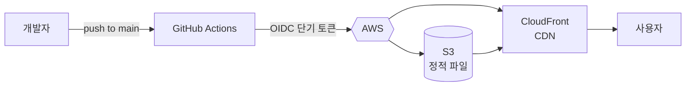
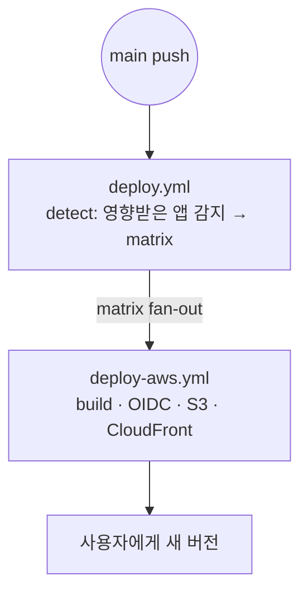
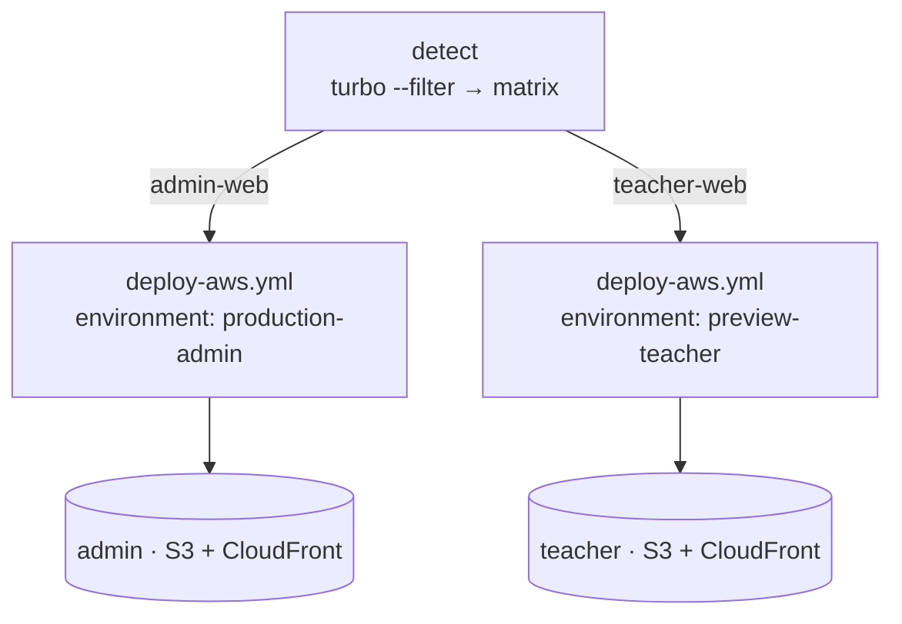
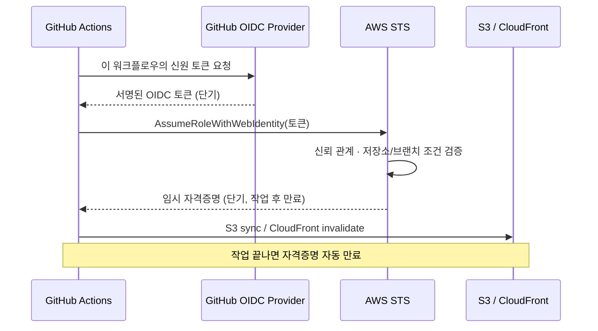
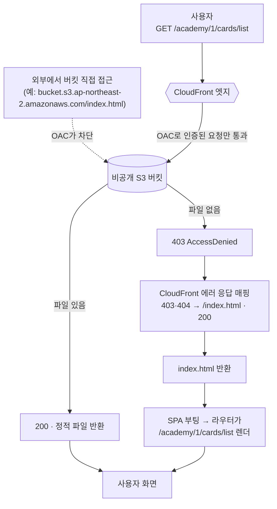
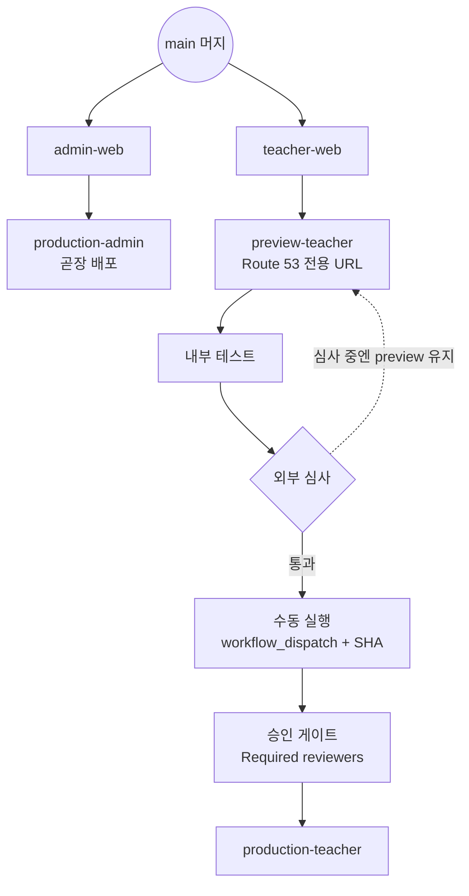

사내에서는 현재 세 개의 앱을 운영한다.

운영자용 `admin-web`과 선생님용 `teacher-web`은 React(Vite)로 만든 웹 앱이고, 학생용 `student-app`은 모바일 앱이다. 이 중 웹 앱 두 개를 [Vercel](https://vercel.com)에 올려 운영해 왔다.

처음엔 더없이 편했다. 깃에 푸시하면 알아서 배포되고, PR마다 미리보기가 떴다.

그런데 시간이 지나며 두 가지가 분명해졌다.

하나는 **비용**이다. 사용자와 팀이 늘수록 무시하기 어려운 고정비가 쌓여갔다.

다른 하나는 **궁합**이다. 우리 두 앱은 Vercel의 강점을 안 쓰는 순수 정적 SPA인데, 정작 인프라는 이미 전부 AWS에 있었다. 프론트만 Vercel에 따로 떨어져 있을 이유가 점점 옅어졌다.

그래서 프론트엔드 배포를 AWS([S3](https://aws.amazon.com/s3/) + [CloudFront](https://aws.amazon.com/cloudfront/))로 다시 설계했다.

이 글은 **왜 프론트엔드 인프라를 Vercel에서 AWS로 옮기게 됐는지**, 옮기며 **무엇을 얻고 무엇을 내줬는지**(Pros & Cons), 그리고 성격이 다른 **두 앱을 어떤 기준으로 다르게 배포하기로 했는지**를 실제 [GitHub Actions](https://docs.github.com/ko/actions) 워크플로우 코드와 함께 풀어 쓴 기록이다.



---

## 왜 Vercel에서 AWS로 옮겼나

먼저 짚고 싶은 건 Vercel이 나빠서가 아니라는 점이다. 좋은 도구다. 다만 우리가 지불하는 비용만큼 Vercel을 유의미하게 쓰고 있지 않았고, 서비스의 모양과도 점점 어긋났을 뿐이다. 옮긴 이유는 네 가지였다.

**① 비용**

Vercel 요금은 빌드나 배포 횟수가 아니라 트래픽과 팀 좌석에 붙는다. 사용자에게 나간 데이터 전송량(`Fast Data Transfer`)과 CDN 요청 수(`Edge Requests`)가 쌓이고, 여기에 좌석당 월 $20인 팀 좌석까지 더해진다. 사용자와 팀이 늘수록, 정적 앱 두 개를 배달하는 일치고는 고정비가 꽤 컸다.

반면 `S3` + `CloudFront`는 철저히 사용량 기반이라, 같은 트래픽을 받아도 정적 파일 배달에 드는 비용이 훨씬 적다. 실제로 옮기고 나서 프론트엔드 인프라 비용이 크게 줄었다.

> 2026년 6월 4일 기준으로 [Claude](https://claude.ai)의 도움을 받아 대략적인 비용을 비교해봤다. 단가는 언제든 바뀔 수 있으니 흐름만 참고하자.

좌석 3개를 쓴다고 가정하고, 월 트래픽을 단계별로 잡으면 이렇게 갈린다.

| 월 트래픽 | Vercel Pro | AWS (`S3` + `CloudFront`, 서울) |
|---|---|---|
| 가벼움 (200GB · 500만 요청) | $60 (좌석 3개, 트래픽은 무료분 내) | 사실상 $0 (영구 무료 티어 안) |
| 중간 (1.5TB · 2천만 요청) | 약 $155 | 약 $72 |
| 무거움 (5TB · 5천만 요청) | 약 $740 | 약 $530 |

차이의 핵심은 두 가지다. Vercel은 트래픽이 적어도 **좌석당 월 $20**이라 3명이면 $60이 트래픽과 무관하게 깔린다. 반면 `CloudFront`는 **1TB 전송과 1천만 요청이 영구 무료**라, 내부 도구 수준의 트래픽은 사실상 무료 구간에 들어간다. 트래픽이 커지면 둘 다 전송비가 지배하지만, GB당 단가도 `CloudFront`(약 $0.11)가 Vercel($0.15)보다 낮다.

**② 우리 앱은 Vercel의 강점을 안 쓴다.**

`admin-web`과 `teacher-web`은 둘 다 [Vite](https://vitejs.dev)로 빌드한 순수 정적 SPA다. 빌드하면 `index.html` 하나와 해시 붙은 JS/CSS 묶음이 나올 뿐, SSR·ISR·Edge Functions를 하나도 쓰지 않는다. 그런데 이게 바로 Vercel이 돈값을 하는 영역이다. 정작 우리에게 필요한 건 "정적 파일을 인터넷에 올리는 일"뿐이었다.

**③ 인프라가 이미 전부 AWS에 있었다.**

백엔드, DB, 로그, 스토리지는 이미 전부 AWS에 있다. 프론트만 Vercel에 떨어져 있으니 운영 도구가 둘로 쪼개졌다.

게다가 작은 스타트업이라 역할이 칼같이 나뉘지 않는다. 기획도 하고 디자인도 보고, 프론트와 백엔드를 한 사람이 오가며 다 맡는다. 나부터도 클라이언트와 백엔드를 같이 보는 입장이라, 도구가 둘로 갈린 부담은 고스란히 한 사람에게 쌓였다.

권한도 `IAM`과 Vercel에서 따로 관리해야 하고, 문제가 터지면 "어느 쪽이지?"부터 가리느라 두 콘솔을 오간다.

큰 회사라면 담당이 나뉘어 흡수될 일이지만, 인원이 빠듯한 팀에선 이런 자잘한 맥락 전환이 쌓여 정작 제품 개발에 쓸 시간을 갉아먹는다.

백엔드가 이미 AWS에 있으니, 프론트까지 한곳으로 모으면 이 **운영 표면이 절반**이 된다.

**④ 배포 방식까지 우리 손으로 가져올 수 있다.**

Vercel에선 빌드와 배포가 벤더 안에서 자동으로 일어난다. 편하지만, 그 과정에 우리가 끼어들 여지는 거의 없다. AWS로 옮기면 빌드부터 업로드, 캐시 무효화까지 전 과정을 `GitHub Actions`에서 직접 짜고 통제하게 된다.

보안도 같이 좋아진다. 외부 벤더에 만료 없는 AWS 키를 맡겨두는 대신, GitHub과 AWS가 신뢰 관계를 맺고 키 없이 배포할 수 있다(뒤에서 다룰 `OIDC`다). 게다가 `S3` + `CloudFront`는 어디서나 쓰는 표준 구성이라, 특정 벤더에 묶일 일도 없다.

정리하면, 우리 서비스의 모양(정적 SPA)과 이미 AWS에 모인 인프라, 그리고 비용을 함께 놓고 보면 프론트도 AWS로 통일하는 게 합리적이었다.

문제는 분명히 인지했고, 결정도 섰다. 이제 남은 건 개인 시간을 쪼개 인프라만 옮기는 일뿐이었다. 그럼 실제로는 어떻게 했을까?

---

## 배포 파이프라인 한눈에 보기

Vercel은 깃에 푸시하면 알아서 배포해 줬다. AWS로 옮긴다는 건, 비용을 아끼는 대신 그 편의를 우리 손으로 다시 만들어야 한다는 뜻이다. 다행히 [Claude](https://claude.ai)와 함께 작업한 덕인지, 생각만큼 복잡하지 않았다.

그렇게 만든 배포 파이프라인은 딱 두 파일로 끝난다. 역할도 깔끔하게 나뉜다.

| 파일 | 역할 |
|---|---|
| `.github/workflows/deploy.yml` | 게이트 — 어떤 앱을 어떤 환경으로 보낼지 *결정* |
| `.github/workflows/deploy-aws.yml` | 본체 — 실제 *빌드 → S3 업로드 → CloudFront 무효화 → Slack* |



푸시 한 번이 어떻게 사용자 화면까지 이어지는지, 이 두 파일을 차례로 따라가 보자. 먼저 게이트 역할인 `deploy.yml`부터다.

---

## `deploy.yml` — "무엇을, 어디로 보낼까"

푸시가 들어왔다고 무조건 배포하면 안 된다. 어떤 앱이 바뀌었고, 그걸 어느 환경으로 보낼지부터 정해야 한다. 이 판단이 `deploy.yml`의 전부다.

### 트리거: main push (그리고 수동 실행)

```yaml
on:
  push:
    branches: [main]
    paths:
      - "apps/**"
      - "packages/**"
      - "package.json"
      - "pnpm-lock.yaml"
      - "turbo.json"
  workflow_dispatch:        # 수동 배포 / prod 승격 / 롤백
    inputs:
      apps:
        description: "강제 배포할 앱 (콤마 구분). 비우면 자동 감지."
      teacher_target:
        description: "teacher-web 배포 환경 (preview | prod)"
      ref:
        description: "배포할 SHA/브랜치 (비우면 HEAD). prod 승격·롤백 시 검수한 SHA 지정."
```

`main`에 코드가 들어오면 돈다. 다만 무작정 둘 다 배포하지는 않는다.

### detect: Turbo로 "영향받은 앱"만 골라낸다

모노레포의 핵심 고민은 "이 푸시가 어떤 앱에 영향을 주는가"다. 공유 패키지(`packages/**`)를 건드리면 두 앱 다 영향받을 수 있고, 한 앱만 고치면 그 앱만 배포하면 된다. 이걸 [Turborepo](https://turbo.build/repo) 의존성 그래프가 판정한다.

```bash
# turbo가 직전 커밋 대비 영향받은 패키지를 JSON으로 뽑고,
# 그중 우리 두 앱만 남긴다
DRY=$(pnpm exec turbo run build --filter='...[HEAD^1]' --dry=json)
APPS=$(echo "$DRY" | jq -c '[.packages[]
  | select(test("^@crabit/(admin|teacher)-web$"))
  | sub("@crabit/"; "")]')
```

그다음, 고른 앱을 "어느 환경으로 보낼지" [matrix](https://docs.github.com/ko/actions/using-jobs/using-a-matrix-for-your-jobs)로 변환한다. 여기서 `admin`과 `teacher`의 운명이 갈린다.

그런데 `matrix`가 뭘까? `GitHub Actions`의 `matrix`는 같은 잡(job)을 여러 입력값에 대해 병렬로 반복 실행시키는 기능이다. `[{app: admin-web, ...}, {app: teacher-web, ...}]`라는 목록을 주면, GitHub이 그 항목 수만큼 잡을 복제해 동시에 돌린다.

우리는 이 목록을 미리 고정하지 않고 `detect` 단계에서 "영향받은 앱"만 골라 동적으로 만든다. 그래서 `admin`만 바뀐 푸시는 `admin` 잡 하나만, 둘 다 바뀌면 두 잡이 **별도 러너에서 동시에** 도는 식이다. 한 잡에서 순서대로 배포하면 둘째 앱은 첫째가 끝나야 시작하지만, 이렇게 펼치면 서로를 기다리지 않는다. 앱이 늘수록 이 차이는 더 벌어진다.

각 항목에 `environment`를 박아두면 앱마다 다른 환경(= 다른 버킷·도메인·배포 정책)으로 흩어진다.

```bash
MATRIX=$(echo "$APPS" | jq --arg tt "$TEACHER_T" -c '
  [ .[] |
    if . == "admin-web" then
      { app: ., environment: "production-admin", label: "prod" }       # admin → 곧장 prod
    elif . == "teacher-web" then
      if $tt == "prod" then
        { app: ., environment: "production-teacher", label: "prod" }
      else
        { app: ., environment: "preview-teacher", label: "preview" }   # teacher → 기본 preview
      end
    else empty end
  ]')
```

읽어보면 의도가 그대로 보인다. `admin-web`은 `production-admin`으로 **직행**하고, `teacher-web`은 기본적으로 `preview-teacher`로 간다. 왜 이렇게 다른지는 뒤에서 자세히 다룬다.

### deploy: 매트릭스를 본체 워크플로우로 fan-out

```yaml
deploy:
  needs: detect
  if: needs.detect.outputs.matrix != '[]' && needs.detect.outputs.matrix != ''
  strategy:
    fail-fast: false
    matrix:
      include: ${{ fromJson(needs.detect.outputs.matrix) }}
  uses: ./.github/workflows/deploy-aws.yml      # ← 본체 호출
  with:
    app: ${{ matrix.app }}
    environment: ${{ matrix.environment }}
    target_label: ${{ matrix.label }}
    ref: ${{ inputs.ref }}        # 수동 실행 시 지정한 SHA (push면 비어 있음)
  secrets: inherit
```

이 짧은 블록에 `matrix`의 값어치가 다 들어 있다. `fail-fast: false`는 한 앱 배포가 깨져도 나머지를 취소하지 않게 한다 — 기본값(`true`)이면 `teacher-web`이 실패하는 순간 `admin-web`까지 함께 멈춘다. 앱마다 운명이 다른 우리 구조에선 이게 맞다. 게다가 `deploy-aws.yml` 하나를 `app`·`environment`·`label`만 바꿔 호출하니, "앱마다 거의 똑같은 배포 절차"를 잡마다 복붙할 필요가 없다. 나중에 `teacher-web`의 prod든 새 앱이든, `detect`만 손보면 배포 파이프라인이 알아서 따라 늘어난다.



영향받은 앱이 없으면(`matrix == []`) 아무것도 안 한다. 워크플로우·문서만 고친 PR이 배포를 일으키지 않는 이유다.

이게 생각보다 중요하다. 요즘은 코드 못지않게 문서를 자주 쓴다. 스킬 정의나 `CLAUDE.md` 같은 AI 관련 문서, 기획 문서, README가 수시로 추가되고 다듬어진다. 그런데 이런 문서는 `apps/**`·`packages/**` 밖에 있어 **앱 빌드 결과물을 한 글자도 바꾸지 않는다.**

만약 이런 커밋까지 배포를 일으킨다면 어떻게 될까? 빌드해봐야 직전과 **완전히 똑같은 산출물**이 나온다. 그걸 다시 `S3`에 올리고 `CloudFront` 캐시를 무효화하니, 운영 서버는 바뀐 것도 없이 한 번 출렁인다. CI 시간만 축내고, 배포 이력은 "무슨 변화인지 알 수 없는 배포"로 지저분해진다. 무엇보다 **코드 변경이 없는데 프로덕션이 건드려진다**는 점이 찜찜하다.

그래서 "영향받은 앱"을 먼저 골라내는 이 게이트가, 문서 작업이 잦아질수록 더 고맙다. 마음 편히 문서를 쌓아도 운영 서버는 조용하다.

한마디로 `matrix`는 같은 일을 여러 대상에 대해 **병렬로, 서로 독립적으로, 중복 코드 없이** 돌리는 도구다. 흔히 한 테스트를 여러 버전에 쪼개 돌리는(샤딩) 데 쓰지만, 우리처럼 앱별 배포를 fan-out 하는 데에도 똑 들어맞는다.

여기까지가 "무엇을, 어디로"를 정하는 게이트다. 이제 실제로 빌드하고 올리는 본체로 넘어간다.

---

## `deploy-aws.yml` — "빌드부터 배포까지 직접 한다"

본체는 `workflow_call`로 재사용되는 워크플로우다. 앱·환경만 입력으로 받아 똑같은 절차를 굴린다. 빌드 → 인증 → 업로드 → 캐시 정리, 이 네 단계를 차례로 보자.

```yaml
on:
  workflow_call:
    inputs:
      app:          { type: string, required: true }    # admin-web | teacher-web
      environment:  { type: string, required: true }    # production-admin | preview-teacher | ...
      target_label: { type: string, required: true }
      ref:          { type: string, required: false }   # 빌드할 SHA (비우면 github.sha)

permissions:
  id-token: write        # ★ OIDC 토큰 발급
  contents: read

concurrency:
  group: deploy-${{ inputs.environment }}-${{ github.ref }}
  cancel-in-progress: false      # 같은 환경 배포는 직렬화 (덮어쓰기 사고 방지)

jobs:
  deploy:
    runs-on: ubuntu-latest
    environment: ${{ inputs.environment }}   # ★ 승인 게이트의 정체
    steps:
      - uses: actions/checkout@v4
        with:
          ref: ${{ inputs.ref || github.sha }}   # 지정한 SHA, 없으면 푸시된 커밋
```

`ref`를 받아 그 커밋을 그대로 체크아웃해 빌드한다. 평소(푸시)엔 비어 있어 푸시된 커밋을 쓰고, 뒤에서 볼 prod 승격이나 롤백 때는 **검수한 특정 SHA**를 콕 집어 빌드한다.

### ① 환경별 변수를 주입해 빌드한다

```yaml
- name: Build
  env:
    VITE_SERVER_BASE_URL: ${{ vars.VITE_SERVER_BASE_URL }}   # 환경마다 다른 API 주소
    # 환경별로 갈아 끼울 값이 늘면 이 블록에 한 줄씩 매핑한다.
    # 예: VITE_SENTRY_DSN(에러), VITE_FIREBASE_* (분석)
  run: pnpm exec turbo run build --filter=@crabit/${{ inputs.app }}
```

`preview-teacher`와 `production-teacher`가 서로 다른 API를 바라보는 건 이 한 줄 덕분이다. 빌드 본문은 같고, [GitHub Environment](https://docs.github.com/ko/actions/deployment/targeting-different-environments/using-environments-for-deployment)의 변수만 갈아 끼운다. (지금 실제로 주입하는 건 `VITE_SERVER_BASE_URL` 하나뿐이고, 나머지는 필요해질 때 위 블록에 더한다.)

### ② OIDC로 키 없이 AWS에 로그인한다

여기가 보안적으로 가장 크게 좋아진 부분이다.

```yaml
- name: Configure AWS credentials
  uses: aws-actions/configure-aws-credentials@v4
  with:
    role-to-assume: ${{ secrets.AWS_DEPLOY_ROLE_ARN }}   # 키가 아니라 "역할의 주소"
    aws-region: ap-northeast-2
```

CI를 AWS에 붙이는 가장 흔한 방법은 AWS `Access Key`/`Secret Key`(만료 없는 비밀번호)를 발급해 Secrets에 박아두는 것이다.

우리도 이대로 갈 수 있었지만, 이 방식은 유출되면 끝장이고 교체도 번거롭다.
[OIDC(OpenID Connect)](https://docs.github.com/ko/actions/deployment/security-hardening-your-deployments/about-security-hardening-with-openid-connect)는 그 비밀번호 보관 자체를 없앤다.

GitHub과 AWS가 신뢰 관계를 한 번 맺어두면, 배포할 때마다 GitHub이 서명한 단기 토큰으로 임시 자격증명을 받는다. 이 자격증명은 짧게 유지되고(기본 1시간), 작업이 끝나면 만료된다.



저장하는 건 비밀번호가 아니라 역할(Role)의 주소(ARN)뿐이다.

그 역할은 우리 저장소의 특정 **Environment**(`production-teacher` 등)에서 온 요청에만, 해당 버킷·distribution에 대한 최소 권한만 갖도록 잠가뒀다. 환경을 쓰는 잡은 OIDC 토큰의 신원(`sub`)이 `repo:<org>/<repo>:environment:<환경>` 형태로 찍히므로, 신뢰 정책을 이 조건으로 잠그면 그 환경의 배포만 역할을 빌릴 수 있다. (브랜치 제한은 Environment의 *Deployment branches* 설정으로 `main`만 허용해 한 겹 더 건다.)

### ③ 캐시 전략을 담아 S3에 업로드한다

```bash
# 해시 붙은 에셋: 1년 영구 캐시 (immutable)
- name: Sync hashed assets to S3 (immutable)
  run: |
    aws s3 sync apps/${{ inputs.app }}/dist/ s3://${{ vars.S3_BUCKET }}/ \
      --exclude "index.html" \
      --cache-control "public,max-age=31536000,immutable"

# index.html: 캐시 안 함 (항상 최신을 받아 새 에셋을 가리키게)
- name: Upload index.html (no-cache)
  run: |
    aws s3 cp apps/${{ inputs.app }}/dist/index.html s3://${{ vars.S3_BUCKET }}/index.html \
      --cache-control "no-cache,must-revalidate" \
      --content-type "text/html"
```

`S3`(Simple Storage Service)는 AWS의 객체 스토리지, 쉽게 말해 인터넷 파일 보관함이다. 여기에 빌드 결과(`dist/`)를 올린다. 위 두 단계가 정적 SPA 배포의 정석인데, [`Cache-Control`](https://developer.mozilla.org/ko/docs/Web/HTTP/Headers/Cache-Control)로 파일마다 캐시 수명을 다르게 줬기 때문이다.

| 파일 | 캐시 | 왜 |
|---|---|---|
| `assets/index-a1b2c3.js` | 1년 `immutable` | 내용이 바뀌면 파일명 해시가 바뀌므로 영원히 캐시해도 안전 |
| `index.html` | `no-cache` | 항상 최신을 받아 새 해시 파일을 가리키게 |

참고로 이 sync에는 의도적으로 `--delete`를 넣지 않았다.
배포 중 옛 탭을 켜둔 사용자가 이미 받은 청크를 못 찾아 깨지는 걸 막기 위해서다.

### 옛 에셋은 S3 Lifecycle로 자동 정리

그런데 `--delete`를 안 쓰면 배포할 때마다 옛 해시 파일이 버킷에 계속 쌓인다. 그냥 두면 용량이 무한정 늘고, 그만큼 스토리지 비용도 야금야금 오른다. 그렇다고 배포 직후 손으로 지우면 앞서 막으려던 "옛 탭 깨짐" 문제가 다시 생긴다.

그래서 우리는 [S3 Lifecycle](https://docs.aws.amazon.com/AmazonS3/latest/userguide/object-lifecycle-mgmt.html) 규칙으로 **오래된 에셋만 일정 시간이 지난 뒤 자동으로 만료**시키도록 정했다. 콘솔에서 `대상 버킷 → Management → Lifecycle rules → Create rule`로 만들었고, 설정은 이렇다.

| 항목 | 값 |
|---|---|
| Rule name | `expire-old-assets` |
| Scope | prefix `assets/`로 제한 |
| Action | `Expire current versions of objects` → 30일 |

핵심은 **만료 범위를 좁힌 것**, 즉 Scope를 `assets/` prefix 하나로만 한정한 데 있다. 해시 붙은 청크는 전부 `assets/` 아래에 있고, `index.html`·`favicon` 같은 진입점 파일은 그 prefix 밖이라 만료 대상에서 안전하게 빠진다. 만약 진입점까지 만료되면 사이트 자체가 사라지니, 이 경계가 중요하다.

만료 기간을 **30일**로 잡은 이유도 같은 맥락이다. 새 배포가 나간 직후에도 옛 `index.html`을 캐시해 둔 브라우저나, 한참 켜둔 탭은 여전히 옛 청크를 요청할 수 있다.

30일이면 그런 사용자가 새로고침할 충분한 유예가 되면서, 그 뒤엔 알아서 비워지니 버킷이 깔끔하게 유지된다. 이 규칙은 `admin`·`teacher` 버킷에 각각 한 번씩 걸어두면 끝이고, 이후로는 사람이 손댈 일이 없다.

만료가 "아직 쓰이는 청크"까지 지워버리지 않는 건, CI가 매 배포마다 `dist/`를 새로 빌드해 sync하면서 **현재 빌드에 포함된 파일의 last-modified를 갱신**해 만료 타이머를 리셋하기 때문이다. 빌드 결과에서 빠진(= 더는 참조되지 않는) 옛 해시 청크만 타이머가 멈춰 30일 뒤 사라진다.

이렇게 두면 좋은 점은 분명하다.

- **비용** — 옛 청크가 무한정 쌓이지 않으니 스토리지 비용이 일정하게 유지된다.
- **안전** — 만료 유예(30일) 덕에 배포 직후에도 옛 탭이 깨지지 않는다.
- **무관리** — 한 번 걸어두면 정리가 자동이라, 수동 청소나 별도 스크립트가 필요 없다.

### ④ CloudFront를 무효화해 새 버전을 노출한다

빌드 결과는 모두 `S3`에 올라갔다. 하지만 `CloudFront` 엣지엔 옛 `index.html`이 아직 캐시돼 있어, 그대로 두면 사용자는 한동안 예전 버전을 본다. 마지막 한 걸음, 캐시를 비울 차례다.

```bash
- name: Invalidate CloudFront
  run: |
    aws cloudfront create-invalidation \
      --distribution-id ${{ vars.CF_DISTRIBUTION_ID }} \
      --paths "/" "/index.html"
```

`CloudFront`는 `S3` 앞단의 글로벌 CDN이다. 사용자와 가까운 엣지에서 캐시해 빠르게 배달하고, HTTPS를 처리하고, SPA 라우팅까지 책임진다. 배포 직후엔 캐시에 남은 옛 `index.html`을 비워야 새 버전이 바로 보이므로 위처럼 무효화한다.

그런데 `CloudFront`에서 꼭 해둬야 하는 게 두 가지 있다.

- **SPA fallback** — `/academy/1/cards/list` 같은 라우트는 `S3`에 파일이 없다. `403/404 → /index.html (200)`로 매핑해 SPA가 라우팅을 잇게 한다. (`OAC`로 막힌 버킷은 [`404`](https://developer.mozilla.org/ko/docs/Web/HTTP/Status/404)가 아니라 [`403`](https://developer.mozilla.org/ko/docs/Web/HTTP/Status/403)이 떨어지므로 둘 다 잡아야 한다.)
- `OAC(Origin Access Control)` — `CloudFront`만 `S3`를 읽게 잠그는 자물쇠다. 버킷은 퍼블릭 액세스를 전부 막고 `CloudFront`만 통과시킨다.

요청 하나가 이 두 장치를 어떻게 통과하는지 그림으로 보면 이렇다.



`/academy/1/cards/list`처럼 `S3`에 없는 경로는 `403`으로 막히지만, `CloudFront`가 이를 `/index.html`(200)로 되돌려 SPA가 라우팅을 잇는다. 정상 파일은 그대로 200으로 나간다.

그런데 `OAC`로 버킷 직접 접근을 막는 건 왜 중요할까?

버킷이 열려 있으면 공격자는 `CloudFront`를 건너뛰고 `bucket.s3.ap-northeast-2.amazonaws.com`을 바로 두드릴 수 있다.

그 순간 우리가 엣지에 세워둔 방어선(HTTPS 강제·WAF·요청 제한·접근 로그)이 통째로 무력화된다. 게다가 `--delete` 없이 쌓인 옛 빌드나 소스맵 같은 흘린 파일을 그대로 주워 가거나, 캐시를 건너뛰고 원본을 직접 두들겨 `S3` 요청 비용을 불릴 수도 있다.

`OAC`는 출입구를 `CloudFront` 하나로 좁혀, 모든 요청이 우리 통제 아래로만 들어오게 한다.

### ⑤ 배포 결과를 Slack으로 알린다

마지막으로 배포의 시작·성공·실패를 `Slack`으로 알린다. 여기에 `GitHub Actions` 로그까지 더하면, 벤더 GUI 대시보드 없이도 배포 상태가 한눈에 보인다.

여기까지가 한 앱이 빌드돼 사용자에게 닿기까지의 전 과정이다.
그런데 우리 두 앱은 이 과정을 같은 속도로 통과하지 않는다. 왜 그럴까?

---

## 배포 모델 — 두 앱, 다른 속도

앞서 본 매트릭스 분기, 그리고 본체의 `environment:` 한 줄이 만나면 두 앱의 배포 속도가 갈린다. `admin`은 머지하면 곧장 프로덕션, `teacher`는 preview를 거쳐 승인해야 프로덕션이다. 같은 파이프라인을 쓰는데 왜 다르게 굴릴까? 답은 두 앱이 짊어진 리스크가 다르기 때문이다.



### admin은 빠른 주기가 중요해 preview를 두지 않았다

`admin-web`은 내부 운영자용 도구다. 사용자가 한정돼 있고, 문제가 생겨도 영향 범위가 팀 안이다. 무엇보다 고친 걸 **빨리 반영하는 짧은 배포 주기**가 곧 가치다. 그래서 굳이 preview를 두지 않았다. `main` 머지 = `production-admin` 직행, 중간 단계가 없다.

### teacher는 외부 서비스 연동 때문에 preview가 필수다

`teacher-web`은 실제 선생님들이 쓰는 서비스다. 잘못 나가면 외부 사용자가 곧바로 영향을 받는다. 게다가 토스페이먼츠(결제), 팝빌(예금주명 조회), 싸인오케이(전자서명), 카카오 같은 외부 서비스를 여럿 물고 있다.

이 중 일부는 **연동 전에 심사를 거쳐야 한다.** 서비스를 미리 만들어 두고, 실제로 잘 동작하는지 보여줘야 통과된다. 그래서 `preview-teacher`에 `Route 53`으로 전용 URL을 붙여 두고, 그 환경에서 내부 테스트와 심사를 진행한다. 심사를 통과하고 최종 승인이 나면, 한 번 더 내부 검토를 거쳐 비로소 배포 서버로 올린다.

그래서 `main` 머지는 일단 `preview-teacher`까지만 자동으로 가고, 프로덕션은 **사람이 직접 승격**해야 나간다.

여기서 한 가지를 분명히 했다. **푸시가 prod 배포를 자동으로 만들지 않는다.** preview까지만 자동이고, 운영 반영은 검수가 끝난 뒤 별도의 수동 실행으로만 시작된다.

```yaml
# main push → preview-teacher 까지만 자동. 자동 승격 잡은 없다.
# 운영 반영은 검수 후 수동으로:
#   Actions → "Deploy" → Run workflow
#     apps:           teacher-web
#     teacher_target: prod
#     ref:            <preview 에서 검수한 SHA>
#   → production-teacher 의 Required reviewers 승인 → 그 SHA 로 빌드·배포
```

여기서 승인 게이트의 정체가 드러난다. 수동 실행이 `teacher_target: prod`로 들어오면 매트릭스가 `production-teacher`를 가리키고, 본체의 `environment: ${{ inputs.environment }}`가 그 환경을 찍는 순간 `GitHub Environments`에 설정한 `Required reviewers`가 작동한다. 승인자가 Approve를 누르기 전까지 이 잡은 멈춰서 기다린다.

자동 승격 대신 수동 실행을 택한 이유는, **검수한 바로 그 커밋**(SHA)을 그대로 올리기 위해서다. 푸시할 때마다 prod 배포를 자동으로 만들어 두면, 승인을 누르는 시점엔 그새 `main`이 더 진척해 있을 수 있다. `ref`로 SHA를 콕 집으면 preview에서 확인한 산출물이 그대로 운영에 나간다. 덕분에 `teacher`의 프로덕션 배포는 의도적이고, 검수한 묶음 단위로만 일어난다.

### 한쪽의 신중함이 다른 쪽의 속도를 깎지 않는다

내부 도구(`admin`)는 속도를, 외부 서비스(`teacher`)는 안전장치를 우선한다. 같은 파이프라인에서 환경(Environment)만 다르게 묶어 두 정책을 동시에 굴리는 덕에, 둘은 서로의 발목을 잡지 않는다.

특히 `teacher`가 심사 중일 때 빛을 본다. 그 사이 `admin` 기능을 고쳐 배포해도, 영향받은 앱만 골라 내보내고 `teacher`의 푸시는 preview까지만 간다. 그래서 심사 중이던 `teacher`가 **운영에 함께 딸려 나가는 일이 없다.** 운영 승격은 우리가 직접 누를 때만 일어나기 때문이다. 반대로 `teacher`가 검수 대기로 멈춰 있어도 `admin`은 평소처럼 배포된다.

파이프라인을 다 둘러봤으니, 이제 옮기고 나서 실제로 무엇이 달라졌는지 정리해 보자.

---

## 뭐가 좋아졌나

| 항목 | Vercel | AWS (`S3` + `CloudFront`) |
|---|---|---|
| **비용** (결정적) | 좌석당 월 $20 고정 + 트래픽 과금 | 사용량 기반 + 1TB 무료 티어 — 정적 배달엔 훨씬 저렴 |
| 인프라 통합 | 프론트만 별도 벤더 — 권한·로그·청구가 두 곳 | 백엔드·DB·로그와 한 곳 — `IAM`·`CloudWatch`로 통합 |
| 배포·인증 | 빌드·배포를 벤더가 대행 | `GitHub Actions`에서 직접, `OIDC` 키리스 |

솔직히 말하면, 빌드·배포 방식이나 배포 정책 같은 건 Vercel로도 충분히 할 수 있는 일이다. 그러니 "AWS라서 더 낫다"고 우길 생각은 없다. 우리에게 결정적이었던 건 결국 **비용**, 그리고 이미 AWS에 모여 있던 인프라와 한곳으로 합쳐진다는 점이었다. 권한은 `IAM`, 로그·지표는 `CloudWatch`로 일원화되니 새 팀원이 익혀야 할 도구도 하나로 줄었다. 물론 얻은 게 있으면 내준 것도 있다.

---

## 잃은 것과, 그걸 어떻게 메웠나

솔직하게 적는다. Vercel이 공짜로 주던 편의 몇 가지는 포기했다.

| 잃은 것 | 보완책 |
|---|---|
| PR 단위 자동 Preview | `teacher`는 `preview-teacher`, `admin`은 prod 자체가 빠른 피드백 루프 |
| 원클릭 즉시 롤백 | `workflow_dispatch` + 이전 SHA로 재빌드·재배포 (수 분) |
| GUI 대시보드 | Slack 배포 알림(시작/성공/실패) + `GitHub Actions` 로그 |
| Web Vitals 자동 수집 | 이미 쓰고 있는 `Sentry`로 에러·성능을 함께 수집 |

어느 것도 치명적이지 않았다. 다시 말하지만, 우리 두 앱은 Vercel 네이티브 강점을 애초에 쓰지 않는 순수 정적 SPA였기 때문이다.

인프라도 갖췄고 트레이드오프도 받아들였다. 이제 진짜 마지막 관문이 남았다. 실제 사용자가 쓰는 도메인을 Vercel에서 넘겨받는 일이다.

---

## 무중단에 가깝게 — DNS Cutover

이 단계가 까다로운 건, 사용자가 실시간으로 쓰는 도메인을 건드리기 때문이다. 잘못되면 곧바로 장애다. 그래서 원칙을 하나 세웠다.

> DNS를 바꾸기 전에, `CloudFront` 자체 URL(`d1xxx.cloudfront.net`)로 먼저 완벽히 검증한다.

순서를 거꾸로 하면 깨졌을 때 그걸 사용자가 본다. 그래서 ① 첫 배포 → ② `CloudFront` 도메인으로 메인·딥링크·새로고침·캐시 헤더까지 전부 확인 → ③ 그다음에야 `Route 53`에서 기존 Vercel 레코드를 `CloudFront Alias`(A/AAAA)로 교체했다. 기존 레코드 값은 삭제 전에 메모해 뒀다. 문제가 생기면 즉시 되돌리기 위해서다.

---

## 마치며

처음으로 돌아가 보자. 편의는 분명했지만, 서비스가 자랄수록 Vercel과 우리 사이의 거리는 점점 멀어졌다. 그 간극을 메운 여정을 한 줄씩 정리하면 이렇다.

- **왜** — 비용이 장기적으로 부담이었고, 정적 SPA엔 Vercel의 강점이 과했으며, 인프라는 이미 전부 AWS에 있었다.
- **어떻게** — `deploy.yml`이 무엇을 어디로 보낼지 정하고, `deploy-aws.yml`이 `OIDC`로 키 없이 인증해 빌드·업로드한다. 캐시와 `S3 Lifecycle`로 뒷정리까지 자동이다.
- **무엇이 달랐나** — 두 앱에 각자 어울리는 속도를 입혔다. `admin`은 빠르게 직행하고, `teacher`는 외부 서비스 검증을 위해 preview를 거쳐 검수한 SHA를 수동으로 승격한다.

결국 더 좋은 도구를 고른 게 아니라, 우리 모양에 맞는 자리로 운영을 모은 것에 가깝다.

오해는 말자. Vercel은 훌륭한 도구다. 특히 인원이 적은 스타트업이라면, 비용만 지불하면 직접 만들기 버거운 기능들을 곧바로 누릴 수 있다. 사실 Vercel을 계속 썼다고 해서 회사가 당장 흔들릴 만큼 상황이 나빴던 것도 아니다.

그럼에도 이 일을 한 건, 쓰던 기능은 그대로 유지하면서 관리 포인트와 비용을 함께 줄였다는 데 의미가 있어서다. 애초에 우리는 좌석당 월 $20어치만큼 Vercel을 활용하지도 못하고 있었다. 정적 파일을 올리는 일 말고는 그 요금에 딸려 오는 기능을 거의 건드리지 않았으니까. 그래서 근무 외 시간을 쪼개 최대한 비슷한 환경을 손수 만들어냈고, 팀도 그 결과에 꽤 만족하고 있다.

문제를 보고도 그냥 지나치는 사람이 많다. 하지만 이런 문제를 직접 풀고 기록하는 경험은 지금 같은 시기에 더 필요하다고 믿는다. 그리고 그 과정은 AI 덕에 훨씬 수월해졌다. 도구가 서비스의 모양을 따라가야지 그 반대가 되어선 안 되니, 앞으로도 조금이라도 더 줄일 구석이 보이면 계속 찾아내고 기록할 생각이다.
